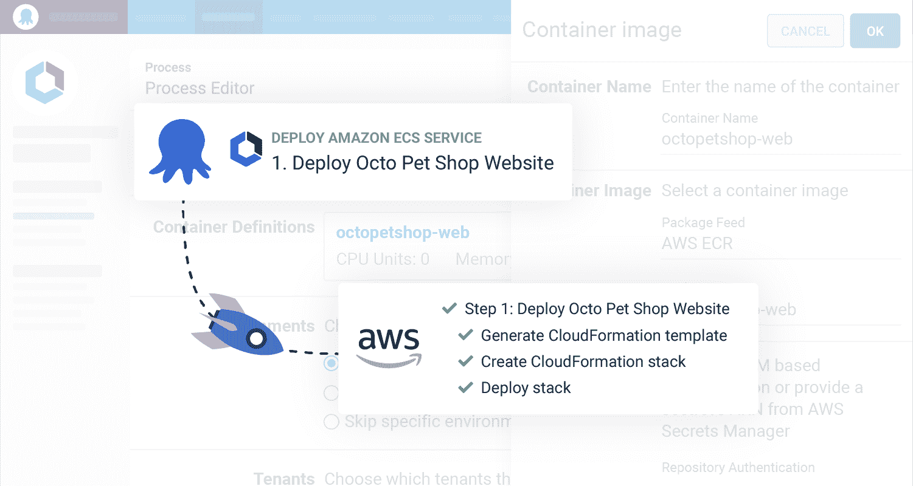
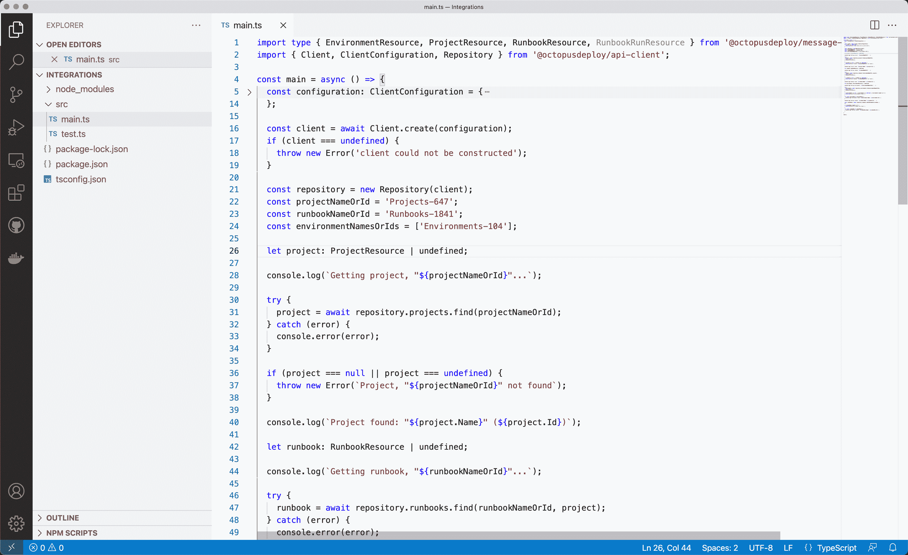
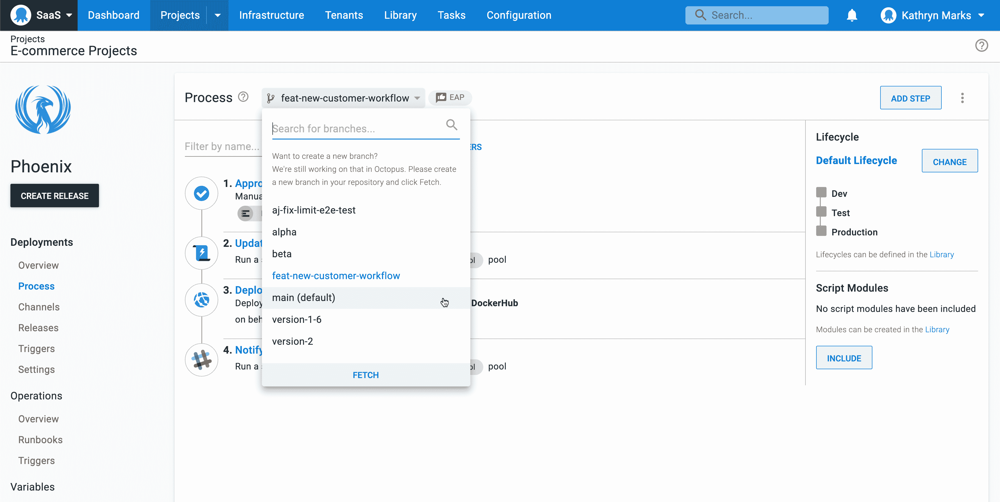

# Octopus 2021 Q4:使用我们的引导式 UI 步骤- Octopus Deploy 部署到 ECS

> 原文：<https://octopus.com/blog/octopus-release-2021-q4>

Octopus 2021 Q4 版本现已上市。

对 Amazon 的弹性容器服务(ECS)的内置支持将使您的 ECS 部署更加容易。我们固执己见的 UI 步骤指导您完成设置并构建 CloudFormation 模板，因此您不必编写配置文件或定制脚本。

此版本包括一些其他值得注意的更新:

*   我们为 Octopus Deploy 提供了一个新的 TypeScript API 客户端。
*   所有客户都可以使用“配置为代码早期访问预览”( EAP)。
*   尝试我们新的 Visual Studio 代码扩展，它支持 Octopus 配置语言(OCL)作为代码进行配置。
*   用于 Octopus Deploy 的 Terraform Provider 支持脚本模块、租户变量和工作池。
*   我们为 Octopus Deploy 改进了我们的 Go API 客户端和 TeamCity 插件。
*   Octopus Cloud 支持 Azure AD、Google 和 Okta 作为身份验证提供者，同时支持 Octopus ID。

## 包括在第 4 季度版本中

*   章鱼服务器 2021.3 ( [发布说明](https://octopus.com/downloads/whatsnew/2021.3))
*   用于 Octopus Deploy 1.1.5 的 TypeScript API 客户端
*   Octopus 为 Visual Studio 部署代码 0.0.17
*   用于 Octopus Deploy 6.1.5 的 TeamCity 插件
*   Octopus 部署 1.7.52 的 Go API 客户端
*   触手 6.1.1147
*   Octopus 部署 0.7.63 的平台提供程序

## 长期支持

下表显示了具有长期支持的 Octopus 服务器版本。

| 释放；排放；发布 | 长期支持 |
| --- | --- |
| 八达通 2021.3 | 是 |
| 章鱼 2021.2 | 是 |
| 八达通 2021.1 | 是(至 2022 年 1 月 31 日) |
| 八达通 2020.6 | 期满 |

## 发布之旅

[https://www.youtube.com/embed/NqcfVLP_WrE](https://www.youtube.com/embed/NqcfVLP_WrE)

VIDEO

## 新的亚马逊 ECS 与 Octopus 的集成

我们新的 Amazon Web Services (AWS) ECS 集成使得使用 ECS 或通过 Octopus 部署新服务变得更加容易。

此版本交付了第一个集成里程碑以及对现有**部署 AWS CloudFormation 模板**步骤的更新[:](https://octopus.com/blog/rfc-ecs-integration-with-octopus)

1.  一个新的[目标](https://octopus.com/docs/deployments/aws/ecs#step-2-create-a-deployment-target-for-your-ecs-cluster)代表一个 ECS 群集，以便您可以对环境和租赁部署进行建模
2.  一个固执己见的、UI 驱动的 [ECS 步骤](https://octopus.com/docs/deployments/aws/ecs)，它通过 CloudFormation 为您创建和管理服务和任务定义
3.  导出底层 CloudFormation 模板的能力
4.  跨环境的简化部署工作流
5.  将 Docker 图像添加到[部署 AWS CloudFormation 模板](https://octopus.com/docs/deployments/aws/cloudformation)步骤，并在您的 CloudFormation 模板中引用它们

新的 ECS 步骤将指导您完成配置，并根据您的输入生成云形成 YAML。

当你不再需要 guided UI 步骤或者需要更多的灵活性时，你可以暴露底层的 YAML 并将其粘贴到[部署 AWS CloudFormation 模板](https://octopus.com/docs/deployments/aws/cloudformation)步骤中。

我们的目标是帮助您实现可重复、可恢复且可审核的 ECS 部署。阅读我们的 [AWS 文档](https://octopus.com/docs/deployments/aws)，了解这些功能如何节省您的时间并最大限度地减少手动配置。

我们正在为第二个里程碑开发更多功能，预计明年发布。观看我们的博客更新。

## 用于 Octopus 部署的 TypeScript API 客户端

新的 [TypeScript API 客户端](https://github.com/OctopusDeploy/api-client.ts)使用 Node.js 和 npm 生态系统提供了与 Octopus 的跨平台集成。

现在，您可以使用一种可访问的、熟悉的编程语言通过 Octopus Deploy 编写任务脚本，而不管您使用的是什么系统。

我们的 API 支持您可以使用 Octopus web 门户和命令行界面(CLI)执行的所有操作。

以下是让你开始的一些想法:

*   自动化生产部署批准
*   从构建服务器和其他系统触发部署和操作手册

在我们的[入门指南](https://github.com/OctopusDeploy/api-client.ts/blob/main/getting-started.md)、[参考文档](https://octopusdeploy.github.io/api-client.ts)和文档化的 [API 示例](https://octopus.com/docs/octopus-rest-api/examples)中了解关于 TypeScript API 客户端的更多信息。可以通过 npm 下载客户端[。](https://www.npmjs.com/package/@octopusdeploy/api-client)

## 早期访问 Config as 代码和 Octopus Deploy for Visual Studio 代码

所有客户都可以使用代码早期访问预览(EAP)配置。我们将 Octopus 的可用性与 Git 的能力结合起来，这样您就可以在开发应用程序代码的同时改进部署过程。

[Octopus Deploy for Visual Studio Code](https://marketplace.visualstudio.com/items?itemName=octopusdeploy.vscode-octopusdeploy)是一个免费的扩展，使得使用 Octopus 配置语言(OCL)文件更加容易。功能包括:

*   语法突出显示
*   步骤和操作的代码片段
*   在文件中导航节点的集成树视图

本季度，Octopus Deploy 成为 Visual Studio 代码扩展市场的认证发行商。

在我们的文章[Octopus Deploy Config as Code:early access preview](https://octopus.com/blog/config-as-code-eap)中了解更多信息。

## 其他集成更新

本季度，我们对现有集成进行了改进:

*   用于 Octopus Deploy 的 [Terraform Provider](https://github.com/OctopusDeployLabs/terraform-provider-octopusdeploy) 支持脚本模块、租户变量和工作池。我们从 [Terraform Registry](https://registry.terraform.io/providers/OctopusDeployLabs/octopusdeploy/latest) 获得了超过 325，000 次供应商安装。
*   我们为 Octopus 改进了我们的 [Go API 客户端](https://github.com/OctopusDeploy/go-octopusdeploy)，包括错误修复和对工人池的更新支持。
*   Octopus Deploy 的 [TeamCity 插件](https://plugins.jetbrains.com/plugin/9038-octopus-deploy-integration)传递版本控制项目的 Git 细节，以支持代码形式的配置。
*   Octopus Cloud 支持一系列身份验证提供商，包括 Azure AD、Google 和 Okta。在我们的文档中了解[认证提供者](https://octopus.com/docs/security/authentication)。

## 重大变化

这个版本包括三个突破性的变化。

### “获取机器”的新默认行为

我们向部署目标屏幕添加了 runbook 运行活动。为了支持这一改变，`GET machines/{id}/tasks`现在返回部署和 runbook 运行。您可以指定一个`type`参数来过滤结果:`Deployment`或`RunbookRun`。

在 GitHub 问题中了解更多关于这一变化的信息[。](https://github.com/OctopusDeploy/Issues/issues/6982)

### 运行卡拉马里的 Mono 推荐版本

Calamari 可以在 Mono 框架上执行。我们推荐运行 Calamari 的 Mono 最低版本为 5.14.0。

在我们的 [SSH 目标需求](https://octopus.com/docs/infrastructure/deployment-targets/linux/ssh-requirements#mono-calamari)文档中了解更多关于这个变化的信息。

### 章鱼的推荐版本。NET API 客户端

我们推荐 11.3.3453 作为八达通的最低版本。用于与 Octopus Server 2021.3 交互的. NET API 客户端。

使用八达通的顾客。使用团队、角色和权限的. NET API 客户端必须使用 11.3.3453 版本的客户端(或更新版本),以确保与 Octopus Server 2021.3.7491 和更新版本兼容。

在 GitHub 问题中了解更多关于此变化的信息[。](https://github.com/OctopusDeploy/Issues/issues/7190)

## 升级或开始

章鱼云用户已经在运行这个版本了。自托管八达通客户可以从我们的网站下载最新版本。

[下载章鱼 2021.3](https://octopus.com/downloads/2021.3.0)

我们鼓励您查看升级 Octopus 服务器的[步骤。更多信息请参见](https://octopus.com/docs/administration/upgrading)[发布说明](https://octopus.com/downloads/whatsnew/2021.3)。

如果你以前从未使用过 Octopus，[注册](https://octopus.com/start)免费试用，或者[给我们的客户成功团队](mailto:customersuccess@octopus.com)发电子邮件，观看演示并了解更多信息。

## 未来的版本中会有什么？

查看我们的[公共路线图](https://octopus.com/roadmap)以了解最新消息并注册更新。

## 结论

Octopus 2021 Q4 实现了我们对亚马逊 ECS 的集中支持的第一个里程碑。

这个版本还包括 Octopus 的 TypeScript API 客户端，以及一系列新的和改进的与其他平台的集成。

我们期待在下一个版本中发布更多优秀的特性。

我们欢迎您提出任何问题或意见。你可以在下面留下评论或者加入我们的[章鱼社区 Slack](https://octopus.com/slack) 的讨论。

愉快的部署！