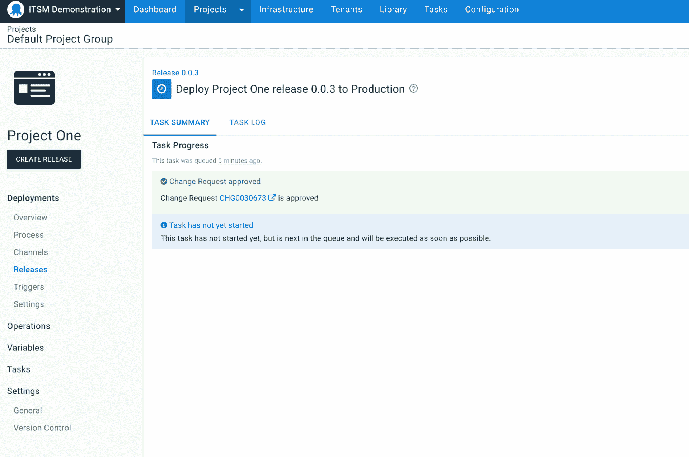

# 八达通 2022 Q2:集装箱化和现代化您的 CI/CD 管道-八达通部署

> 原文：<https://octopus.com/blog/octopus-release-2022-q2>

章鱼 2022 Q2 版现已发售。

迁移到原生云并不是随意提升和移动每个组件或重写每个应用程序。它是关于结合正确的技术和工具，并对在哪里进行现代化和在哪里进行维护做出战略选择。

无论您是部署到 AWS、Azure、GCP，还是您自己的数据中心——无论您在云之旅的哪个地方——Octopus Deploy 都是您需要的唯一部署工具。

我们正在通过新功能改进我们的云原生支持，以帮助您实现 CI/CD 渠道的容器化和现代化。我们改进了对 Amazon ECS 和 Kubernetes 部署容器化应用程序的支持，添加了云目标发现功能，并对 AWS 进行了无服务器改进。

2022 年 Q2 发布版在章鱼云上提供，并可供我们的自助客户下载。

此版本还包括其他值得注意的更新:

*   ServiceNow 无摩擦的变更管理(早期访问预览)
*   发布创建和步骤模板的代码可用性改进
*   更快的 Octopus 云部署和更好的动态工作人员缓存
*   客户驱动的更新:
    *   轻松定制项目和空间图标
    *   通过可调整的会话超时和失效改进安全管理
    *   通过 PKCE 支持 OAuth 2.1 授权代码流
    *   无错误的租户变量版本控制

## 包括在 Q2 版本中

*   章鱼服务器 2022.2 ( [发布说明](https://octopus.com/downloads/whatsnew/2022.2))
*   触手 6.1.1320
*   插件和工具:
    *   Octopus 为 Visual Studio 部署代码 0.0.17
    *   Azure DevOps 插件 5.2.134
    *   用于 Octopus Deploy 6.1.12 的团队城市插件
    *   Octopus 部署 0.7.72 的平台提供程序

## 长期支持

下表显示了具有长期支持的 Octopus 服务器版本。

| 释放；排放；发布 | 长期支持 |
| --- | --- |
| 八达通 2022.2 | 是 |
| 八达通 2022.1 | 是 |
| 八达通 2021.3 | 期满 |

## 为什么使用 Octopus 进行云原生部署？

大多数 DevOps 团队在混合了现代和遗留技术的项目上工作。随着团队开始现代化，随着新系统中功能的增加，维护部署到旧基础设施上的关键遗留系统是很常见的。客户经常告诉我们，他们正在缓慢地对旧系统进行现代化，将应用程序和服务容器化，并将其转移到云中以最大限度地降低风险。

这是整个行业的趋势。在最近一份由 Konveyor 进行的关于现代化状态的报告中，应用程序现代化的团队发现这一过程并不快速或直接，并且面临许多挑战。他们面临的最大挑战是变革阻力、时间限制、成本和预算限制，以及缺乏熟练的资源。

Octopus 是团队在这个旅程中的一个很好的解决方案，因为我们有一套新老技术的广泛集成。当您启动新项目来更新其他项目时，您可以使用较旧的技术来协调部署。

Octopus 中的 Config as Code 允许您分支和迭代您的部署流程，以便您可以在维护旧流程的同时现代化您的 CI/CD 管道，直到新流程准备好投入生产。

[了解更多关于版本控制的信息](https://octopus.com/docs/projects/version-control)。

Octopus 2022 Q2 还包括将应用部署到亚马逊 ECS 和 Kubernetes 集群的开箱即用支持，包括亚马逊 EKS、Azure Kubernetes 服务和谷歌 Kubernetes 引擎。

## 简化配置的指导步骤

容器托管平台帮助团队管理和扩展他们的容器化应用程序，但是它们也因为陡峭的学习曲线而变得复杂。我们的指导步骤让您更容易开始。我们的结构化用户界面引导您完成配置复杂部署场景的过程。这有助于您让 CI/CD 管道快速工作，以便您可以部署、获得反馈和迭代。

我们的指导步骤还允许您导出底层 YAML 或云形成模板，以便您可以完全控制自定义您的部署。导出的文件包含参数化变量，因此您可以在补充步骤中使用它们:**部署原始的 Kubernetes YAML** 或**部署 AWS CloudFormation 模板**。

## AWS、Azure 和谷歌云账户

我们的云原生支持利用了我们对 AWS、Azure 和 Google Cloud 的内置云提供商帐户支持。添加您的云提供商凭据，并在整个部署过程中安全地使用它们。

Octopus 通过[执行容器](https://octopus.com/docs/projects/steps/execution-containers-for-workers)提供工作机(Octopus Cloud 有[动态工作机](https://octopus.com/docs/infrastructure/workers/dynamic-worker-pools)，Octopus Server 内部有[内置工作机](https://octopus.com/docs/infrastructure/workers/built-in-worker))和工具，因此您可以执行部署，而无需配置额外的基础设施(即，无需委托给单独的虚拟机或容器)。

## 与您的基础架构和旧系统集成

没有一个团队使用相同的技术栈，所以将工具与基础设施集成是很重要的。Octopus 具有与您合作的集成，从传统的虚拟机和复杂的网络系统到现代的云原生技术。

我们的触手代理几乎可以在任何地方运行，支持 Windows、Linux (Debian、Ubuntu、Linux Mint、CentOS、RHEL、Fedora 等等)和 Docker。您可以使用它以监听或轮询模式连接到任何物理或虚拟机。或者，您可以安全地直接连接到运行 SSH 的服务器。

Octopus 还附带了 500 多个自动化步骤模板，涵盖的技术包括 AWS、Azure、Cassandra、Databricks、F5、Firebase、Flyway、吉拉、MariaDB、Oracle、Pingdom、Pulumi、Slack、Splunk、雪花、Twilio 和 Zabbix。

无论您使用什么，Octopus 都可以让您的团队将 Octopus 与您现有的系统和工作流程集成在一起，同时您可以根据您的时间表和优先级更新您的应用程序和服务。

## Octopus 云-原生部署演示

[https://www.youtube.com/embed/vsJkvaCLT4k](https://www.youtube.com/embed/vsJkvaCLT4k)

VIDEO

### 跨 Kubernetes 和 Amazon ECS 的灵活部署选项

无论您在云原生之旅的哪个阶段，Octopus 都提供了以适合您的方式进行部署的灵活性。

### 亚马逊 ECS

Octopus 还提供基于约定的 Amazon ECS 部署，无需定制脚本或导航 AWS 控制台。Octopus 允许您使用我们易于使用的 UI 配置您的 ECS 部署，或者您可以直接编辑基于 HCL 的配置作为代码配置文件。

我们的解决方案涵盖了两种最常见的配置:

*   AWS Fargate 上的 Amazon ECS，消除了管理服务器或 Amazon EC2 实例集群的需要。
*   建立手动创建的 Amazon 集群，或者使用 AWS CloudFormation 或 Hashicorp Terraform 等基础设施作为代码技术。这允许您将基础架构(集群配置和管理)和部署分开。

Octopus 为自动化亚马逊 ECS 部署提供了深度支持:

*   引导式 ECS 自动化步骤，默认为自以为是，可扩展以实现完全控制。没有自定义脚本或任务定义配置文件。
*   没有 AWS 控制台的内置验证、有用的部署反馈和错误消息。
*   导出底层 CloudFormation 模板(带有参数化变量)以根据您的特定需求进行定制。
*   在一个步骤中部署容器化的应用程序更新(版本变动),而无需更改底层部署流程。
*   当部署陷入不良状态时，没有支持超时的重试循环。
*   支持复杂的任务定义(多个容器和任务角色)。

您还可以用 runbooks 来补充您的部署，以管理和维护您的集群:重启任务、运行 AMI 更新等等。

[进一步了解我们对 ECS 部署的支持](https://octopus.com/docs/deployments/aws/ecs)。

### 库伯内特斯

爱 YAML 还是恨它？我们的 Kubernetes 自动化支持 3 种方法:

*   一个结构化的 UI 步骤，引导您完成配置，无需任何 YAML 输入。
*   用原始 YAML 配置的完全灵活的步骤。
*   舵图自动化步骤。

Octopus 最初在 2018 年提供了对 Kubernetes 的支持，我们继续更新和完善它。Octopus 2022.2 为 DevOps 团队提供了终极的 Kubernetes 体验。

*   将您的 Kubernetes 集群和资源集中在一个地方，以便您可以专注于您的应用程序和客户。
*   使用内置服务帐户进行简单安全的身份验证。
*   使用共享变量简化您的部署和操作手册。
*   实施蓝/绿、淡黄色和滚动部署等部署模式。
*   使用预认证的 kubectl 脚本。
*   自动化日常维护并更快地响应紧急情况。

值得注意的是，如果您使用我们的引导式 UI 驱动的**部署 Kubernetes 容器**步骤模板，您可以导出底层 YAML 配置，这样您就可以完全定制它。这可以让你快速开始，但如果你需要的话，可以完全控制。

[了解更多关于管理 Kubernetes 资源的信息](https://octopus.com/docs/deployments/kubernetes)。

### 动态基础设施和自动云目标发现

现代云基础架构可以在几秒钟内创建和销毁。DevOps 工具需要“感知云”,以便与动态基础设施一起工作，这样您就可以提高工作效率。

借助自动云发现，您可以快速将工作部署到新的基础架构。不需要点击 UI 来配置它，也不需要编写定制脚本或指定具体细节。连接您的云帐户，标记您的云资源，并部署您的应用程序。

Octopus 还会定期检查云基础架构是否可用，并在需要时将其从 Octopus 基础架构中移除。这可以保持您的基础架构仪表板整洁和最新。

这个初始版本增加了对 Azure App Services (Web Apps)、Amazon ECS 集群和 Kubernetes 集群(早期访问预览版)的支持。

[了解有关云目标发现的更多信息](https://octopus.com/docs/infrastructure/deployment-targets/cloud-target-discovery)。

### 亚马逊网络服务的无服务器改进

Octopus 2022.2 包括对 AWS Lambda 无服务器部署的改进。

新的**创建 S3 存储桶**步骤让您在上传文件到新的或更新的位置时更加灵活。创建新的 S3 存储桶，然后在后续步骤中将文件上传到这些存储桶中，无需任何麻烦或定制脚本。

[了解有关创建 AWS S3 存储桶的更多信息](https://octopus.com/docs/deployments/aws/aws-s3-create-bucket)。

**上传到 AWS S3 存储桶**步骤现在支持引用先前步骤中上传的文件，并增加了对变量替换和结构化变量替换的完全支持。这一更新意味着您可以上传文件，并用目标环境范围内的变量适当地转换它们。

[了解更多关于将包上传到 AWS S3 存储桶的信息](https://octopus.com/docs/deployments/aws/s3)。

## ServiceNow 无摩擦的变更管理(早期访问预览)

IT 服务管理(ITSM)描述了 IT 团队如何为他们的客户提供可靠的 IT 服务。这通常包括 IT 服务的交付和支持，以及管理系统变更。

对于开发运维团队来说，大规模管理部署管道既复杂又耗时，而且当您加入变更管理时，情况会变得更加复杂。通常会有严格的变更流程，需要进行彻底的审查，以获得发布新版本应用程序的批准。变更顾问委员会可以被视为阻碍开发团队的路障。

我们希望通过帮助您将 Octopus 与 ServiceNow 集成来减少摩擦并简化您的开发团队的生活，从而使这变得更容易。

**服务中的 ITSM 认证现在**

作为改进 ITSM 支持的一部分，我们很高兴与大家分享 ServiceNow 集成的第一个里程碑。我们的客户告诉我们，手动填写变更请求既耗时又容易出错。他们希望他们的 CI/CD 系统能够自动创建变更请求，并以更少的摩擦实现最佳实践。

这一新的集成将 Octopus 部署与 ServiceNow 变更请求联系起来，并自动创建预填充的正常变更请求。您获得了开箱即用的改进的可跟踪性，并且您可以向审计人员证明每个受控的部署都有一个变更请求。这确保您的 CI/CD 和发布管理流程符合公司政策和法规。

我们的 ServiceNow 支持包括哪些内容？

*   简单的工作流程配置，因此很容易将 Octopus 与 ServiceNow 集成。
*   将部署链接到现有的更改请求，以手动将部署与更改请求相关联。
*   在部署时自动创建普通的变更请求。Octopus 暂停部署，直到相应的批准完成。
*   使用变更模板自动创建标准变更请求，以减少手动工作并控制要填充的信息。
*   查看和导出受控部署的审核日志，以便轻松实现合规性和部署后协调。

这种集成功能齐全，可在早期访问中使用。我们希望获得您的反馈，以便在我们的支持服务正式推出之前，帮助我们塑造和完善它。

**如果您的团队使用 ServiceNow 变革管理，我们希望您能尝试一下并提供您的反馈。**

[注册 ServiceNow EAP](https://octopusdeploy.typeform.com/servicenow-eap) 。

## 发布创建和步骤模板的代码可用性改进

我们将继续改进 Octopus 中的 Config as 代码，使其更加易于使用。要了解更多关于 Config as Code 的信息，请阅读我们 2022.1 版本的[公告。](https://octopus.com/blog/octopus-release-2022-q1)

使用 Config as Code，您现在可以拥有一个项目的多个分支，并且由于部署过程可以在分支之间变化，步骤模板也可以变化。我们将 Config 更新为代码，以更好地支持跨分支使用 step 模板。您可以使用“步骤模板用法”选项卡，通过显示从不同分支创建的最新 20 个版本中使用的模板版本来查找过期的模板。

您还可以从 Git commit 或 tag 而不是分支的头部创建一个 release，这样您可以通过在创建一个 release 时选择一个特定的 commit 或 tag 来获得更多的控制。

了解更多关于我们版本控制特性的信息。

根据客户反馈，我们改进了执行容器 Docker 映像，使部署速度更快。

我们改进了 Docker 图像缓存，并且我们正在努力缩小 Docker 容器图像(我们称之为 Worker Tools)的大小，这些图像是特定于技术的，文件大小要小得多。结合更好的缓存方法，您可以在部署中使用最新的工具和技术，而不会影响性能。

## 客户驱动的改进

此版本包含几项客户驱动的改进。

### 轻松定制项目和空间图标

我们引入了对项目和空间图标的内置支持，因此您可以找到合适的图标并选择适合您团队的颜色。快速轻松地定制您的 Octopus 实例。

### 通过可调整的会话超时和失效改进安全管理

借助 Octopus 2022.2，您的安全团队可以根据您的内部安全策略调整会话超时。您可以在 Octopus 配置设置中表达您的威胁模型，并根据您组织的需求进行定制。

### OAuth 认证改进

除了当前的 OAuth 2.0 隐式流程，我们还支持 PKCE 的 OAuth 2.1 授权代码流程，因此我们拥有最新的关键协议和标准，以满足您的安全团队的需求。对 PKCE 使用授权代码流可以确保您的实例更加安全，因为您可以在每次请求时动态生成客户端机密。请注意，旧的隐式流仍然可以使用，直到您通过您的设置更新到新的流。

以下身份验证提供程序现在可以与 PKCE 的 OAuth 2.1 授权代码流一起使用:

请阅读每个提供商的文档以了解更多信息。

### 租户变量版本控制

如果两个人同时对租户变量进行更改，那么可能会覆盖另一个人的更改。我们通过添加一个新的变量版本字段修复了这个问题。这可以防止租户变量被另一个用户所做的任何后续更改覆盖，如果他们同时编辑租户变量的话。

例如，如果两个人同时处理租户变量，第二个人不能覆盖第一个人所做的更改。第二个人需要刷新他们的页面并重新输入他们的变量更新以保存他们的更改。

## 重大变化

此版本包含一个突破性的变化:

八进制语法中的空版本现在抛出一个错误，而不是返回一个默认值

Octostache 允许您指定一个空版本，将任何部分解析为默认值。这种行为已从 Octopus 中删除。从 2021 年 3 月开始版本化，但是直到现在这个包才在 Octostache 中更新。从现在开始，空版本会抛出一个错误，Octostache 的所有其他行为保持不变。

在 [GitHub 问题](https://github.com/OctopusDeploy/Issues/issues/7375)中了解更多关于这一变化的信息。

## 升级或开始

章鱼云用户已经在运行这个版本了。自托管八达通客户可以从我们的网站下载最新版本。

[下载章鱼 2022.2](https://octopus.com/downloads/)

我们鼓励您查看升级 Octopus 服务器的[步骤。更多信息请参见](https://octopus.com/docs/administration/upgrading)[发行说明](https://octopus.com/downloads/whatsnew/2022.2)。

如果你从未使用过 Octopus，[注册免费试用](https://octopus.com/start)或[发送电子邮件给我们的团队](mailto:sales@octopus.com)观看演示并了解更多信息。

## 未来的版本中会有什么？

查看我们的[公共路线图](https://octopus.com/roadmap)以了解最新消息并注册更新。

## 结论

八达通 2022 Q2 提供了许多新功能，以支持您的容器化应用程序和现代化的 CI/CD 管道。无论您在云之旅的哪个地方，Octopus 都是您需要的唯一部署工具。

愉快的部署！