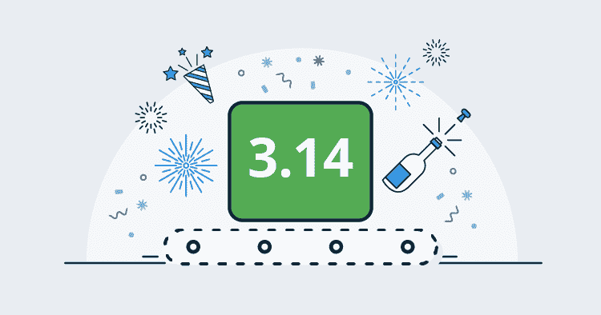
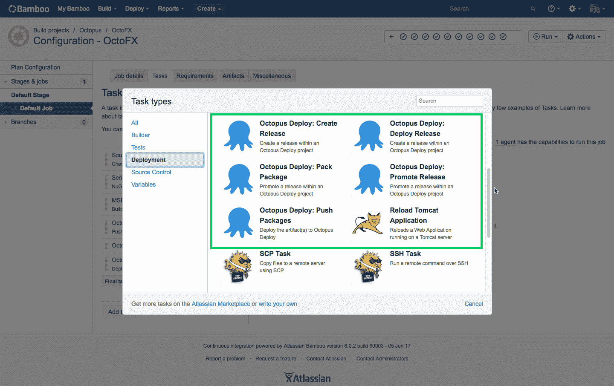
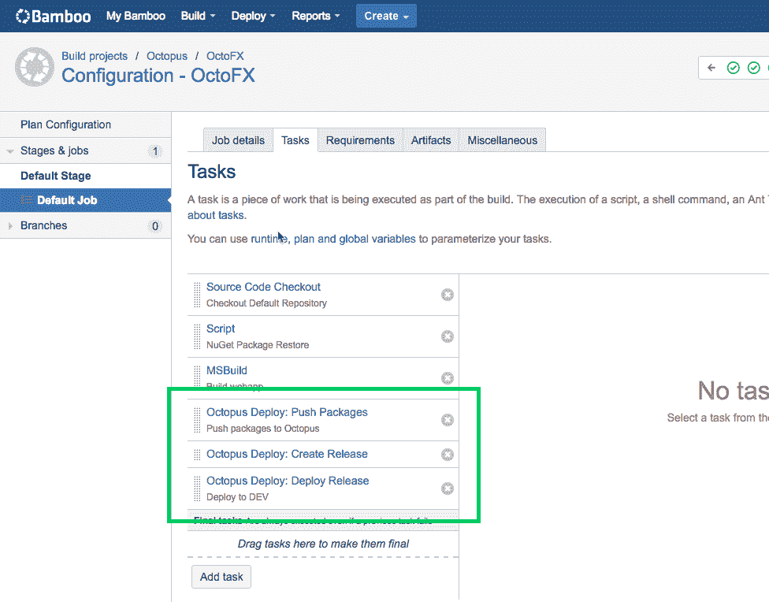
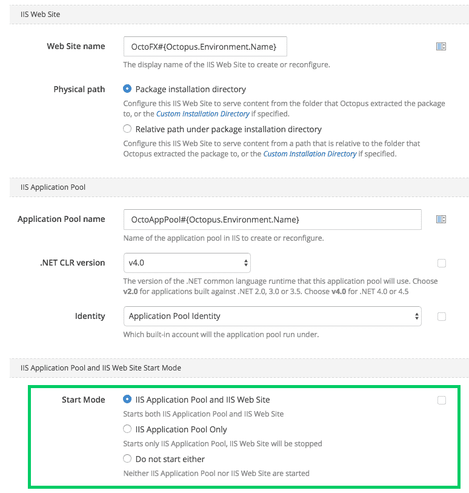
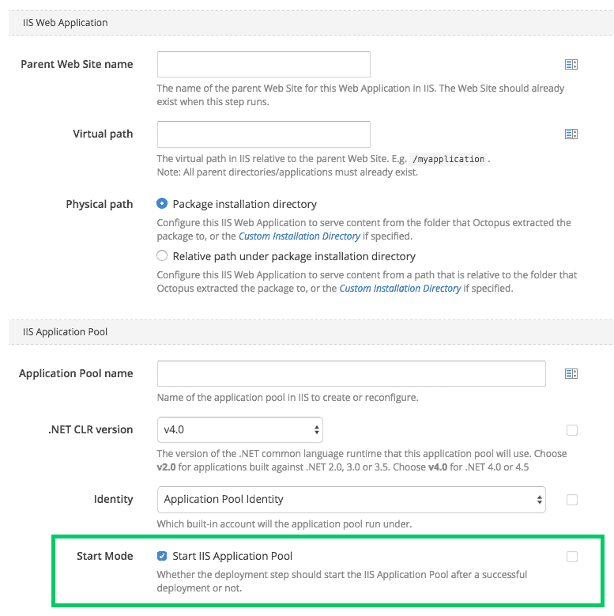
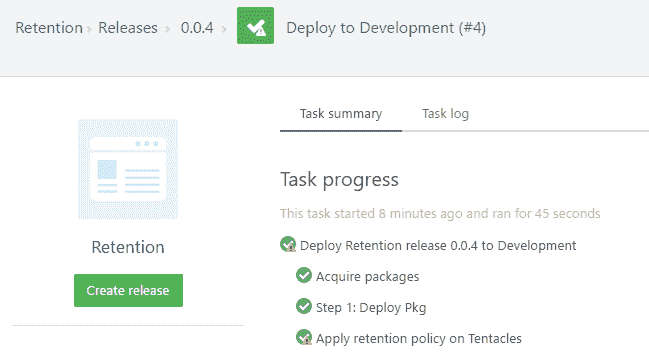
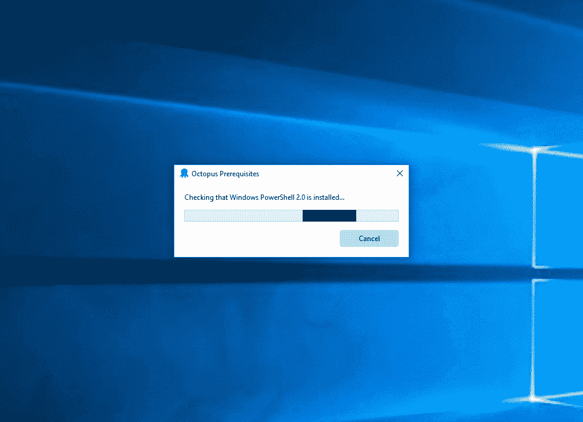

# 八达通 6 月版 3.14 -八达通部署

> 原文：<https://octopus.com/blog/octopus-release-3-14>

本月的发布带来了一些令人兴奋的新功能，包括我们为 Atlassian 的 [Bamboo](https://www.atlassian.com/software/bamboo) build 服务器开发的新 Octopus Deploy 插件，以及更容易的升级、安全改进和更好的性能。

## 在这篇文章中

## 发布之旅

[https://www.youtube.com/embed/CWf5Y-dk14c](https://www.youtube.com/embed/CWf5Y-dk14c)

VIDEO

## 章鱼竹插件

我们正在为 Atlassian 的[Bamboo build/持续集成服务器](https://www.atlassian.com/software/bamboo)发布一个本地 Octopus Deploy 插件。这个新的附加组件允许您轻松地配置您的构建计划，以打包应用程序进行部署，将包推送到 Octopus，以一流的方式创建、部署和推广版本。这使得集成 Bamboo 和 Octopus 来构建您的部署管道变得很容易，并且可以利用这两种产品的强大功能！

这个插件可以在 Atlassian 的市场上买到，如果你使用 Bamboo 和 Octopus，我们强烈推荐你去看看。

## 部署到 IIS 的步骤改进

我们已经更新了“部署到 IIS”步骤，以添加支持来控制在成功部署后如何启动您的 web 应用和应用池。这在配置`Web Sites`和`Web Applications`时可用。这是对最受欢迎的步骤之一的一个很好的补充。
`Web Site`的新选项:

`Web Application`的新选项:

## 现在使用 SHA256 生成证书

正如我们在[粉碎](https://octopus.com/blog/shattered)的博文中承诺的，我们已经更新了我们的证书生成，使用 SHA256，而不是以前的 SHA1。这确保了任何新的安装或重新生成的证书将使用 SHA256，但不会影响任何现有的证书。我们将在不久的将来推出一些功能，使替换旧证书变得更加容易。

## 触手分裂

直到现在，我们总是随着每个版本的章鱼服务器发布新版本的触手。今天我们劈开触手！

### 之前的触手节奏

随着每个章鱼服务器的发布，我们也发布了一个触手版本。因此，每次你升级你的章鱼服务器时，系统都会提示你升级你所有的触手。在我们的大多数版本中，我们没有对触手做任何改动。

### 新的触手节奏

新版本的触手只有在触手有变化的情况下才会发布。在这个阶段，触须版本的隆起将标志着变化。Octopus Server 将捆绑最近发布的触手版本，并将其用于触手升级。

### 这对你意味着什么？

少触手升级！自从 Octopus 3.0 发布以来，对触手进行了一些小的调整，主要是增加了新的命令和对通信栈的微小改变。章鱼服务器 v3.x 兼容所有触手 3.x 版本。我们希望分裂触手有助于减轻升级章鱼的一些麻烦和摩擦，并提供关于触手变化的更好的沟通。

### 即将推出

我们的目标是给触手和我们的一些其他开源库提供他们自己的发行说明，这样你就不用在 Octopus 服务器的发行说明中寻找感兴趣的东西了。我们也会给你自动升级触手的能力，只要一个新的触手版本发布，而不是等到下一个章鱼服务器发布。

## 保留策略改进

在极少数情况下，保留策略会在部署期间失败，通常是由于锁定的文件或病毒扫描程序。在过去，这种失败会导致您的部署看起来好像失败了，而实际上部署实际上是成功的——我们只是无法在事后进行适当的清理。现在，如果保留策略在部署期间失败，我们仍将记录失败的详细信息，但部署本身将显示为成功(带有警告)。

## 性能改进

在此版本中，我们进一步改进了 Octopus 的一般性能:

*   现在，每个 HTTP 请求分配的内存减少了 86%(平均从 1.44MB 减少到 256KB)，导致 Octopus 在一段持续的时间内每秒可以处理的请求数量增加了 45%。这意味着章鱼可以花更少的时间清理自己，而有更多的时间为你工作。
*   我们在 Releases 表中添加了一些内置的 SQL 索引，将一些最常见的查询成本降低了 92%。
*   我们改进了任务调度程序和保留策略的性能，从而减少了 SQL 数据库上的争用和查询成本。
*   现在，写入任务日志的速度提高了 10%,从而减少了锁争用，并加快了部署速度。

每位八达通用户都应该从这些改进中受益，尤其是那些安装了大型设备的用户。

## 改进的升级体验

每当我们需要更改数据库模式时，这些更改将在 Octopus 服务器启动时由 Octopus 服务器帐户应用，对任何用户来说都是不可见的。这并没有为拥有大型安装的客户或使用 [Octopus 高可用性](https://g.octopushq.com/HighAvailability)集群的客户，或想要不同安全模式的客户提供最佳体验。现在，当您将 Octopus 升级到 3.14.x 或更高版本时，数据库模式升级将在安装程序完成后自动执行，清楚地显示模式更改的进度。

您现在可以选择**何时**运行 SQL 数据库模式升级，以及**用户帐户**您想要执行模式升级:

1.  安装程序完成后自动运行(新行为)——这将作为启动安装程序的用户帐户运行模式升级
2.  在 Octopus 服务器启动期间自动进行(就像以前一样)——这将作为启动 Octopus 服务器的用户帐户运行模式升级
3.  当对存储在数据库中的设置执行`Octopus.Server.exe configure`命令时自动执行(就像之前一样)——这将作为启动 Octopus 服务器的用户帐户运行模式升级
4.  手动执行全新的`Octopus.Server.exe database --upgrade`命令——这将作为启动该命令的用户帐户运行模式升级

这可能不会影响许多客户，但可以实现一些高级场景，在这些场景中，您可以向 Octopus 服务器帐户授予有限的权限，并向用于安装的特殊帐户授予模式更改权限。

## 重大变化

在这个版本中没有突破性的变化，但是值得注意的是我们已经调整了 SQL 数据库模式升级，正如我们上面讨论的。

`SQL Error 4060 - Cannot open database "OctopusDeploy" requested by the login. The login failed.`

如果您在安装完成后看到这样的错误消息，您可以像以前一样启动 Octopus 服务器，让它执行模式升级。

## 升级

升级 Octopus Deploy 的所有常规[步骤都适用。更多信息请参见](https://octopus.com/docs/administration/upgrading)[发布说明](https://octopus.com/downloads/compare?to=3.14.0)。

## 包裹

这个月到此为止。我们希望你喜欢最新的功能和我们的新版本。欢迎给我们留下评论，让我们知道你的想法！愉快的部署！