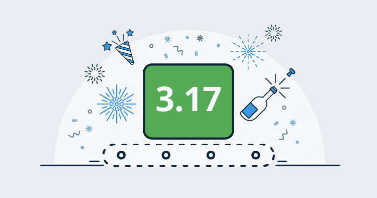
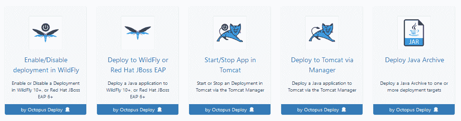
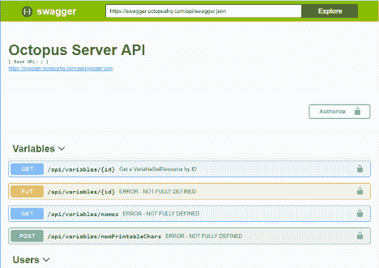

# 八达通 9 月版 3.17 -八达通部署

> 原文：<https://octopus.com/blog/octopus-release-3-17>

这个月的发布是重要的，我们很高兴能发布具有一流 Java 支持的 Octopus 3.17！这是令人兴奋的，因为它使使用 Java 平台构建应用程序的团队能够以安全、可靠和可重复的方式部署他们的应用程序。我们也为 Octopus API 提供了强大的支持。Octopus 是一个 API 优先的系统，所以你可以通过我们的门户网站或命令行工具做任何事情，你可以通过我们的 REST API。现在，我们已经添加了 Swagger 支持，所以它更容易被发现和使用。最后，我们改进了用户管理和身份验证性能。请继续阅读所有激动人心的细节！

## 在这篇文章中

## 发布之旅

[https://www.youtube.com/embed/2vpxRy2yXAI](https://www.youtube.com/embed/2vpxRy2yXAI)

VIDEO

## 一流的 Java 部署

3.17 引入了许多针对 Java 应用服务器部署和管理应用程序的新步骤，并为管理内置 Octopus 库中的`jar`、`war`、`ear`和`rar`文件提供支持。

这些新步骤允许将 Java 应用程序部署到 WildFly 10+和 Red Hat JBoss EAP 6+应用服务器，以及 Tomcat 7+上。此外，`Deploy Java Archive`步骤允许将 Java 应用程序复制到目标机器上的自定义位置，从而允许将 Java 应用程序部署在任何能够使用文件复制部署的 Java 应用服务器上。

有关这些新步骤的更多信息，请参见[文档](https://g.octopushq.com/JavaAppDeploy)。

## 对 Octopus API 的大力支持

Swagger(也称为 OpenApi)是描述 REST API 的标准。许多公司采用它来描述他们的公共 API。现在在 3.17 Octopus Deploy 已经开始使用 Swagger 记录它的 API。

swagger 文档有两个版本，JSON 格式的版本在`[server]/api/swagger.json`可用，YAML 格式的版本在`[server]/api/swagger.yaml`可用。

3.17 现在还包括默认的 Swagger UI，用于以一种人类可读的方式显示 Swagger 文档。该用户界面在`[server]/swaggerui/`可用

## 用户管理和身份验证性能改进

我们围绕用户管理引入了一些变化，以解决一些性能问题，并在 Octopus 中更好地模拟用户。关键性能修复与在使用 Active Directory 提供程序时何时检查安全组有关。在以前的版本中，组是在用户登录时检索的。在大型/复杂的目录场景中，这可能需要一段时间，并且用户在登录时会经历长时间的延迟。为了解决这个问题，我们现在每小时在后台检查一次组(它最初在启动后不久运行，因此如果需要，可以使用重启来强制它运行)。此更改还修复了以前不会为服务帐户用户加载组的问题，因为他们没有登录。

与用户建模相关的另一个重大变化是登录的引入，它允许多个登录与一个给定的用户相关联。例如，您现在可以创建一个用户，并关联一个 Active Directory 帐户和一个 GoogleApps 帐户(假设您已经启用了这两个帐户)。它还消除了强制用户名为活动目录提供者的 UPN 的需要(如果用户是在登录时自动创建的，它将默认为 UPN，但如果是手动创建用户，则不必如此)。要为用户添加 Active Directory 登录，也不再需要猜测 upn，您需要通过一个搜索对话框，类似于编辑团队和查找安全组时。

最后一点，现在可以禁用自动用户创建。它仍然默认为启用，但您现在可以选择禁用它。启用/禁用通过`configure`命令行完成，并且可以根据身份验证提供者进行设置。

更多信息参见更新的[文档](https://g.octopushq.com/AuthenticationProviders)。

## 重大变化

这个版本没有重大变化。

## 升级

升级 Octopus Deploy 的所有常规[步骤都适用。更多信息，请参见](https://octopus.com/docs/administration/upgrading)[发行说明](https://octopus.com/downloads/compare?to=3.17.0)。

## 包裹

这个月到此为止。我们希望你喜欢我们的新功能和最新版本。欢迎给我们留下评论，让我们知道你的想法！愉快的部署！