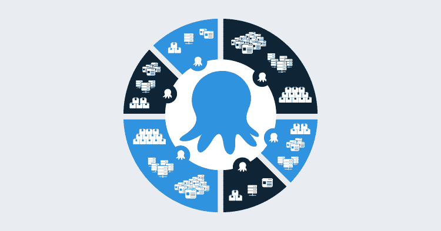

# 章鱼空间博客系列启动-章鱼部署

> 原文：<https://octopus.com/blog/octopus-spaces-blog-series-kick-off>

Octopus 最初是为小团队设计的。一切都是全局层次的:项目、环境、生命周期、变量集等等。

在大型组织中，随着团队数量的增加，这种方法的可扩展性并不好:

*   人们最终用“命名空间”来避免冲突和混淆:“这是我们的生产环境”
*   人们努力使用我们的许可系统来提供任何隔离。

## 拯救空间

几乎所有的东西都在一个空间内。唯一保持全球性的是:

*   八达通服务器配置(许可证、维护模式、HTTPS 证书等)
*   用户
*   组

空间功能将被选择加入，如果你目前不认为自己有必要划分你用八达通做什么，那么你可以继续使用八达通像你今天这样做。如果有一天你发现你在 Octopus 中管理的东西已经增长，并且可以从一些隔离中受益，那么你就可以选择开始利用空间。

这里有一些小警告，我们所做的一些改变会对一些 API 产生影响。不要惊慌，目前它们仅限于团队管理 API。作为这个博客系列的一部分，我们将分享一些技术细节，以及我们正在改变的 API 的具体细节。

接下来会有一些详细的帖子，所以一定要看看我们的博客。

* * *

博客系列文章: