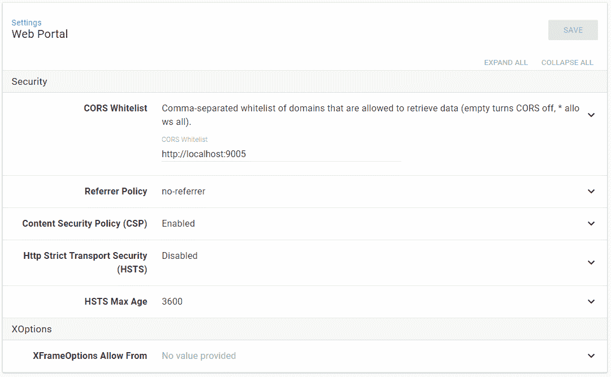

# 八达通部署 4.0 -配置-八达通部署

> 原文：<https://octopus.com/blog/octopus-v4-config>

[](#)

这篇文章是我们章鱼 4.0 博客系列的一部分。在我们的[博客](https://octopus.com/blog)或我们的[推特](https://twitter.com/octopusdeploy)上关注它。

**Octopus Deploy 4.0 已经发货！今天就阅读[博文](/blog/octopus-release-4-0)和[下载](https://octopus.com/downloads)吧！**

* * *

对于大多数 Octopus 用户来说，他们与 Octopus 的日常交互包括设计和定义出色的部署流程，然后根据这些流程监控部署。他们生活在章鱼门户的美丽世界中，正如你在本系列中已经看到的，这个世界在 4.0 版中变得更加美丽。

还有另一个更小的用户群，他们生活在一个非常不同的世界。他们是负责供应 Octopus 服务器本身并保持其愉快运行的小组，以便它可以提供所有其他用户生活的美丽世界。

这群用户今天生活的世界看起来更像这样

```
Octopus.Server.exe stop --instance=master
Octopus.Server.exe configure --instance=master --corsWhitelist=http://opsthing.mycompany
Octopus.Server.exe start --instance=master 
```

现在我们知道这个世界对某些人来说是美丽的，但它也存在一些问题。

## 理解问题

我们在这里讨论的问题影响着我们，作为 Octopus 开发者，以及我们的客户。我们经常建立新的实例，试图重现问题，在发布前测试版本，并开发新功能，所以我们已经亲身经历了所有这些。

在这一部分，我们将只讨论两个最大的问题。首先是了解你可以设置哪些选项。第二个是设置的实际编辑。

### 有多少配置选项？

对于那些从未享受过使用`configure`命令的人来说，花一分钟运行`Octopus.Server.exe configure --help`(你可能想在运行之前提高你的屏幕缓冲区的高度😉)或查看我们的[文档页面](https://g.octopushq.com/ConfigureCommand)。

了解这些选项之间的相互关系有时可以通过命名来理解，但并不总是如此。有时通过接近就能破译，但并不总是如此。

这是一堵巨大的文字墙，找到你想要的东西太难了。

### 控制台访问

要更改 Octopus 配置，您需要访问服务器的控制台。这通常包括物理访问服务器或远程桌面、远程 PowerShell 或类似的可以让您远程运行命令的东西。

当我们在发布之前进行测试时，这是一个特别棘手的问题。我们使用基本配置，在云中自动运行测试环境。现在，让我们假设我一直在做类似认证相关的修复工作，我想让 Azure AD 认证提供商测试我的更改。

实例已启动并正在运行，我可以使用用户名/密码登录，但我实际要做的第一件事是查找启动的虚拟机的详细信息，然后我需要获得该服务器的地址及其管理员凭据，以便我可以远程桌面到它。一旦我最终连接上了，我必须进入安装文件夹并运行如下程序:

```
Octopus.Server.exe configure --instance=xyz --azureADIsEnabled=true --azureADIssuer=https://login.microsoftonline.com/xxxxxxxx-xxxx-xxxx-xxxx-xxxxxxxxxxxx --azureADClientId=zzzzzzzz-zzzz-zzzz-zzzz-zzzzzzzzzzzz 
```

## 解决方案

我们考虑这些问题已经有一段时间了，允许通过 API 编辑配置似乎是显而易见的答案。在 4.0 中，这就是我们正在做的事情。

### API 优先

允许通过 API 读取和写入配置意味着我们可以在 UI 中以更有意义的方式显示值，并且还允许像任何其他资源一样进行编辑。

通过 API 进行配置也意味着所有用于读取和写入的数据都是完全相同的形状。如果你正在做像自动安装和漂移检测这样的事情，这应该会使生活比以前容易得多。

### 把东西放在一起

当您查看`configure`命令时，您可能已经注意到，设置被视为一个列表；它们不是结构化数据。拥有一个 API 也能帮助我们做到这一点。

假设 API 使用 JSON 文档，它可以使用对象来表示配置节和相关值。例如，Web 门户配置可以表示为如下形式:

```
{
  "Id": "webportal",
  "Security": {
    "CorsWhitelist": "http://localhost:9005",
    "ReferrerPolicy": "no-referrer",
    "ContentSecurityPolicyEnabled": true,
    "HttpStrictTransportSecurityEnabled": false,
    "HttpStrictTransportSecurityMaxAge": 3600,
    "XOptions": {
      "XFrameOptionAllowFrom": ""
    }
  }
} 
```

或者对于 Azure AD，类似这样的内容:

```
{
  "Id": "authentication-aad",
  "IsEnabled": true,
  "Issuer": "https://login.microsoftonline.com/xxxxxxxx-xxxx-xxxx-xxxx-xxxxxxxxxxxx",
  "ClientId": "zzzzzzzz-zzzz-zzzz-zzzz-zzzzzzzzzzzz",
  "Scope": "openid%20profile%20email",
  "RoleClaimType": "roles",
  "NameClaimType": "name",
  "AllowAutoUserCreation": null
} 
```

### 新的用户界面

随着对门户的更新，我们现在可以更容易地动态生成表单来编辑配置。

为什么这很重要？一句话，扩展。我们希望有一种方法允许扩展向门户贡献 UI，而不需要它们理解所涉及的技术。在 v3.5+中，扩展能够贡献角度模块，这在当时满足了我们的需求，但总感觉有风险。

因此，我们正在脱离这种模型，转而使用一种基于我们如何处理 Step 模板的模型。也就是说，我们使用一些元数据来描述我们想要的 UI，然后生成它。这意味着实际上有两个新的 API，一个用于获取/设置值，另一个用于获取与值相关的元数据。

[](#)

## 一些精美的印刷品

当您在 HA 配置中使用 Octopus 时，需要注意这些变化。

### 节点细节

首先，您可以通过 API 和 UI 查看和编辑的唯一配置设置是那些与 HA 节点集中的每个节点相关的设置。

出于各种原因，ListenPrefixes、ForceSSL 和 RequestLoggingEnabled 等设置是特定于节点的，因此不能通过 API 进行编辑。

### 性能和缓存

这些特定于节点的设置有问题的原因之一是，更改它们需要重新启动 Octopus 服务。在单节点配置中，这并不难管理，但在负载平衡的 HA 配置中，这是一个非常棘手的问题，解决这个问题超出了我们目前的目标范围。

在我们设置为可编辑的值中，出于性能原因，一些值被所有节点缓存。在 v3.x 中，对这些值的任何更改也需要重新启动服务，但我们正在努力避免在 4.0 中出现这种情况。

在 4.0 中，收到 API 更新请求的节点将立即重置其内存缓存。所有其他节点将在下一次心跳时重置(可能在 5 到 30 秒之间，取决于它们是否是主节点)。因此，一些更改可能需要 30 秒才能在节点间传播。我们希望这在整个集群中更加直接，但是引入分布式缓存再次超出了我们目前的目标范围。

在非高可用性配置中，您实际上只是运行单个节点，因此将获得立即重置行为。

最后一点，命令行实现没有改变。它仍然支持以前的所有设置，包括特定于节点的设置。这意味着它仍然在一个独立于 Octopus 服务的进程中运行，并且不能立即触发缓存重置。不管是不是，您都必须等待下一次心跳，以使更改生效。这可能会在未来的更新中有所改变，但目前，最好的解决方法是通过新的 API 进行配置😉

## 欢迎反馈

在我们测试这些变化的过程中，我们确实发现生活变得更容易了，我们希望你也一样。一如既往，我们热切期待您的反馈，请在下面留下您的意见。

祝您配置愉快，部署愉快！

更新(2017 年 11 月 24 日):我们在[管理文档](https://g.octopushq.com/ManagingConfig)中添加了一些如何以编程方式与新 API 交互的示例。