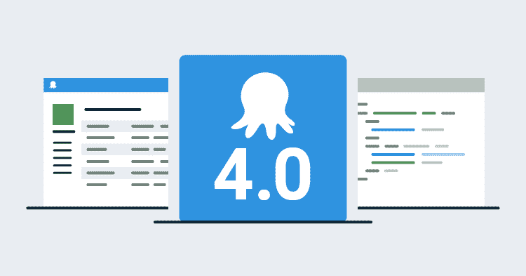

# 八达通部署 4.0 -历史-八达通部署

> 原文：<https://octopus.com/blog/octopus-v4-history>

这篇文章是我们章鱼 4.0 博客系列的一部分。在我们的[博客](https://octopus.com/blog)或我们的[推特](https://twitter.com/octopusdeploy)上关注它。

**Octopus Deploy 4.0 已经发货！今天就阅读[博文](/blog/octopus-release-4-0)和[下载](https://octopus.com/downloads)吧！**

* * *

我知道你们中的一些人想知道为什么我们决定重写 Octopus UI，这篇博文试图对这个问题提供一个高层次的答案。我们将在以后的博客文章中解释每个重大变化的细节。

Octopus `3.x`的 UI 是建立在 Angular `1.x`之上的，大约一年前 Angular `2.0`取代了 Angular`1.x`。从`1.4`到`2.0`的迁移需要付出巨大的努力，所以我们不只是问如何/何时迁移`1.4`到`2.0`，而是问自己下一个版本的 Octopus UI 应该是什么样子。而`v4`就是这样诞生的。

## 用户体验

自从`2.0`于 2013 年 12 月发布以来，Octopus UI 一直没有显著变化，我们认为是时候对其进行现代化改造并解决几个长期存在的问题了。这不能仅仅通过应用一个新的样式表来完成，因为我们想要引入新的交互，去除很多不一致的地方，并重新设计一些最常用的页面。变量编辑器、部署页面或环境仪表板不能仅仅通过修复错误而得到显著改进。它们需要完全重新设计。

当你第一次访问 Octopus UI 时，你需要等待超过 1MB 的静态资产被下载。这不是一个很好的第一印象。为了解决这个问题，我们重新构建了 UI 代码，只同步加载绝对必要的内容，然后在后台异步加载所有其他区域。这有效地减少了用户开始与应用程序交互之前需要发送给浏览器的代码量。

## 开发者体验

从开发的角度来看，我们想要一个可以使用现代 JavaScript 的环境，我们可以在未来安全地维护和扩展它。满足这些要求的技术不止一种，我们已经对其中的一些进行了试验。在这个练习的最后，我们选择了 [TypeScript](https://www.typescriptlang.org/) 、 [React](https://reactjs.org/) 和 [CSS 模块](https://github.com/css-modules/css-modules)作为我们的基本构建模块。

TypeScript 让我们的 JavaScript 成为强类型，这有助于消除许多手动重构，现在可以由代码编辑器自动完成。TypeScript 还将几个常见的运行时错误转换为编译时错误。我不记得上一次看到由打字错误引起的错误是什么时候了😃。

TypeScript 编译器[是一个 transpiler](https://en.wikipedia.org/wiki/Source-to-source_compiler) ，这意味着我们可以使用现代 JavaScript(例如`arrow functions`、`async/await`)，而不用担心浏览器还不支持它。

我们从 Angular 到 React 的转变需要一个单独的帖子，但我至少应该在这里提供一个高水平的总结。我们选择 React 是因为它在概念上很简单，并且大量使用现代 JavaScript(例如`Array.map`)而不是依赖自定义语法(例如 Angular `v1`中的`ng-repeat`或`*ngFor` Angular `v2`)。梅里克·克里斯滕森的 [React vs Angular 2](http://merrickchristensen.com/articles/react-vs-angular-2.html#my-conclusion) 帖子的结论很好地总结了这两者之间的主要区别。实际上，React 让你成为更好的 JavaScript 开发人员，Angular 让你成为更好的 Angular 开发人员。

CSS 模块让我们保持组件的样式彼此完全隔离。我们可以全力以赴，用 JavaScript 指定我们的 CSS，但我们对更少的东西感到满意，唯一缺少的就是隔离。

正如你所看到的，我们已经决定同时解决相当多的复杂问题，这需要大量的协调努力，但我们将 Octopus UI 视为 Octopus Deploy 生态系统的重要组成部分，并愿意投资于它。