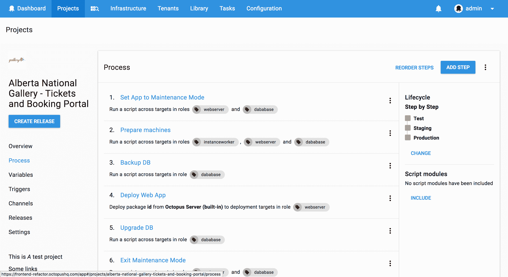
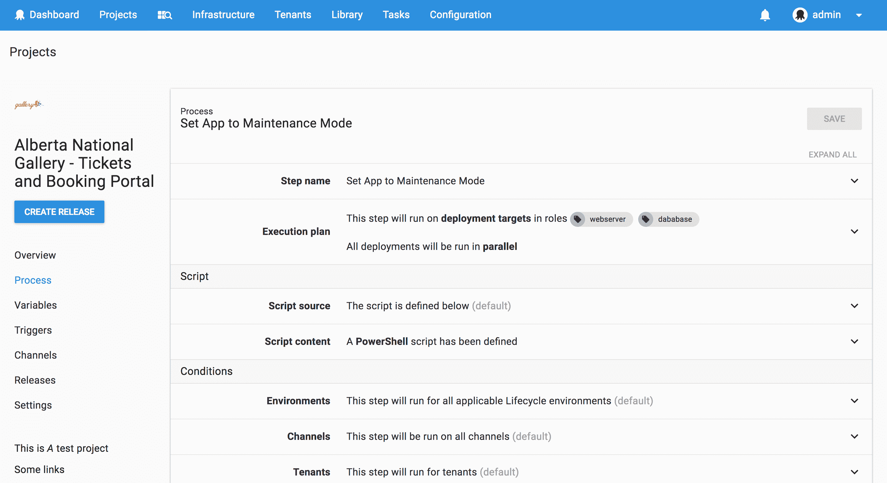

# Octopus 部署 4.0 - UX 和 UI - Octopus 部署

> 原文：<https://octopus.com/blog/octopus-v4-uxui>

这篇文章是我们章鱼 4.0 博客系列的一部分。在我们的[博客](https://octopus.com/blog)或我们的[推特](https://twitter.com/octopusdeploy)上关注它。

**Octopus Deploy 4.0 已经发货！今天就阅读[博文](/blog/octopus-release-4-0)和[下载](https://octopus.com/downloads)吧！**

* * *

## 八达通 4.0 UX 和用户界面

我们希望 Octopus 发展壮大，成为一个强大的行业领先的部署工具，甚至比现在还要强大。但是我们认识到，为了给我们的用户最好的体验，我们需要重写和重新设计，以适应未来的增长和新功能的能力。新的用户界面可能会有很大的不同，但有很多页面的布局或内容没有改变，所以你应该会发现大部分领域都很熟悉。Octopus 4.0 UI 的目的是更新到一个现代化的界面，减少用户的认知负荷，重新设计以适应增长，最重要的是保持提供良好的用户体验。

### 现代用户界面

我们决定使用现有的 CSS 和模式库，这样我们就可以专注于构建出色的部署工具体验。我们真的很喜欢谷歌的材料指南，但也意识到不要失去一些标志性的章鱼风格，例如，任务细节风格。Material-UI 库中有大部分需要的模式，我们已经将它们改编成我们自己的品牌。通过使用现有的库，我们利用大多数人已经使用的现有模式，所以当你升级到 Octopus 4.0 时，这是一种熟悉的体验。

**仪表板前**

**仪表板后**

#### 降低认知负荷

每个页面的目标是直观的，让用户立即知道他们在哪里，做什么，以及如何做。我们发现有些页面很忙，有解释每个部分内容的文字和看起来一样的按钮。为了减少所需的脑力劳动，我们应用了一些简单的设计原则:焦点和流程的层次颜色、大小和位置帮助 4.0 在布局和组件中实现了层次。

按钮组件使用颜色来确定主要动作、次要动作和三元动作，这些动作通常内嵌显示。任何用户不经常使用或者我们不希望被意外点击的动作现在都在溢出菜单中。

使用页面布局层次结构允许我们使用模式来帮助直观地表示从高级摘要、详细摘要到详细数据视图的流程。在某些情况下，由于数据的目的，这并不可行，但是大多数部分都是从卡片视图开始，然后转到列表或表格，再转到表单和详细数据。

**卡片查看**

**列表视图**

**汇总表视图**

**详细表格视图**

#### 将有用的动作放在一起

该界面被设计成动作按钮位于内容区域内，并且在任何时候都可以通过粘性的部分标题看到。不用再滚动到保存按钮！

#### 一致性

通过基于层次和接近度创建设计布局，我们立即解决了布局一致性问题。为了确保每个人都使用相同的组件，我们开发了一个详细的风格指南，开发人员可以很容易地找到正确的组件。

#### 提供清晰的摘要视图

Octopus 4.0 UI 最大的变化之一是扩展了表单部分。当折叠时，面板显示步骤或项目设置的配置摘要，没有其他设置的干扰，因此减少了用户的认知负荷。

**汇总表单视图**

**详细表格视图**

### 规模设计

以前的 Octopus UI 不能很好地显示大量数据，因此 Octopus 4.0 需要确保使用扩展面板和表格等模式在屏幕上显示尽可能多的数据。扩展面板还有助于减少页面(如重新设计的环境页面)的加载时间。拥有大量数据的 Octopus 用户面临的一个问题是寻找东西。为了帮助我们，我们疯狂地使用过滤器、高级过滤器和预定义过滤器。

**环境页面在**之前

**环境页面**后

我们知道习惯新事物可能是一个挑战，但我们相信我们重新设计和重组区域的决定，如变量编辑器和部署页面，已经产生了一个令人敬畏的 Octopus 4.0 版本。这要感谢正在进行的用户语音建议，以及最近我们的用户，他们在测试 Octopus 4.0 Alpha 时提供了宝贵的反馈。