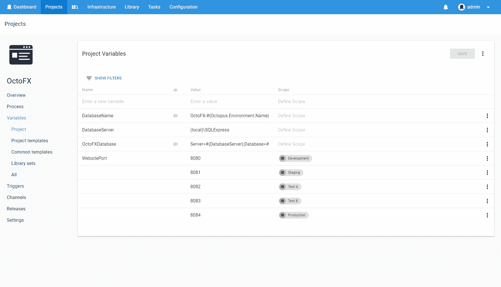
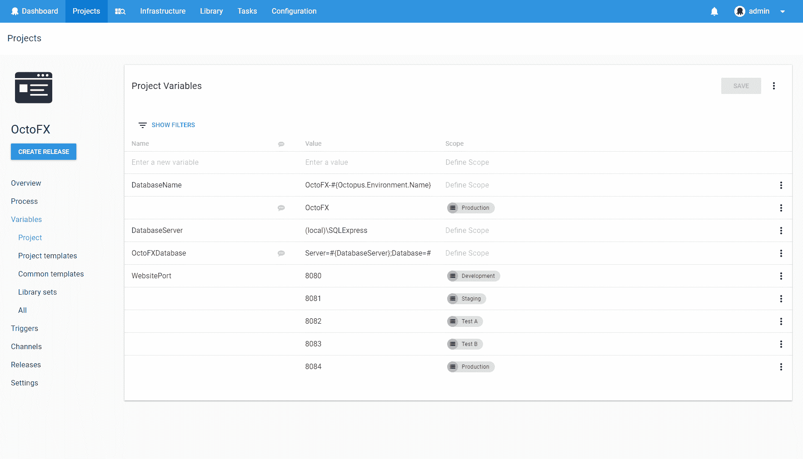
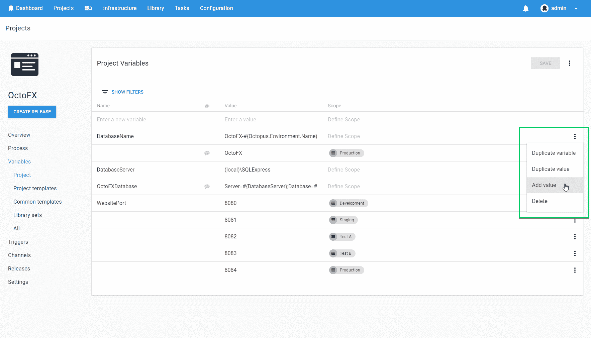
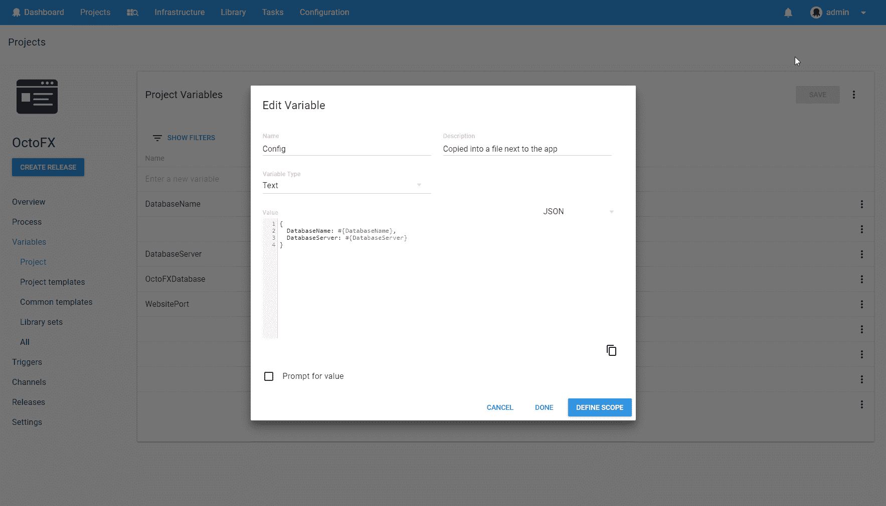
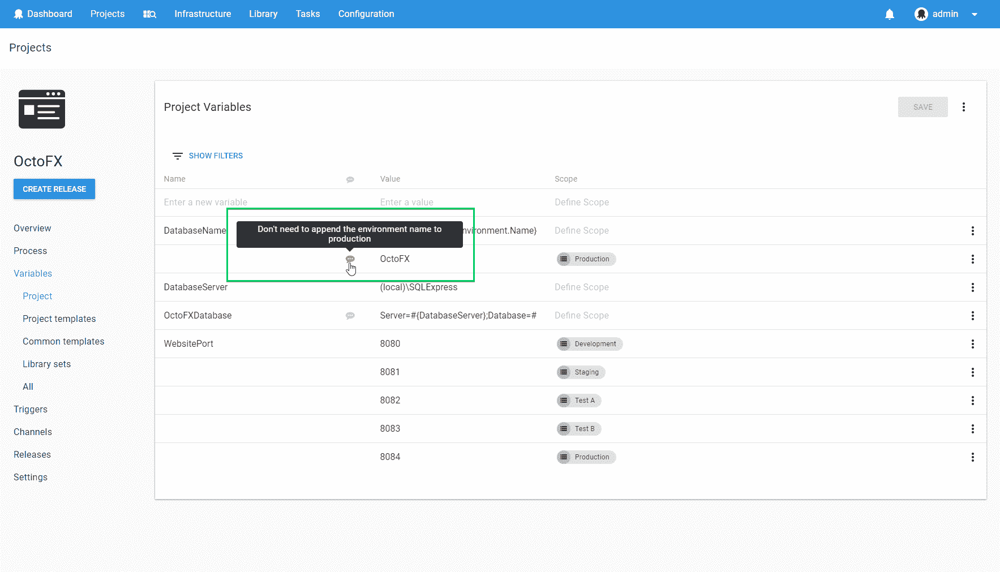
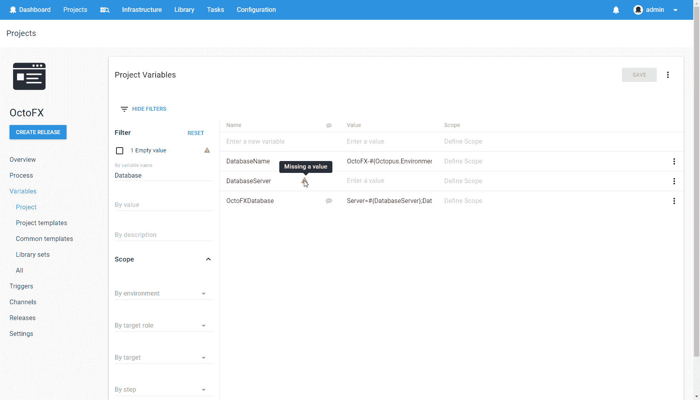
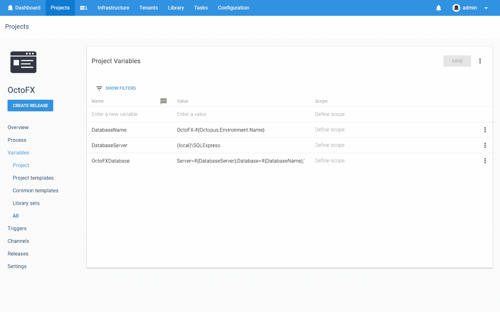

# 章鱼部署 4.0 -变量编辑器重新设计-章鱼部署

> 原文：<https://octopus.com/blog/octopus-v4-variable-editor>

这篇文章是我们章鱼 4.0 博客系列的一部分。在我们的[博客](https://octopus.com/blog)或我们的[推特](https://twitter.com/octopusdeploy)上关注它。

**Octopus Deploy 4.0 已经发货！今天就阅读[博文](/blog/octopus-release-4-0)和[下载](https://octopus.com/downloads)吧！**

* * *

我们之前发布了一个关于变量编辑器重新设计的 RFC。这个话题引起了很多人的兴趣，它是我们在[用户之声](https://octopusdeploy.uservoice.com/forums/170787-general/suggestions/7192251-improve-variables-ui)上最受欢迎的建议。

修改后的变量编辑器将在我们即将发布的 Octopus Deploy 4.0 版本中发布。让我们深入了解一下我们所做的一些改变吧！

基于 React 和 Material 设计，使用我们新的 UI 框架从头开始构建变量编辑器。这种全新的外观使使用变量编辑器成为一种非常愉快的体验，并使其与应用程序的其他部分保持一致。

**变量组**

新的变量编辑器迫使用户在确定变量的作用域时，以稍微不同的方式考虑变量。现在，一个变量有多个不同作用域的值，而不是多个同名的变量。从概念上讲，这与变量的使用方式更加一致，意味着您总是可以在 UI 中看到适当分组的变量。这也意味着我们可以提供一些有用的特性，比如只需要重命名一个变量一次，而不是为每个值重命名多次。

在这个例子中，您可以看到`DatabaseName`和`WebsitePort`的所有值都被分组在一起，这样您就可以轻松地一起查看和编辑它们。

**附加行动**

就像 4.0 UI 的其余部分一样，当有额外的上下文操作可用时，它们会显示在溢出菜单中。变量编辑器中每一行的右侧都有一个溢出菜单按钮。这允许您执行更具体的操作，如复制、删除或向现有变量添加新值。

**弹出对话框**

有时你需要更多的空间来编辑一个变量，这就是变量弹出对话框发挥作用的地方。如果您的变量是一个脚本或包含大量数据，这将非常有用。它使用我们的代码编辑器，为您选择的语言提供语法高亮显示。该对话框还为您提供了执行一些高级变量设置的机会，例如配置提示变量。

**描述**

有时你想用一些额外的信息来注释一个变量。也许这是对在部署过程中如何使用变量的描述，或者也许是对为什么使用特定值的解释。我们现在对每个变量都有了一个方便的描述。只需将鼠标悬停在变量名旁边的描述图标上即可查看其描述。您可以在变量弹出对话框中编辑描述。

**过滤**

我们还对变量过滤进行了重大修改。过滤确实存在于版本 3 和早期的变量编辑器中，但是它不是很容易被发现，很多用户甚至不知道它的存在！它在新的变量编辑器中更加突出，允许您以更多的方式过滤变量。例如，您可以选择只显示还没有值的变量。

**键盘**

很多用户在编辑变量时喜欢呆在键盘上。对于第一个版本，我们主要关注导航体验。您可以使用 tab、shift + tab 和上下箭头键在变量编辑器中轻松导航。您可以更改任何变量的名称、值或范围，而无需触摸鼠标！当然，如果你喜欢用鼠标，那也很好。

下面是一个不用离开键盘就可以添加一个具有多个值的新变量的例子。

**性能**

一些用户有非常大的变量集，所以我们确保变量编辑器在这些情况下保持快速。使用 react 在这里帮了我们很多，因为 React 有一些优化渲染性能的有用策略。此外，我们利用 UI 虚拟化技术，只呈现当前在屏幕上可见的变量。我们相信，即使是我们最大的客户也会对新变量编辑器的性能感到满意。

**反馈**

感谢所有提供建议和反馈的人。不幸的是，我们无法在变量编辑器的第一版中解决所有这些问题。相反，我们专注于建立一个坚实的基础，在即将发布的 Octopus 中，我们可以在这个基础上轻松地迭代和改进。

我们期待着将它交到您的手中，看看您有什么想法！