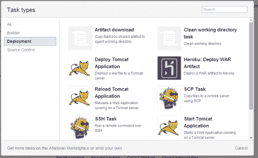
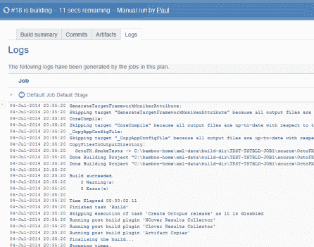
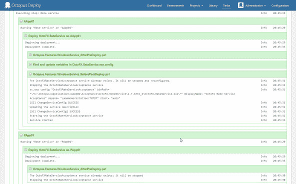

# Octopus 与构建服务器- Octopus 部署

> 原文：<https://octopus.com/blog/octopus-vs-build-server>

在我以前的生活中，我使用 CruiseControl.NET，以及后来的 TeamCity，作为我的部署自动化工具。目标是自动化部署，因为我的构建服务器已经编译了代码并运行了测试，所以让它也进行部署是很自然的。

我通过添加部署软件的定制脚本来扩展构建过程。有时它们是运行 RoboCopy 和一些 XML 转换的短脚本。其他时候，它们是大量的 PowerShell，代理监听远程机器；这完全取决于实际部署过程的复杂程度。正是这些经历导致了章鱼的诞生。

也就是说，这是一个仍然每周出现一次的问题:当我已经有一个 CI 服务器时，为什么还要使用 Octopus？

事实上，当我写一些关于集成 Atlassian Bamboo 和 Octopus Deploy 的文档时，我也问过自己这个问题。Bamboo 甚至还融入了部署概念；为什么竹子使用者需要章鱼？

原因如下:

## 不同的焦点

构建服务器通常包含许多内置任务，而**关注于构建**。TeamCity 和 Bamboo 提供了一系列便于构建的构建运行器类型:它们可以调用许多平台的构建引擎(如 MSBuild)，可以处理构建时依赖(NuGet，Maven)，有许多单元测试运行器(NUnit，MSTest)，可以运行并报告代码质量和一致性(代码覆盖率，FXCop)。

当您从部署的角度查看构建服务器中的任务运行器列表时，您会注意到一个不同之处。配置 IIS 网站的内置任务在哪里？或者[安装一个 Windows 服务](http://docs.octopusdeploy.com/display/OD/Windows+Services)？更改一个[配置文件](http://docs.octopusdeploy.com/display/OD/Configuration+files)？或者在 Octopus 库中[可用的其他 54 个(截至今天)面向部署的任务？](http://library.octopusdeploy.com/#!/listing)

即使在 Bamboo 中，内置了完整的部署特性，可用的部署任务也仅限于运行脚本:

事实是，当从 CI 服务器部署时，您通常会发现与内置部署任务最接近的是运行脚本的能力。这就引出了下一个问题:

## 远程部署

当构建服务器执行作业时，构建代理通常与最终部署到的机器不同。这是因为与构建不同，部署涉及协调许多机器上的活动。

当一个部署涉及多台机器时，由您来决定如何通过网络使用 XCOPY、SSH 或 PowerShell remoting 等工具远程执行整个部署。然后，您可以将它包装在一个 *for* 循环中，以迭代所有相关的机器。

这带来了许多挑战:

1)您对所有这些机器都有适当的权限吗？2)您能对防火墙进行所有必要的更改吗？3)如果这些机器不在同一个 Active Directory 域上，该怎么办？4)您将如何取回日志？如果出了问题，你将如何诊断？5)连接是否安全？

过去，我在不同的项目中浪费了太多的时间来解决这些问题，这正是我们在设计触手代理系统上投入如此多时间的原因:

*   触角不需要在同一个 AD 域
*   我们使用 [SSL 和双向信任](http://docs.octopusdeploy.com/pages/viewpage.action?pageId=360622)来保证安全性
*   触须既可以[监听](http://docs.octopusdeploy.com/display/OD/Listening+Tentacles)也可以[投票](http://docs.octopusdeploy.com/display/OD/Polling+Tentacles)——由你决定
*   当 Tentacles 运行命令时，它们是作为本地用户执行的，因此您可以执行许多可能无法通过网络执行的活动

## 自动并行化

与上述相关，在除了最简单的部署之外的所有部署中，一个部署通常涉及多台机器:可能是几台 web 服务器，或者一个应用服务器群。

一个好的部署自动化工具可以解决在所有这些机器上并行运行所有部署活动的问题。在 Octopus 中，您注册机器并用角色标记它们，然后您指定要部署到给定角色的机器上的包。Octopus 确保包在机器上，然后并行或滚动部署它们。

当您比较来自像 Bamboo 或 Jenkins 这样的 CI 工具的平面构建日志时，区别是显而易见的:

对照 Octopus 中的分层部署日志:

Octopus 使用嵌套不是为了显示的目的(像 TeamCity):我们使用它是因为这些步骤中的每一步都在同一时间运行。根本没有其他方法来显示它。如果您有一个需要在 10 台机器上运行的脚本，您将看到它在所有 10 台机器上同时执行时的日志消息，而不会把它们混在一起。

上周五，一位客户使用 Octopus 在超过 600 台**机器**上部署了一个应用程序。如果不自己编写所有的协调脚本，用构建服务器来做这件事会花费很长时间，而且日志也不可能被破译。

## 配置

所有构建服务器都有某种级别的构建参数/变量支持。但是观察它们的能力非常有限。如果您有多台目标服务器，并且需要对每台服务器的设置使用不同的值，您如何管理呢？

在 Octopus 中，我们用不同的作用域管理[变量](http://docs.octopusdeploy.com/display/OD/Variables)，可以安全地处理密码等敏感设置。如你所料，我们在发布之间拍快照，并且[审计](http://docs.octopusdeploy.com/display/OD/Auditing)所做的变更。最重要的是，您可以更改配置(这实际上是一个操作问题)，而不必重新构建应用程序。

## 部署可能会很混乱

当您的构建服务器遇到一个错误——一个失败的单元测试，或者糟糕的代码，它会怎么做？理想情况下，它会很快失效。您不希望 CI 服务器暂停，并询问您下一步想做什么。

当您在 10 台 web 服务器上执行一个 web 站点的滚动部署时，7 号服务器出现故障，快速故障可能是您最不希望看到的。也许您想调查问题并重试，或者跳过那台机器并继续其余部分。这就是为什么章鱼有[引导失败](http://docs.octopusdeploy.com/display/OD/Guided+failures)的原因。

事实上，人工干预可能是所有部署都需要的，而不仅仅是在出现问题时。在 Octopus 中，您可以将[手动干预步骤](http://docs.octopusdeploy.com/display/OD/Manual+intervention+and+approvals)添加到部署中，这些步骤可以在开始(用于批准)、结束(用于验证)、甚至中途(某些遗留组件只需手动配置)运行。

## 摘要

所有这些问题——可用的内置任务、远程执行和基础设施问题、并行性和故障模式——都指向一个结论:**构建和部署是根本不同的东西**。事实上，它们唯一真正共享的特征是它们有时都涉及脚本，团队需要对它们的可见性。

作为负责自动化部署的开发人员，这种区别起初并不明显。构建和 CI 服务器已经存在很长时间了，我们对它们很熟悉，因此很自然地会想到如何将它们扩展到部署。尽管我们已经在 Octopus 上工作了很多年，但在为 Octopus 设计新功能时，我仍然发现自己在看 CI 工具。只有当您使用定制脚本来协调日益复杂的部署时，这些差异才会变得非常明显。

构建和部署是不同的，但同样重要。“最佳工作工具”的规则应该适用于他们两个。我们的目标是专注于成为最好的部署工具；我们将把构建的问题留给构建服务器 **:-)**