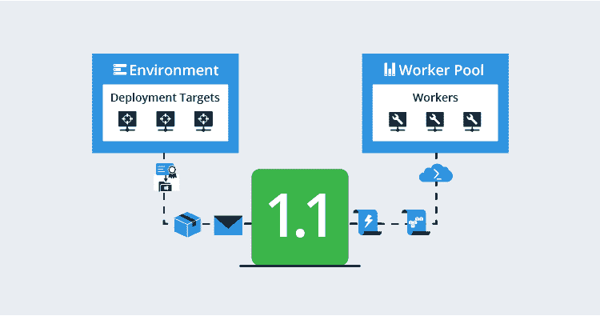
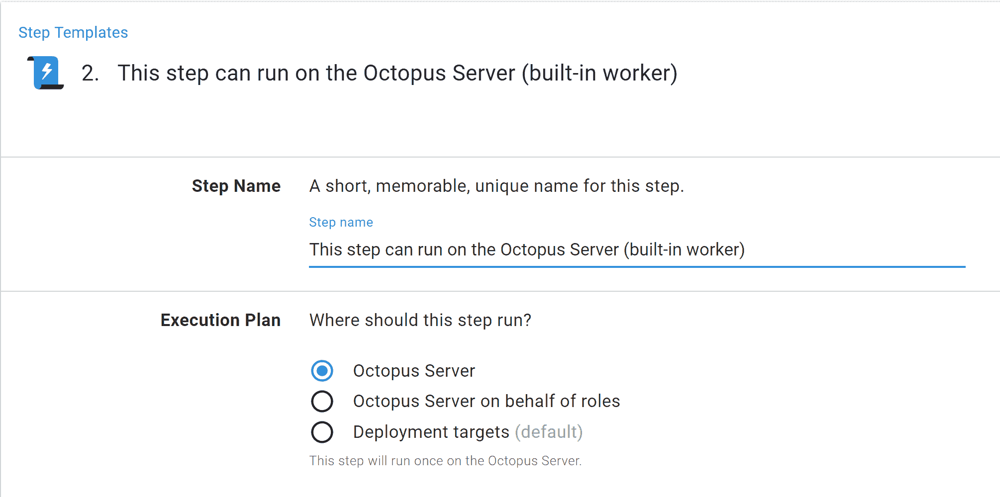
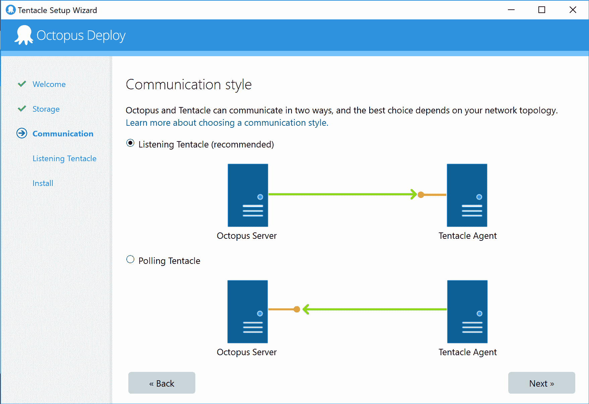
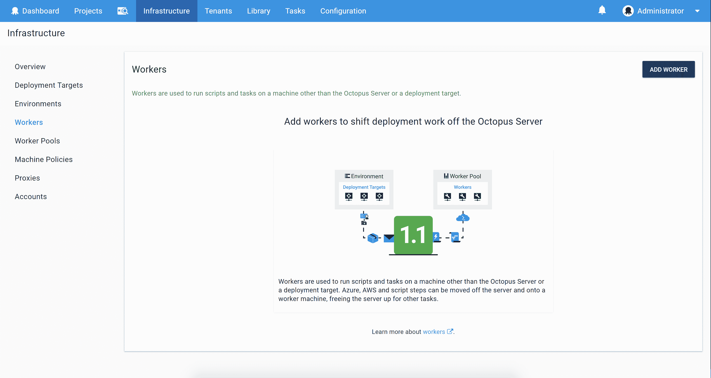
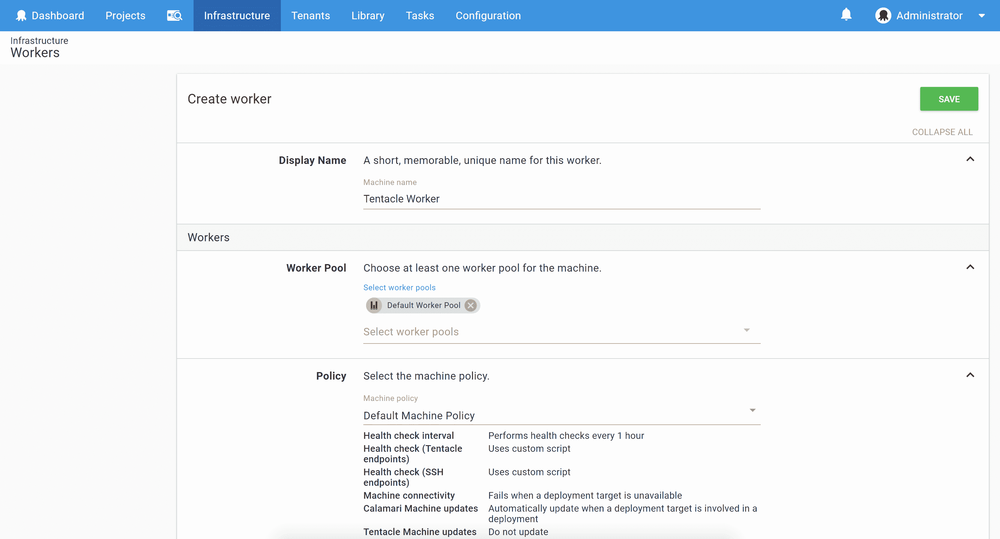
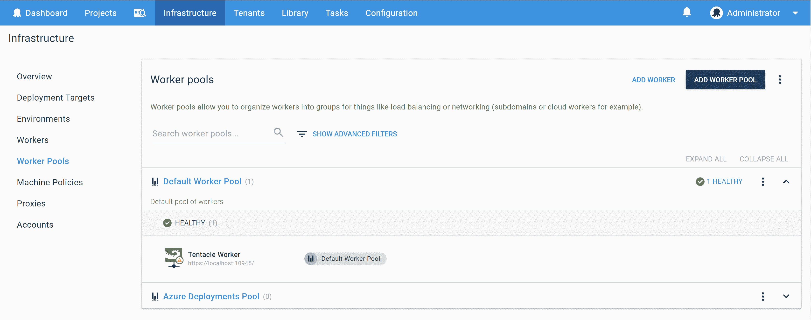
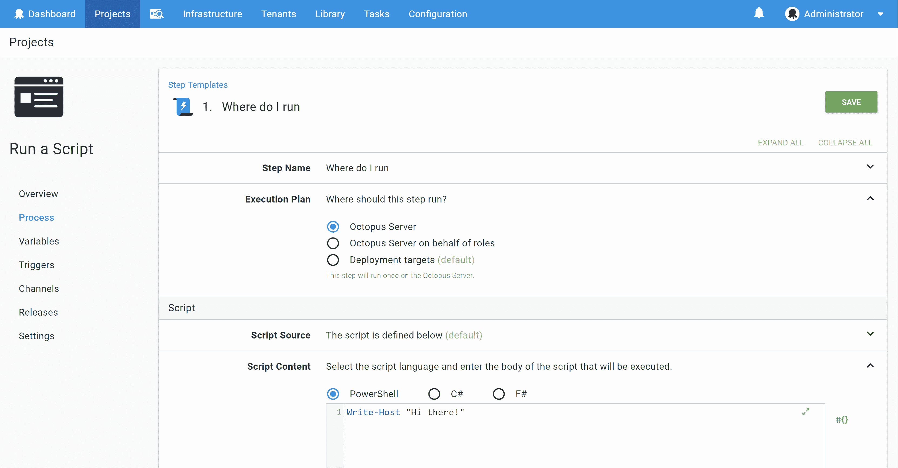
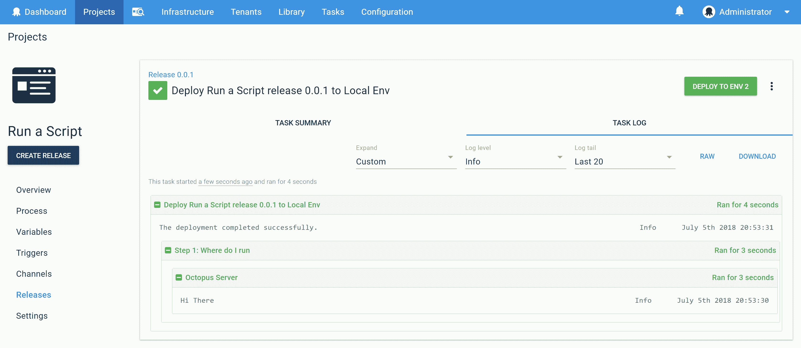
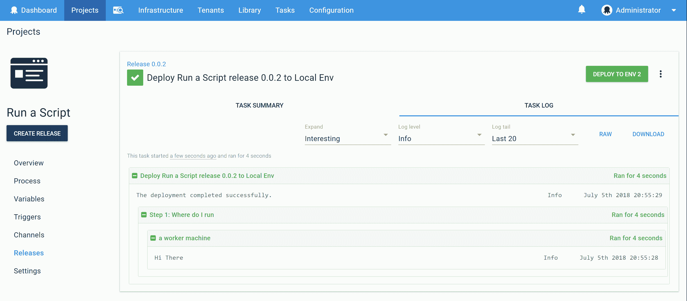

# 八达通工人-八达通部署

> 原文：<https://octopus.com/blog/octopus-workers>

我们即将发布一个伟大的新功能，给你各种新的力量来建立你的八达通基础设施。在 2018.7.0 中，我们将引入工人。

在这篇文章中，我会给你一个预发布的预览，告诉你 Workers 是什么和为什么，并向你展示如何使用 Workers 将步骤从 Octopus 服务器上移走。

未来的帖子将给出更多的示例，通过 Workers 和使用 Workers 进行云部署来扩展您的 Octopus 基础设施。

Workers 为您提供了一些很好的方法来设置您的部署并将工作从您的 Octopus 服务器上移走，因此它非常值得仔细阅读，但我们也设计了它[,因此如果您不想使用它，您甚至不需要知道它在那里](#what-wait-no.i-dont-need-workers-change-it-back)。

## 这些工人到底是什么？

从 3.0 版本开始，Octopus 就有了一个工人。我们一开始并没有把它叫做工人，你可能甚至不知道它的存在就用上了。它被称为内置工人，它与章鱼服务器捆绑在一起。

Azure、AWS 和 Terraform 步骤都需要在某个地方运行，因此，开箱即用就是 Octopus 服务器上的内置工作器。Octopus 中的步骤由我们的开源、基于约定的部署可执行文件 [Calamari](https://github.com/OctopusDeploy/Calamari) 执行。通常，Calamari 运行在部署目标上，但是在 Azure、AWS 和 Terraform 步骤中，Octopus 服务器使用内置的 Worker 在本地调用 Calamari。

脚本步骤透露了 Octopus 可以在本地调用 Calamari。在图中的脚本步骤中，你可以看到在 Octopus 服务器上运行的选项；是内在的工人使这成为可能。

Worker 所做的就是利用内置的 Worker，在服务器可以本地执行 Calamari 的地方获取这些点，并让您选择在其他地方的 Worker 上执行它们。

### 什么是工人，什么不是

工作人员不会取代 Octopus 服务器来协调部署；它只是执行服务器指示的步骤。脚本、Azure、AWS 或 Terraform 步骤的执行方式没有任何变化；工人只是提供一个关于在哪里执行这些步骤的选项。

Octopus 服务器协调整个部署过程。部署目标是部署的目的地，工作人员是可以为服务器执行某些步骤的机器，但不是部署的目标。

所以，worker 只是可以运行 script、Azure、AWS、Terraform 步骤的机器，可以是监听触角、轮询触角，也可以是 SSH 机器(SSH Workers 只能运行 bash 脚本)。

## 什么时候你可能需要一个工人

在接下来的几篇文章中，我将充实工人派上用场(或必不可少)的三个案例的细节。

1.  [移动八爪鱼服务器的步骤——安全](#Stopping-steps-running-on-the-Octopus-Server)
2.  [扩大规模的工人-绩效](https://octopus.com/blog/octopus-workers)
3.  设置云工人-云(在下面的帖子中)

当然，也有其他使用工人的方法。

但是，在我们进入示例之前，让我们看看整个 Workers 设置是如何工作的。

## 工人*如何工作*

### 工人

工人是监听触角，轮询触角或者 SSH 机器。设置与触手或 SSH 部署目标相同。工人甚至使用相同的触手和卡拉马里二进制文件作为部署目标。

例如，这里我使用触手管理器来[设置触手](https://octopus.com/docs/infrastructure/windows-targets)，但是您也可以[编写设置](https://octopus.com/docs/infrastructure/windows-targets/automating-tentacle-installation)的脚本，甚至从命令行执行完整的[工作注册](https://octopus.com/docs/octopus-rest-api/tentacle.exe-command-line/register-with)。

一旦我设置了触手，我就导航到*基础设施*中的新*工人*选项卡，并选择“添加工人”。

在输入我配置的触手的主机和端口之后，我给这个工作者一个名字，选择一个机器策略，并把这个工作者放在一个工作者池中。

### 工人池

工人被分组到工人池中。从 Octopus 服务器的角度来看，一个池中的所有工作人员都是等效的。池可能代表机器设置，以帮助特定类型的部署，或者安装特定的工具集，或者您可能会为您正在进行的特定团队或项目分配池(当我们的空间特性出现时，这将很快工作)。

### 工人的跑步步骤

步骤——well、script、Azure、AWS 或 Terraform 步骤——现在可以针对一个工人池，并将在该池中的工人上执行。如果没有指定任何其他内容，那么总是有一个默认池被假定为步骤的目标。您可以自由更改哪个池是默认池。不出所料，最初它是作为一个名为“默认工人池”的池开始的。

Octopus 只有两种选择来选择一个工人来执行一个步骤。

1.  如果步骤解析到默认池，并且默认池中没有工作线程，Octopus 将选择内置工作线程。
2.  在所有其他情况下，Octopus 从给定的池中挑选任何健康的工人。

差不多就是这样。您设置工作人员(就像设置部署目标一样简单)，将工作人员分组到池中(就像将部署目标放入环境中一样简单)，然后您将一个步骤指向一个池，Octopus 就会分发您的部署流程的工作。

## 什么，等等，不。我不需要工人，把它改回来...

我们仔细研究了使用工人的*而不是*的用例以及过渡到工人的用例。我们认为这两个问题都得到了圆满的答案。

**如果你不想用工人，那么真的很简单——忽略它**就好。如果您是现有的 Octopus 用户，您的步骤不会改变，您的任何部署流程都不会改变，您的 Octopus 体验不会改变，甚至您的部署日志也不会改变。

以上第(1)点说明了一切。任何需要 Worker 的步骤都将解析(因为您的步骤不会有任何不同)到默认的 Worker 池，并且最终会在内置的 Worker 中结束，这与 Octopus 用户从 3.0 版本开始的体验相同。

## 停止在 Octopus 服务器上运行的步骤

我们也有一个很好的故事，从章鱼服务器上运行步骤的过渡。没有需要更新的部署流程。只需一点点设置，Octopus 就会将步骤从服务器转移到工人身上。

我们都喜欢我们的开发团队(至少像我这样的开发人员希望你喜欢)，但是如果他们不能在你的 Octopus 服务器上执行代码，也许你会更喜欢这样。

好吧，你现有的所有 Azure、AWS 和 Terraform 步骤(以及任何针对服务器的脚本步骤)都不会提到 Worker 池，所以最终使用默认池，它是空的，因此这些步骤运行在内置的 Worker 上。但是，如果您在默认池中删除了一个 Worker，那么规则(2)适用，并且该步骤在该 Worker 上运行，而不是在内置 Worker 上运行。

让我们来看看实际情况。我从一个没有工作线程(当然，除了内置工作线程)和工作线程池(除了默认池)的 Octopus 服务器设置开始。我用一个针对服务器的脚本创建了一个简单的项目。

部署项目后，日志清楚地指出脚本运行在 Octopus 服务器上。

然后，正如上面所描述的[，我提供了一个触手，并将其注册为默认工作池中的一个工作线程。](#workers)

在部署同一个项目的 0.0.2 版本(未更改)时，日志让我知道它现在运行在 Worker 上，而不是服务器上。

这就够了。仅仅一根触手就足以阻止用户代码在 Octopus 服务器上执行。

当然，也可以提供多个工作人员来分担服务器分配的工作。我将在下一篇文章中谈到这一点。

也可以关闭内置的 Worker，这意味着它永远不会被调用，即使默认池碰巧是空的。选中{配置->功能}中的选项。

相同的并发规则一如既往地适用。服务器仍然尊重您的并行步骤和`Octopus.Action.MaxParallelism`，因此多个并发步骤可以在 Worker 上运行，甚至可以在同一个 Worker 上运行，就像内置 Worker 并发运行许多步骤一样。

## 即将推出

工人即将在 Octopus 2018.7.0 中发布，所以请关注我们的发布。

在博客上，我会发布更多关于工人的文章。接下来，我将考虑使用 Workers 来减少 Octopus 服务器上的负载。在那之后，我将看一看我们如何使用 Workers 来为云部署提供一些好的模式。