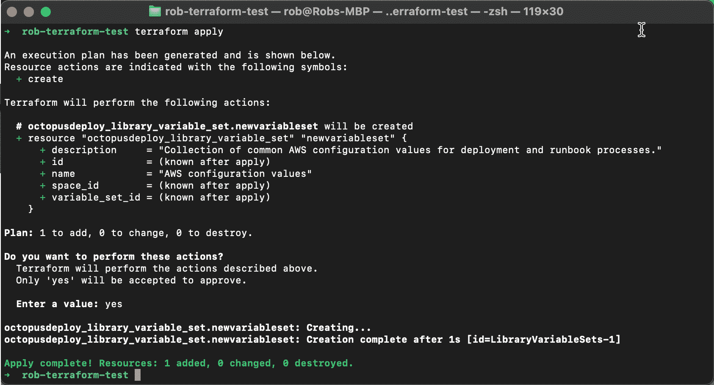
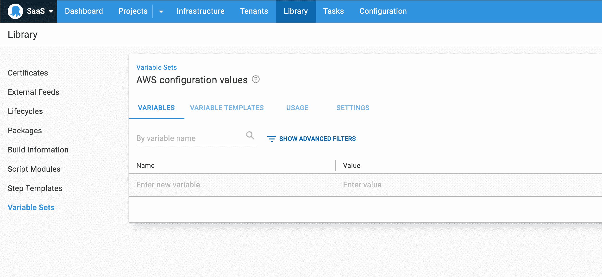

# Octopus Deploy 的 Terraform provider 入门- Octopus Deploy

> 原文：<https://octopus.com/blog/octopusdeploy-terraform-provider>

[](#)

基础设施即代码(IaC)允许团队创建基础设施资源(即虚拟机、存储、网络资源等)。)而无需浏览向导或多次点击鼠标。哈希公司的 [Terraform](https://www.terraform.io) 是最受欢迎的基础设施 as 代码解决方案之一。Terraform 是一个开源的 IaC 解决方案，它允许您使用一种基于函数的编程语言来定义您的基础设施，这种语言叫做[哈希公司配置语言(HCL)](https://github.com/hashicorp/hcl) 。

章鱼很自豪地介绍我们的官方平台提供商。这个项目最初是由[马修·霍奇金斯](https://github.com/MattHodge/)发起的[社区倡议](https://github.com/MattHodge/terraform-provider-octopusdeploy)，他根据自己的需求建造了这个项目。接下来， [Mark Henderson](https://github.com/mhenderson-so) 为 StackExchange 的需求贡献了项目。我们感谢 Matt 和 Mark 自 2018 年项目启动以来所做的努力。使它成为一个官方的、受支持的提供者带来了显著的优势，因为我们可以保持插件最新，改进它的测试，并增加新的特性。

在这篇博文中，我介绍了 Octopus Deploy 的 Terraform 提供者，并分享了如何开始使用它的实际例子。

## 为什么基础设施是代码？

自动化和开发运维是未来。手动创建基础设施既慢又容易出错，而且很容易因为一个愚蠢的打字错误而破坏系统。

作为代码的基础设施允许您声明性地描述您的基础设施，并且相关的工具允许您在将其应用于生产系统之前对其进行测试。将您的配置存储在源代码管理中允许您通过协作、代码审查来进一步提高质量，并且它为您提供了更改的完整历史。

## 什么是 Terraform 提供商？

Terraform 是一个开源工具，您可以使用声明性配置文件，遵循基础架构即代码的方法，来配置和更新基础架构。您在配置文件中描述资源的状态，Terraform 将此应用于您的基础设施。它可以创建、破坏和检测期望状态和实际基础设施之间的偏差。

Terraform 提供者是允许 Terraform 与多种技术交互的插件。Octopus Deploy Terraform provider 将使您能够与 Octopus 实例交互并管理其配置。

## Octopus Deploy 的 Terraform provider 入门

我们的 Terraform 提供商允许团队提供和配置 Octopus Deploy 实例。这适用于本地 Octopus 服务器和 [Octopus Cloud](https://octopus.com/docs/octopus-cloud) 实例。

我们在内部使用这个 Terraform provider 来提供和配置 Octopus 实例，包括 Octopus Cloud。这是一个神奇的工具，我们很高兴看到它在社区的团队中使用。

这个提供者由用 [Go](https://golang.org) 编写的新的跨平台 [Octopus 客户端](https://github.com/OctopusDeploy/go-octopusdeploy)提供支持。这个客户端很有用，因为它让您无需直接调用 Octopus REST API 就可以与 Octopus 进行交互。它补充了 [Octopus CLI](https://octopus.com/docs/octopus-rest-api/octopus-cli) 和其他 Octopus [API 客户端](https://octopus.com/docs/octopus-rest-api)。

### 先决条件

使用 Octopus Terraform provider 需要以下工具:

*   Go 1.12 或更新版本
*   Terraform 0.12 或更新版本
*   Octopus Deploy 2019.1 或更新版本

### 安装 Octopus Terraform 提供程序

我们正在将 Octopus 提供程序发布到官方的 [Terraform 注册表](https://registry.terraform.io)，Terraform 会自动检测您需要哪些提供程序并安装它们。

### 创建您的第一个地形脚本

首先，这里有一个简单的例子，向您展示如何向现有的 Octopus 实例和空间添加新的变量集:

1.  **创建地形配置文件**

*   `main.tf`:这是主配置文件，配置提供者并指定要创建或更新的资源。
*   `variables.tf`:该文件定义了`main.tf`配置文件中使用的变量。
*   `terraform.tfvars`:该文件包含`variables.tf`中定义的变量值。

2.  **配置主地形配置文件。**打开`main.tf`文件，复制粘贴以下内容。前两个块配置 Octopus 部署提供程序，最后一个块定义新的变量集资源:

```
terraform {
  required_providers {
    octopusdeploy = {
      source  = "OctopusDeployLabs/octopusdeploy"
    }
  }
}

provider "octopusdeploy" {
  address  = var.serverURL
  api_key   = var.apiKey
  space_id = var.space
}

resource "octopusdeploy_library_variable_set" "newvariableset" {
  description = var.description
  name        = var.variableSetName
} 
```

3.  **添加变量定义。**打开`variables.tf`文件，复制并粘贴以下变量定义。这个文件的内容很简单。我们正在定义变量名和它们将存储的数据类型。在这种情况下，一切都是一个简单的字符串:

```
variable "apiKey" {
    type = string
}

variable "space" {
    type = string
}

variable "serverURL" {
    type = string
}

variable "variableSetName" {
    type = string
}

variable "description" {
    type = string
} 
```

4.  **设置您的变量值**。Terraform 会在运行时将这些值传递到您的配置文件中。打开`terraform.tfvars`文件，复制并粘贴以下文本。您将需要使用您的 Octopus 服务器详细信息以及变量集名称和描述来更新这些值:

```
serverURL       = "https://mytestoctopusname.octopus.app"
apiKey          = "API-XXXXXXXXXXXXX"
space           = "Spaces-1"
variableSetName = "AWS configuration values"
description     = "Collection of common AWS config values for automated deployment and runbook processes." 
```

5.  **应用配置文件中的更改。**通过将 Terraform 配置文件应用到 Octopus 实例来创建新的 Octopus 变量集资源。在终端或命令提示符下运行以下命令，初始化、验证并应用您的更改:

*   `terraform init`
*   `terraform plan`
*   `terraform apply`

**注意**:这不是一个完整的地形教程。我强烈推荐你阅读优秀的 [Terraform 文档](https://www.terraform.io/docs/)来了解更多关于 Terraform 本身的信息。

[](#)

恭喜你！您已经使用 Terraform 和 Octopus Deploy 提供程序配置了 Octopus 实例。导航到您的 Octopus 实例，您将看到在所选空间中新创建的变量集！

[](#)

### 后续步骤

阅读 [Terraform provider 文档](https://registry.terraform.io/providers/OctopusDeployLabs/octopusdeploy/latest/docs)并查看 GitHub 存储库中的[T5 文件夹](https://github.com/OctopusDeployLabs/terraform-provider-octopusdeploy/tree/master/examples)以获取更多示例。

观看我们的管理 Octopus with Go 和 Terraform 网络研讨会，获得深入的概述，并观看大量真实的例子。

[https://www.youtube.com/embed/lN78iPeqwsE](https://www.youtube.com/embed/lN78iPeqwsE)

VIDEO

## 开源和贡献

GitHub 上的[项目库](https://github.com/OctopusDeployLabs/terraform-provider-octopusdeploy)带有 Mozilla Public License 版许可。我们接受拉取请求，并且我们希望看到社区贡献。

## 使用 Terraform provider 的基础架构代码与配置代码

我们目前正在构建对代码为的[配置的支持，以给团队一个版本控制的 Octopus 项目的文本表示。这带来了许多好处，但也提出了几个问题。](https://octopus.com/blog/shaping-config-as-code)

*对于我们的 Terraform 提供商来说，配置即代码和基础设施即代码有什么区别？什么时候应该使用配置作为代码？我应该何时使用 Terraform 提供程序？*

这两个特性都很有价值，它们相辅相成。如果适合您的需要，您可以选择单独使用或一起使用它们。这两种技术之间最显著的区别是范围。基础设施代码侧重于提供和配置整个 Octopus 实例，而配置代码侧重于项目中的自动化过程。

使用代码为的 **Config，您可以在 Git 源代码控制中获得自动化过程(部署和 runbook)的人类可读版本。这带来了许多好处，包括捕获历史，支持分支的变更，拥有单一的事实来源，以及提高创建可以被克隆的模板配置的能力。Config as Code 侧重于项目中的自动化过程。它不允许您配置 Octopus 的其他区域。**

使用代码为的**基础设施，您可以提供新的 Octopus 实例并配置现有的实例。这涵盖了 Octopus 的大部分领域，从基础设施、项目、库到系统配置。您还可以从 Terraform 生态系统中获得许多好处，包括配置基础架构、管理变更和检测偏差的一致方法。**

## 结论

我们很高兴分享我们的 Terraform 提供者，我们希望它能帮助团队用一种声明性的“基础设施即代码”的方法来管理他们的 Octopus 实例。