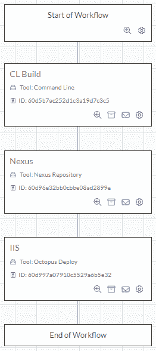
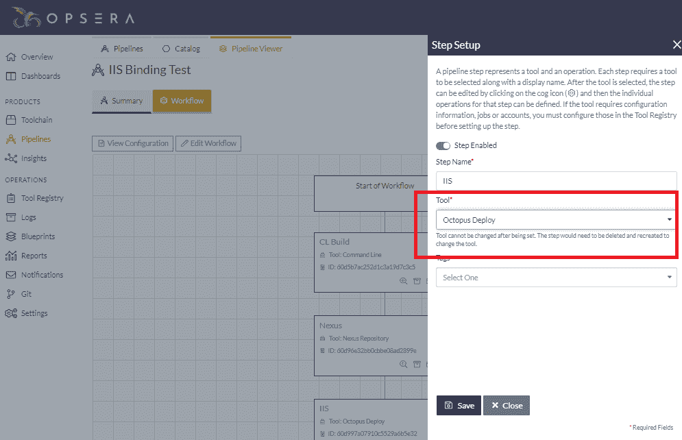
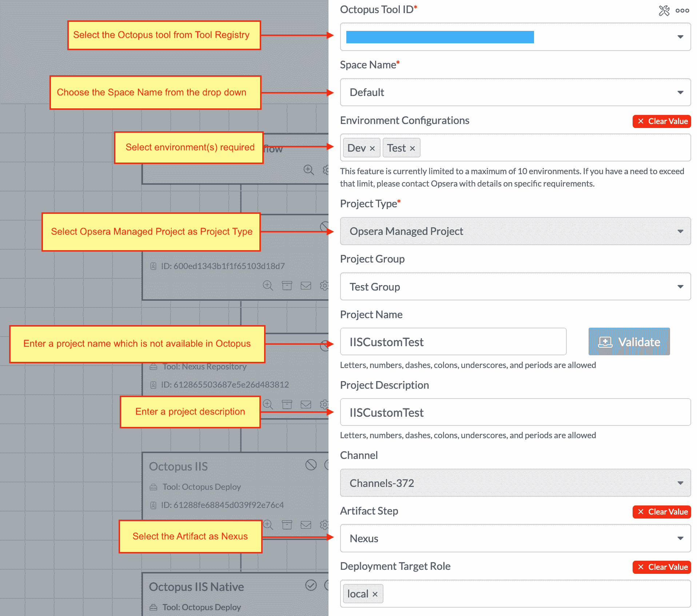
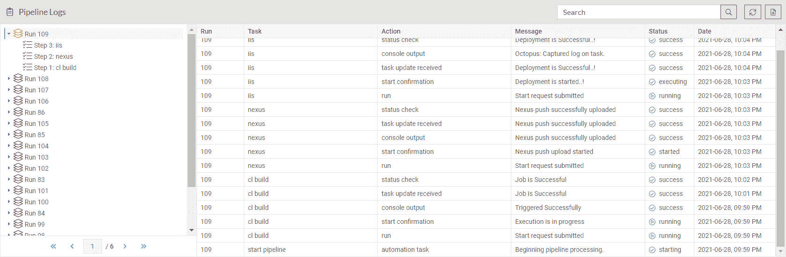

# Opsera 与 Octopus 集成- Octopus 部署

> 原文：<https://octopus.com/blog/opsera-integration-with-octopus-deploy>

我们已经与 Opsera 合作，提供与 Octopus Deploy 的集成。您可以将 Octopus 与 Opsera 支持的 95+平台集成，作为其无代码 DevOps 编排平台的一部分。

自动化您的 CI/CD 渠道是一项挑战，尤其是当您使用不同的解决方案时。它需要技术知识和经验来编排开发团队所需的各种工具、管道和洞察力。这就是 Opsera 可以提供帮助的地方。

Opsera 提供自助服务平台，帮助您实现 CI/CD 渠道的自动化。您可以通过可视化界面来实现这一点，因此您可以创建具有统一洞察力的声明性管道。

启用后，Opsera 的集成通过其管道 UI 提供对 Octopus Deploy 中定义的资源的访问，如通道、环境、生命周期、项目、空间和租户。

## 入门指南

Opsera 和 Octopus Deploy 通过 Octopus API 进行通信。所以，第一步是在 Octopus 中创建一个 API 键。

这个 API 键代表您对 Octopus Deploy 执行操作。查看我们的文档来[了解如何创建 API 密匙](https://octopus.com/docs/octopus-rest-api/how-to-create-an-api-key)。

下一步是通过工具注册表在 Opsera 中注册 Octopus Deploy。该步骤的说明见 Opsera 文档中的[节，在工具注册表](https://opsera.atlassian.net/wiki/spaces/OE/pages/1367474335/Octopus+Deployment#Registering-the-Octopus-tool-in-Tool-Registry)中注册 Octopus 工具。

完成这一步后，您可以在 Opsera 的管道 UI 中使用 Octopus Deploy 集成。

## Opsera 与 Octopus 的整合概述

Opsera 的一个强大功能是其可视化和编排管道工作流的能力:

这个工作流代表了一个基于 Java 的项目:通过命令行构建源代码→将工件推送到 Nexus repository →通过 Octopus Deploy 部署到 IIS。

Opsera 显示工作流程的每个步骤；每个步骤代表一个工具和一个要执行的操作。

编辑配置使您能够自定义其步骤包含的属性和操作:

这一步表示通过 Octopus Deploy 部署到 IIS。Opsera UI 公开了渠道、项目和角色等资源，提供了跨其支持的平台的一致体验。

建立管道后，它可以基于一系列事件或作为计划任务运行:

## 结论

Opsera 提供了一个自助服务平台，通过可视化界面帮助您自动化 CI/CD，因此您可以创建具有统一洞察力的声明性管道。

Octopus Deploy 加入了 Opsera 支持的 95+平台，作为其无代码 DevOps 编排平台的一部分。Opsera 的强大之处在于它能够轻松地将其他系统与 Octopus Deploy 集成在一起。

如果你是 Opsera 的客户，并且你对使用 Octopus Deploy 进行部署感兴趣，你可以[注册免费试用](https://octopus.com/start)。使用上面的步骤，您可以通过 Opsera 快速将我们的部署功能作为编排的一部分。

要了解更多信息，请观看关于 Opsera 和 Octopus 部署集成的免费网络研讨会[。](https://www.opsera.io/events/opsera-and-octopus-integration)

愉快的部署！