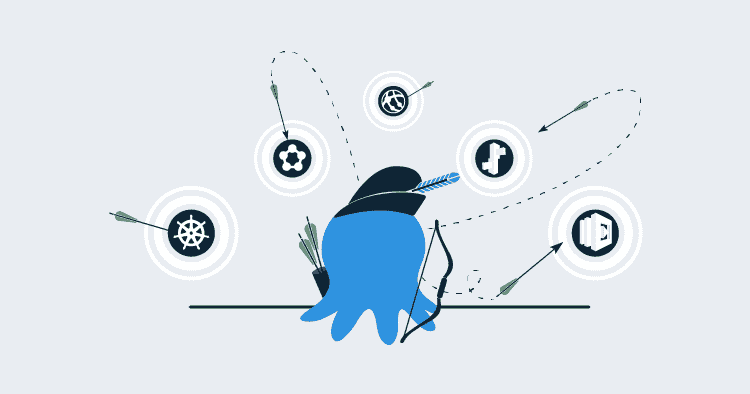
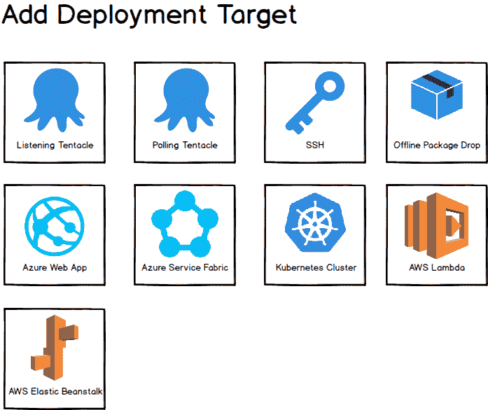
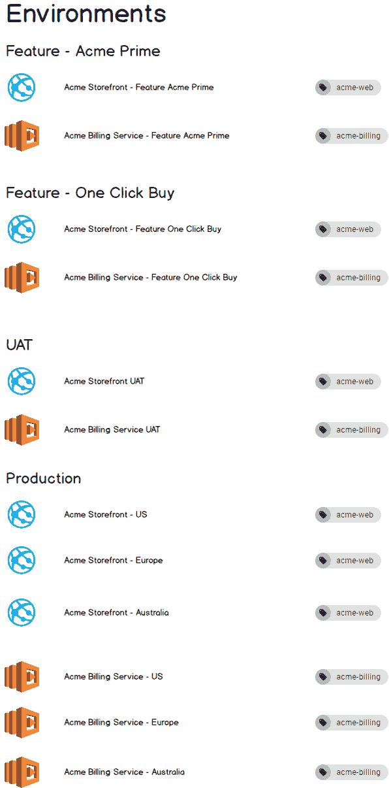

# PaaS 部署目标- Octopus 部署

> 原文：<https://octopus.com/blog/paas-targets>

[](#)

这篇文章是我们的“用 Octopus 部署 Azure 云”博客系列的一部分。在我们的[博客](/blog/octopus-azure-deployments)或我们的[推特](https://twitter.com/OctopusDeploy)上关注它。

* * *

*总结:平台即服务端点(Azure 网站等。)将被建模为 Octopus 中的部署目标。*

Octopus 是一个发布管理和部署自动化工具。毫不奇怪，Octopus 中暴露的概念反映了这一点:发布、部署、环境和*目标*(又名机器)。

Octopus 的优势之一(我们认为)是它以一种符合人们思考和交流的方式对部署概念进行建模。部署目标被建模为存在于一个或多个环境中的一级对象。这是一种非常罕见的方法。在同一领域中的许多工具主要是构建/CI 服务器，因此它们对环境和目标/代理有不同的概念。对他们来说,“目标”通常只是部署过程中的一组配置值。

八达通目前(截至 2018 年 3 月)的部署目标类型有:

*   听力触手
*   轮询触手
*   嘘
*   离线丢弃
*   云区

除了 Cloud Region 之外，这些目标都表示到 Windows 或 Linux 机器的连接(在离线丢弃的情况下是间接的)。

## PaaS

世界正在改变。越来越多的情况是，部署的目标不是一组机器，而是一个平台即服务端点，比如 Azure WebApp、AWS ElasticBeanstalk 或 Kubernetes 集群。我们有几个选择来模拟这些。我们决定从现在开始，Octopus 将把各种 PaaS 作为部署目标。

[](#)

这听起来很熟悉...

那些已经使用八达通一段时间的人可能还记得，我们曾经开始走这条路。当 Octopus 3.0 发布时，我们[将 Azure Web 应用和云服务建模为目标](https://octopus.com/blog/deployment-targets-in-octopus-3)。然后我们[改变了主意](https://octopus.com/blog/azure-changes)。

关于原因的全部细节，请阅读链接的帖子。总之，这是因为我们没有为那些希望在部署期间动态配置基础架构的人提供答案。这是一个我们深感遗憾的错误，但在许多其他方面，Azure 目标类型是非常好的。我们不会再犯同样的错误(参见下面的[动态预配置](#dynamic-provisioning))。

### 帕斯动物园

将支持哪些 PaaS 风格？

作为第一阶段，在我们的 5 月版本(2018.5)中，我们将添加:

*   Azure Web 应用(也代表 Azure 功能)
*   Azure 云服务
*   天蓝色服务织物

在接下来的几个月里，我们将增加:

毫无疑问，还会有更多。

## 利益

将这些 PaaS 端点建模为部署目标有很多好处。有三个特别值得一提。

### 1.能见度

我们喜欢能够在其环境中查看您的 PaaS 目标的想法:

【T2 

想象一下在一家新公司开始工作。能够在 Octopus 中查看基础设施页面并看到环境、其中的目标以及这些目标所拥有的角色是非常强大的。我们觉得这比不得不从各种部署过程中逆向工程这个图片要好得多。

### 2.多个目标

Octopus 中的角色提供了一个简单而强大的能力来执行一个跨越多个目标的步骤。目标被分配一个或多个角色。部署流程中的步骤指定它们应该在哪个角色上执行，然后该步骤将为每个匹配的目标执行一次。

不可否认，对于 PaaS 目标，这种能力不像机器那样经常需要。例如，将 web 应用程序部署到虚拟机时，必须部署到集群中的每台机器。然而，以 Azure Web 应用为例，您只需部署到 PaaS 端点，它就可以在内部扩展(这是主要优势之一)。但是...您可能在不同的地理区域有多个 Azure Web 应用。目标和角色的组合提供了一个简单的机制来部署所有这些。或者您可能有一个多租户应用程序，其中每个租户都有自己的 web 应用程序。目标+角色+租户=一种可爱的建模方式。

### 3.将运营置于 DevOps 中

通过将 PaaS 端点显式建模为存在于环境中的自包含目标，Octopus 拥有有价值的信息和概念，如果 PaaS 目标仅作为分散在变量和部署流程中的配置值存在，这些信息和概念就不会存在。这开启了许多可能的特性途径，我们很乐意探索。例如:

*   在环境中执行的操作过程。例如运行自定义健康检查流程或更新 HTTPS 证书。
*   目标的自定义状态\诊断页面。例如，我的 Kubernetes 集群上正在运行哪些 pod？

## 动态供应

如上所述，我们首先在 Octopus 的 3.0 版本中添加了 PaaS 目标，但是有一个重大的疏忽。没有办法将 Azure Web 应用作为部署流程的一部分进行动态供应，然后让当前流程使用它。

这次有。我们创建了一种机制，在这种机制下，正在执行的部署步骤可以向 Octopus 服务器返回一条消息，指示它向当前环境添加一个新目标。以这种方式创建的目标将可用于执行部署过程中的后续步骤。

我们还添加了 cmdlets，以便通过脚本轻松做到这一点。例如，请参见下面代码块中的最后一行:

```
# Octopus variables
$environment = $OctopusParameters['Octopus.Environment.Name']
$releaseNumber = $OctopusParameters['Octopus.Release.Number'].Replace(".", "-")
$deploymentId = $OctopusParameters['Octopus.Deployment.Id']

# A unique name based on the Octopus environment, release, and deployment
$uniqueName = "Acme-$environment-$releaseNumber-$deploymentId"

# Create resources in Azure
New-AzureRmResourceGroup -Name $uniqueName -Location "WestUS"
New-AzureRmAppServicePlan -Name $uniqueName -Location "WestUS" -ResourceGroupName $uniqueName -Tier Free
New-AzureRmWebApp -Name $uniqueName -Location "WestUS" -AppServicePlan $uniqueName -ResourceGroupName $uniqueName

# Create new target in Octopus
New-OctopusAzureWebAppTarget -Name $uniqueName -AzureWebApp $uniqueName -AzureResourceGroupName $uniqueName -OctopusAccountIdOrName "my-octopus-azure-serviceprincipal-account" -OctopusRoles "acme-web" 
```

当然，如果您的基础设施供应是在 Octopus 之外执行的，那么您总是可以通过我们的 HTTP API 创建目标。

我们将在以后的文章中深入探讨更多细节。

## 定价

Octopus 许可目前基于您部署的机器数量；这是因为我们相信您部署到的机器数量是 Octopus 提供的价值的一个很好的近似值。这意味着 Octopus 到目前为止还没有对部署平台即服务应用程序收费。部署到 100 个 IaaS 虚拟机的客户必须适当地许可 Octopus，但是部署到 100 个 Azure 网站、服务结构集群或 Kubernetes 集群的客户则不需要。

历史上，PaaS 端点的部署只占 Octopus 总使用量的一小部分，所以这不是我们所担心的。但是趋势很明显，没有理由认为采用率不会继续增加。

我们最初计划引入基于计算您实际部署到的 PaaS 端点的 PaaS 目标计费(对我们来说，在部署期间计算这些端点很容易)。由于我们正在转向将 PaaS 端点建模为目标，如果我们打算这样做的话，这似乎是为他们引入计费的正确时机。

### 自 2018.5 起许可发生变化

以下是我们计划在 Octopus 2018.5 中进行的重要许可更改:

*   和以前一样，您现有的 Azure **步骤**不会计入您的许可限制。这里什么都没变。
*   **Azure targets** 将会像 Octopus 中的其他目标一样开始对你的许可限制做出贡献。
    *   任何现有的“旧”Azure 目标都将升级到新的格式，并将开始计入您的许可限制。
*   **离线掉落**目标将开始影响你的许可限制，就像章鱼的其他目标一样。

如果您大量使用“旧的”Azure 目标或离线 Drop 目标，请花时间确保您的 Octopus 服务器在升级后仍然符合您的许可证。八达通将在升级过程中为您检查这一点。如果你遇到麻烦，请联系我们的[支持团队](https://octopus.com/support)寻求帮助！

## 移民

不会有突破性的变化。您今天配置的一切都将继续工作。

从 2018.5 版本开始，如果您希望创建新的*部署 Azure Web* 、*部署 Azure 云服务*或*部署服务架构应用*步骤，您将需要首先在适当的环境中配置目标。

在您创建新目标的实例之前，许可证使用计数不会改变。从本质上讲，您在 Octopus 中的现有配置将继续发挥作用，并将完全按照原来的价格定价。这些更改都是仅向前的。

如果您有任何顾虑或问题，请随时联系我们。

## 未来

我们对这个方向感到兴奋。我们认为这是一个自然的契合，并提供了上述提到的所有直接[好处。](#benefits)

但这项工作也是我们计划的其他功能的关键踏脚石。我们希望更容易地动态供应和取消供应整个环境(例如，针对功能分支)，并针对环境执行操作流程。我们将在未来几个月发布更多关于这些功能的内容。

一如既往，我们欢迎您的反馈。

## 了解更多信息