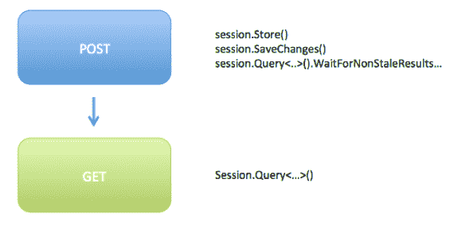

# RavenDB - Octopus 部署中的感知一致性

> 原文：<https://octopus.com/blog/perceptual-consistency-in-ravendb>

在“ [UI 设计的最终一致性](http://octopusdeploy.com/blog/designing-for-eventual-consistency)”中，我写了我们通常如何得到这样的错误报告:

> 我转到“添加机器”页面，输入机器信息，单击保存，但是当我转到“环境”页面时，我的机器没有列出。几秒钟后，我点击刷新，它就在那里。

这是 Raven 使用[异步索引](http://ravendb.net/docs/2.0/client-api/querying/stale-indexes)的结果。作为一名使用 RavenDB 的开发人员，你应该拥抱**最终一致性**。有一些常见的模式可以处理这种情况，例如:

*   您可以将“添加机器”请求作为一个命令接受，并将其排队等待处理，然后在处理完成时重定向用户；或者，
*   您可以将新机器存储在中间缓存中，并在查询列表时包含它

当你的操作是“提交一个银行交易退款请求”时，这是有意义的。但是当你有一打不同的文档类型，你需要一点 CRUD，而你又不是网络规模的时候，坦白地说，这些模式是多余的。

所以在我的天真中，Octopus 1.0 被分散了:

```
.Customize(x => x.WaitForNonStaleResultsAsOfNow()) 
```

这当然有问题，对于 Octopus 2.0，我决定接受 Raven 最终的一致性。

首先，我让 REST API 返回一个标志，指示查询结果是否过时。然后，我们的 UI 会呈现一条消息来通知用户，或者在一秒钟后自动刷新以尝试获得非陈旧的结果。虽然它让用户界面感觉更快，但有点不协调。

然而，当构建一些命令行工具来使用 API 时，我意识到大多数时候，这些工具宁愿等待非陈旧的结果。因此，它成为了一个标志(例如，`/api/environments?nonStale=true`)，作为 URI 模板的一部分提供。这个[引起了一些争论](http://lostechies.com/jimmybogard/2013/05/15/eventual-consistency-in-rest-apis/)；毕竟，客户应该能够要求这样的事情吗？

## 知觉一致性

我对这两种解决方案都不满意，我觉得没有好的折中方案。然后我偶然发现[这个帖子](https://groups.google.com/forum/#!topic/ravendb/ncy9_fwF7P4)，克里斯·马里斯克提出了一个[巧妙的建议](https://groups.google.com/d/msg/ravendb/ncy9_fwF7P4/IgqG-pOMl8kJ)(重点是我的):

> 您想写这个记录，**然后在同一个请求**中用 waitfornonsaleresultsasoflashwrite 查询那个索引，然后在索引同步后将用户重定向到列表。这避免了使普通的操作读总是等待，而使不普通的操作写必须等待。

我以前从未见过这个建议，但我认为它很棒。我认为这是“感知一致性”，或者“每个用户的一致性”。



它的意思是，在 Octopus REST API 中，当您执行 PUT/POST/DELETE 时，我们将在返回成功之前等待索引不陈旧(至少一小会儿)。因此，当您点击“创建机器”时，您可能会看到一个轻微的停顿。但是当您被重定向并执行 GET 时，请求者**不会**等待非陈旧结果。您不会在意，因为当您被重定向时，索引已经足够新，可以包含您刚刚添加的机器。太棒了。

我们仍然会在查询结果上提供 non-stale 标志来指示 GET 请求的结果是否过时，但是没有办法告诉 API 是否要等待非过时的结果。从用户界面的角度来看，你总能看到一致的结果。