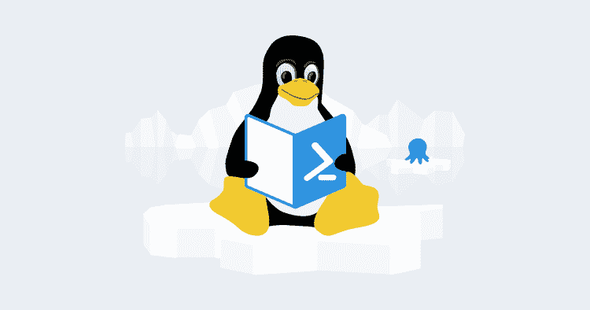

# 如何使用 PowerShell 脚本模块...在 Linux 上——Octopus 部署

> 原文：<https://octopus.com/blog/posh-modules-linux>

[](#)

Octopus Deploy 支持可重用的 [PowerShell 脚本模块](https://octopus.com/docs/deployments/custom-scripts/script-modules)，这些模块可以包含在所有项目的部署中。当脚本模块包含在项目中时，它将自动可供在 Windows 上运行的 PowerShell 脚本使用。您还可以在 Linux 上运行您喜欢的 PowerShell 脚本模块，但是它们不会自动提供给 Linux 脚本上的 PowerShell。虽然我们计划在 Linux 上提供一流的 PowerShell 支持，但下面是让它们工作的技巧。

在本例中，我们将使用一个名为`Say Hello`的脚本模块，其内容如下:

```
function Say-Hello($name)
{
    Write-Output "Hello $name. Welcome to Octopus!"
} 
```

如需在 Octopus 中创建脚本模块的帮助，请遵循文档中的[说明。](https://octopus.com/docs/deployments/custom-scripts/script-modules)

我们将使用一个名为`PowerShell modules on Linux`的项目，它包含了`Say Hello`脚本模块。我们的部署流程包括一个从 PowerShell 调用`Say-Hello`方法的`Run a Script`步骤。我们天真的 bash 脚本应该是这样的:

```
pwsh -Command "Say-Hello" 
```

如果我们尝试运行此脚本，我们会遇到一条错误消息，指出脚本模块尚未加载:

> 术语“Say-Hello”不被识别为 cmdlet、函数、脚本文件或可运行程序的名称。

脚本模块的内容可用于名为`Octopus.Script.Module[Say Hello]`的 Octopus 变量中的步骤。为了在我们的 bash 脚本中使用脚本模块，我们将检索内容，将它们保存到一个文件中，然后在我们的 PowerShell 脚本中导入它们。为了简单起见，我们将模块保存到`/tmp`文件夹中——PowerShell 的`Import-Module`需要一个绝对路径。下面是导入模块后 bash 脚本的样子:

```
say_hello_module=$(get_octopusvariable "Octopus.Script.Module[Say Hello]")
echo "$say_hello_module" > /tmp/SayHello.psm1
pwsh -noprofile -Command "&Import-Module /tmp/SayHello.psm1; Say-Hello World" 
```

当我们运行脚本时，我们的模块被导入，我们看到了预期的输出:

> 你好世界。欢迎来到章鱼！

现在，您可以在 Windows 和 Linux 上重用 PowerShell 脚本模块库。