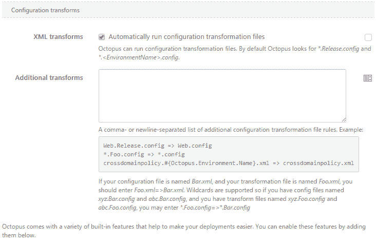
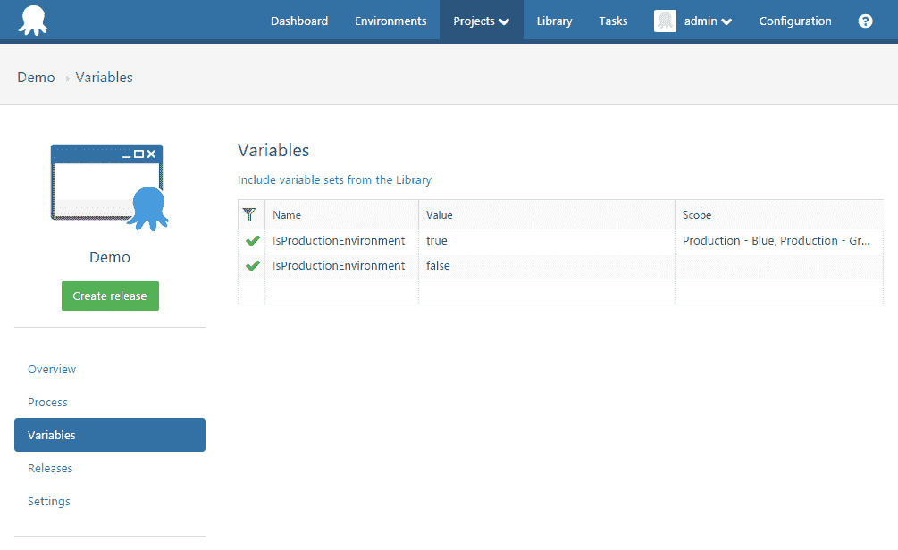

# 配置转换的力量- Octopus Deploy

> 原文：<https://octopus.com/blog/power-configuration-transformations>

根据要部署到的环境执行不同的配置转换是一种常见的情况。比如:`Web.config`开发、测试、生产可能需要不同的值。Octopus [配置转换](http://docs.octopusdeploy.com/display/OD/Configuration+files#Configurationfiles-ConfigurationTransformation)特性通过在部署到开发时寻找`Web.Development.config`并将适当的配置转换应用到`Web.config`来自动支持常见场景。虽然这对大多数人来说很好，但有时需要指定自定义规则并进行条件转换。

### 自定义配置转换

在部署过程中编辑“部署 Nuget 包”步骤时，可以指定将在部署期间执行的附加配置转换。



您可能希望应用 Octopus 无法自动识别的变换:

```
MyCustomTransform.config => Web.config 
```

这条规则会用`MyCustomTransform.config`变换`Web.config`。

配置转换规范支持[章鱼变量](http://docs.octopusdeploy.com/display/OD/System+variables)。这允许在文件名与规则规范匹配时应用自定义转换。例如，您可能希望在每个环境中应用非标准配置转换:

```
MyCustomTransform.#{Octopus.Environment.Name}.config => Web.config 
```

该规则将查找与当前部署环境匹配的文件，并应用该配置。部署到生产时，`MyCustomTransform.Production.config`将应用到`Web.config`。

### 条件转换

变量替换语法的一个强大特性是对条件的[支持。当与项目变量结合时，指定定制的配置转换会变得非常复杂。考虑蓝绿色部署场景。有两种环境:“生产蓝”和“生产绿”。当两个配置文件`Web.Production - Blue.config`和`Web.Production - Green.config`本质上相同时，最好不要维护它们。](http://docs.octopusdeploy.com/display/OD/Variable+Substitution+Syntax)

一个解决方案是使用一个条件来指定生产转换:

```
#{if IsProductionEnvironment}
    Web.Production.Config => Web.config
#{/if} 
```

然后，使用变量指定哪些环境是生产环境:



默认情况下，变量`IsProductionEnvironment`被设置为`false`，并且对于环境“生产蓝”和“生产绿”，其范围为`true`。当包被部署到任一生产环境中时，将应用`Web.Production.Config`转换。

### 结论

使用 Octopus 执行配置转换在大多数情况下会自动发生，但是指定额外转换的能力使该特性更加强大。当与 Octopus 变量结合使用时，配置转换提供了一种灵活的方式来管理每个环境中的设置。