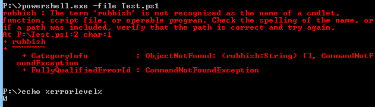
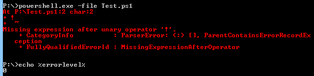
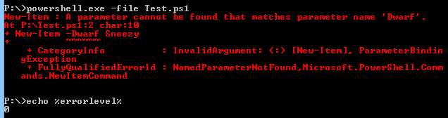

# PowerShell 和退出代码 0 - Octopus 部署

> 原文：<https://octopus.com/blog/powershell-exit-codes>

Octopus Deploy 有两种不同的方式来执行 PowerShell 脚本。最初，我们在 AppDomain 中托管 PowerShell 并调用管道。那种方法有问题，所以现在我们简单地调用 PowerShell.exe 的脚本并通过管道传输结果。

当我改变我们的方法时，我遇到的一个问题是 PowerShell 使用[返回代码](http://en.wikipedia.org/wiki/Exit_status)的方式。我(错误地)假设，如果脚本运行成功，将返回 0，如果失败(异常、无效语法等)。)代码将是非零的。

这里有一个测试。在 PowerShell 中创建此文件:

```
# Call a command that doesn't exist
rubbish 
```

现在，运行它并打印它返回的返回代码:



现在，试试这个脚本:

```
# Parser error
! 
```



另一个:

```
# Invalid argument
New-Item -Dwarf Sneezy 
```



显然，PowerShell 中的退出代码 0 可以表示从“脚本运行良好”到“您的脚本完全崩溃，PowerShell 将被卸载”的任何内容。有人可能会认为这是正确的行为，因为 PowerShell 成功地完成了它的工作(运行脚本)，但脚本是不正确的，这不是 PowerShell 的错。就我个人而言，我不同意这种方法。这就像 C#编译器为不能编译的代码返回退出代码 0，因为代码不好并不是编译器的错。

所以，我不能仅仅依靠退出代码来告诉 Octopus 脚本失败了。

然而，所有这些类型的错误确实会写入到[的 stderr 流](http://www.cplusplus.com/reference/cstdio/stderr/)，而*的 stderr 流*是好的，所以我认为，如果脚本正在写入到`stderr`，则脚本存在某种问题，我们可以使用写入到`stderr`的信号来使脚本失败。我在章鱼 1.4 就是这么做的。

但是这在实践中并不是很好，事实证明人们大量使用`stderr`是因为他们不想让部署失败。所以我收到了很多关于脚本运行“正常”但被视为失败的错误报告。

现在，我不对返回代码做任何事情(哦，除了如果`$LastExitCode`不为零，我会设置 PowerShell 退出代码)。当脚本运行时，由您来检查错误并返回适当的退出代码。 [PowerShell 让这一切变得非常简单](http://weblogs.asp.net/soever/archive/2010/07/14/returning-an-exit-code-from-a-powershell-script.aspx)。

然而，对`stderr`的写入将会在您的部署日志中产生一个警告。如果有警告，你可以使用特殊的章鱼变量`OctopusTreatWarningsAsErrors`让章鱼停止部署。因此，这是一种即使 PowerShell 以代码 0 退出，也可以在写入`stderr`时让 Octopus 失败的方法。

### 了解更多信息