# 像使用 Octopus Deploy - Octopus Deploy 的应用程序一样部署 PowerShell 所需状态配置(DSC)

> 原文：<https://octopus.com/blog/powershelldsc-as-template>

PowerShell DSC 是一项非常棒的技术，可以放在您管理基于 Windows 的服务器的工具箱中。这篇文章是一系列文章的一部分:

我们也有关于使用 PowerShell DSC 和 Octopus Deploy 的文章:

* * *

在之前的[帖子](https://octopus.com/blog/octopus-and-powershell-dsc)中，Paul Stovell 向我们展示了如何使用 Octopus Deploy 将 PowerShell 期望状态配置(DSC)部署到服务器，以:

*   管理基础设施。
*   使用机器策略监控漂移。
*   使用项目触发器自动校正漂移。

这篇博文将通过以下方式阐述这一观点:

*   将配置数据分离成配置数据文件(. psd1)。
*   将 PowerShell DSC 脚本转换为 step 模板。
*   捕获机器策略中漂移的项目。
*   利用文件中的替代变量功能来设置环境或项目中需要更改的属性。

到本文结束时，我们将创建一个可重用的 PowerShell DSC 脚本，作为可以在部署中使用的步骤模板。我们还将创建一个机器策略，该策略将报告任何已漂移的项目，并将机器标记为不健康。

## PowerShell DSC

### 保罗的原始剧本

Paul 为 DSC PowerShell 提供的代码示例是一个很好的基本脚本示例:

```
Configuration WebServerConfiguration
{  
  Node "localhost"
  {        
    WindowsFeature InstallWebServer
    {
      Name = "Web-Server"
      Ensure = "Present"
    }

    WindowsFeature InstallAspNet45
    {
      Name = "Web-Asp-Net45"
      Ensure = "Present"
    }
  }
}

WebServerConfiguration -OutputPath "C:\DscConfiguration"

Start-DscConfiguration -Wait -Verbose -Path "C:\DscConfiguration" 
```

### 分离节点数据

在他的例子中，节点数据包含在脚本本身中，要配置的特性是静态的。如果我们将脚本中的节点数据分离到配置数据文件(DSC 配置)中，我们可以使 DSC PowerShell 脚本更加动态:

```
@{
    AllNodes =  @(
        @{

            # node name
            NodeName = $env:COMPUTERNAME

            # required windows features
            WindowsFeatures = @(
                @{
                    Name = "Web-Server"
                    Ensure = "Present"
                    Source = "d:\sources\sxs"
                },
                @{
                    Name = "Web-Asp-Net45"
                    Ensure = "Present"
                    Source = "d:\sources\sxs"
                }
            )
        }
    )
} 
```

### 使 DSC PowerShell 脚本更加动态

现在，节点数据已经分离，DSC PowerShell 脚本可以更改为动态的，安装配置数据文件(DSC 配置)中指定的功能:

```
Configuration WebServerConfiguration
{
    Import-DscResource -ModuleName 'PSDesiredStateConfiguration' # We get a warning if this isn't included

    Node $AllNodes.NodeName
    {
        # loop through features list and install
        ForEach($Feature in $Node.WindowsFeatures)
        {
            WindowsFeature "$($Feature.Name)"
            {
                Ensure = $Feature.Ensure
                Name = $Feature.Name
                Source = $Feature.Source # Needed if for some reason the resource isn't on the OS already and needs to be retrieved from something like a mounted ISO
            }
        }
    }
}

WebServerConfiguration -ConfigurationData "C:\DscConfiguration\WebServer.psd1" -OutputPath "C:\DscConfiguration"

Start-DscConfiguration -Wait -Verbose -Path "C:\DscConfiguration" 
```

### 填写 DSC 配置的更多详细信息

太好了！我们的 web 服务器实现有了一个良好的开端，但是配置 web 服务器不仅仅是安装 Windows 功能。让我们通过添加一些额外的 Windows 功能、站点、应用程序，为 IIS 站点设置默认日志路径，并使用密码、哈希、协议、密钥交换和指定密码套件顺序来加强我们的安全性，从而为我们的配置数据文件添加更多的数据。

注意:这只是为了演示，请咨询您的安全团队以确定哪些设置最适合您的组织。

以下是一个片段，完整的文件可以在我们的示例 GitHub 存储库中找到，网址为[https://GitHub . com/OctopusSamples/DSC-as-a-template/blob/master/src/complete script/web server . PS D1](https://github.com/OctopusSamples/DSC-as-a-template/blob/master/src/CompleteScript/WebServer.psd1):

```
@{
    AllNodes =  @(
        @{

            # node name
            NodeName = $env:COMPUTERNAME

            # required windows features
            WindowsFeatures = @(
                ...
                @{
                    Name = "Web-Server"
                    Ensure = "Present"
                    Source = "d:\sources\sxs"
                },
                ...
            )

            # default IIS Site log path
            LogPath = "c:\logs"

            # Define root path for IIS Sites
            RootPath = "C:\inetpub\wwwroot"

            # define IIS Sites
            Sites = @(
                ...
                 @{
                    Name = "OctopusDeploy.com"
                    Ensure = "Present"
                    State = "Started"
                    BindingInformation = @(
                        @{
                            Port = "80"
                            IPAddress = "" # leave blank or comment out to set to All Unassigned
                            Protocol = "HTTP"
                        },
                        @{
                            Port = "443"
                            IPAddress = ""
                            Protocol = "HTTPS"
                            CertificateStoreName  = "WebHosting" # WebHosting | My
                            Exportable = $true
                        }

                    )
                    Pool = @{
                            PipeLine = "Integrated"
                            RuntimeVersion = "v4.0"
                            State = "Started"
                        }
                    Applications = @(
                        ...
                        @{
                            Name = "OctoFX"
                            FolderName = "OctoFX"
                            Ensure = "Present"
                            Pool = @{
                                Pipeline = "Integrated"
                                RuntimeVersion = "v4.0"
                                State = "Started"
                            }
                            Authentication = @{
                                Windows = $false
                                Anonymous = $true
                            }

                        },
                        ...
                    )
                }
            )

            # fill in this section to enable or disable encryption protocols, hashes, ciphers, and specify cipher suite ordering
            Encryption = @{
                Ciphers = @(
                    ...
                    @{
                        Name = "DES 56/56"
                        Enabled = "0" # Disabled = 0, Enabled = -1
                    },
                    ...
                )
                Hashes = @(
                    ...
                    @{
                        Name = "MD5"
                        Enabled = "0"
                    },
                    ...
                )
                Protocols = @(
                    ...
                    @{
                        Name = "Multi-Protocol Unified Hello"
                        Enabled = "0"
                    },
                    ...
                )
                KeyExchanges = @(
                    ...
                    @{
                        Name = "Diffie-Hellman"
                        Enabled = "-1"
                    },
                    ...
                )
                CipherSuiteOrder = @("TLS_ECDHE_RSA_WITH_AES_256_GCM_SHA384", ...)
            }
        }
    )
} 
```

### 更完整的 DSC 脚本

正如您可能已经猜到的，我们需要更新我们的 DSC 脚本来配置我们在配置数据文件中指定的选项。

以下是一个片段，完整的文件可以在我们的示例 GitHub 资源库中找到，网址是[https://GitHub . com/OctopusSamples/DSC-as-a-template/blob/master/src/complete script/IISDSC-complete . PS1](https://github.com/OctopusSamples/DSC-as-a-template/blob/master/src/CompleteScript/IISDSC-Complete.ps1):

```
Configuration WebServerConfiguration
{
    Import-DscResource -ModuleName 'PSDesiredStateConfiguration'
    Import-DscResource -Module xWebAdministration

    Node $AllNodes.NodeName
    {
        # loop through features list and install
        ForEach($Feature in $Node.WindowsFeatures)
        {
            WindowsFeature "$($Feature.Name)"
            {
                ...
            }
        }

        # stop default web site
        xWebSite DefaultSite
        {
            ...
        }

        # loop through list of default app pools and stop them
        ForEach($Pool in @(".NET v2.0", `
        ".NET v2.0 Classic", `
        ".NET v4.5", `
        ".NET v4.5 Classic", `
        "Classic .NET AppPool", `
        "DefaultAppPool"))
        {
            xWebAppPool $Pool
            {
                ...
            }
        }

        # make sure log path exists
        File LoggingPath
        {
            ...
        }

        # loop through the sites
        ForEach($Site in $Node.Sites)
        {
            # create the folder
            File $Site.Name
            {
                ...
            }

            # create the site app pool
            xWebAppPool $Site.Name
            {
                ...
            }

            # create the site
            xWebSite $Site.Name
            {
                ...
            }

            # Loop through site application collection and create folders
            ForEach($Application in $Site.Applications)
            {
                File "$($Site.Name)-$($Application.Name)"
                {
                    ...
                }

                # create application pool
                xWebAppPool $Application.Name
                {
                    ...
                }

                # create application
                xWebApplication $Application.Name
                {
                    ...
                }
            }
        }
    }
}

# create credential object
$Credentials = @()

WebServerConfiguration -ConfigurationData "C:\DscConfiguration\WebServer.psd1" -OutputPath "C:\DscConfiguration"

Start-DscConfiguration -Wait -Verbose -Path "C:\DscConfiguration" 
```

这不是一个关于如何做 PowerShell DSC 的帖子，所以我不会重复添加的所有内容。然而，我确实想强调一行，`Import-DscResource -Module xWebAdministration`。这个 xWebAdministration 不像 PSDesiredStateConfiguration 那样是默认安装的，当我们进行部署时需要包含它。我们将在这篇文章的后面讨论更多。

## 使 DSC 脚本成为步骤模板

好吧！我们将配置数据分离到它自己的文件中，并且我们有一个 DSC 脚本来配置 IIS Web 服务器。现在让我们开始在 Octopus Deploy 中将它们连接在一起，并使我们的 DSC 脚本成为一个步骤模板！

我们首先登录 Octopus Deploy 实例，单击 Library 选项卡，然后是 Step Templates:

[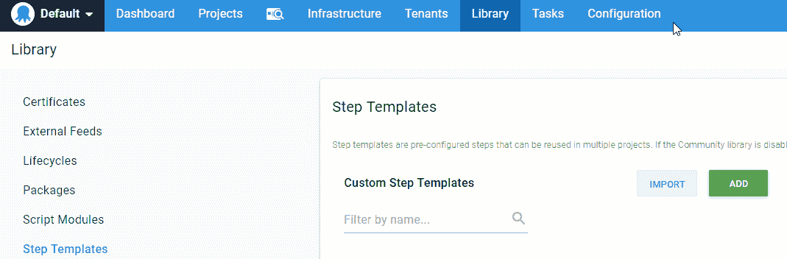](#)

点击添加按钮:

[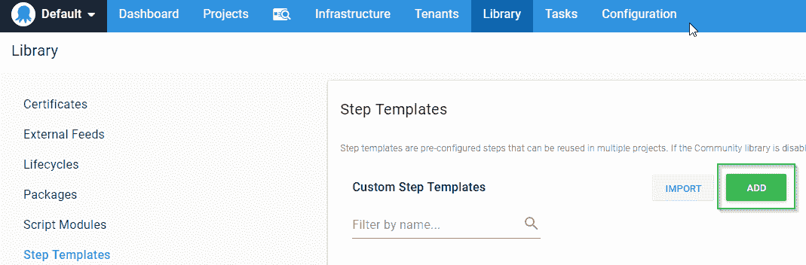](#)

选择部署包模板:

[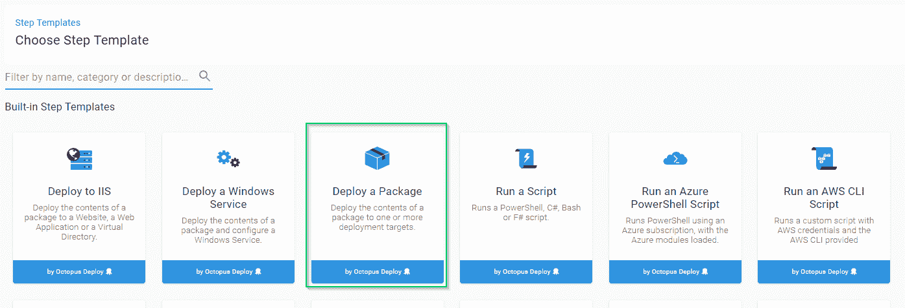](#)

### 设置

填写设置:

[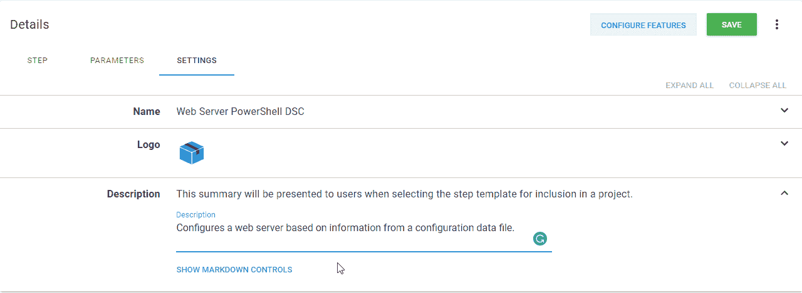](#)

### 因素

我们将定义三个参数，DSC 路径、配置数据文件步骤和配置数据文件名。这些将被我们的 DSC 脚本使用。

#### DSC 路径

这是一条小路。DSC 执行时将写入 MOF 文件:

[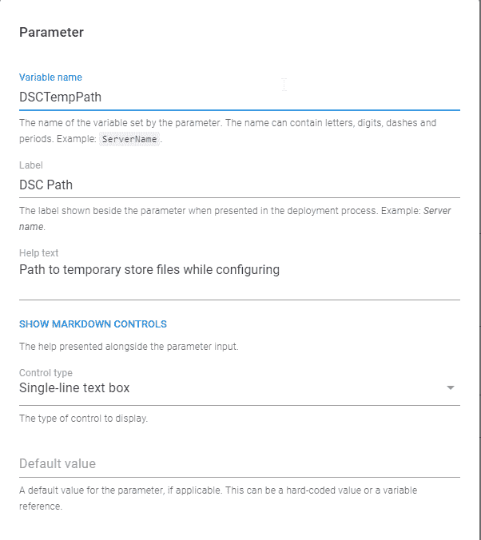](#)

#### 配置数据文件名

这是我们创建的配置数据文件的名称，WebServer.psd1:

[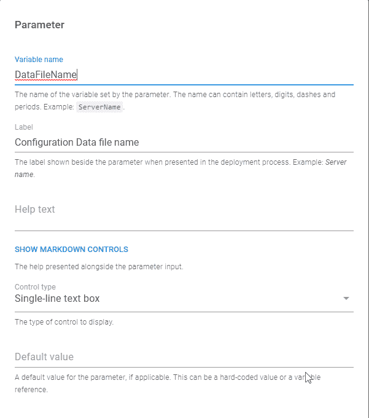](#)

#### 包 ID

这是库中将用于部署的包的 ID:

[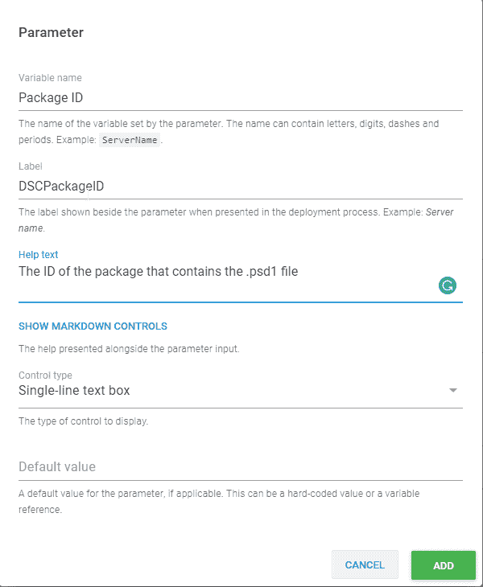](#)

### 步骤选项卡

#### 配置功能

在步骤选项卡上，单击配置要素按钮:

[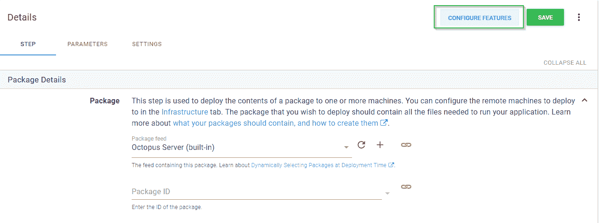](#)

在文件中启用自定义部署脚本和替代变量:

[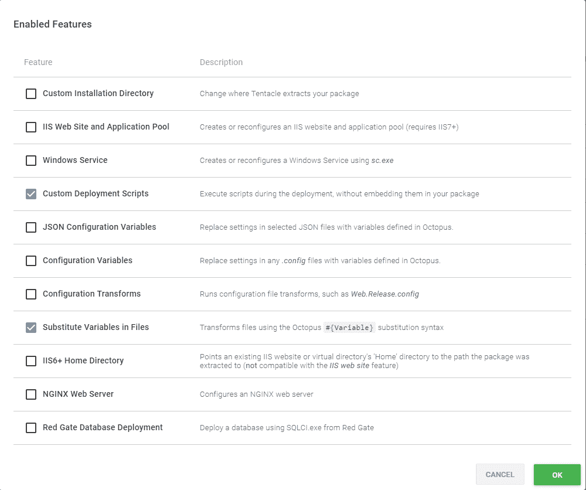](#)

#### 设置包变量

在“步骤”选项卡的“包详细信息”下，单击链式链接图标以启用到变量的绑定:

[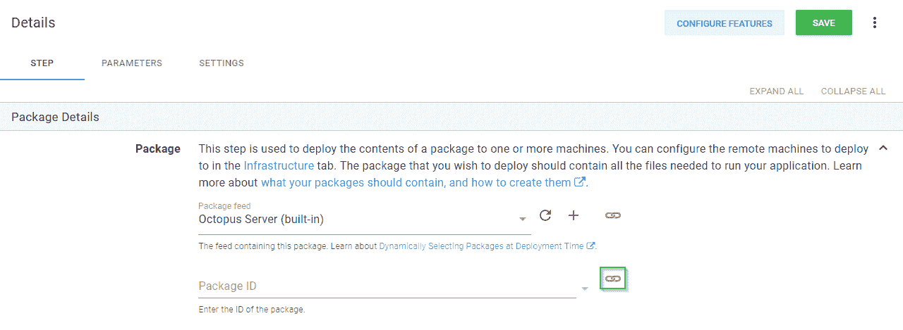](#)

现在，单击#调出变量列表，并选择我们创建的 DSCPackageId 参数:

[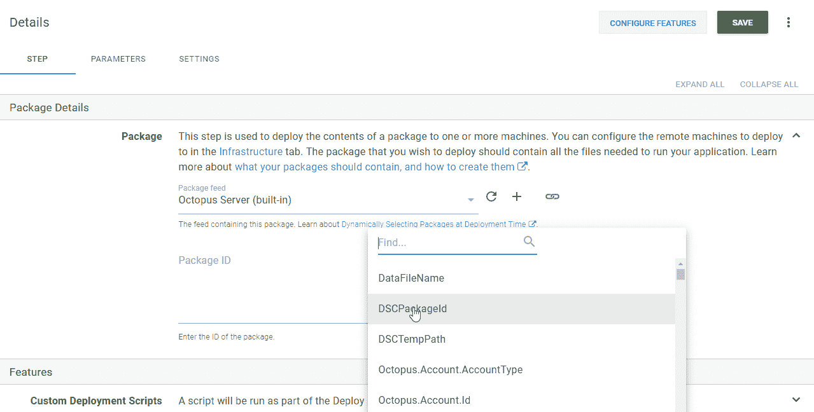](#)

#### 实现 DSC 脚本

展开自定义部署脚本，并将我们的 PowerShell DSC 脚本粘贴到部署脚本框中:

[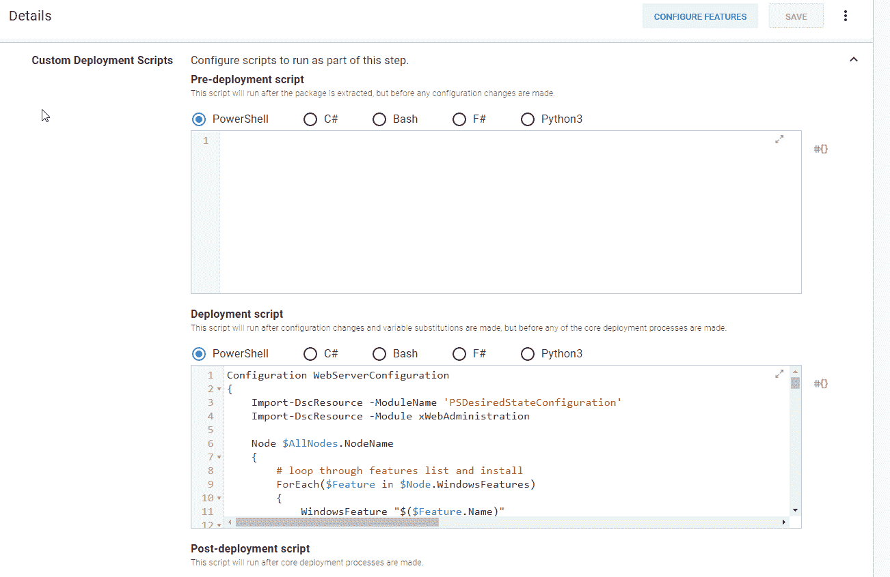](#)

通过单击相反的箭头进入全屏模式，这样我们可以更容易地调整我们的脚本以使用我们定义的参数:

[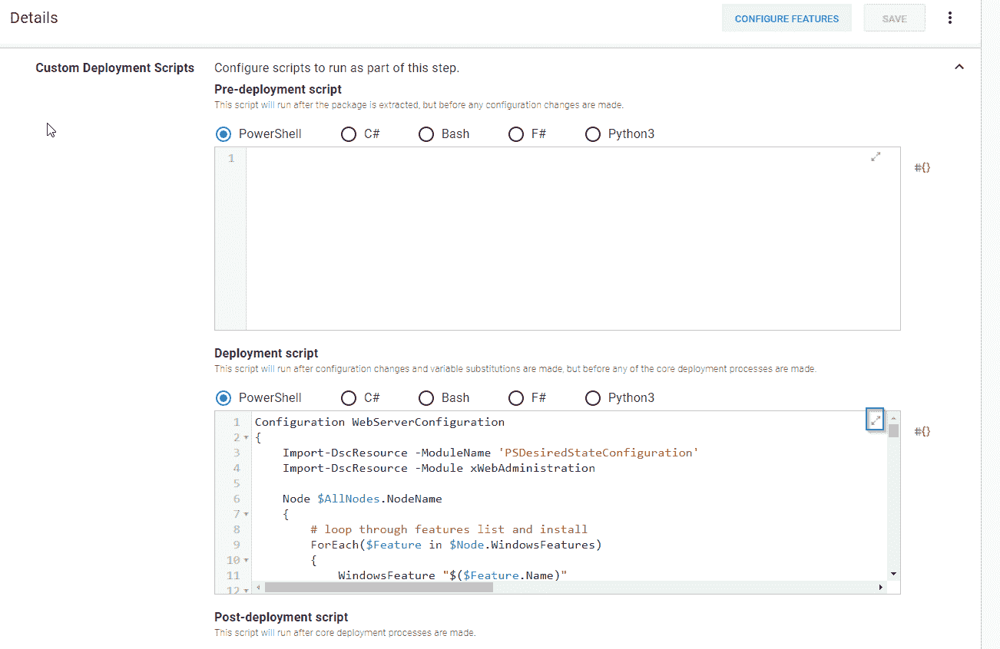](#)

滚动到底部并更改:

```
WebServerConfiguration -ConfigurationData "C:\DscConfiguration\WebServer.psd1" -OutputPath "C:\DscConfiguration"

Start-DscConfiguration -Wait -Verbose -Path "C:\DscConfiguration" 
```

收件人:

```
# set location for mof files
Set-Location -Path $DSCTempPath

# get the configuration data file
$ConfigurationDataFile = (Get-ChildItem -Path $OctopusParameters["Octopus.Action.Package.InstallationDirectoryPath"] | Where-Object {$_.Name -eq $DataFileName}).FullName

# Display which file it's using
Write-Host "The configuration data file is: $ConfigurationDataFile"

# Execute and generate .MOF file
WebServerConfiguration -ConfigurationData $ConfigurationDataFile -OutputPath $DSCTempPath

# Configure the server using the MOF file
Start-DscConfiguration -Wait -Verbose -Path $DSCTempPath 
```

#### 设置变量替换

展开“文件中的替代变量”部分。对于目标文件，单击#并选择数据文件名变量:

[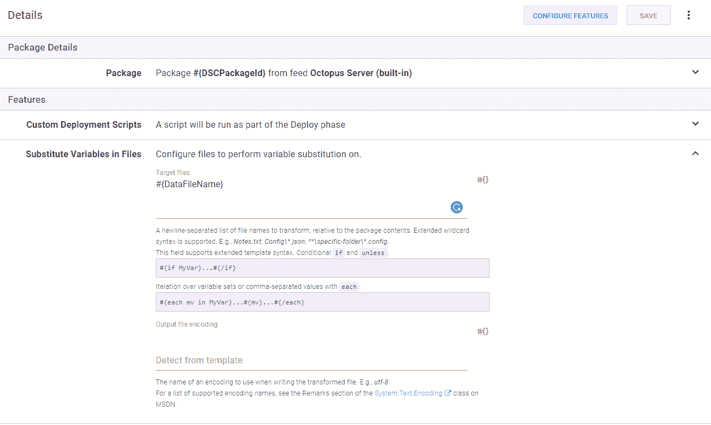](#)

现在，保存模板。

酷！我们刚刚创建了一个动态的、可重用的步骤模板，它将使用 PowerShell DSC 配置 IIS Web 服务器！现在我们需要创建一个新项目来使用它。

## PowerShell DSC 资源模块注意事项

在这篇文章的前面，我谈到了 DSC 脚本中的`Import-DscResource -Module xWebAdministration`行。这是对 xweb administration PowerShell DSC 资源模块的引用，需要从 [PowerShell Gallery](https://www.powershellgallery.com/packages?q=xwebadministration) 或 [GitHub](https://github.com/PowerShell/xWebAdministration) 下载。需要注意的是，您的脚本中引用的任何 DSC 模块都必须在 DSC 脚本执行之前安装。

## 使您的配置数据文件(DSC 配置)和您引用的 PowerShell DSC 模块成为可部署包

假设您已经将配置数据文件(DSC 配置)和引用的 PowerShell DSC 模块放入源代码控制中。一旦进入源代码控制，您的构建服务器就可以很容易地将它们打包并发送到 Octopus Deploy 进行部署。

## 配置您的项目

现在我们已经有了配置数据文件包和 PowerShell DSC 模块包，我们可以配置我们的项目了！

### 创建项目变量

在定义我们的流程之前，让我们创建一些将在我们的部署中使用的变量；项目。PowerShellModulePath，项目。DSCPath，项目。PackageId 和 Project.ConfigurationDataFile。单击 Variables 选项卡并像这样填写变量:

[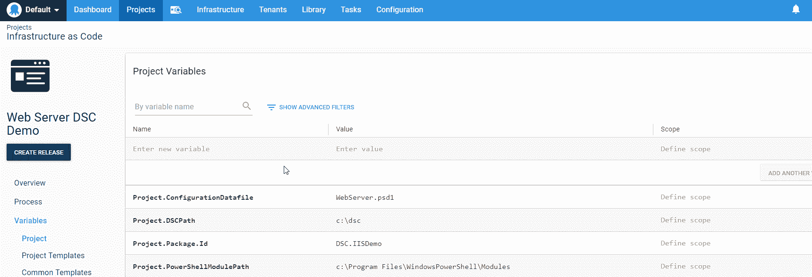](#)

### 定义部署流程

#### 步骤 1:部署 PowerShell DSC 模块

PowerShell DSC 将使用$env:PSModulePath 中定义的路径来查找模块。出于演示的目的，我们将把模块放在变量 Project.PowerShellModulePath 中定义的`c:\Program Files\WindowsPowerShell\Modules`中。

通过单击“添加步骤”,向我们的项目添加一个新步骤:

[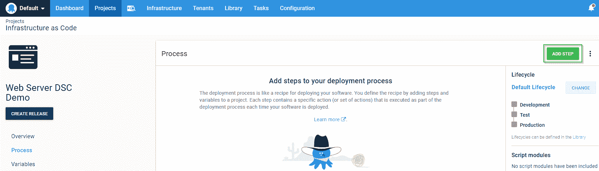](#)

选择部署包模板:

[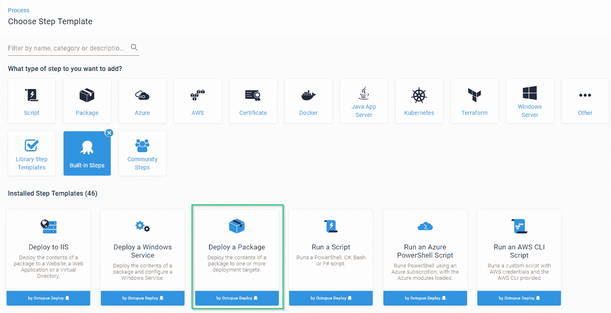](#)

要指定特定位置，请单击“配置功能”按钮并启用自定义安装目录:

[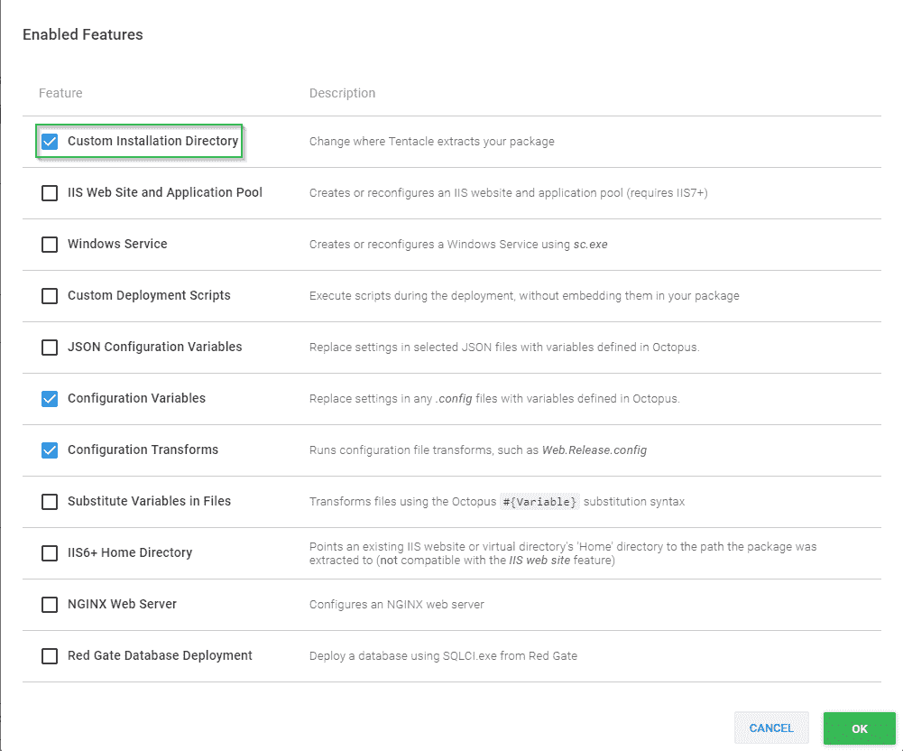](#)

要引用变量，请单击#调出列表并选择 Project.PowershellModulePath，然后单击 Save。

警告！不要在安装前选择清除这个目录，PowerShell 需要的其他模块在那里。

完成后，您的步骤应该如下所示:

[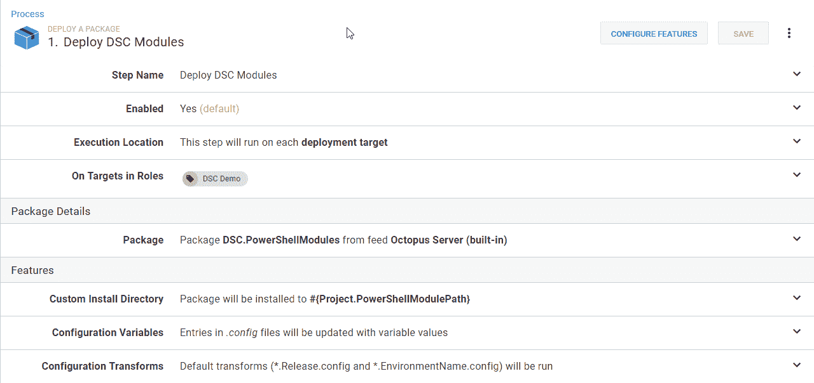](#)

#### 步骤 2:我们的自定义步骤模板

第二步是我们之前创建的自定义步骤模板。通过选择库步骤模板类别，然后选择步骤来添加此步骤，在本例中，它是 Web 服务器 PowerShell DSC:

【T2 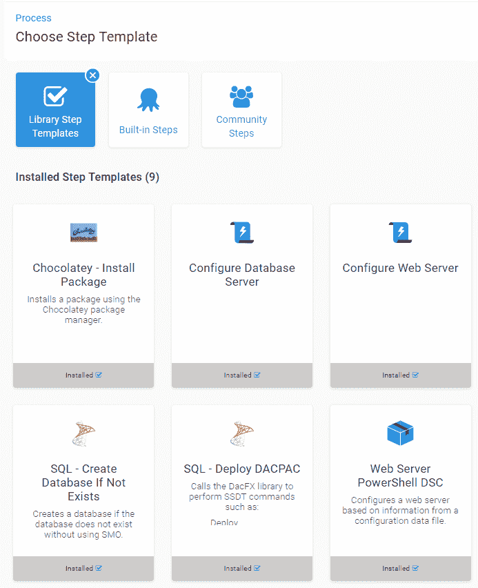

用项目中的变量填充我们创建的参数:

[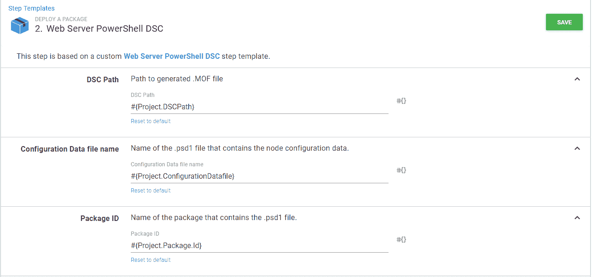](#)

就是这样！一旦我们保存了我们的项目，我们就可以创建一个发布并配置一个服务器了！

## PowerShell DSC 和 Octopus 部署结合，太棒了！

部署完成后，我们应该会看到如下内容:

[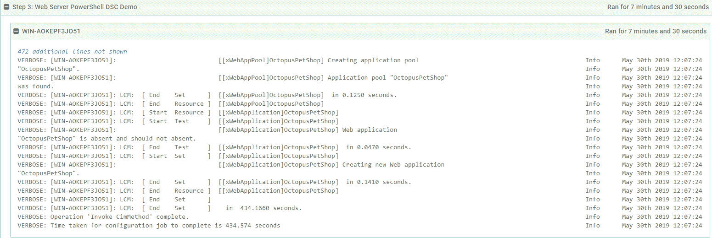](#)

登录到我们的 Web 服务器，我们应该会发现 IIS 已经安装，并且定义了站点、应用程序池和应用程序:

[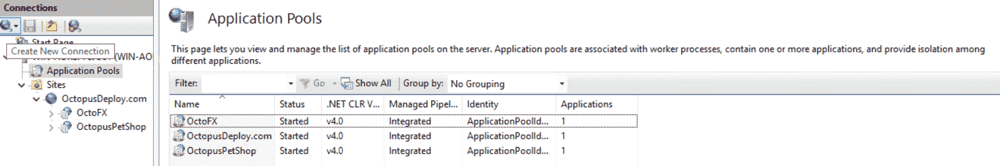](#)

## 变量替换更牛逼！

但是等等！在我们的配置数据文件中，我们已经静态地设置了 IIS 站点登录的位置，但是如果我希望每个项目都有所不同呢？这就是我们可以使用 Octopus Deploy 的文件替换变量特性的地方！

让我们创建一个名为 Project 的变量。日志位置的日志路径:

[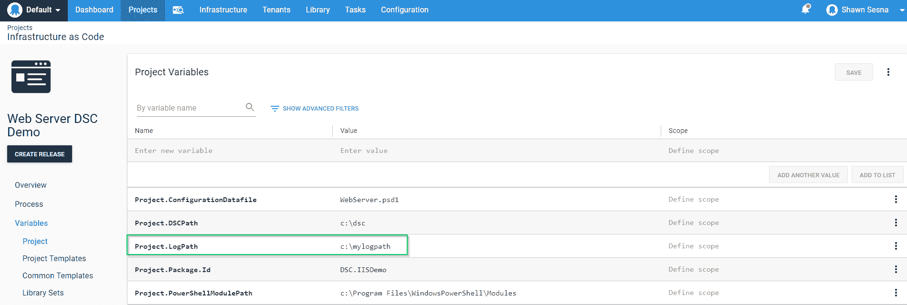](#)

让我们将配置数据文件中的`LogPath = "c:\logs"`行改为`LogPath = "#{Project.LogPath}"`。#是 Octopus Deploy 语法，表示变量 LogPath 的位置。不要忘记检查的变化，以便它可以交付给八达通部署！

因为我们在自定义步骤模板中启用了文件中的替代变量特性，所以我们已经准备好处理这个问题了！

有了我们定义的变量和交付给 Octopus Deploy 的新配置数据文件包，我们就可以创建新的发布和部署了！部署完成后，我们将弹出到我们的 IIS 服务器，我们应该看到日志文件路径已经更新:

[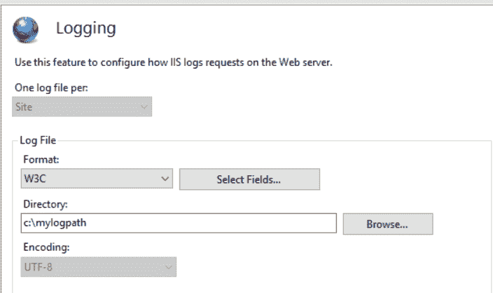](#)

## 使用机器策略监控淘气行为

哇！太棒了。我可以像部署应用程序一样部署服务器配置更改！有人调皮手动改了怎么办？你不是说要监控漂移吗？是的，当然了！我们可以调整 Paul 的机器策略脚本，向我们显示哪些项目不再处于所需状态，并将机器标记为不健康。

Paul 监控漂移的机器策略如下所示:

```
$result = Test-DscConfiguration -Verbose -ErrorAction SilentlyContinue

if ($result -eq $false) {
    Write-Host "Machine has drifted"
    Fail-HealthCheck "Machine has drifted"
} elseif ($result -eq $true) {
    Write-Host "Machine has not drifted"
} else {
    Write-Host "No configuration has been applied to the machine yet"
} 
```

如果我们改变一些事情，我们可以很容易地列出哪些资源已经漂移:

```
# Capture the detailed results
$result = Test-DscConfiguration -Detailed

# Check to see if anything is in the NotInDesiredState collection
if ($result.ResourcesNotInDesiredState.Count -gt 0)
{
    # Loop through the resources
    foreach ($resource in $result.ResourcesNotInDesiredState)
    {
        # Display warning
        Write-Warning "Resource $($resource.ResourceId) is not in desired state!"
    }

    # Fail the health check
    Fail-HealthCheck "Machine has drifted."
}
else
{
    # All good!
    Write-Host "Machine has not drifted."
} 
```

让我们通过在我们的 IIS 服务器上停止 OctopusDeploy.com 网站来测试它。停止站点后，在对机器运行运行状况检查时，我们应该会看到类似这样的内容:

[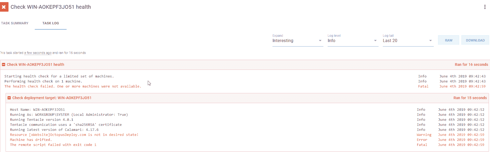](#)

## 摘要

在本文中，我们创建了一个 PowerShell 期望状态配置(DSC)脚本，将其转换为 Octopus 部署步骤模板，将节点数据分离到一个配置数据文件(DSC 配置)中，并创建了一个用于监控漂移的机器策略。

这篇文章的源代码可以在[https://github.com/OctopusSamples/DSC-as-a-template](https://github.com/OctopusSamples/DSC-as-a-template)获得