# Selenium 系列:准备资源- Octopus 部署

> 原文：<https://octopus.com/blog/selenium/29-preparing-the-resources/preparing-the-resources>

这篇文章是关于[创建 Selenium WebDriver 测试框架](/blog/selenium/0-toc/webdriver-toc)的系列文章的一部分。

当作为 AWS Lambda 运行代码时，我们负责在每次应用程序运行时配置环境。虽然 Lambda 通常被称为*无服务器*计算(这是我们在上一篇文章中安装的无服务器应用程序的名称的灵感来源)，但仍然涉及到服务器。术语“无服务器”指的是这样一个事实，即服务器不需要由我们作为最终用户来提供或管理，并且在大多数情况下，我们可以运行我们的代码，而不必太担心托管它的服务器的细节。

然而，针对一个无头 Chrome 浏览器运行 WebDriver 测试确实需要我们配置环境，以确保我们需要的资源可用。也就是说，我们需要 Chrome 浏览器和可供 WebDriver 使用的二进制驱动程序。

尽管我们的代码将在 Linux 服务器上运行，但我们没有从包管理器安装 Chrome 的奢侈。事实上，我们甚至不能下载和运行 Chrome 的标准发行版，因为托管 Lambda 函数的 Linux 环境还不够标准，不足以让这些官方版本工作。

在 [Medium](https://medium.com/@marco.luethy/running-headless-chrome-on-aws-lambda-fa82ad33a9eb) 上有一个详细的帖子，讨论了如何编译 Chrome 的定制版本以在 Lambda 环境中运行。不用说，为 Lambda 构建 Chrome 的过程并不是特别容易。好消息是这篇博文的作者已经自动化了这个过程，并在 https://github.com/adieuadieu/serverless-chrome/releases 的[为 Lambda 提供了定期更新的 Chrome 版本。我们将在自己的环境中使用这些版本。](https://github.com/adieuadieu/serverless-chrome/releases)

我们需要配置的第二个资源是 Chrome 二进制驱动程序。正如我们在本地运行 WebDriver 测试时所做的那样，作为测试的一部分，需要下载、提取和配置这个二进制驱动程序。

当在本地运行测试时，将这个二进制驱动程序放在`PATH`上的一个目录中是很方便的。我们在 Lambda 环境中没有这种奢侈，因为它受到严格限制，我们没有权限将文件放在通常可能在`PATH`上的位置。但是这没关系，正如我们在之前的帖子中看到的，我们可以设置`webdriver.chrome.driver`系统属性指向二进制驱动的位置。

Lambda 还对 Lambda 包的大小进行了限制。今天，我们被限制在 50MB 的封装大小。正如我们将在下一篇文章中看到的，我们的代码已经占用了大量的限制，没有留下足够的空间来打包像 Chrome 发行版和二进制驱动程序这样的文件。

Lambda 确实允许我们在运行时下载和提取额外的文件，我们将利用这一点在每次测试中下载 Chrome 发行版和驱动程序。为了使下载这些文件的过程尽可能快，我们需要将它们托管在 S3，它可以通过高速连接由 Lambda 函数访问，因为 Lambda 和 S3 都是由 AWS 托管的服务。

首先，我们在本地下载这些文件。打开[https://github.com/adieuadieu/serverless-chrome/releases](https://github.com/adieuadieu/serverless-chrome/releases)，下载 Chrome 发行版的 64 版本。

在我的测试中，当从 AWS Lambda 调用时，版本 65、66 和 67 不能正常工作，所以我们必须专门使用版本 64。

一些版本的 Chrome 不工作的事实突出了我们在这里使用的代码应该被认为是实验性的。

【T2 

然后打开[https://sites . Google . com/a/chromium . org/Chrome driver/downloads](https://sites.google.com/a/chromium.org/chromedriver/downloads)找到支持 Chrome 64 的 Linux 二进制驱动的版本。从驱动列表中我们可以看到 2.37 版本支持 Chrome 64。

打开[https://chromedriver.storage.googleapis.com/index.html?path=2.37/](https://chromedriver.storage.googleapis.com/index.html?path=2.37/) 下载 Linux 二进制驱动。

[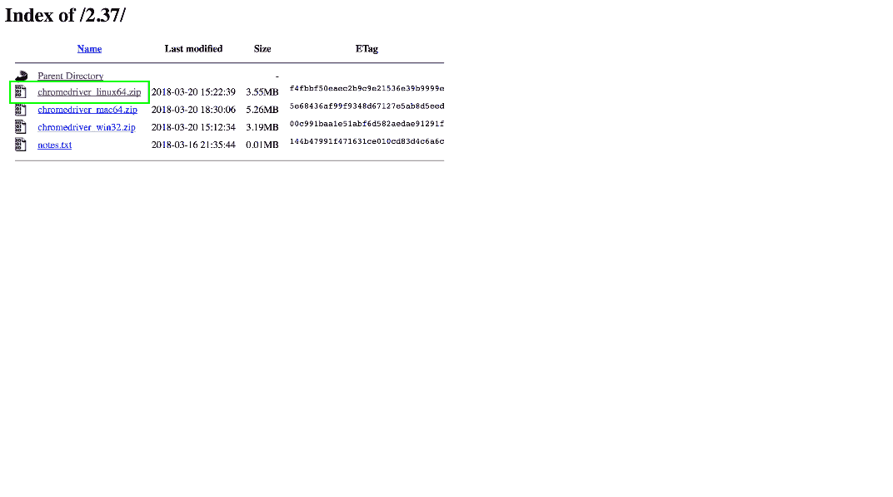](#)

然后，我们将把这些文件上传到 S3，就像我们创建测试公共网站一样。

从 AWS 控制台选择服务➜ S3 。

[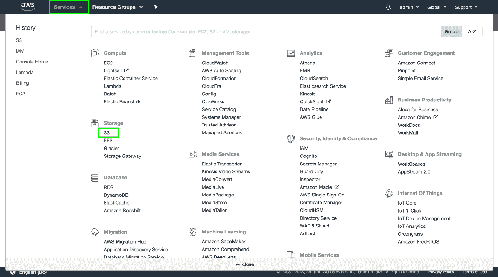](#)

我们将创建一个新的存储桶来存放这些文件，因此单击`Create bucket`按钮。

[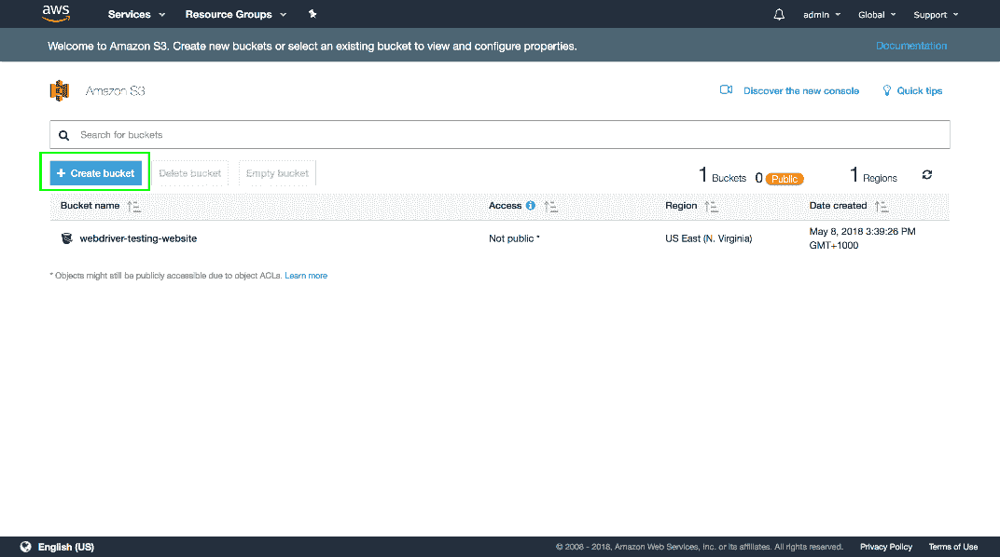](#)

为您的存储桶命名，然后单击`Create`按钮。

请记住，存储桶名称必须是全局唯一的，因此您将无法使用此处显示的名称。

[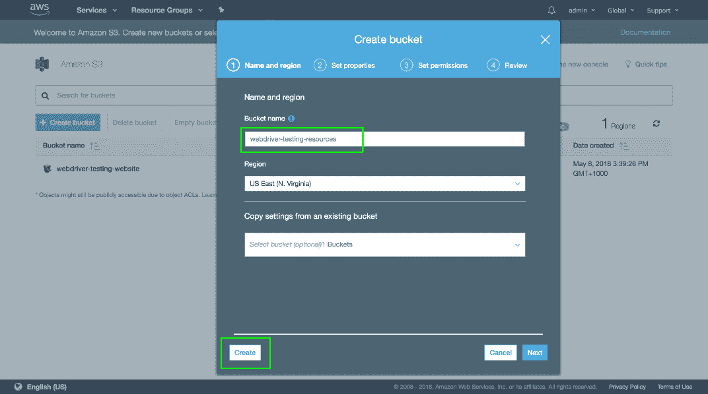](#)

打开新创建的存储桶。

[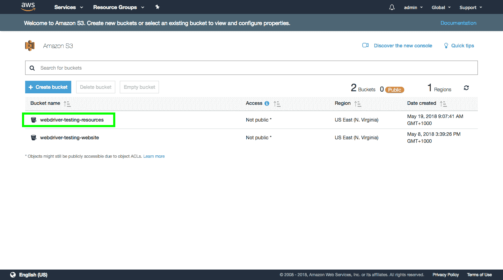](#)

点击`Upload`按钮。

[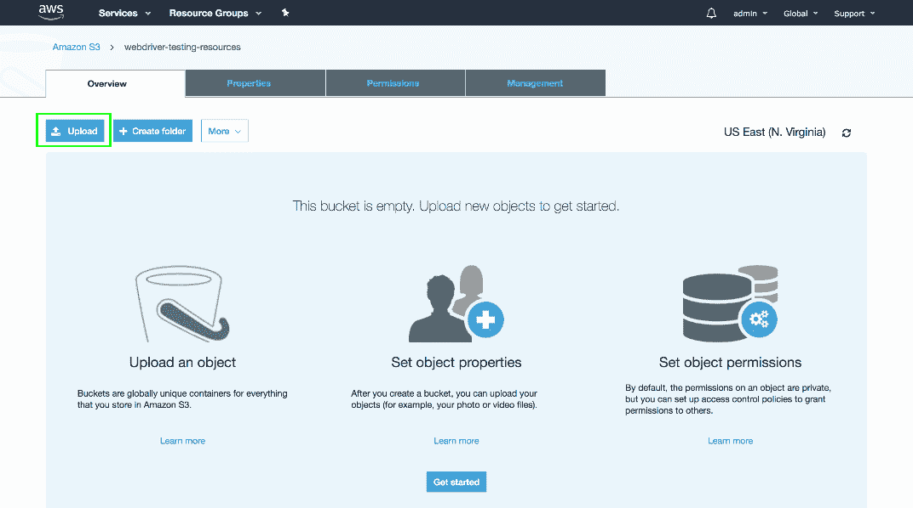](#)

点击`Add files`按钮。

[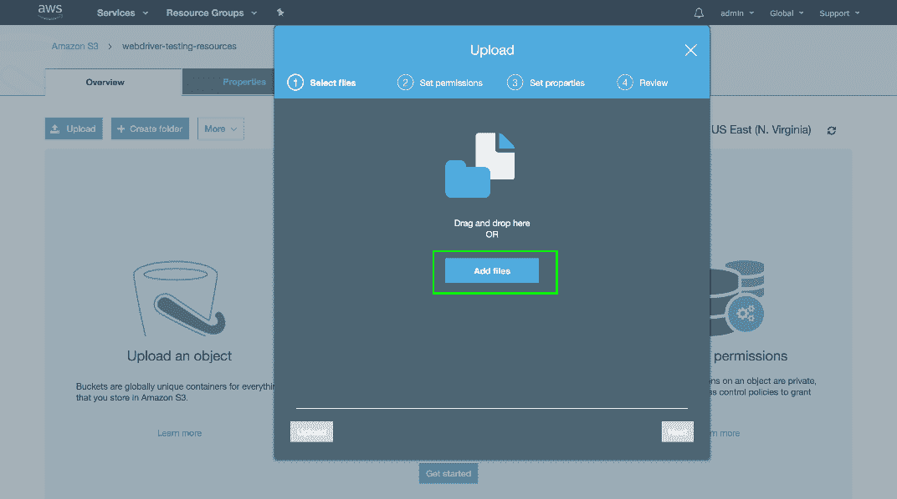](#)

选择之前下载的两个文件。

[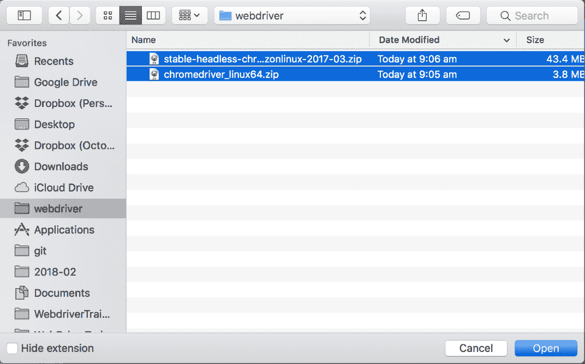](#)

点击`Upload`按钮。

[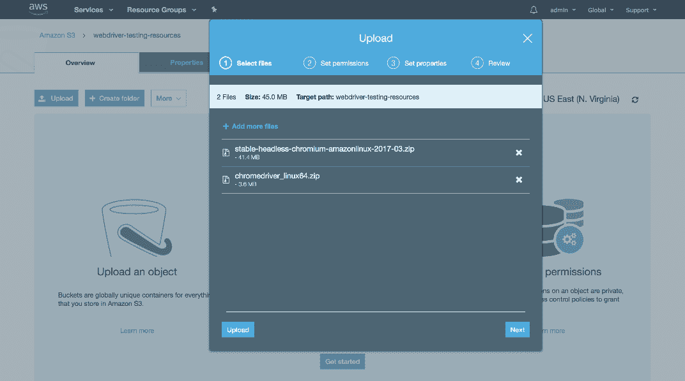](#)

文件上传后，选择它们并点击更多➜公开。

[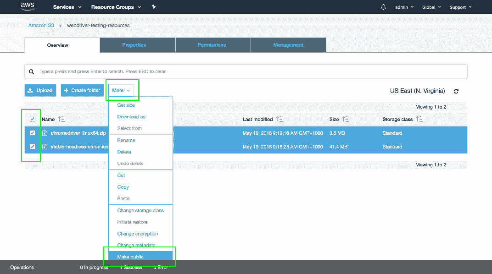](#)

然后点击`Make public`按钮。

[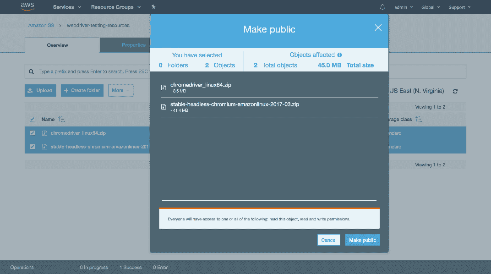](#)

要找到可用于下载这些文件的 URL，请单击该文件并查看`Overview`选项卡中的链接。记下这些 URL，因为我们在后面的帖子中需要它们来下载文件和准备 Lambda 环境。

[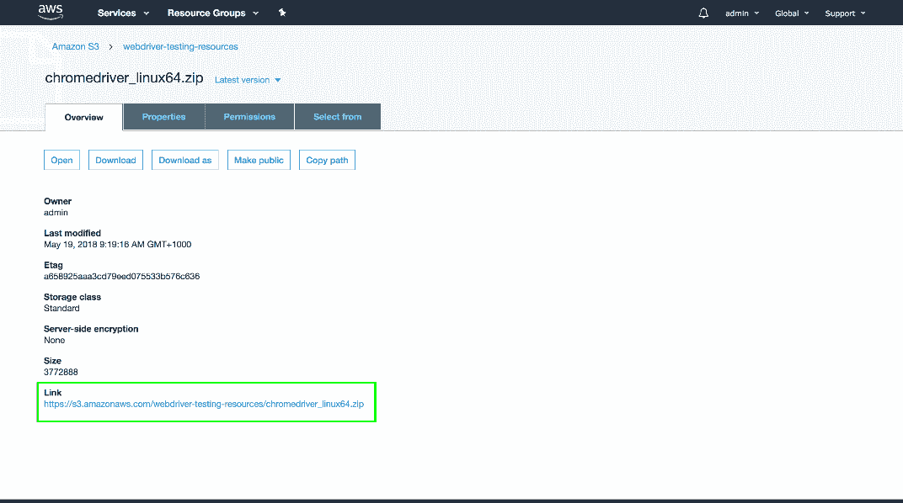](#)

[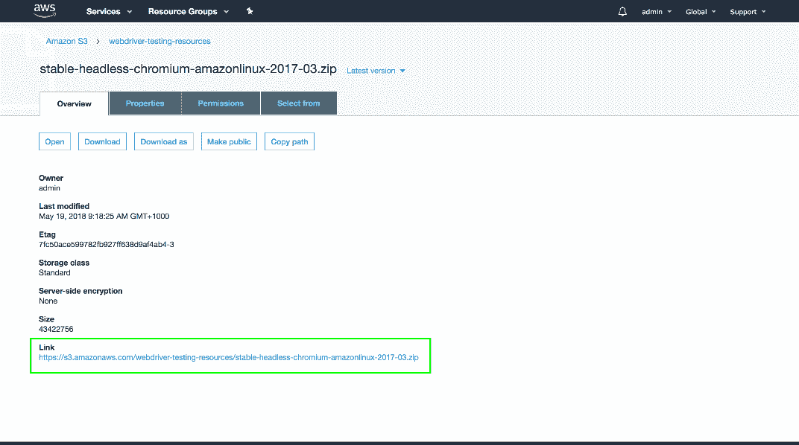](#)

将定制的 Chrome 发行版和适当的 Chrome 驱动程序上传到 S3 后，我们可以继续创建一个包含 Java 代码的包，这些代码将作为 Lambda 函数执行。

这篇文章是关于[创建 Selenium WebDriver 测试框架](/blog/selenium/0-toc/webdriver-toc)的系列文章的一部分。