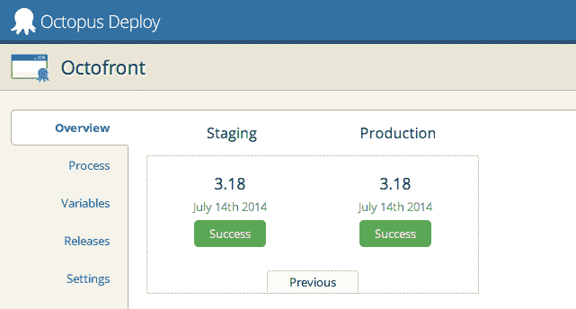
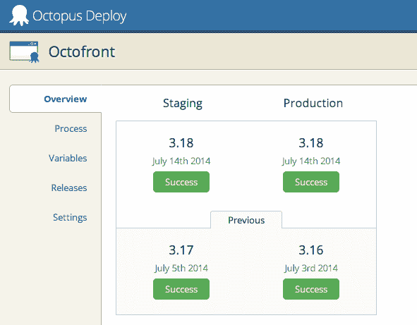
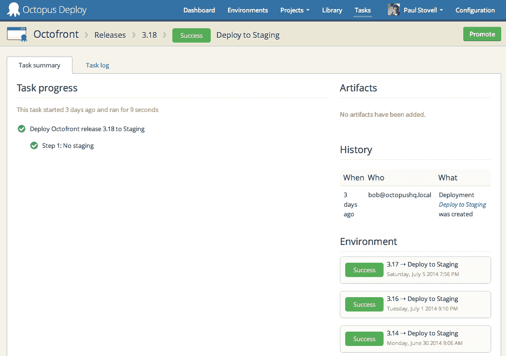

# 以前的部署- Octopus 部署

> 原文：<https://octopus.com/blog/previous-deployments>

我们在 2.5.4 中添加的一个小特性是在查看项目概述时能够轻松查看以前的部署。默认情况下，您只能看到每个环境的最新部署:

您可以单击“Previous”选项卡，展开并显示每个环境以前的成功部署:

目标是更容易找到要回滚到的部署。这意味着我们只显示成功的部署，并且我们只显示当前部署版本之外的版本的部署(例如，如果花了 4 次尝试来部署 3.18，您仍然会看到 3.17 是以前的部署)。

同样，在查看部署时，我们添加了该环境中以前部署的列表:

同样，我们的目标是能够快速帮助您回滚。该列表实际上不仅显示了以前的部署，还显示了任何将来的部署(如果您正在查看旧的部署)。

这是一个微小的变化，但有时正是这些微小的变化真的有帮助。愉快的部署！