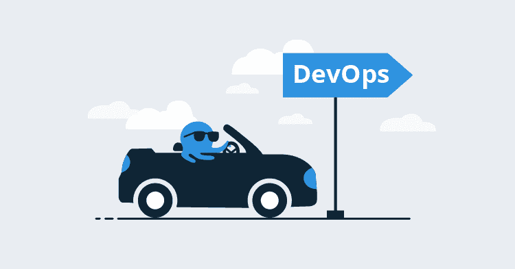
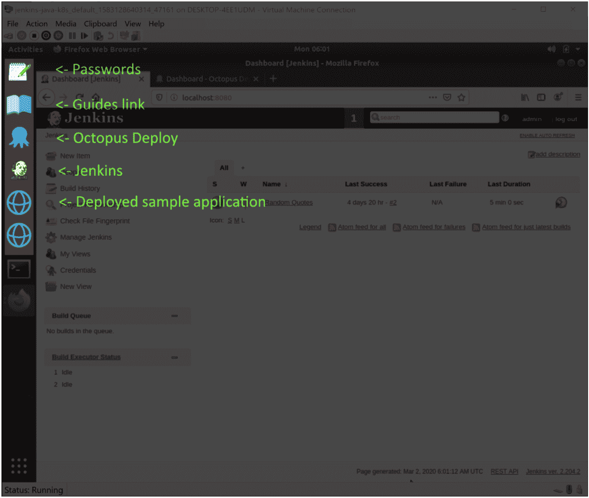

# 介绍项目 TestDrive - Octopus Deploy

> 原文：<https://octopus.com/blog/project-testdrive>

[](#)

开始一个新的 IT 项目是一个令人生畏的前景。通常感觉你需要深入了解六种工具和平台，其中任何一种都足够复杂，你可以围绕它建立一个完整的职业生涯，更不用说以任何有意义的方式将它们集成在一起。

如果你曾经盯着一个概念验证项目，不知道从哪里开始，你并不孤单。我在办公室里听到过不止一个负责调试 Kubernetes、NGINX、WildFly 或 Tomcat 部署的开发人员同事(包括我自己)发出的无奈的叹息，我们工作的环境中这种部署司空见惯。

然而，令人难以置信地令人满意的是，您可以看到部署通过 Octopus 从 CI 服务器中启动的构建展开到其目的地，因为从该基线开始，变化被快速地迭代实现。

章鱼的目标之一是让您更快、更少沮丧地到达目的地。为此，我们刚刚启动了 [TestDrive](https://octopus.com/testdrive) 项目，将几个虚拟机发布到[fluoro Cloud](https://app.vagrantup.com/octopusdeploy)中，这些虚拟机利用自由和开源平台，如 Jenkins、Docker、Kubernetes、Tomcat 和 NGINX，捕获各种独立的 CI/CD 工作流。

## 获取虚拟机

Hyper-V 和 VirtualBox 虚拟机已经使用[流浪者](https://www.vagrantup.com/)构建和打包，并通过[流浪者云](https://app.vagrantup.com/octopusdeploy)分发。

如果你从来没有使用过 vagger，最简单的方法就是把它当成一个管理程序的通用 CLI 工具。vagger 使得消费和创建虚拟机变得容易，你只需要执行两个命令就可以下载并在本地安装一个虚拟机。例如，为 VirtualBox 用户安装 Octopus、Jenkins 和 Kubernetes 虚拟机是通过以下两个命令完成的:

```
vagrant init octopusdeploy/jenkins-java-k8s
vagrant up --provider=virtualbox 
```

或者这两个针对 Hyper-V 用户的命令:

```
vagrant init octopusdeploy/jenkins-java-k8s
vagrant up --provider=hyperv 
```

你可以从 [Octopus TestDrive 页面](https://octopus.com/testdrive)找到所有的虚拟机。

虚拟机启动后，您将登录到 Ubuntu 桌面。已安装应用程序的快捷方式已添加到左侧的 dock 中。下面的屏幕截图显示了 Kubernetes 虚拟机中的各种图标:

[](#)

您现在有了一个完整的 CI/CD 管道来进行实验。通过利用虚拟机管理程序的快照功能，您可以快速回滚任何更改，使该虚拟机成为探索 Octopus 的理想环境。

## 结论

如果你曾经好奇 Octopus 能为你做什么，或者你想探索 Octopus 作为一个完整的 CI/CD 管道的一部分，TestDrive VMs 是一种快速和安全的方式来试验 Octopus、Jenkins 和其他平台，如 Kubernetes、NGINX、Tomcat 和 WildFly。