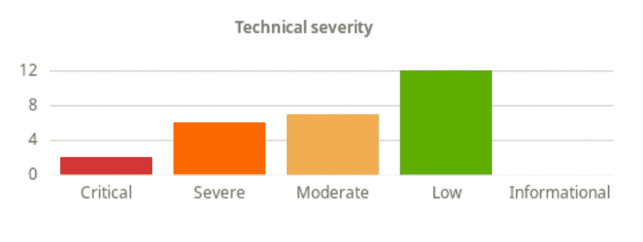
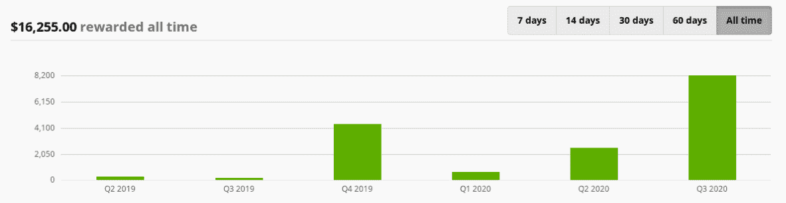

# 公众虫赏金计划与虫群-章鱼部署

> 原文：<https://octopus.com/blog/public-bug-bounty>

我们已经和 Bugcrowd 一起运行了一个私人的 bug bounty 项目超过 12 个月了，我们很高兴地宣布我们正在把它变成一个任何人都可以加入的公共项目。在这篇文章中，我将解释为什么我们要这样做，到目前为止我们从这个项目中看到了多少数字，以及你如何加入进来。

大多数在线团队都熟悉安全研究人员会停下来报告一些不太正确的事情。自然，当他们发现重要问题时，我们要说“谢谢！”让我们的网站对每个人来说都更安全。

我们一直有一个关于[负责任的披露](https://octopus.com/docs/security#disclosure-policy)的政策来支持这一点，就我个人而言，我有很多时间给赏金猎人和研究人员，因为我认为我自己就是其中之一！

然而，公平地奖励人们是很难管理的，随着你网站流量的增加，寻找“谢谢”感觉的人也会增加。我们并没有真正建立起管理支付以及支付所需的政策和程序。

我们已经投入了大量资源来保护自己的安全和编写优秀的代码，但与 Bugcrowd 建立关系以开发一个奖金计划使我们能够保持积极的反馈循环，减少任何“噪音报告”，并使我们能够专注于我们最擅长的事情+。

## 目前为止我们的昆虫赏金之旅

我们认为这种方法应该与我们现有的常规渗透测试一起运行，而不是取代它。决定从小规模开始，只将研究人员的注意力集中在我们的网站上(即，排除运行我们的 Octopus 实例的部分),这意味着我们可以学习如何管理负载，因为我们增加了被邀请参加该计划的研究人员的数量。

我们的私人项目于 2019 年在 Q2 启动，截至撰写本文时，我们已经得到了 883 名研究人员的帮助。他们一起给了我们很大的打击，创造了超过 200 个提交，其中 27 个足够严重，可以获得奖励。其中大多数(12 例)为低严重性；Bugcrowd 评级系统中的 P4。我们选择不奖励 P5 的“信息”发现。

## 我们当前的臭虫赏金统计

关键问题的平均修复时间不到 2 天，如果包括严重性较低的问题，总体平均修复时间为 18 天。还不错，但是还有提高的空间！

在这段时间里，我们已经奖励了超过 16，000 美元，正如你所看到的，它有升有降，主要是由于参与其中的研究人员的数量。

## 今天就加入我们的昆虫赏金计划吧

今天，我们自豪地宣布，我们将把我们的奖金计划向所有有时间和愿望帮助我们的人公开，我们承诺为遵守我们的范围和 Bugcrowd 规则的研究人员提供一个安全的港湾。我们还要感谢近 900 名研究人员，他们在过去的 12 个月里帮助我们变得更好，并学习如何处理这种活动。

如果你想加入这个有趣的活动，你可以去 Bugcrowd，在他们的研究门户网站上找到我们。在这里，您可以找到我们的范围和奖励计划，但我会为您节省一些点击次数，并在这里为您提供详细信息:

### 范围

我们的范围严格限制在我们专用的安全测试环境:[https://bc.octopus.com](https://bc.octopus.com)。任何超出这个范围的测试都不会得到奖励。我们暂时将我们的产品(包括云产品)排除在这个范围之外，但是我们正在考虑将来如何将它包括进来。目前，我们定期对产品进行外部审计。

有关包含和排除的完整列表[，请查看我们 Bugcrowd 页面](https://bugcrowd.com/octopus-og)上的完整简介。

### 奖励

根据发现的严重程度，奖励从 150 美元到 3000 美元不等，我们使用 Bugcrowd VRT 和 CVSS 评分来帮助我们做出一致的判断。

## 帮助我们让章鱼更安全

如果你有兴趣帮助保护八达通的安全，并且你希望这项工作得到一些认可，我鼓励你在 Bugcrowd 上查看我们的奖金计划并加入进来！如果你对我们如何运行这个程序有任何反馈，或者如果你想报告这个赏金程序范围之外的一个漏洞，请通过 security@octopus.com 给我们写信。