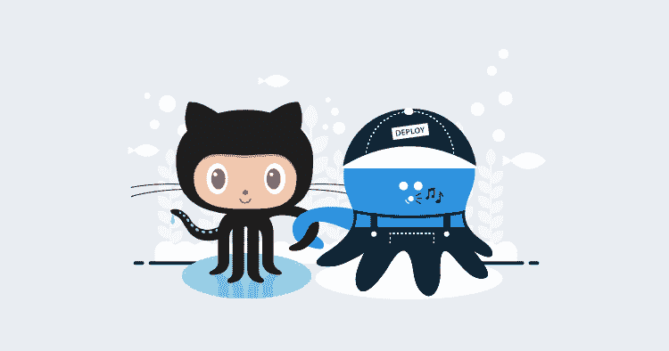

# 使用 GitHub 操作将包发布到 Octopus-Octopus Deploy

> 原文：<https://octopus.com/blog/publishing-a-package-to-octopus-with-github-actions>

[](#)

作为 Octopus 2021 Q2 版的一部分，我们引入了对 GitHub 操作的原生支持，因此您可以将您的 GitHub 构建和其他自动化流程与您的 Octopus 工作流集成。在我们的帖子[中，了解如何开始宣布针对 Octopus Deploy](https://octopus.com/blog/github-actions-for-octopus-deploy) 的 GitHub 操作。

我最近留出了一些时间来写我的第一个 GitHub 动作。我用我的个人博客作为我的测试案例。这是一个静态站点，由 Wyam 构建，托管在 Firebase 中。

[TL；DR](#full-script) :跳到底部看完整的脚本。

## 什么是 GitHub 动作？

GitHub 动作是可以对存储库中发生的事件做出反应的工作流。推送到分支机构、打开拉式请求和打开问题都是可以触发工作流的事件示例。

在我的例子中，我的工作流对推送到主分支做出反应。

工作流包含一个或多个在 Docker 容器上运行的作业。作业包含一个或多个执行任务的步骤，以执行所需的操作。

## 我的工作流程

我需要执行的高级步骤包括:

*   查看代码。
*   生成网站。
*   打包网站。
*   将该包推送到我的 Octopus 实例。

其中一些步骤需要先运行其他步骤。我需要安装步骤。NET Core、Wyam 和 Octopus CLI。我还需要一个步骤来计算我的站点包的版本。

## 工作流创建

创建新的工作流非常直观。我转到我的存储库的**动作**标签，点击**新工作流**按钮。

您可以选择一些初学者工作流程。我跳过了这些，选择了**自己设置工作流**选项。

GitHub 让我进入了一个编辑器，在我的库的`.github/workflows/`文件夹中有一个新的 YAML 文件。

以下是我对该文件所做的更改。

### 名称和触发器

我保留了默认名称`CI`和对`master`分支的触发:

```
name: CI

on:
  push:
    branches: [ master ] 
```

### 生成作业

我将默认作业从`build`重命名为`generate`，并接受它运行的映像:`ubuntu-latest`:

```
jobs:
  generate:
    runs-on: ubuntu-latest 
```

### 结帐步骤

以下是您可以添加到作业中的最小步骤。在这一行中，我定义了一个步骤，将我的存储库签出到托管作业的 Ubuntu 容器。

重用步骤是 Actions 和许多其他基于 YAML 的管道的一个关键特性。我使用 GitHub Actions 团队提供的第二版`checkout`步骤。您还可以创作动作并在工作流程中使用第三方动作:

```
steps:
    - uses: actions/checkout@v2 
```

### 工作流命令和环境变量

动作提供了[工作流命令](https://help.github.com/en/actions/reference/workflow-commands-for-github-actions)，通过传递给`echo`的特殊字符串格式，您可以在步骤中使用这些命令。

此步骤称为**设置版本**，并基于当前日期和工作流的当前运行编号创建包版本。使用`set-env`命令将包版本保存为`$PACKAGE_VERSION`。`$PACKAGE_VERSION`现在在创建和发布包的步骤中可用:

```
 - name: Set version
      run: echo "PACKAGE_VERSION=$(date +'%Y.%m.%d').$GITHUB_RUN_NUMBER" >> $GITHUB_ENV 
```

### 生成网站

要生成我的静态站点，我需要安装。NET 核心，Wyam 工具，并调用 Wyam 对我的源代码。

我用另一个内置动作`actions/setup-dotnet@v1`来安装。容器上的网芯。该步骤接受。要安装的. NET 版本:

```
 - name: Setup .NET Core
      uses: actions/setup-dotnet@v1
      with:
        dotnet-version: 2.1.802 
```

与。NET，我可以调用 CLI 将 Wyam 工具安装到容器上:

```
 - name: Install Wyam
      run: dotnet tool install --tool-path . wyam.tool 
```

最后，`Generate site`步骤调用 Wyam 来生成站点:

```
 - name: Generate site
      run: ./wyam build -r blog -t Stellar src 
```

### 打包并发布网站

我需要 Octopus CLI 来打包和发布网站。我跳转到 [Octopus CLI 下载页面](https://octopus.com/downloads/octopuscli#linux)，复制了安装在 Ubuntu 上的脚本:

```
 - name: Install Octopus CLI
      run: |
        sudo apt update && sudo apt install --no-install-recommends gnupg curl ca-certificates apt-transport-https && \
        curl -sSfL https://apt.octopus.com/public.key | sudo apt-key add - && \
        sudo sh -c "echo deb https://apt.octopus.com/ stable main > /etc/apt/sources.list.d/octopus.com.list" && \
        sudo apt update && sudo apt install octopuscli 
```

我将必要的文件复制到代表包的目录中。然后我调用`octo pack`命令创建一个 Zip 包，版本设置为`$PACKAGE_VERSION`:

```
 - name: Package blog.rousseau.dev
      run: |
        mkdir -p ./packages/blog.rousseau.dev/src/
        cp .firebaserc firebase.json ./packages/blog.rousseau.dev/
        cp -avr ./src/output ./packages/blog.rousseau.dev/src/
        octo pack --id="blog.rousseau.dev" --format="Zip" --version="${{ env.PACKAGE_VERSION }}" --basePath="./packages/blog.rousseau.dev" --outFolder="./packages" 
```

此步骤的输出片段如下所示:

```
Setting Zip compression level to Optimal
Packing blog.rousseau.dev version "2020.04.08.21"...
Saving "blog.rousseau.dev.2020.04.08.21.zip" to "./packages"...
Adding files from "./packages/blog.rousseau.dev" matching pattern "**" 
```

创建好包后，我调用`octo push`命令将包上传到我的 Octopus 实例。我的服务器 URL 和 API 密钥在我的存储库中被配置为机密，以确保它们的安全:

```
 - name: Push blog.rousseau.dev to Octopus
      run: octo push --package="./packages/blog.rousseau.dev.${{ env.PACKAGE_VERSION }}.zip" --server="${{ secrets.OCTOPUS_SERVER_URL }}" --apiKey="${{ secrets.OCTOPUS_API_KEY }}" 
```

关于 API 密匙的话题，我*高度*推荐在将另一个应用与 Octopus 集成时建立一个[服务账户](https://octopus.com/docs/administration/managing-users-and-teams/service-accounts)。有一个内置的`Build server`角色可以用于 CI 服务帐户。

下面的结果显示请求被认证为`GitHub (a service account)`而不是我的用户帐户。

在包步骤中创建的包被成功地推送到 Octopus。现在我可以将我的站点部署到 Firebase 了(但那是以后的事了):

```
Detected automation environment: "NoneOrUnknown"
Space name unspecified, process will run in the default space context
Handshaking with Octopus Server: ***
Handshake successful. Octopus version: 2020.1.6; API version: 3.0.0
Authenticated as: GitHub (a service account)
Pushing package: /home/runner/work/blog.rousseau.dev/blog.rousseau.dev/packages/blog.rousseau.dev.2020.04.08.21.zip...
Requesting signature for delta compression from the server for upload of a package with id 'blog.rousseau.dev' and version '2020.04.08.21'
Calculating delta
The delta file (60,053 bytes) is 0.42 % the size of the original file (14,338,268 bytes), uploading...
Delta transfer completed
Push successful 
```

## 完整脚本

```
name: CI

on:
  push:
    branches: [ master ]

jobs:
  generate:
    runs-on: ubuntu-latest

    steps:
    - uses: actions/checkout@v2

    - name: Set version
      id: set-version
      run: echo "PACKAGE_VERSION=$(date +'%Y.%m.%d').$GITHUB_RUN_NUMBER" >> $GITHUB_ENV

    - name: Setup .NET Core
      uses: actions/setup-dotnet@v1
      with:
        dotnet-version: 2.1.802

    - name: Install Wyam
      run: dotnet tool install --tool-path . wyam.tool

    - name: Generate site
      run: ./wyam build -r blog -t Stellar src

    - name: Install Octopus CLI
      run: |
        sudo apt update && sudo apt install --no-install-recommends gnupg curl ca-certificates apt-transport-https && \
        curl -sSfL https://apt.octopus.com/public.key | sudo apt-key add - && \
        sudo sh -c "echo deb https://apt.octopus.com/ stable main > /etc/apt/sources.list.d/octopus.com.list" && \
        sudo apt update && sudo apt install octopuscli

    - name: Package blog.rousseau.dev
      run: |
        mkdir -p ./packages/blog.rousseau.dev/src/
        cp .firebaserc firebase.json ./packages/blog.rousseau.dev/
        cp -avr ./src/output ./packages/blog.rousseau.dev/src/
        octo pack --id="blog.rousseau.dev" --format="Zip" --version="${{ env.PACKAGE_VERSION }}" --basePath="./packages/blog.rousseau.dev" --outFolder="./packages"

    - name: Push blog.rousseau.dev to Octopus
      run: octo push --package="./packages/blog.rousseau.dev.${{ env.PACKAGE_VERSION }}.zip" --server="${{ secrets.OCTOPUS_SERVER_URL }}" --apiKey="${{ secrets.OCTOPUS_API_KEY }}" 
```

## 结论

GitHub Actions 是将持续集成和交付直接添加到您托管在 GitHub 上的项目的一种极好的方式。当与 Octopus CLI 结合使用时，您将获得一个强大的可重复、可靠的部署。