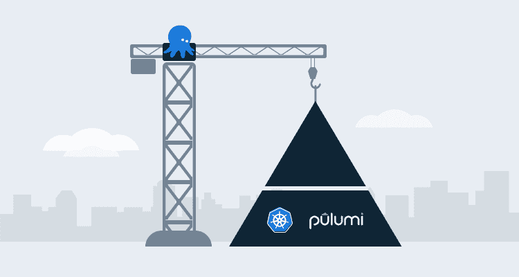

# 使用 Pulumi 和 Octopus Deploy - Octopus Deploy 创建 AKS 集群

> 原文：<https://octopus.com/blog/pulumi-and-aks-with-octopus-deploy>

[](#)

创建软件定义的基础架构有许多不同的形式和大小，包括 Terraform 等流行的 IaC 工具和 Ansible 等配置管理工具。对于任何工具来说，都有一点是正确的，那就是你希望能够用自己喜欢的语言编写代码。

Pulumi 结合了作为代码的基础设施和通用编程的力量，使基础设施成为软件，它让你像在 Go、Python、JavaScript 等中一样编写代码。

在这篇博文中，我解释了如何使用 Pulumi、Python 和 Octopus Deploy 创建 Azure Kubernetes 集群(AKS)。

## 先决条件

当您使用 Pulumi 将基础设施创建为软件时，您需要考虑一些硬性的先决条件。一旦你创建了一个新项目，你会被问及你正在使用哪种云和编程语言，因此，最好选择特定的技术。

要跟进这篇博文，您需要以下内容:

*   Pulumi 项目已经定义为使用 Azure 和 Python。
*   Azure 账户。如果你还没有，你可以注册一个 30 天的免费试用。
*   Azure 应用程序注册。如果你不知道如何创建一个，你可以遵循这些[指令](https://docs.microsoft.com/en-us/azure/active-directory/develop/howto-create-service-principal-portal)。
*   Python 的中级知识。
*   一个 GitHub 帐户，你可以在那里开始 Python 代码。
*   外部 [GitHub 馈送](https://octopus.com/docs/packaging-applications/package-repositories/github-feeds)。

## 创建 Python 代码

下面几节将向您展示如何用 Python 编写代码。

### 编写 Python 常量

当您使用 Pulumi 时，有几个选项可以在运行时传递参数:

*   配置文件
*   从命令行
*   硬编码在代码中

我更喜欢创建一个常量文件，因为它可以让我避免对值进行硬编码，并给我一个可以更改值的位置。

如果您决定采用这种方法，在您的 Pulumi 项目中，创建一个名为`aksParamConstants.py`的新文件。

将下列常量添加到您的文件中。保持`keys`不变，但是`values`应该根据您的工作环境而变化:

```
name = ('octoaks92')
location = ('eastus')
resource_group_name = ('resource_group')
dns_prefix = ("dns_prefix")
min_count = (1)
max_count = (1)
vm_size = ('Standard_D12_v2')
auto_scaling = (True)
clientID = ("azure_app_registration_client_id") 
```

### 编写 Python 函数

Python 代码将使用 Pulumi Azure Python SDK。

首先，您需要导入将用于创建 AKS 集群的包。

第一个库用于日志记录，将用于输出发生的任何错误。第二个导入是 Pulumi SDK 本身。第三个是您在上一节中创建的`[aksParamConstants.py](http://aksparamconstants.py)`文件，最后，您从`pulumi_azure`库中导入核心组件来管理 Azure 中的容器:

```
import logging
import pulumi
import aksParamConstants as constants
from pulumi_azure import containerservice, core 
```

下一段代码是 Python 函数本身。

该函数调用 SDK 中的`KubernetesCluster`类，并使用一些您可以初始化并赋值的属性:

```
def createAKSCluster():
    config = pulumi.Config()

    if containerservice == None:
        logging.warning("Check to ensure the containerservice import is accurate")

    else:
        try:
            containerservice.KubernetesCluster(
                resource_name = constants.name,
                default_node_pool={
                    'min_count': constants.min_count,
                    'max_count': constants.max_count,
                    'name': constants.name,
                    'vm_size': constants.vm_size,
                    'enable_auto_scaling': constants.auto_scaling
                },
                dns_prefix=constants.dns_prefix,    
                resource_group_name=constants.resource_group_name,
                service_principal={
                    'client_id': constants.clientID,
                    'client_secret': config.require_secret('clientSecret')
                    }
                )

        except Exception as e:
            logging.error(e) 
```

要获得您可以使用的属性的下拉列表，请看一下`KubernetesCluster` [类](https://github.com/pulumi/pulumi-azure/blob/master/sdk/python/pulumi_azure/containerservice/kubernetes_cluster.py)下的 SDK 本身。

Pulumi 项目中的`__main__.py`文件应该如下所示:

```
import logging
import pulumi
import aksParamConstants as constants
from pulumi_azure import containerservice, core

def createAKSCluster():
    config = pulumi.Config()

    if containerservice == None:
        logging.warning("Check to ensure the containerservice import is accurate")

    else:
        try:
            containerservice.KubernetesCluster(
                resource_name = constants.name,
                default_node_pool={
                    'min_count': constants.min_count,
                    'max_count': constants.max_count,
                    'name': constants.name,
                    'vm_size': constants.vm_size,
                    'enable_auto_scaling': constants.auto_scaling
                },
                dns_prefix=constants.dns_prefix,    
                resource_group_name=constants.resource_group_name,
                service_principal={
                    'client_id': config.require('clientID'),
                    'client_secret': config.require_secret('clientSecret')
                    }
                )

        except Exception as e:
            logging.error(e)

createAKSCluster() 
```

### 将代码存储在 GitHub 中

因为 Octopus Deploy 需要从提要中检索和提取 Pulumi 项目，并最终将代码推送到部署目标，所以您可以将 Pulumi 项目推送到 GitHub repo。

接下来，您可以在 GitHub 中创建代码的新版本。Octopus Deploy 在使用外部提要拉入代码时会寻找特定的发布版本。

## 在 Octopus 部署中配置部署

现在代码已经编写好并存储在 GitHub 中，是时候用 Octopus Deploy 部署这个包了。

### Octopus 部署中的身份验证

对于 Pulumi 步骤，您需要一个 Azure 帐户，该帐户被配置为项目变量中的一个变量，以便进行身份验证。

1.  在 Octopus 门户网站中，导航到项目。
2.  选择项目变量。
3.  创建一个名为 Azure 的新变量。
4.  在值下，转到 **更改➜ Azure 帐户类型** 。
5.  选择要用于身份验证的 Azure 帐户。

## Pulumi 密码和秘密变量

当您从 Pulumi 代码向 Azure 进行身份验证时，您需要提供 Azure 应用注册和客户端密码。客户端机密非常敏感，因此您应该将其存储在安全的地方:

1.  转到 **项目➜变量** 。
2.  创建一个名为`clientSecret`的新变量。
3.  确保类型是敏感的。
4.  添加 Azure 应用程序注册客户端机密的值。

### 代码包步骤

1.  在 Octopus Deploy 门户中，创建一个新项目来部署 Pulumi 包。
2.  前往 **部署➜进程** 。
3.  点击**添加步骤**按钮。

您需要添加的第一步是**部署包**步骤。这允许您指定外部 GitHub 提要，指向 Pulumi 包所在的 GitHub repo，并将其推送到部署目标。

4.  在`.NET Configuration Transforms`下，点击**配置功能**按钮。
5.  取消选中所有。NET 选项并勾选/选择**自定义安装目录。**自定义安装目录是 Pulumi 包将被推入并存储的位置，以便流程中的下一步可以使用它。
6.  保存该步骤。

### 安装 Pulumi SDK

在运行任何 Pulumi 包之前，您需要确保 Pulumi SDK 存在。Pulumi SDK 还包含 Pulumi SDK 的 Azure。

1.  添加一个**运行脚本**的步骤。
2.  在**内联源代码**部分下，在 Bash 下添加以下代码:`pip install pulumi`

### 普鲁米舞步

接下来，是时候添加第一个 Pulumi 步骤了。Pulumi 步骤将创建一个 secret 和 AKS 集群。您将使用 **RUN A SCRIPT** 模板来使用 Bash 中的 Pulumi 命令，而不是使用第三方步骤模板。

对于**运行脚本**步骤，将以下代码添加到**脚本**下的**内联源代码**部分:

```
cd /home/mike/pulumiaks/AKS-Create
secret=$(get_octopusvariable "clientSecret")
sudo /root/.pulumi/bin/pulumi config set --secret clientSecret $secret
sudo /root/.pulumi/bin/pulumi up --yes 
```

### 运行 Pulumi 部署

现在是运行部署的时候了:

1.  点击**保存**。
2.  创建新版本。
3.  保存发布。
4.  选择要将 Pulumi 软件包部署到的生命周期和部署。
5.  点击**部署到某 _ 环境**。
6.  点击**部署**。

恭喜你。您已经成功地使用基础设施作为软件创建了一个 AKS 集群。

## 结论

凭借 Pulumi 的强大功能，您不仅可以使用通用编程语言定义基础设施和服务，还可以使用 Octopus Deploy 存储状态和部署功能，我们正在慢慢进入基础设施开发的新时代。