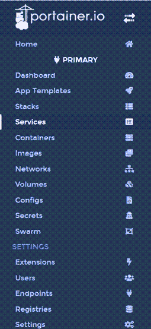
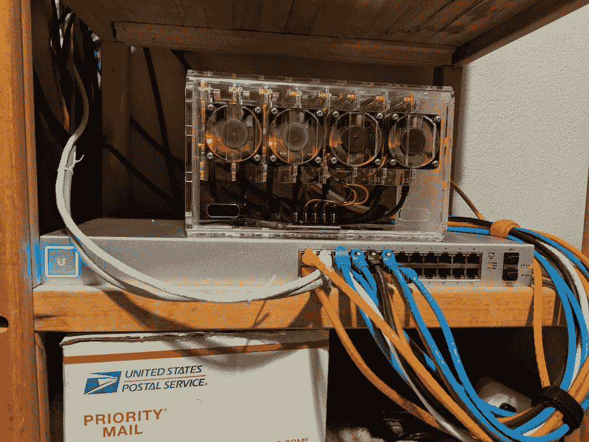

# 构建 Raspberry Pi 集群- Octopus 部署的进一步经验

> 原文：<https://octopus.com/blog/raspberry-pi-further-lessons-learned>

[](#)

在之前的一篇文章[构建 Raspberry Pi 集群的经验教训](https://octopus.com/blog/raspberry-pi-cluster-lessons-learned)中，我分享了我在 Docker 集群中使用 Raspberry Pi 机器时学到的一些东西。以下是我后来学到的一些经验(如果你想看前四课，可以看看[之前的帖子](https://octopus.com/blog/raspberry-pi-cluster-lessons-learned))。

## 配置和网络更新

在上一篇文章中，集群由五台 Raspberry Pi 机器组成，这是因为我有 8 端口交换机。后来，我升级到了 24 端口交换机，这使我可以用另外三台 Pi 机器来完全填充机箱。总共有八台机器，我可以在 Docker Swarm 和 Kubernetes (K8s)之间平均分配。

如果你感兴趣，我把我的整个网络设备换成了 Unifi。这篇文章不是关于网络设备的，但是如果你曾经考虑过 Unifi，我强烈推荐它。它让您以更合理的价格控制企业设备。提醒一句，他们给你足够的配置自由，让你自己陷入困境，有可能失控:

> 如果我在儿童室和餐厅之间再增加一个接入点，我就可以在走廊上一直保持 5Ghz 的信号强度

你已经被警告了😃

## 第 5 课:Raspberry Pi 4 有 64 位处理器，但 Raspberry Pi 操作系统仍然是 32 位的

正如我在上一篇文章中提到的，并不是所有的容器都可以在 ARM 架构上运行。然而，我确实发现有许多容器可以在 ARM64 上运行。在我最初的项目中，我试图运行这些 ARM64 兼容的容器，但是他们都声称不兼容的架构。当我读到 Raspberry Pi 4 中的处理器是 64 位芯片时，我感到困惑。我没有意识到的是，Raspberry Pi 操作系统仍然只有 32 位，这是有意义的，因为直到最近他们才提供了一个大于 4GB 内存的模型。随着 8GB 型号的推出，Raspberry Pi OS 也有了 64 位版本，但仍处于测试阶段。

我做了更多的研究，发现 Ubuntu 有一个 64 位的 ARM 兼容版本。由于对 Ubuntu 有些熟悉，我将这个操作系统加载到了我的 4 台 Raspberry Pi 机器上。

## 第 6 课:ARM64 兼容容器

除了学习集群计算，我的 Raspberry Pi 项目的另一个目标是通过使用容器而不是虚拟机来减少虚拟机管理程序的负载。我想替换的其中一个虚拟机运行的是 MySQL。我在 [Docker Hub](https://hub.docker.com) 上找到的唯一一个在 ARM 上运行的容器是非官方的、旧的、很少更新的 MySQL 的 Raspberry Pi 端口。不幸的是，我使用的数据库部署技术会抱怨它们太旧，需要我购买新的许可证...嘘！幸运的是， [MySQL-Server](https://hub.docker.com/r/mysql/mysql-server) 容器恰好兼容 ARM64！有了几个 YAML 文件，我很快在我的 K8s 集群中运行了 MySQL 容器:

```
apiVersion: apps/v1
kind: Deployment
metadata:
  name: mysql-dev-deployment
spec:
  replicas: 1
  selector:
    matchLabels:
      component: mysqlserver-dev
  template:
    metadata:
      labels:
        component: mysqlserver-dev
    spec:
      containers:
        - name: mysqlserver-dev
          image: mysql/mysql-server
          ports:
            - containerPort: 3306
          env:
            - name: MYSQL_ROOT_PASSWORD
              value: "A_Password_I_will_not_share"
            - name: MYSQL_ROOT_HOST
              value: "%" 
```

```
apiVersion: v1
kind: Service
metadata:
  name: loadbalancer-dev-mysql
spec:
  selector:
    component: mysqlserver-dev
  ports:
    - port: 3306
      targetPort: 3306
      name: mysqldevport
  externalIPs:
    - 192.168.1.64
  type: LoadBalancer 
```

随着这个容器的运行，我现在可以运行 MySQL 的现代版本，并测试各种部署方法(Dbup、Flyway、Liquibase 和 RoundhousE)！

## 第 7 课:更好的群体监控

在我最初的 Swarm 项目中，我遵循了一个指南[让你运行一个叫做 Visualizer 的容器。这个容器显示了集群中的哪个节点上运行了哪些容器，除此之外别无其他。我的同事 Adam Close 告诉我关于](https://howchoo.com/g/njy4zdm3mwy/how-to-run-a-raspberry-pi-cluster-with-docker-swarm) [Portainer](https://www.portainer.io/) ，一个容器管理工具。

Portainer 不仅能让你看到哪些容器在你的集群中运行，还能让你管理集群本身。左侧的导航显示了它的功能

[](#)

不用说，Portainer 是用于容器管理的更好的工具。

## 结论

随着我对 Linux、Docker 和 Kubernetes 的了解越来越多，这个项目仍然很有趣。这也让我在新冠肺炎问题拖延的时候有事可做。

[](#)

附言:我知道我的电缆管理技能还有待提高😉