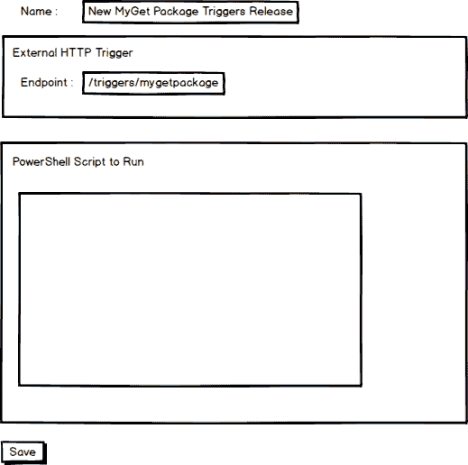
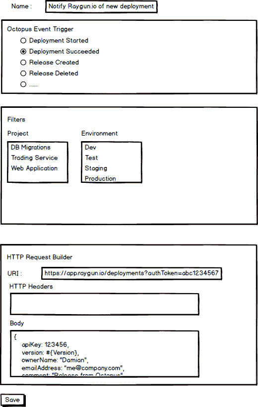
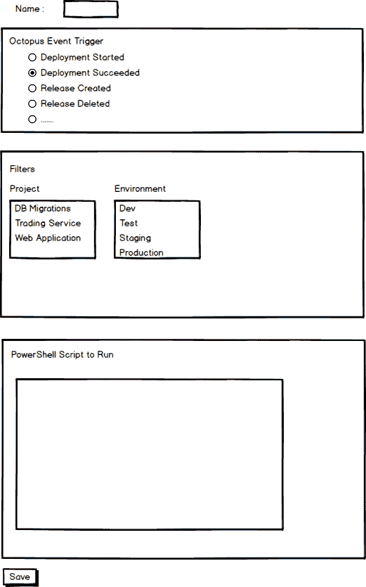

# RFC: Octopus 反应-集成工具包- Octopus 部署

> 原文：<https://octopus.com/blog/rcf-octopus-reactions-integration-toolkit>

最近在 Octopus 总部，我们一直在研究如何更好地与 DevOps 生态系统中的其他工具集成。

我们已经花了一些时间来研究类似领域中存在的其他工具，人们使用 Octopus Deploy 的情况，以及我们的客户已经在哪里编写与他们现有工具的集成。

对于如何最好地支持目前有点棘手的各种工具和产品，我们已经有了一些想法，以及做一些人们已经在做的事情的更好的方法。我们已经为 Octopus 开发了一些特性，这些特性将实现更多更好的集成，以及对您可能想要使用的一些定制流程的更好支持。

## 介绍章鱼反应

我们为 Octopus 提出了一个新功能，我们现在称之为反应。它将允许您获取内部和外部事件(触发器),并将它们映射到一些自定义操作，或者以 PowerShell 脚本的形式，或者以传出 HTTP 请求的形式。

### 触发器和操作

有两种类型的事件触发器可用于反应。内部事件，如部署成功或失败、创建发布、注册触手或更新部署流程。我们也有外部事件，比如一个新的包在一个外部包存储库中可用，它可以作为 HTTP webhook 请求接收。

在内部或外部触发的情况下，我们可以启动一个操作。

例如，我们可能想要将我们的工件存储库中的外部 HTTP 触发器映射到一个 PowerShell 脚本来创建一个新的版本。

我们在内部的 NuGet 资源库中为包创建了自动发布，但是我们从来没有支持过外部的资源库，比如 MyGet，因为轮询这些服务不会让我们成为一个好公民。

这个特性允许我们用一个 webhook 触发器来实现它。当 Octopus 以它期望的模式收到 HTTP 请求时，它将触发一个脚本，该脚本可以查询您的包存储库以构建一些发布说明，然后创建一个发布。

另一个例子可能是使用 Octopus 事件，比如部署开始和结束，通过它们的 HTTP API 通知外部监控系统。在这种情况下，我们将一个内部触发器映射到一个传出的 HTTP 请求。

## 这可能看起来像什么

添加新的反应就是选择触发器，添加过滤器(在一些内部事件的情况下)，然后创建相应的动作。

### 具有 PowerShell 操作的外部触发器

外部触发器将通过定义一个端点来创建，就像您定义 ASP.NET 路由的方式一样。例如，您可能希望对 MyGet 中可用的新包做出反应，因此您可以定义/triggers/mygetpackage 的端点(即 https://octopus.yourcompany.com/triggers/mygetpackage)并在 [MyGet](http://docs.myget.org/docs/reference/webhooks) 中进行配置。

对于身份验证，我们可能需要在查询字符串或 HTTP 头中传递 API 密钥。

大多数发送 HTTP WebHook 的产品都将 JSON 有效负载作为请求的主体。我们将把它反序列化为 PowerShell 对象，并把它以及任何查询字符串参数传递给 PowerShell 脚本。这个脚本也有一个可用的引导 API 客户端，因此您可以使用 Octopus API 来创建发布。

### 内部事件和传出 HTTP 操作

我们看到人们编写步骤模板的一个常见场景是通知监控或分析系统，如 [New Relic](http://newrelic.com/) 、 [AppDynamics](http://www.appdynamics.com/) 或 [Raygun](https://raygun.io/) 部署正在开始和结束。通过与这些系统集成，我们可以在部署期间放宽警报阈值，并标记版本以供以后进行性能关联。

为了创建它，我们将选择内部事件(部署开始，然后部署成功)，应用过滤器来选择我们感兴趣的项目和环境(例如生产中的核心 Web 应用程序)，然后通过指定 URI、头和主体来定义 HTTP 请求。

为了构建 HTTP 请求，我们将包含标准的 Octopus Deploy 文本模板特性，以包含像发布版本和其他相关变量这样的变量。

### 内部事件和 PowerShell 操作

这里我想到了几种类型的场景。第一个可能与前一个类似，但是第三方集成比简单的 HTTP 请求更复杂，我们可以使用 PowerShell 与产品更紧密地集成(也许有我们需要使用的 API DLL)。第二种类型是我们希望在完成其他操作的基础上开始的内部 Octopus 操作。一个例子可能是触发部署的新触手注册(场景[我们已经讨论过自动执行](https://octopus.com/blog/rfc-cloud-and-infrastructure-automation-support)，但是这可能是一种更细粒度的实现方式)。另一个例子可能是，如果一个依赖组件发布了一个新版本，那么创建并部署一个新版本的项目。

在这些情况下，PowerShell 脚本将使用 API 客户端以及基于事件的任何相关变量(项目 ID、发布 ID、部署 ID、机器 ID 等)进行引导。

### 外部事件和传出 HTTP 操作

这个场景实际上没有意义，所以我们很可能不会支持它。Octopus 将只是充当一个直通 HTTP 代理，并且可能有更好的方法来实现这将打开的任何场景。

## 有些事情我们还在考虑

这里我们仍然需要解决几个问题，首先想到的是权限。

## 让它更简单

我们认为这些特性为扩展 Octopus 部署提供了大量的能力和可能性。这里的风险是，创建和管理你所有的反应会变得有点麻烦。我们可能会做的是预先构建许多第三方集成，并允许您选择它们，添加任何帐户特定的东西(API 令牌等)，并为您配置它们。

## 轮到你了

这些功能听起来像是你会使用的吗？我们遗漏了什么情况吗？让我们知道你的想法。