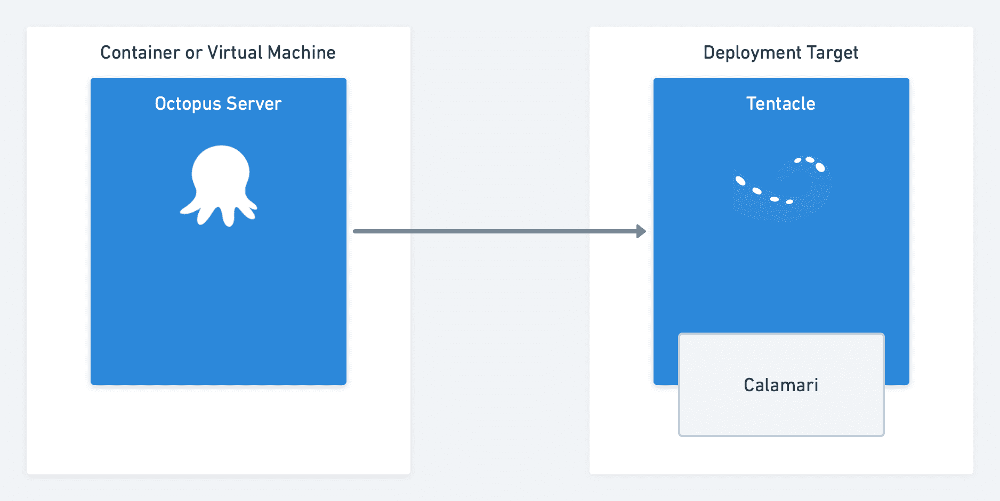

# 重构章鱼:模块化、鱿鱼和生鱼片-章鱼部署

> 原文：<https://octopus.com/blog/refactoring-octopus-modularity>

2012 年，我们发布了 Octopus Deploy 1.0，近八年过去了，该产品的受欢迎程度和功能仍在继续增长。作为这一旅程的一部分，代码库经历了一些重大的变化，包括重大的检修和重写。这篇文章是一个新博客系列的第一篇，在这里我们将分享我们在这种增长中遇到的一些问题，以及我们如何重构 Octopus 代码库以简化它并使它更容易更改。

在这篇文章中，我解释了我们如何引入模块化来降低 Octopus 与外部服务和工具集成的复杂性。

## 章鱼、触手和鱿鱼

Octopus 总是让网站和服务的发布变得很容易，但是驱动部署执行的编程逻辑已经改变了很多年。

在 Octopus 1.x 和 2.x 中，部署执行逻辑位于触手内部。Octopus Server 完成了主要的协调工作，但是部署是在部署目标上运行的触手代理中直接执行的。如果我们发布了新版本的 Octopus 服务器或者对部署执行逻辑进行了更新，我们必须发布新版本的触手。它们紧密耦合，必须保持同步。

在 Octopus 3.0 中，我们引入了鱿鱼，我们认为这是章鱼的小切片。这个新组件是一个独立的部署执行引擎，我们设想为不同的目的和技术创建多个独立的 calamari 片。触手得到了简化，它变成了一个与 Octopus 服务器通信并安全传输部署数据的简单管道。部署工作被委托给卡拉马里人。随着时间的推移，Calamari 已经成长为一个庞然大物，我们从未像预期的那样创建多个版本，只有标准的 Calamari 版本和 Calamari 云版本。

触手和卡拉马里在这方面做得非常好，他们已经帮助我们的客户执行了数千万次部署。

然而，这并非没有挑战。如果我们想要添加一个新的技术集成，它需要开发人员对 Octopus 代码库中从前端到服务器端代码和 Calamari 的众多接触点有深入的了解。虽然这很有效，但它会减慢我们的速度，并增加创造新功能的摩擦。

## 介绍鱿鱼口味

我们的第一步是按照我们最初的打算，将鱿鱼分成我们称之为*口味*的小块。这种划分是在步骤类别之间进行的(例如 AWS、Terraform、K8)。每种风格都是一个独立的可执行文件，这允许我们改变每种风格的目标平台(Windows、macOS、Linux 和 ARM)以及运行时(例如。网芯 3.1)。这种清晰的分离允许我们快速迭代并专注于特定的技术，而不必将所有其他事情放在心上。

鱿鱼口味有几个优点:

*   每个部分都是独立的，可以根据项目的需要独立升级和定制。
*   我们可以将 Azure 云服务等旧技术分离出来，并保持它们的稳定，同时专注于其他优先事项。

## 介绍生鱼片

随着对鱿鱼的重新思考，我们也开始将章鱼服务器切成我们称之为生鱼片的小块。类似于卡拉马里，这些切片将沿着部署步骤技术路线。这些片段最终将包含步骤的 UI 和服务器端部分、部署目标和帐户。

这是一个巨大的进步，使我们能够使 Octopus 服务器(前端和 web 服务)成为世界级的协调引擎，而不需要任何特定的知识或特定技术步骤的挂钩。例如，我们可以支持 Azure、AWS 或 Terraform，而无需服务器具备这些技术的任何特定知识或参考。

对于生鱼片，我们的目标是简化添加新技术和服务支持所需的开发工作。换句话说，我们团队中的开发人员可以独立于 Octopus 编写代码来添加支持，grok 它，并独立测试它，而不必了解 Octopus 服务器中的所有接触点。结果是集成速度更快，麻烦更少。例如，我们可以在很短的时间内通过遵循 Terraform 创建的模式来引入 Pulumi 支持。它还为第三方在 Octopus 中添加对其技术的支持提供了可能性，而且开销很小。

### 生鱼片和避免重复

每个生鱼片都包含在一个 NuGet ( `.nupkg`)包装中，其中包含:

*   我们注入到主用户界面的压缩 UI 文件。
*   服务器端处理组件。
*   任何第三方库或组件(依赖关系)。
*   每个平台的独立 Calamari 可执行文件。

这种方法引入了一个有趣的问题，这个问题以前阻碍了我们的发展。因为每个 Calamari 可执行文件都包含完整的。NET 核心运行时，Octopus 服务器安装程序的大小将显著增加。例如，如果我们在三个平台上各有 10 种鱿鱼口味，那么压缩后会产生 30 个鱿鱼组件，每个 40 MB。安装程序下载额外增加了 1.2 GB，这并不理想。

### 生鱼片和鱿鱼合并

为了解决这个问题，我们从 [Windows 映像格式](https://en.wikipedia.org/wiki/Windows_Imaging_Format)文件格式中取出一页，并使用了[单实例存储](https://en.wikipedia.org/wiki/Single-instance_storage)技术。在构建时，我们查看所有的 Calamari 包，并对每个文件进行哈希处理。然后，我们只将唯一的文件存储在最终的归档文件中，这个归档文件的大小只有 150MB 左右，不管有多少种不同口味的鱿鱼。在运行时，我们使用包含的索引文件来重建原始的 Calamari 可执行文件。

## 结论

有了鱿鱼和生鱼片，我们正在实现小章鱼片和真正模块化的目标。这种方法带来了许多好处，其中最突出的是更简单的代码库，使我们更容易添加新的集成。

我们仍处于这一转变过程中，但它已经证明了自己的价值。这是最好的重构。我们正在改进代码库的设计，它应该对我们的客户透明。