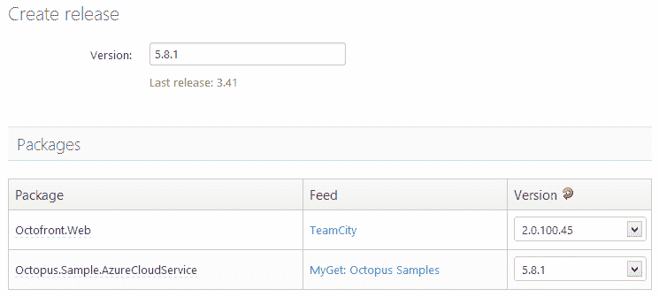
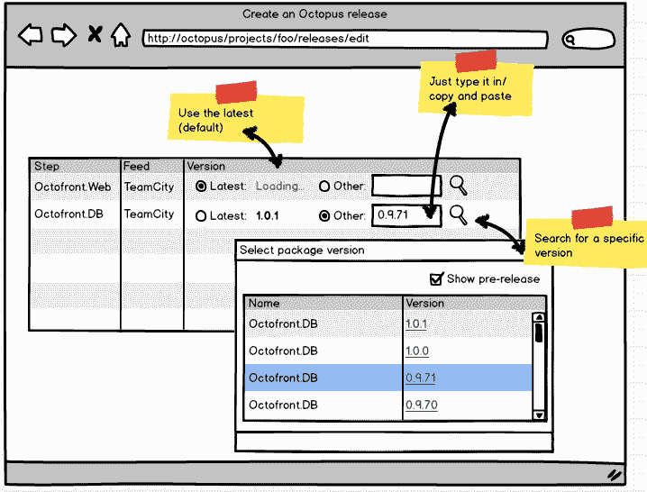

# RFC:改进创建发布屏幕- Octopus Deploy

> 原文：<https://octopus.com/blog/release-creation-screen>

在 Octopus 中，一次发布可以包含许多包。例如，您的披萨订购网站的**版本 1.3** 可能包含以下软件包:

*   披萨店。在线订购，版本 1.4.1
*   披萨店。CMS，版本 1.3.2
*   披萨店。数据库，版本 1.1.71

对于许多客户来说，一个版本包含一个包。对于其他人来说，一个版本包含 20 多个包。

Octopus 中有一个页面我们在 Octopus 中遇到了问题，那就是发布创建界面，在这里选择一个发布的包版本。目前看起来是这样的:

随着时间的推移，我们改进了这个页面上的 UX，这样，对于大多数人来说，他们只需向下滚动并单击“创建”-我们选择每个包的最新版本，并以最高的包版本命名发布号。大多数人从来不改变这个页面上的任何东西。

该页面存在一些问题:

*   如果 NuGet feed 很慢或者有太多的包，那么用所有的包版本填充下拉列表会花费很长时间( [bug 报告](http://help.octopusdeploy.com/discussions/problems/3560-create-release-screen))
*   如果你已经知道要选择的版本号，你必须为每个包滚动一个长长的列表

为了尝试解决这些问题，同时保持当前设计的优点，我们正在考虑以下方法:

我们不会加载每个包的所有版本，而是异步获取最新的版本，这意味着 NuGet 查询会更快。我们还允许输入版本号，而不是从下拉列表中选择。如果您不确定要键入什么，单击 search 按钮将进行另一个查询，以获取软件包版本供您选择(我们甚至可以尝试在此显示中包含发行说明)。

和当前的设计一样，我们将默认使用最新的版本，这样在大多数情况下你就不需要点击任何东西。如果您确实需要选择特定的版本，希望这种方法会使它变得更容易，如果您知道的话，您只需键入/粘贴号码，如果不知道的话，您可以搜索它。