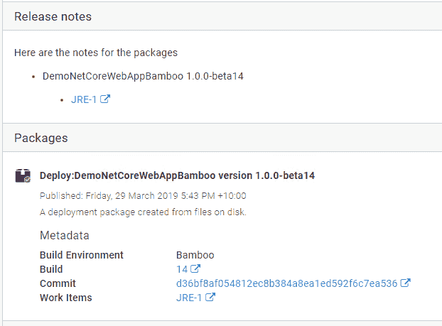

# 带有模板和自动生成的更好的发行说明- Octopus 部署

> 原文：<https://octopus.com/blog/release-notes-templates>

这篇文章是继我们的 **Octopus Deploy 2019.4** 关于[从代码到部署](/blog/metadata-and-work-items)跟踪你的工作的公告之后的。

跟踪的一个重要部分是可见性和可追溯性，我们已经在上一篇文章中看到了吉拉集成如何对此有所帮助。在这篇文章中，我们将看看另一个新特性，[发布说明模板和自动发布说明生成](https://octopus.com/docs/packaging-applications/build-servers/build-information)。

这是来自吉拉集成的一个特性，但是不依赖于那个集成，它本身可以使管理你的发布说明更简单。因此，如果你正在管理 Octopus 中的发行说明，请继续阅读。

## 发行变更和发行说明模板

在我们开发吉拉集成的过程中，很明显，从我们现在可以访问的新的包元数据中获得的发布和部署本身也有真正的价值。

考虑到这一点，我们开始在部署中添加新的变量，以访问发布版本的变化。我们做的第一件事是使用它来创建电子邮件步骤，并使用变量来创建电子邮件的 HTML。

这太棒了。感觉真的很有用。但是输出只有在您收到电子邮件时才有用。那么在 Octopus 门户中，在那里看到这些信息不是很好吗？是的，它会，所以我们这样做了。

在第一次迭代中，我们将其呈现在固定的只读控件中。这很棒，感觉真的很有用，但它是只读的。它适合人们会想到的所有用例吗？

历史告诉我们没有😃所以我们反复强调“我们如何允许定制发布说明的布局？”结果是发行说明模板。

发行说明模板在项目设置中定义，示例可能如下所示:

```
Here are the notes for the packages
#{each package in Octopus.Release.Package}
- #{package.PackageId} #{package.Version}
#{each workItem in package.WorkItems}
    - [#{workItem.Description}](#{workItem.LinkUrl})
#{/each}
#{/each} 
```

您可以使用任何有效的降价，就像您一直能够使用发行说明一样，但是现在变量替换作为发行创建的一部分被应用，所以您将立即在门户中看到它。

[](#)

另请注意，如果您编辑一个版本，您将会看到创建时产生的文本，而不是原始的模板内容。您可以在编辑中使用变量绑定，它们将在保存时应用。

## 部署变量

正如我们上面提到的，部署已经扩展到包括“发布变更”关于这一点很重要的一点是**部署总是将来自**发布的发布说明聚集到发布变更中，即使没有元数据和工作项。换句话说，**即使您没有使用任何其他的包元数据和工作项功能，您仍然可以在部署期间利用累积的发行说明**。

对于与部署相关的每个发布，发布变更包括一个版本(发布版本)、发布说明(以 markdown 格式)和一个工作项列表。

就像我们前面的例子一样，这个信息的一个常见用途是在电子邮件步骤中。下面是一个示例电子邮件模板，包括一个返回到该版本的链接，以及从 markdown 重新格式化为 HTML 的版本说明:

```
<p>Here are the notes customized for email</p>
#{each change in Octopus.Deployment.Changes}
<strong><a href="(#{Octopus.Web.ServerUri}#{Octopus.Web.ReleaseLink}">#{change.Version}</a></strong></br>
#{change.ReleaseNotes | MarkdownToHtml}</br>
#{/each} 
```

## 包裹

我们收到了许多对发行说明增强的请求，我们真的很兴奋最终能发布它。如果你正在使用或渴望使用 Octopus 的发行说明，请尝试一下，并告诉我们你的想法。