# 远程发布促销 RFC - Octopus 部署

> 原文：<https://octopus.com/blog/remote-release-promotions-rfc>

这篇文章是作为我们当时正在开发的一个功能的评论请求而写的。但是，该功能尚未开发，在 Octopus Deploy 中不可用。关于 Octopus 中可用功能的高级概述，请访问我们的[功能页面](https://octopus.com/features)。

我们目前正在设计一个功能，我们称之为*远程发布推广*。

这篇文章是对我们现阶段想法的征求意见。

这篇文章是前两篇文章的后续:

## 问题是

在有些场景中，不同的 Octopus 服务器实例根据要部署到的环境来执行部署是有意义的。例如:

*   Octopus 服务器 1 部署到`Development`和`Test`环境
*   Octopus 服务器 2 部署到`Staging`和`Production`环境

### 电梯推销术

我们正在计划一个功能，使您能够促进跨多个八达通服务器的版本...以一种美好的方式😃如果你今天正在这样做，那么你知道这是可能的...但是不太愉快。

两个最常见的原因是:

*   隔离环境
*   地理位置遥远的环境

### 隔离环境

出于安全目的，许多组织将其生产和开发环境分开。例如，这是实现 [PCI DSS](https://octopus.com/docs/reference/pci-compliance-and-octopus-deploy) 合规性的常见方式。

安全网络甚至可能完全断开(也称为空气间隙)。

[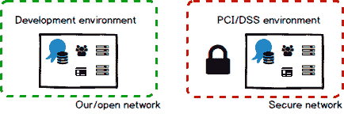](#)

这些组织仍然想要章鱼的所有优点，比如通过环境、整体编排和在仪表板上看到进度来推广同一个版本。但是他们不希望开发 Octopus 服务器连接到生产环境。希望不同的用户(可能来自不同的 Active Directory 域)拥有生产 Octopus 服务器的权限也很常见。

### 地理位置遥远的环境

其他组织可能部署到地理位置较远的环境中。

比如他们的开发环境可能位于[澳大利亚布里斯班](http://www.visitbrisbane.com.au/)(很适合居住的地方！)，而他们的生产环境由美国和欧洲的数据中心托管。

这有两个主要问题，都与性能有关:

1.  包在部署时传输。如果包很大，这可能需要很长时间。
2.  在部署期间，信息必须在 Octopus 服务器和部署目标之间来回传送。这些通信中的高延迟会对部署持续时间产生重大影响。

这些客户希望在他们选择的时间推广该版本，让包自动高效地传输到适当的数据中心，然后尽快执行部署。

[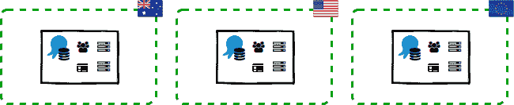](#)

### 其他示例

出于各种其他原因，我们的一些客户决定跨多个 Octopus 服务器管理他们的部署。我们认为我们建议的解决方案还将帮助以下客户:

*   将他们的工作分配给多个团队，可能分布在世界各地
*   使用面向服务(SOA)或微服务架构
*   使用 Octopus 将他们的软件直接部署到客户的网络中
*   取决于所有这些例子的组合

[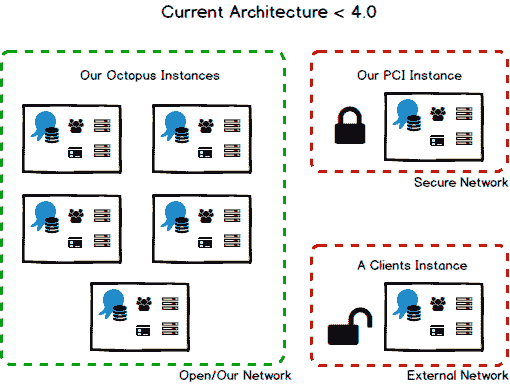](#)

## 拟议解决方案

我们建议的解决方案将使您能够**将您的整个部署管道分布到多个空间**，允许您**将发布提升到其他空间**，并且**将部署结果再次流回**以显示在仪表板上。

想象一下，如果您可以将一个空间添加到您的生命周期中，就像您可以添加环境一样，然后将一个版本升级到另一个空间。当您向另一个空间推广一个版本时，Octopus 可以将部署该版本所需的一切打包到另一个空间的环境中。我们还会考虑到空间之间有严格分隔的情况(想想 PCI DSS)。这就是为什么我们称这个功能为**远程发布促销**。

[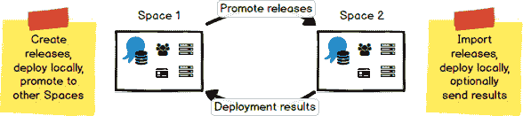](#)

我们认为有三个主要的概念在发挥作用，使所有这些走到一起:**空间**、**信任**和**生命周期**。

### 间隔

一个**空间**是我们在之前的[RFC](https://octopus.com/blog/odcm-rfc)中引入的概念。每个空间都有自己的一套项目、环境、生命周期、团队、权限等。

[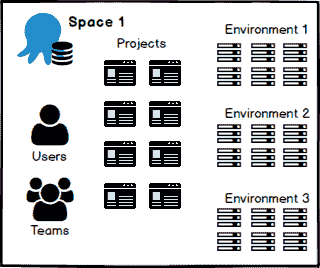](#)

稍后我们将更多地讨论[配置空间](#configuring-spaces)，但同时我们要明确:我们将支持**可以**相互通信的空间，以及**不能**相互通信的空间。

#### 连通空间

如果您对您的交流空间感到满意，那么我们将致力于提供超级流畅的体验。将发布升级到一个远程空间就像按一个按钮(或者点击 API)一样简单。同样，您可以让部署结果自动流回，以便您的仪表板总是最新的。

#### 不连续的空间

我们还将支持隔离空间，因为这是一个常见的安全场景。事情必然会更加手动；你可能要多打一会儿字(甚至可能还要走一会儿路！).

### 信任其他空间

我们已经有了在[章鱼服务器和触手](https://octopus.com/docs/security/octopus-tentacle-communication)之间建立信任的概念:它只会执行从可信的章鱼服务器发出的命令。我们还认为，在两个空间开始共享*部署一个版本*所需的一切和*部署一个版本*的结果之前，在它们之间建立信任关系是很重要的。在我们最近介绍空间概念和章鱼数据中心经理(ODCM)的博文中，我们谈到了[分享](/blog/odcm-rfc#sharing)。

这种关系的核心将包括一个*名称*和一个*证书*。这将使每个空间能够唯一地识别信息的来源，并验证信息的完整性，就像[章鱼服务器和触手今天所做的](https://octopus.com/docs/security/octopus-tentacle-communication)。我们认为配置这种关系的最佳方式是使用 ODCM，因为它的核心能力是管理空间。

[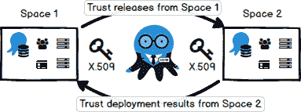](#)

这意味着您可以控制不同空间之间的信息流，并且可以在一个地方对其进行审计。

### 生活过程

我们认为生命周期应该在一个空间内*定义*，并且能够在多个空间内*组合*——你可以把它想象成把不同空间的生命周期链接在一起。

**在一个空间内定义:**这使每个空间中的团队能够以他们认为合适的方式管理他们自己的环境和生命周期。例如，一个空间的成员可能决定将一个环境引入他们的生命周期。我们不希望将环境引入一个空间的生命周期的决定对任何其他空间产生任何影响。

**跨空间组合:**这使您能够将整个部署管道建模为一个**复合生命周期**，它是通过将不同空间中定义的生命周期连接在一起而形成的。例如:

1.  您可能希望通过您的测试环境来提升一个版本，然后将该版本提升到一个不同的空间来管理您的生产环境。

    [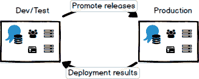](#)

2.  您可能做同样的事情，但是在不同的地理位置托管您的生产环境。

    [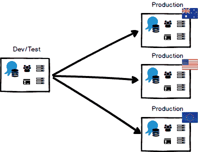](#)

3.  您可能想要通过您的开发团队的测试环境来提升一个版本，然后将该版本提升到由 QA 团队管理的另一个空间。当他们完成测试时，您希望开发团队将同一个版本提升到另一个空间，在那里运营团队管理您的生产环境。

    [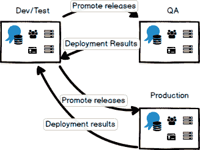](#)

4.  您可能想做同样的事情，但是一旦 QA 团队完成了，他们就直接将发布提升到操作团队的空间，而不通过开发团队返回。

    [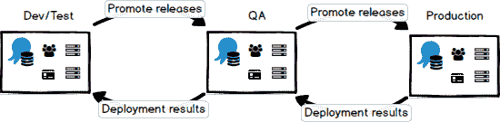](#)

## 定义

在 RFC 的剩余部分，我们将引入一些新的术语。让我们在这里定义它们，这样我们就不会被弄得非常混乱。

*   **空间:**包含一组项目、环境、变量、团队、权限等，由单个 Octopus 数据库限定。在我们最近的 [RFC](/blog/odcm-rfc) 中了解更多信息。
*   **发布包:**一个包，包含了部署一个项目的特定发布所需的一切。
*   **部署收据:**包含显示项目特定版本部署结果所需的所有内容的文档。
*   **Source Space:** 拥有项目及其发布的空间，如果您决定跨越空间边界，那么在这里创建发布包。
*   **目标空间:**发布包将被导入的空间。然后，可以将该版本部署到这一领域的环境中。
*   **远程环境:**对另一个空间所拥有的环境的引用。
*   **远程项目:**对另一个空间拥有的项目的引用。
*   **远程空间:**由不同的 ODCM 管理的空间的引用，通常在不同的网络中。一个**远程空间**的概念将使你能够跨越安全的网络边界来促进发布。
*   **可变模板:**我们在多租户部署中引入了这个概念。在这种情况下，您可以表达为每个可以部署项目的环境都需要一个变量值。

## 一次漫游

让我们使用我们之前提到的**隔离环境**例子来探索这个概念，在这个例子中，您希望在开发和生产环境之间进行严格的隔离。在这种情况下，我们将使用两个空间来模拟这种分离:

*   为了开发和测试目的而部署应用程序的地方
*   `Prod Space`:您的应用程序的生产部署将被部署，并且需要严格的合规性控制

[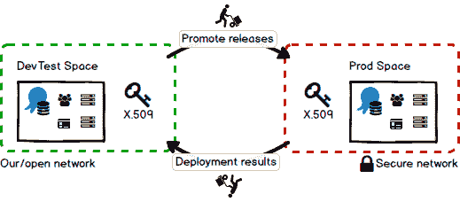](#)

让我们考虑一下你的组织中的每个不同的人可能如何与 Octopus 交互，以促进跨这两个空间的发布，一直到生产。

### 配置空间之间的信任

> TL；DR 使用 ODCM 来配置空间之间的关系。

一个好的起点是配置您的共享空间，并在它们之间建立信任关系。在类似分离环境的情况下，我们认为您最终会在每个网络中安装一个 ODCM 实例。这将允许您的团队独立管理每个网络中的空间，并根据需要在同一网络或不同网络中的空间之间配置信任。

我们认为整个过程会是这样的:

1.  在每个网络中配置一个 ODCM 实例，用于管理该网络中的空间
2.  使用**生产网络**中的 ODCM 创建`Prod Space`
3.  在**开发网络**中使用 ODCM 创建`DevTest Space`
4.  在每个网络中使用 ODCM 来配置您的共享空间之间的信任关系

在连接的场景中，这将是管理空间的单个 ODCM 实例，证书交换自动发生。

然而，在我们的隔离场景中，网络之间有严格的隔离，因此您必须配置两个**远程空间**来手动相互信任，方法是为每个空间交换证书:

1.  使用您的**开发网络**中的 ODCM 为`DevTest Space`下载证书。
2.  去你的**生产网络**中的 ODCM，创建一个新的**远程空间**名为`DevTest Space`，给它你为`DevTest Space`下载的证书。
3.  在您的**生产网络**中使用 ODCM，并下载`Prod Space`的证书。
4.  到你的**开发网络**中的 ODCM，创建一个新的**远程空间**，名为`Prod Space`，给它你为`Prod Space`下载的证书。

[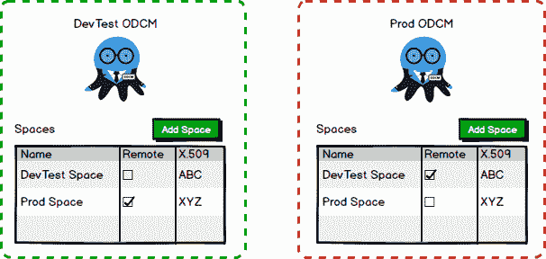【](#)

现在，您已经配置了共享空间并交换了公钥，您可以:

*   在`DevTest Space`中配置您的生命周期，以将版本升级到`Prod Space`
*   将`Prod Space`配置为信任从`DevTest Space`升级的版本
*   配置`DevTest Space`以信任来自`Prod Space`的部署结果

你将完全控制空间之间的信任(以及信息流)。

### 使用项目

> TL；博士没什么太大的变化——一切都会觉得很熟悉。

我们看不到太多变化——生活将和以前一样。作为维护项目的人，您仍然能够像平常一样更改部署过程、管理变量、创建发布并将其部署到`DevTest Space`环境中。然而，这引发了一些问题:

*   当部署到`Production`环境时，如何提供将被使用的变量值？
*   如何配置部署过程的特殊步骤，以便它们只在部署到`Production`环境时执行？
*   您如何在仪表板上显示部署到`Production`环境的结果？

有请**可变模板**和**远程环境**！

#### 可变模板

> TL；我们将扩展变量模板，以支持每个环境的变量值。

想象一下，如果您是将一个发布包导入到您的空间中的人——您将需要知道您的空间中的每个环境需要哪些变量的值。

现在想象一下，作为一个项目贡献者，如果您可以表达一个变量值对于一个项目可以部署到的每个环境都是必需的。想象一下，您可以为变量定义一个数据类型，提供帮助文本，决定该值是强制的还是可选的，甚至提供一个默认值。

可变模板将使人们更容易将一个发布包导入到他们的空间中来“填补空白”。

即使你只是在你自己的空间里推广发布，这也是非常方便的。使用变量模板，如果你把一个新的环境引入你自己的空间，Octopus 会提示你输入那些变量值。

我们在 Octopus 3.4 中为多租户部署引入了[可变模板](https://octopus.com/docs/projects/variables/variable-templates)的概念。作为这组特性的一部分，我们将进一步构建这个概念。

[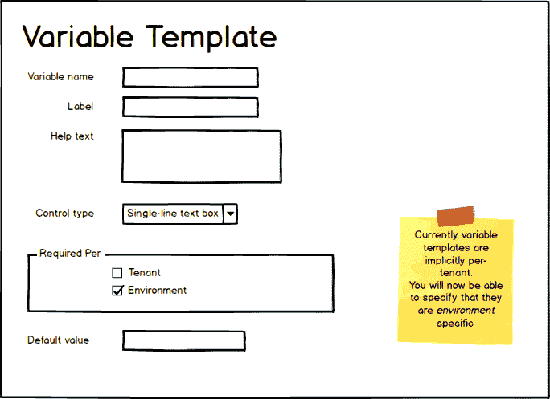](#)

*注意*:这也将允许租户变量根据环境而变化(这是[非常需要的特性](https://github.com/OctopusDeploy/Issues/issues/2710))。

#### 远程环境

> TL；DR 您将能够将部署步骤和变量值扩展到其他空间拥有的环境，并在仪表板上显示这些环境。

我们希望能够实现这样的场景，您可以将发布提升到其他空间，而无需了解该空间中的任何环境。但是，我们可以看到您想要了解其他空间环境的场景:

*   您希望在将发布部署到`Production`环境时执行某些步骤
*   您已经知道了在将一个版本部署到`Production`环境时所需的一些变量值(也许它们不是秘密)
*   您希望在自己的仪表板上看到将发布部署到`Production`环境的结果

这里的问题是，`Production`环境归`Prod Space`所有，所以你的`DevTest Space`不知道`Production`环境的存在！想象一下，如果你能给`DevTest Space`添加一个**远程环境**。这个远程环境将是真实`Production`环境的占位符。Octopus 甚至可以将其命名为`Prod Space: Production`,因此我们都清楚这个环境的所有权。*把这个想象成名称空间:你可以在多个空间中拥有一个`Production`环境。*

我们认为这个过程应该是这样的:

1.  转到环境页面并点击`Add environment`按钮
2.  Octopus 可以显示它知道的空间列表，在这个例子中是`Prod Space`
3.  选择`Prod Space`(表示这是一个远程环境)
4.  选择或命名环境`Production`

现在您已经配置了`Prod Space: Production`环境:

*   您可以将步骤的范围扩大到`Prod Space: Production`，当一个版本最终被部署到那个环境中时，这些步骤将会运行。
*   您可以在您的`DevTest Space`中设置变量值，将它们限定在`Prod Space: Production`的范围内，当一个版本最终被部署到那个环境中时，它们将被使用。

### 配置包含其他空间的生命周期

> TL；DR 其他空间和远程环境可以添加到生命周期中。

为了将一个发布升级到`Production`环境，您将需要配置一个能够针对`Prod Space`的生命周期。我们认为您应该能够将空间添加到生命周期的各个阶段，就像您现在可以在 Octopus 中添加环境一样。对于我们的示例场景来说，这将很好地工作，在这个场景中，您只想将发布升级到`Prod Space`。

如果你想创建一个更复杂的生命周期呢？例如，在将发布升级到`Prod Space`之前，您将发布升级到`QA Space`供 QA 团队测试。我们认为你应该能够将**远程环境**添加到你的生命周期中，让章鱼表现得就像那个环境是同一个空间的一部分一样。

[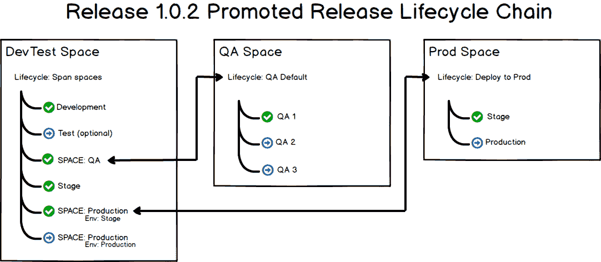](#)

#### 仪表板和远程环境

> TL；灾难恢复远程环境可以显示在仪表板上。

通过将**远程环境**添加到您的生命周期中，Octopus 会将该环境添加到您的仪表盘中。我们计划让你的部署结果流回源空间。这意味着您可以看到整个部署管道中的部署摘要，即使它跨越了多个空间界限。

[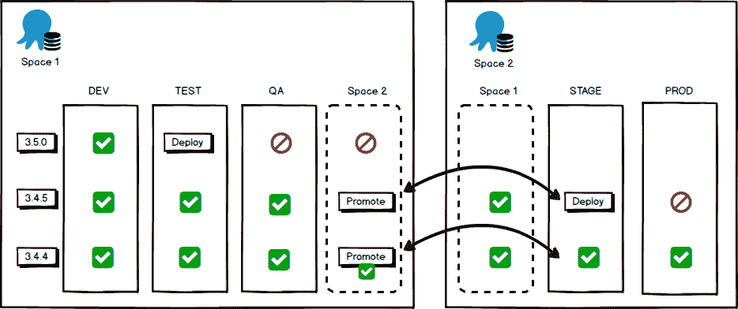](#)

最终您想要将一个发布部署到`Production`环境中！既然您已经将`Prod Space`添加到您的生命周期中，那么现在您可以将您的发布升级到`Prod Space`。此时，Octopus 将创建一个我们称之为**的发布包**:一组文件，包括将该发布部署到其他空间所拥有的环境中所需的一切。

在我们的例子中，有人必须手动将发布包转移到`Prod Space`并导入它。如果你的空间是连通的，Octopus 可以为你自动完成这个过程。

#### 发布捆绑包

> TL；DR 包含将一个版本部署到另一个空间所拥有的环境中所需的一切。敏感部分被加密，包被签名以验证完整性和信任。

我们仍在研究发行包的细节，欢迎您的反馈。

本质上，发布包将包含向远程空间发布所需的一切。这将包括:

*   发布详细信息:版本、注释、渠道
*   部署流程
*   变量
*   包裹清单

发布包将*不*包含包本身，而是包含发布所需的包的清单，包括 ID、版本和散列。这将使得能够以最有效的方式(可能使用增量压缩)将包转移或复制到其他空间，或者使得能够使用外部包馈送。这也将使*目标空间*能够验证被部署的包的身份和完整性——它们保证是被测试的包。

发布包将包含以前空间中已完成部署的摘要，允许它们选择性地显示在远程空间的仪表板上。

当构建发布包时，*源空间*将使用*目标空间*的证书加密任何敏感信息，因此它只能由*目标空间*解密。它还将使用*源空间*的私钥对包进行数字签名，因此*目标空间*可以在导入包之前验证包的来源和完整性。

发布包将有一个模式版本。包可以在具有兼容模式版本的空间之间转移。我们的希望是，发布包模式版本的更改频率将远低于 Octopus 服务器版本，允许一系列 Octopus 服务器版本之间的兼容性。

### 将版本导入您的共享空间

> TL；DR 导入远程项目、发布、流程和变量快照。在导入时，您将选择发布的生命周期。

一旦**发布包**对`Prod Space`可用，你将需要导入它。将会有许多细节需要解决，但是在最高级别上，我们期望该过程看起来像这样:

1.  您将看到一个准备导入的**发布包**列表，您选择导入一个。
2.  然后，您将看到一个显示，包括发布所需的包、捆绑变量值、变量模板和部署过程。
3.  该项目将作为**远程项目**导入。与**远程环境**类似，您的项目将像`DevTest Space: My Project`一样命名。我们还认为**远程项目**在很大程度上应该是只读的，并且可能会使用与普通项目完全不同的 UI。
4.  发布本身将与创建发布时冻结的部署流程快照和变量快照一起导入。
5.  您将需要选择您想要通过`Prod Space`中的环境来推广这个版本的生命周期。如果您的项目只使用一个生命周期，它可以被自动选择。
6.  Octopus 将提示您在部署该版本之前为您的环境和租户设置任何缺失的变量值。

[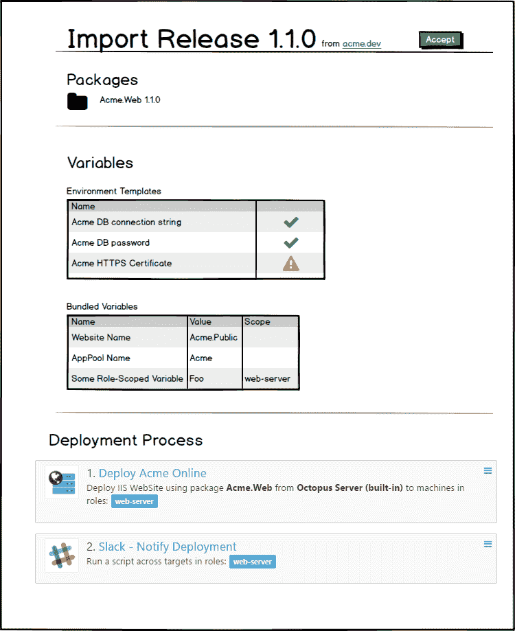](#)

#### 导入的内容将是只读的

> TL；其他空间拥有的东西通常是只读的。

我们认为值得一提的是:几乎所有将要导入的内容都是只读的，一些概念不会跨越空间界限进行传输。最终目标是将一个版本可靠地部署到您的环境中，尽可能避免人工参与。仍有许多细节需要整理，但我们认为一个好的经验法则是:

*   用于构建发布的任何内容在远程空间都是只读的
*   用于自定义部署的任何内容都可以在远程空间中编辑

例如，我们预计您将希望部署使用创建版本时的流程(可重复性)，但有机会为您的环境/租户设置正确的数据库连接字符串(可变性)。

以下是我们不打算进口的一些具体例子:

*   **项目触发器**都是关于自动触发部署的——它们应该在部署发生的地方进行配置
*   **租户**是关于分配部署目标和定义部署变量值的——它们应该在部署发生的地方进行配置
*   只有在您创建一个版本的时候，通道才真正重要，并且您将需要在导入时选择一个生命周期——通道应该在创建版本的地方进行配置

#### 比较版本

> TL；我们将添加查看特定版本的部署过程和项目变量的能力，并查看两个版本之间的差异。

我们认为这个特性的一个重要部分将是查看和理解部署过程和项目变量的能力，这些变量在创建版本时被冻结在一个快照中。想象一下，试图导入和批准一个发布以进行部署，却看不到将在部署期间使用的流程和变量值？

这实际上是我们很久以前就想解决的一个问题:在今天的 Octopus 中，您可以看到变量 snapshot(如果您能找到正确的链接)，但是您看不到部署过程，因为它是在创建发布时定义的。想象一下，如果您甚至可以并排查看版本，相互比较它们！

[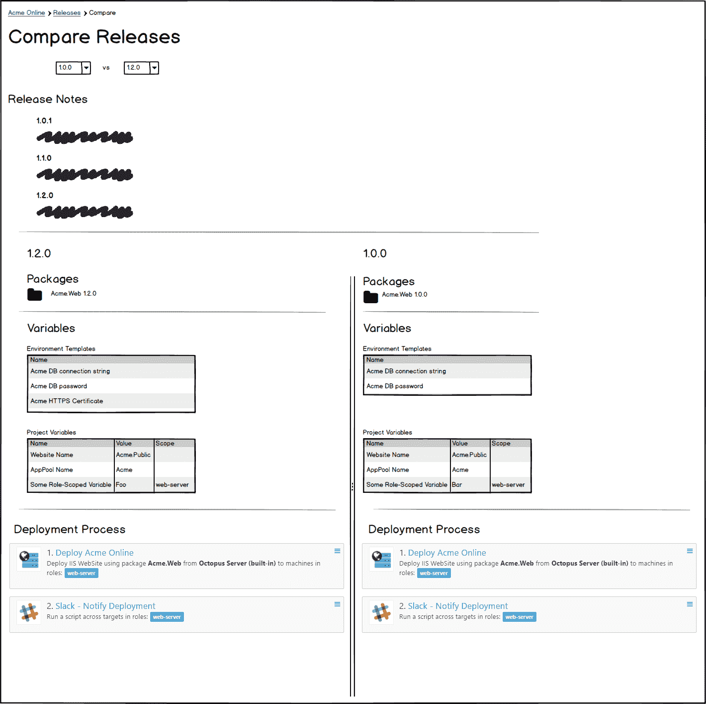](#)

### 部署版本

> TL；DR 您将能够部署该版本，就像它是在这个空间中创建的一样。

现在该版本已经被接受，可以部署到`Prod Space`中的环境中了。对于所有意图和目的，这将像在`Prod Space`中创建版本一样工作:所有相同的规则将适用于部署该版本，包括:

*   **项目权限** -团队可以被限制为**远程项目**，就像普通项目一样-毕竟，它们只是普通项目，但是属于另一个空间
*   **环境权限**-`Prod Space`中的队伍可以被授予`Prod Space`中环境的适当权限，就像平常一样
*   生命周期进展 - Octopus 将确保每个版本在`Prod Space`中通过适当的生命周期，就像平常一样

## 房客

> TL；灾难恢复租户是部署时的问题，不会跨越空间界限。

我们想特别指出租户，因为他们可以像环境一样被对待。此时，我们还不能 100%确定我们将如何处理租户，但我们目前的想法是:

*   租户将归执行部署的空间所有。
*   一个空间中的租户无法连接到另一个空间拥有的环境。

我们很想在这里听到你的想法。请在下面的评论中告诉我们。

## 替代解决方案

此功能旨在取代当前用于迁移或部署到远程机器的方法:

*   章鱼迁移器导入
*   离线丢弃
*   `octo.exe`出口/进口
*   使用 Octopus REST API 的定制解决方案
*   手动迁移所有内容

如果您已经使用了 migrator 或`octo.exe` import/export 来在 Octopus 实例之间移动发布，您就会知道这两种方法都有好处，但是仍然需要大量的脚本或交互来实现您的目的。这两者都将被弃用，并被远程版本升级所取代。对于那些使用源代码控制中的 JSON 文件来检测更改和备份过程的用户，迁移器导出仍然存在。

我们知道有些客户编写了自己的迁移脚本和流程。我们已尝试解决这些解决方案包含在远程发布功能中的所有方法和问题；如果您认为此功能缺少了什么，请告诉我们。我们的目标是您可以使用远程发布促销，而不必维护自己的脚本。

这项功能也将取代离线下降。虽然这可能看起来没有直接的关联，并且您将需要另一端的 Octopus 服务器来捕捉发布包，但是许多关于离线放置的建议和限制是 Octopus 服务器所提供的缺失部分。这些包括基本的编排、输出变量、日志记录和部署状态等等。它将允许您将发布移动到网络边界内的集中 Octopus 服务器，并通过部署到本地触角来利用扩展的编排。

## 参考架构

在一个远程促销的世界中，你将能够使用多个 Octopus 服务器来模拟许多有趣的场景，即使 Octopus 服务器是连接的还是断开的，它们之间也会有释放流。

### 示例:连接的网络

互联架构将考虑多个团队在他们自己的空间中工作，然后将发布推送到在美国本地托管的生产空间，以及在澳大利亚和欧洲的公共云中。所有的空间都由同一个 ODCM 管理，这使得全球管理团队和信托变得很容易。由于所有空间都是相互连接的，因此您可以实现部署的高度自动化，甚至跨多个空间。

【T2 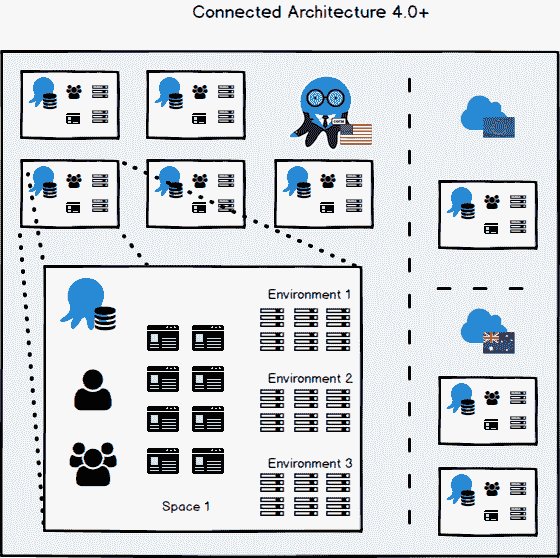

### 示例:断开的网络

不相连的网络有多个团队在各自的空间工作，然后将发布内容推送到托管在其他数据中心的生产空间。这里的重要区别在于，每个数据中心的空间都由各自的 ODCM 管理。您仍然可以获得与连接架构完全相同的最终结果，唯一的缺点是您无法在不连接的空间中实现相同级别的自动化。

[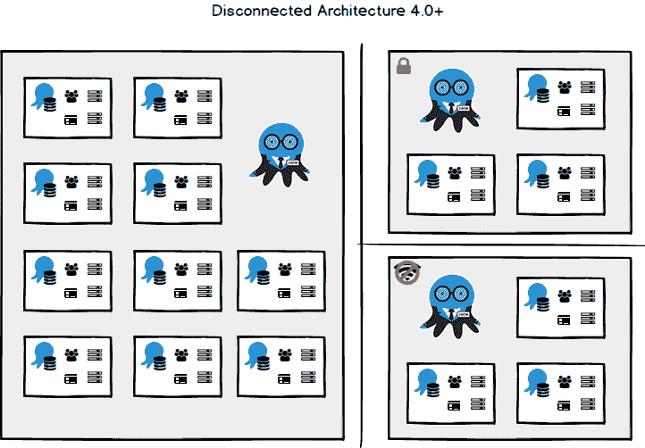](#)

## 反馈

希望你能看出我们在这组特性上花了很多心思。我们试图涵盖我们在与各种客户的关系中遇到的所有场景和细微差别。这里有很多东西需要消化，所以谢谢你坚持到最后。你是王牌。

**我们非常希望收到您的来信！**哪些特征让你产生共鸣，会让你的处境变得更好？也许我们在你的场景中遗漏了一些拼图？

欢迎在下面留下你的评论，或者如果你真的想参与到设计的细节中，请到我们的[规格库](https://github.com/OctopusDeploy/specs)来加入讨论吧！