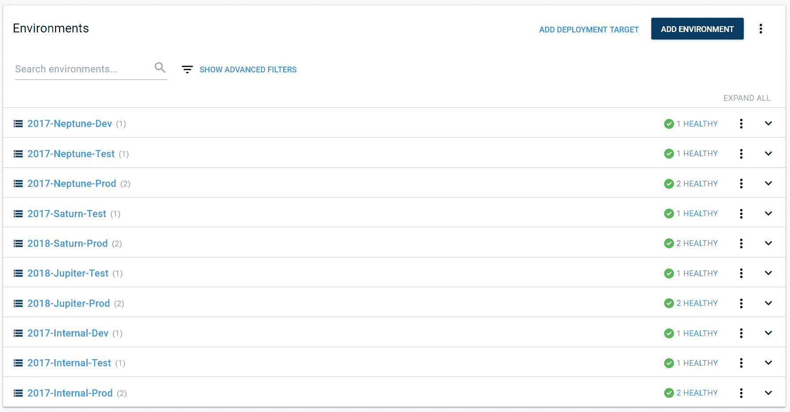
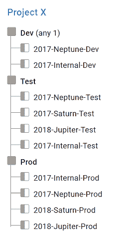
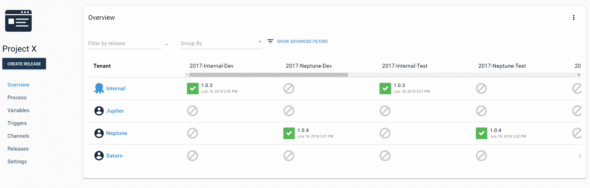
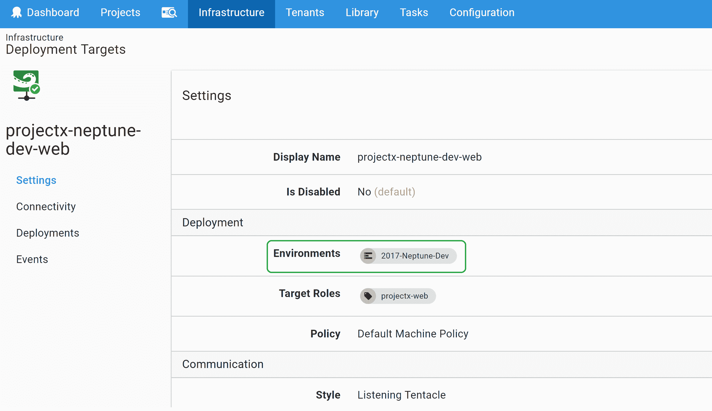
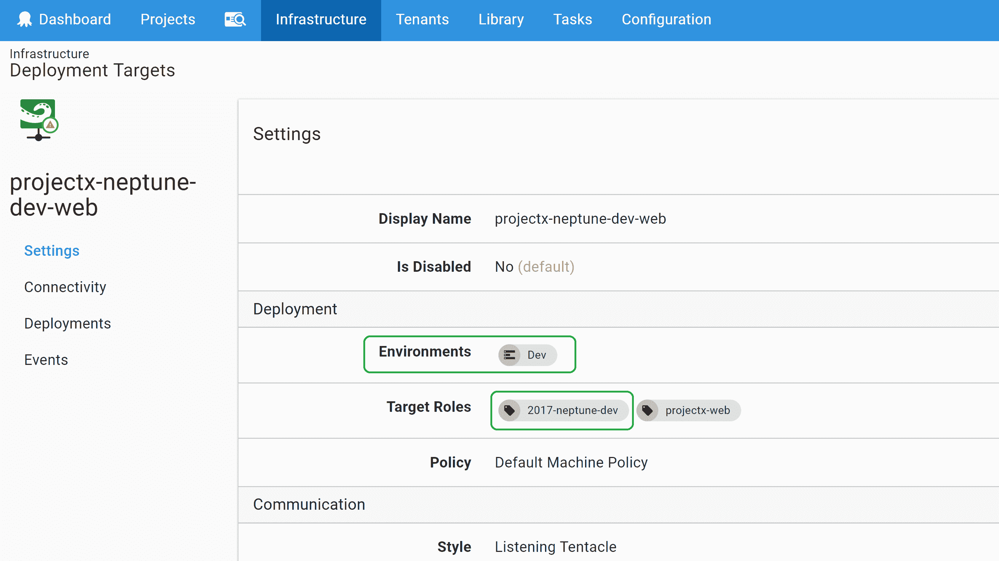
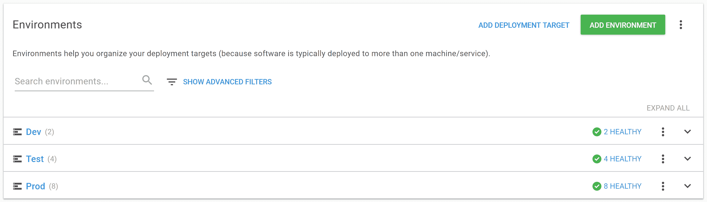
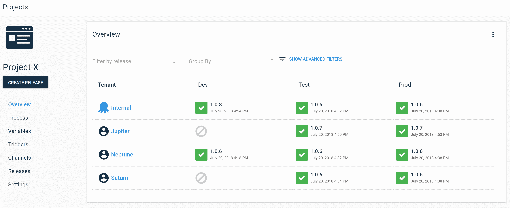
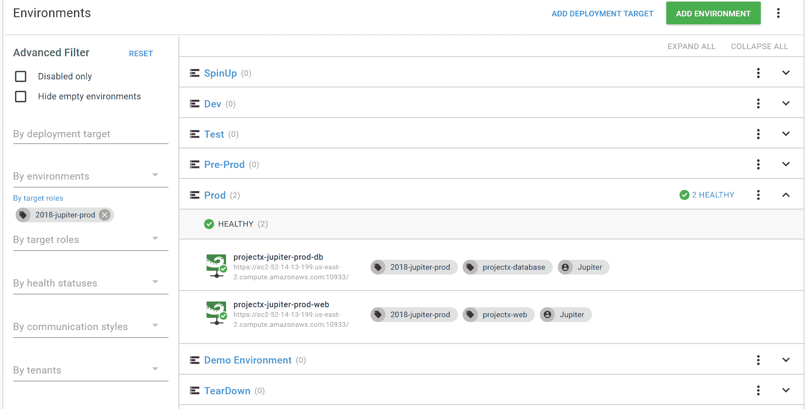

# 真实的 devo PS——用目标角色表示内部环境名称——Octopus Deploy

> 原文：<https://octopus.com/blog/representing-internal-environment-names-with-roles>

你好！我是 Ryan，Octopus 的解决方案架构师。我经常与客户合作，为他们在采用 Octopus 时遇到的工作流程和问题寻找解决方案。

今天，我们将看一个围绕 Octopus 的多租户特性的场景。对于多租户项目，您可以在不同的时间使用不同的配置向多个租户(客户、数据中心、区域等)部署相同应用程序的不同版本。这在 SaaS 环境中很常见，每个客户都有自己的软件实例。当您准备好部署新版本的软件时，您可以先将其推广到一些 alpha 客户，然后推广到 beta 组，然后继续推广到每个客户/租户，直到他们都被更新。您可以在我们的[多租户文档](https://octopus.com/docs/deployment-patterns/multi-tenant-deployments)中了解更多关于多租户部署的信息。如果您有任何问题，您可以通过我们的[支持渠道](https://octopus.com/support)或[请求演示](https://octopus.com/demo)。我很乐意与您一起体验多租户。

## 场景

好吧，让我们开始吧！

在这个场景中，我们有一组客户租户(海王星、木星、土星)。在内部，我们的基础架构团队以特殊的约定命名了客户服务器所属的环境。该约定是“*年创建的* - *客户名称* - *环境名称*”。所以海王星的测试机器在一个名为 2017-Neptune-Test 的环境中。基础设施团队还希望用 Octopus 表示这些内部环境名称。

让我们看看一些选择和它们带来的一些副作用。

## 痛点

### 环境视图

在 Octopus 中对特定于租户的环境建模最明显的方法是在基础设施部分将每个环境都创建为一个环境。每个环境中的目标仍然与租户相关联，因为这是多租户工作所必需的。

在这种情况下，环境页面看起来不错。我们可以可视化我们的环境、它们属于哪个租户，并看到我们的内部名称。所有的框都被选中了！

然而，我们发现在 Octopus 中建模大量环境会导致与一些进程和页面的冲突。因此，我们建议使用少量环境来代表您的基础设施。

### 生命周期

建立生命周期引入了第一个问题。为了让所有这些环境都只有一个生命周期，我们将这些阶段设置为只需要在提升到下一个阶段之前部署到其中一个环境。这意味着我们可以部署到 2017-海王星-测试，然后推广到 2018-土星-产品。这不是一个理想的场景，因为这意味着我们可能会在测试之前意外地将一个版本部署到客户的生产环境中。

为了解决这个问题，我们可以为每个租户创建一个生命周期，然后为每个租户创建一个通道来选择生命周期。你可以看到它的发展方向。添加一个新租户变得很麻烦。我们必须添加新的环境、生命周期和渠道，以确保我们可以安全地部署我们的应用程序。

### 项目概述

这也为我们的项目概述创建了一个稀疏的表格。我们最终会有太多的环境使这个页面变得无用，而且随着我们每增加一个新租户，这个问题会变得更糟。一个很好的经验是，如果你发现自己在 Octopus 中水平滚动，伸出手看看是否有另一种方法来做事情可能是一个好主意。

所以问题是，我们是否可以配置我们的实例，使其具有更标准的开发、测试和生产环境设置，同时仍然跟踪这些内部环境名称？答案是，希望不出意外，是的！

## 输入目标角色

我们可以用目标角色对此建模。您只能使用角色来确定对哪些目标执行哪些步骤。但是您也可以使用角色用元数据来标记机器。在本例中，我们用机器的内部环境名来标记机器。

我们不会将部署目标放在特定于租户的环境中，而是放在通用环境中(开发、测试、生产)。我们将把内部环境名称作为一个角色添加到部署目标中，然后修正我们项目的生命周期。之后，我们将有一个清晰的项目概述，并且我们仍然能够在基础结构页面上看到我们的内部环境名称。

### 更新部署目标

让我们来看看 2017-Neptune-Dev 环境中的部署目标之一。

由于这实际上只是一台开发机器，我们将把它从 2017-Neptune-Dev 移到开发环境中。然后我们给它一个角色“2017-neptune-dev”来代表我们的内部环境名。图中没有包括租户仍然连接到目标。这在整个配置中不会改变。

现在，我们将冲洗并重复所有部署目标。

### 更清洁的环境视图

我们已经更新了所有的目标，并删除了未使用的环境。现在环境看起来又好又整洁。

### 清洁器项目概述

同样，在更新项目生命周期以使用我们的默认约定之后，项目概述就更容易管理了。不再水平滚动！

项目层面还有一点要提。因为新角色仅用于传递信息，所以我们没有更改用于部署到目标的角色。我们的部署步骤继续以“projectx-web”为目标。

### 按内部环境名称查看目标

我们可以使用基础架构页面上的高级筛选器来搜索这些角色，以查看属于内部环境名称的计算机。 

## 包扎

我们所有的框都被选中，我们的项目是干净的，我们在向我们的项目添加新租户时没有任何摩擦！

我们处理了一个涉及租户的非常具体的案例，但是您可以使用这种方法来建模目标属于哪个项目，而无需为每个项目创建单独的环境。你在 Octopus 中使用过角色来建模信息吗？在下面留言告诉我们吧！