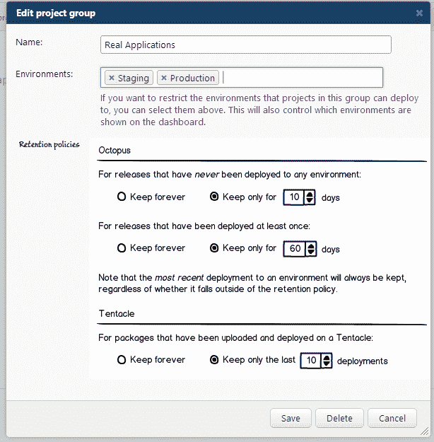

# 保留策略- rfc - octopus 部署

> 原文：<https://octopus.com/blog/retention-policies-rfc>

Octopus 的下一个版本将包括*保留政策*的概念。这些允许您控制保留多少版本和部署，以便保持对磁盘空间使用的控制，并帮助提高性能。在这篇博文中，我想分享一些关于这个新功能如何工作的计划，以便得到你的评论。

## 设置保留策略

保留政策将插入最近发布的[项目组](http://octopusdeploy.com/blog/1.1)功能中。这允许它们被配置用于一组相似的项目，而不需要重复太多次。



前两个设置与 Octopus web 门户相关，它们控制何时从 RavenDB 数据库中删除发布、部署和任务对象。例如，如果您有一个 CI 服务器，它使用 Octo.exe 在每个版本中创建发布，这些设置就很有用。如果这样一个版本从未在一周内部署，您可能会想要删除它。另一方面，您可能希望将已经部署到环境中的版本保留更长时间。

第三个设置影响触须，并控制何时删除提取的包。如果你还不知道的话，触手会根据版本号把包放到不同的文件夹中——例如:

```
C:\Apps\Production\MyApp\1.0.0
C:\Apps\Production\MyApp\1.0.1
C:\Apps\Production\MyApp\1.0.2
C:\Apps\Production\MyApp\1.0.2_1    // This was a retry
C:\Apps\Production\MyApp\1.0.3 
```

如果将此设置设置为保留 3 个部署，则在部署 1.0.3 时，将删除文件夹 1.0.0 和 1.0.1。注意，第三个设置是使用部署的数量而不是天数来指定的，以避免在每个触手上运行计时器/调度作业只是为了清理。

NuGet 包(在 Octopus 和触手上)也将被清理，但这将是一个自动功能，每 12 小时运行一次，清理超过三天的包，所以我不希望它是可配置的。这是因为 NuGet 包总是可以从 NuGet 服务器上重新下载。

## 请求反馈

我想确保这个特性是强大和有用的，但我也想让它尽可能简单。你觉得上面的模型怎么样？项目组是定义保留策略的正确级别吗？我将非常感谢您在下面的框中的评论！