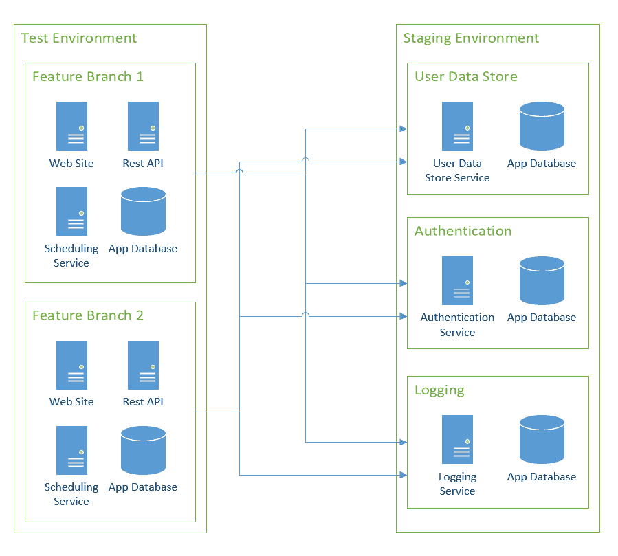
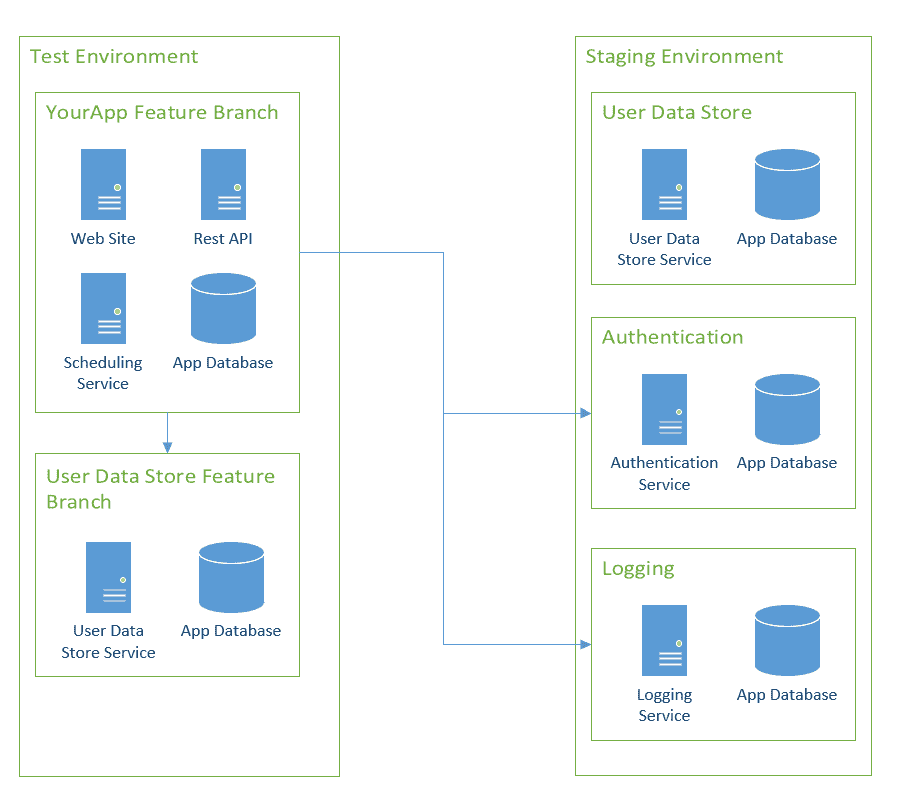
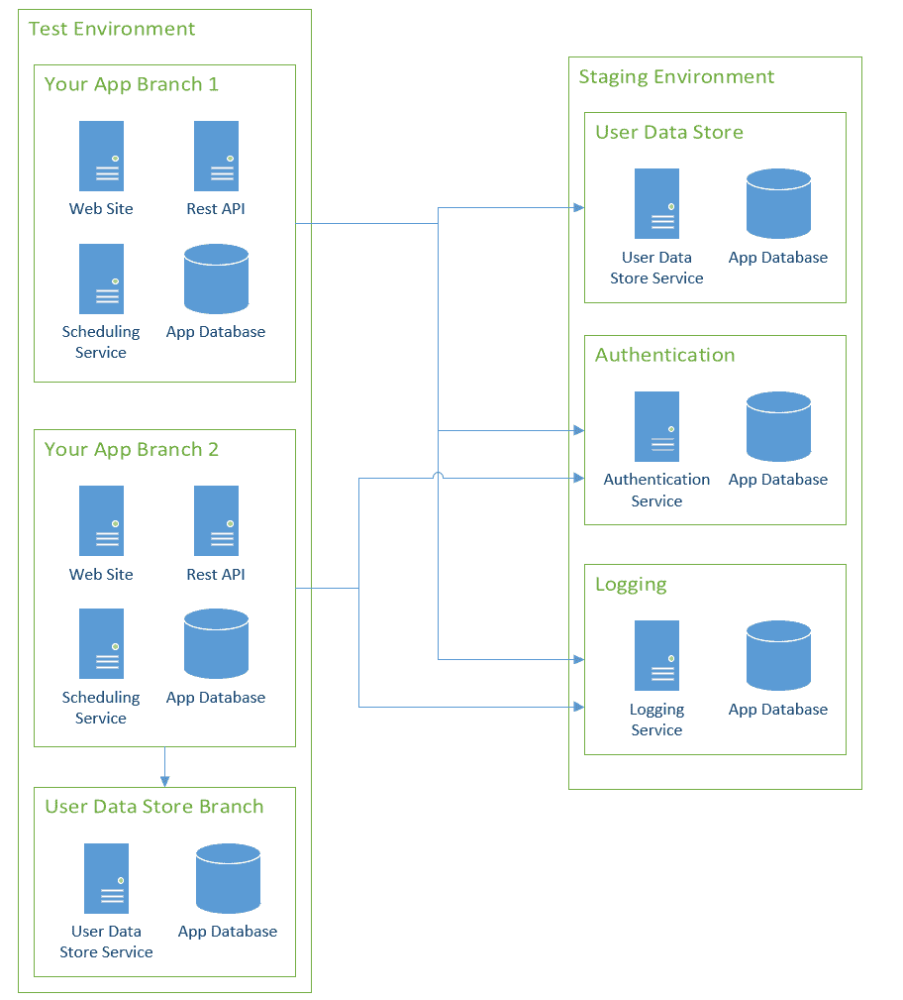

# 重新思考功能分支部署- Octopus 部署

> 原文：<https://octopus.com/blog/rethinking-feature-branch-deployments>

我在 2013 年过渡到 Git。从那时起，我一直在做错误的特性分支测试。问题是，我在同样的静态环境中工作， **开发➜测试➜筹备➜生产** 。每个环境都有我的应用程序的一个实例，它们都反映了`master`分支中的内容。QA 测试新特性的唯一方法是将代码合并到`master`中。在一个完美的世界里，我会为特性分支建立一个沙箱，让 QA 进行测试。 **开发➜测试➜筹备➜生产** 生命周期代表了我的前 Git 生活。在本文中，我介绍了我是如何调整自己的思维来更好地利用 Git 的。

## 特征分支和特征标志

本文讨论了[特性分支工作流](https://www.atlassian.com/git/tutorials/comparing-workflows/feature-branch-workflow)，但是本文也可以用于那些遵循 [Gitflow 工作流](https://www.atlassian.com/git/tutorials/comparing-workflows/gitflow-workflow)的工作流。这种方法还有一个替代方案，[特性标志](https://www.martinfowler.com/articles/feature-toggles.html)。在深入本文的其余部分之前，我想讨论一下特性分支和特性标志之间的区别。

正如我之前提到的，我在 2013 年开始使用 Git。那时，我为一家银行开发贷款发放系统。当有人来贷款时，信贷员会将他们的详细信息输入到我的团队负责的贷款发放系统中。在任何时候，银行都有数百名用户在使用该软件。他们对它应该如何工作都有不同的想法，他们会提交各种各样的特性请求、错误报告和其他各种各样的信息。贷款发放系统很复杂。看似简单的功能需要大量的测试。

假设有一个功能请求，其中声明“对于两个或更多人的贷款，显示每个人在过去六个月中的最低信用评分，而不是显示当前的信用评分。”要实现该功能，需要解决许多实现问题和细节。开发人员将创建一个名为`feature/lowest-credit-score`的新分支，并开始他们的实现。最终，开发人员会到达这样一个点，他们对变更感觉良好，并准备好接受来自 QA 和特性业务所有者的反馈。他们应该如何获得反馈？

我们遇到了两个主要问题:

1.  代码未准备好用于**生产**。用于部署的唯一分支是`master`。在它被并入`master`之后，如果有人不小心的话，它可能最终会进入**生产**。
2.  QA 有几个自动测试来验证显示当前信用评分的旧业务规则。

通常，我见过两种解决这个问题的方法:

1.  创建一个名为`LowestCreditScore`的特征标志。当特征标志设置为`True`时，它将使用新的逻辑。当该标志被设置为`False`时，它将使用旧的逻辑。
2.  在**测试**或 **QA** 环境中创建应用程序的新实例，也称为创建沙箱，以获得反馈和 QA 更新测试的地方。

这两种方法各有利弊。特性标志以一种讨厌的方式嵌入到代码的每一个地方，并且它们引入了复杂性。代码中的每个 if/then 语句都需要额外的单元测试。但是特性标志允许您在关闭新特性的情况下部署代码。当你准备好的时候，你可以打开这个功能。或者，您可以为一组人打开该功能以获取他们的反馈。

创建沙箱需要额外的资源，如 CPU、磁盘空间和 RAM。如果沙盒没有清理干净，很容易达到资源耗尽的地步。在 web 服务器中只能创建这么多网站，在数据库服务器中只能创建这么多数据库。但是它们允许某人得到反馈，并允许 QA 验证，而不需要将未完成的代码合并到`master`中。

令人高兴的是，这些选项并不相互排斥。你可以两样都要，也可以两样都不要。以我的经验来看，拥有一个独立的沙箱来测试和反馈一个新的特性(或者热修复)会避免很多麻烦。在这个例子中，我会推荐这两种方法。我可以预见许多来回，这一变化可能会对贷款的批准方式产生影响。如果在**生产**中结果是负面的，能够快速关闭变更是非常有益的。

## 部署生命周期

我一直忙于配置一个应用程序来演示功能分支。我开始了两个生命周期以及相应的通道。这些生命周期代表了我从 2004 年开始作为开发人员以来一直使用的相同过程。

*   默认: **开发➜测试➜暂存➜生产**
*   特征分支: **开发➜测试**

预期的开发工作流程是:

1.  所有的特性分支都转到`Dev`环境，如果成功了，它们就转到`Test`让 QA/业务所有者验证工作。新的基础设施仅用于该特征分支。分支名称存储在预发布标签中。
2.  当特征分支看起来正常时，PR 会将特征分支合并到主分支中。与特性分支不同，这个包没有预发布标签。这将把合并的代码部署到静态的`Test`数据库中。然后备份和删除特征分支基础结构。
3.  QA 和业务负责人将验证在静态`Test`环境中一切看起来仍然良好。
4.  该版本将被推到`Staging`并重新验证。
5.  假设一切顺利，该版本将被提升到`Production`。

随着我为这篇文章设置的例子越来越深入，同一个问题不断出现在我的脑海里:

> 为什么我要在合并到 master 后重新部署到 dev 和 test？为什么这些环境有静态资源，如数据库、网站和文件存储？

## 静态与动态环境

静态环境是这样一种环境，其中特定于应用程序的资源(数据库、文件存储等。)必须是静态的。启动和使用新资源需要大量的协调和沟通，以避免中断或停机。任何影响非 IT 人员(外部用户、业务用户等)的停机时间。)被认为是大事。部署到这些环境的时间间隔以天为单位，而不是以分钟为单位。

通过 Octopus Deploy 部署的大多数应用程序使用 RDMS 数据库，如 SQL Server、Oracle、PostgreSQL 和 MySQL。数据库的`Production`实例必须是静态的。为每个部署创建一个新的数据库副本是不可行的。尽管这很酷，但时间和资源(磁盘空间、CPU 使用率、RAM 使用率)成本太高。每周部署一个应用程序到`Production`被认为是快速的。通常，每两周一次到每季度一次。

基于这些原因，`Production`是一个静态环境。

对于公司来说，在进入`Production`之前，有一个类似*生产的*环境来运行最终测试是很常见的。这些环境有类似于`Staging`、`Pre-Prod`、`Integration`或`UAT`的名字。出于本文的目的，我将使用`Staging`来表示这些环境。

`Staging`尽可能的*生产化*。这包括向外部用户公开网站，以测试即将推出的功能。即使它没有公开，非 it 人员也可以在前往`Production`之前访问它以尝试新功能。`Staging`被部署到比`Production`更频繁的地方，也许一天一次，也许甚至两次。

根据静态环境标准，`Staging`也是一个静态环境。

动态环境是特定于应用程序的资源不断变化的环境。资源可以根据需要上下旋转。或者身份验证管道中是否有错误。或者一个人在做部署，还没完成。停机时间虽然恼人，但却是可以容忍的，而且仅限于 IT 人员。部署一天发生多次。

`Test`是一个充满活力的环境。

## 静态测试环境的缺点

想到`Dev`和`Test`环境，我就想到一个词:*搅动*。

### 测试环境很少是稳定的

我曾经参与过这样的项目，在关键时刻，我们在 10 小时内完成了 20-25 次`Test`部署。也就是说，每 24-30 分钟部署一次，而与此同时，我们对`Dev`的部署是原来的 1.5 倍。这是因为应用程序只有一个`Dev`实例和一个`Test`实例。当 QA 测试新特性的时候，我们将我们的更改合并到 master 中，并将其部署到`Test`。信不信由你，我们第一次尝试并不完美。

这些 20-25 个部署实际上是每个特性 4-5 个部署。有些部署是由于错误，而有些是由于不正确的合并冲突解决方案。在合并到 master 之前，特性只完成了一半，而且在同一天完成多个特性的情况很少见。计划何时发布代码有点像噩梦。在预定发布之前，我们会冻结《T21》的特色工作，花几天时间研究 bug。冻结意味着没有新功能可以合并到主模块中。

我们的团队区域有一块白板，告诉我们是否可以合并到 master 中。

这也使得部署补丁变得非常困难。我们必须创建一个单独的通道，绕过`Dev`和`Test`，直接进入`Staging`。

### 很少有应用程序是完全孤立的

随着 SOA 和微服务的出现，应用程序不再是这些巨大的(孤立的)整体。以前，每个应用程序都有自己的日志、身份验证、配置和通知模块。当您只有一个应用程序时，这没问题，但是当您将两个或更多的应用程序混合在一起时，维护这些重复模块的成本就会增加。幸运的是，公司明白了这种重复的努力，现在他们有了单一的日志服务器或单一的认证服务，等等。

这就引出了我的下一个观点，应用程序似乎比以往任何时候都更加依赖于其他应用程序才能正常运行。我的应用程序所依赖的服务同时被更改。如果一个依赖的服务由于一个 bug 而关闭，我的应用程序就会进入降级状态，某些功能会受到限制，直到那个依赖的服务恢复。

我们这样做是因为我们将应用程序指向同一个环境中的服务。当每个环境都是静态的时，这是有意义的。我的应用在`Test`，一个依赖服务在`Test`。该服务的 URL 从不改变；我应该在我的申请中指出这一点。

### 开发环境的意义是什么？

我工作过的大多数地方很少使用`Dev`环境。它没有太多的数据来测试。它几乎总是停机，没有人真正使用它。它就在那里。一些团队对它进行了自动化测试，但是结果通常被忽略，因为数据太过时了。如果部署失败，我们会创口贴解决方案，这样它就可以到达`Test`环境，QA 就可以继续工作。

`Dev`一直是一个橡皮图章的环境。

## 重新思考功能分支部署的环境

`Production`和`Staging`不会去任何地方，也不应该去，但是`Dev`和`Test`需要完全重新考虑。

*   将`Dev`和`Test`组合成一个环境:`Test`。
*   当一个新的特征分支被检入时，该特征分支的新基础设施在`Test`中启动。
*   该功能分支的后续签入将转到该基础结构。
*   默认情况下，`Test`中的所有应用程序都使用其依赖应用程序的`Staging`实例。当 1 到 N 个应用程序的工作紧密耦合时，这可以被重写以指向`Test`。
*   当功能分支被合并到主分支中时，一个部署就开始了，它将测试基础设施拆除，然后自动将合并的代码部署到`Staging`。
*   在最终验证和签署后，代码被推送到`Production`。

生命周期将是:

*   默认: **暂存➜生产**
*   特征分支:`Test`

未完成的代码将不再被合并到主代码中。这将使发布的时间安排变得更加容易。主文档中的内容已经由 QA 和任何业务或产品负责人签署。您可以在星期一将特性 A 合并到主服务器中，在星期二部署，然后在星期三将特性 B 合并到主服务器中，在星期五部署。每次部署也会小得多。

这同样适用于错误修复。它们将被视为特征分支。当一个热修复分支被检入时，新的基础设施被建立以验证该修复确实修复了问题。当它准备就绪时，它被合并到 master 并被推送到`Staging`。

如果您使用的是 Gitflow，那么您可以配置构建服务器，当一个变更被签入到一个发布分支中时，启动到`Staging`的发布。

### 合并冲突并引入最新变更

每个特性分支都有自己的沙箱来测试变化。一个功能可能需要一天或一个月才能完成。拥有单独的沙箱来测试变更有很多好处，但是通过定期从`master`分支获取变更来保持他们的特性分支是最新的，这取决于开发人员。随着时间的推移，将`master`中的最新变化合并到一个特性分支中会变得更加困难。我的团队开发的一个特性在 QA 测试之前花了四周时间。开发人员一直等到最后才把 master 合并到他们的分支中；解决所有合并冲突花了四天时间。

我不是说你需要停止你正在做的事情，每小时从`master`合并。我建议建立一个有规律的节奏，每天一次，每两天一次，只要有事情就行。你开始得越早，遇到的头痛就越少。除非有人对代码进行大规模重构。无论你开始得多快，合并都不会有意思。

理想情况下，合并到`master`中的变更数量会随着新的工作流程而减少。记住，在被合并到`master`的变更完成一半之前。他们已经为测试做好了准备，但是我很少看到没有至少一个修改就通过测试的变化。不再将每天 20-25 次的变化合并到`master`中，而是减少到每周 3-4 次。

会发生合并冲突。开发人员需要互相交流，让每个人都知道他们在代码的哪个区域工作。产品负责人或业务分析师应该与开发人员合作，确保他们不会提交涉及相同代码的特性请求。这个新的工作流程将有助于确保**生产**就绪代码被合并到主代码中，而不是帮助更好地组织开发人员。

### 外部服务和数据库

在这种配置中，`Staging`环境尽可能与`Production`匹配，这意味着它应该是稳定的。唯一一次`Staging`与`Production`不同是在`Production`部署之前。

根据经验，所有依赖于外部或下游服务的`Test`中的服务都应该指向`Staging`。我意识到这说起来容易做起来难。

应用程序通常存储从外部服务获得的唯一标识符。在旧的工作流中，因为`Staging`和`Test`是相互隔离的，所以它们会有不同的标识符。好消息是这些标识符通常存储在数据库中。这就引出了我的下一点，数据库。没有数据测试的新沙盒是没有用的。这些数据需要来自某个地方。当您创建特性分支沙箱时，我建议恢复最近备份的`Staging`数据库，而不是复制同一个`Test`数据库。

### 跨多个应用程序的紧密耦合的变化

对于一个大型项目来说，涉及多个应用程序是很常见的，这些变化紧密地耦合在一起。在这种特定情况下，将创建一个沙箱中的沙箱:

毫无疑问，这种情况会让事情变得更加棘手。为特定应用程序的特性分支构建沙盒相对容易，因为您可以控制该应用程序。其他团队会有不同的节奏。你可能会在另一个团队的沙箱准备好之前就把自己的沙箱放好。当你等待另一个团队时，你的沙箱需要工作，所以你将指向`Staging`。当所有相关的沙箱上线时，您需要更新您的配置条目以在`Test`中指向它们。

简单的方法是说，“不要像那样紧密耦合应用程序的变化。”从发布的角度来看，部署这个项目要困难得多，因为应用程序必须按照特定的顺序部署。延迟会自行复合，你会听到，“我的应用程序无法修改，直到[Team X]的服务被修改。“虽然解耦是最终目标，但在实践中，紧密耦合的应用程序会发生变化。

对于依赖服务，您需要担心两件事:

1.  服务的 URL。
2.  服务的数据协定。

URL 需要修改为指向`Test`中的特性分支沙箱。有多种方法可以实现这一点:

*   [配置转换](https://octopus.com/docs/deployment-process/configuration-features/configuration-transforms#Configurationfiles-Wildcard)——您创建一个配置转换，它指向您特性分支中的`Test`中的特定服务。在相关服务被提升到`Staging`之后，配置转换被删除。
*   新配置值——添加一个指向`Test`中服务 URL 的新配置值。在相关服务被提升到`Staging`之后，新的配置值将被删除。这种方法的缺点是还需要修改代码。
*   [利用多租户](https://octopus.com/docs/deployment-patterns/multi-tenant-deployments)，将功能分支部署到特定租户。服务 URL 存储为租户变量。[优步写了一篇关于他们如何利用多租户的精彩文章](https://eng.uber.com/multitenancy-microservice-architecture/)。
*   利用负载平衡器或 URL 来动态路由流量——我在这方面没有太多经验，但我听说有人用这种方法取得了成功。

数据契约是另一个问题，即使对于 JSON 和 RESTful 服务也是如此。像向 JSON 对象添加属性这样简单的事情都会产生影响。更不用说新的端点、新的对象或更改的属性了。关于这个主题的书层出不穷。我发现最有效的方法是分析所做的更改，如果是新属性，编写代码时假设新属性为空。如果是新的端点或对象，请查看功能标志。这样，应用程序可以独立于下游服务进行部署。

一个独立的沙箱使得项目的测试和验证更加容易，但是这将涉及更多的准备工作。

## 新基础架构与重用现有基础架构

这是一个你必须回答的问题。

> 当您启动沙盒时，您会启动新的基础架构还是重用现有的基础架构？

建设新的基础设施有一个好处，那就是完工后更容易拆除。尤其是，如果你使用的是 AWS、Azure 或 GCP。

然而，无论是在云上运行还是自托管，新的基础架构都有相关的成本。对于云来说，每天的费用是真实的。对于自托管，存在时间问题和资源利用问题。例如，SAN 是否有足够的空间容纳另一个虚拟磁盘，或者虚拟机管理程序中是否有足够的 v-CPU 可用？一般来说，`Test`中的大多数服务器都没有得到充分利用。即使在 QA 进行测试时，如果查看资源监视器，CPU 使用率也可能低于 20%。大多数 web 服务器、数据库服务器和应用服务器允许您托管多个应用程序、网站或数据库。

这个问题没有对错之分。这是做对你、你的理智和你的公司最有利的事情。

## 利用 Octopus 部署

在我的下一篇文章中，我将介绍构建服务器和 Octopus 部署的完整设置。

一般而言，该解决方案将使用 Octopus Deploy 中的以下功能:

*   [Runbooks](https://octopus.com/runbooks) :这将用于旋转和拆除一个特性分支的沙箱。
*   [通道](https://octopus.com/docs/deployment-process/channels):通道允许部署过程中不同的生命周期。
*   [提示变量](https://octopus.com/docs/projects/variables/prompted-variables):允许特定设置(数据库名称、URL、外部引用等。)在使用特征分支时被覆盖。

## 结论

在阅读 Git 工作流时，您会经常看到短语*分支*和*主干*。分支的概念是短暂的，一段时间后，它要么合并回主干，要么被修剪。树干是长寿的，它是树枝的分支。

本文建议将您的测试环境视为分支，将登台/生产环境视为主干。这是一种思想转变，说起来比实际做起来容易得多。正如我在上一节中所说的，在我的下一篇文章中，我将提供一个使用这个新工作流配置 CI/CD 管道的指南。它将包括构建服务器和 Octopus 部署。

下次再见，愉快的部署！