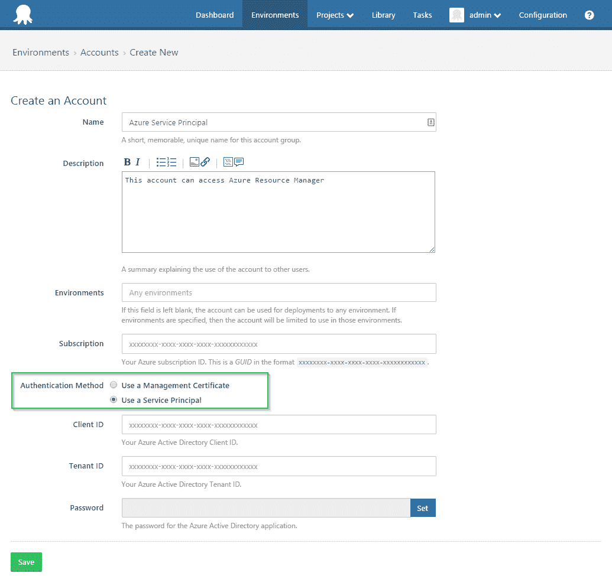
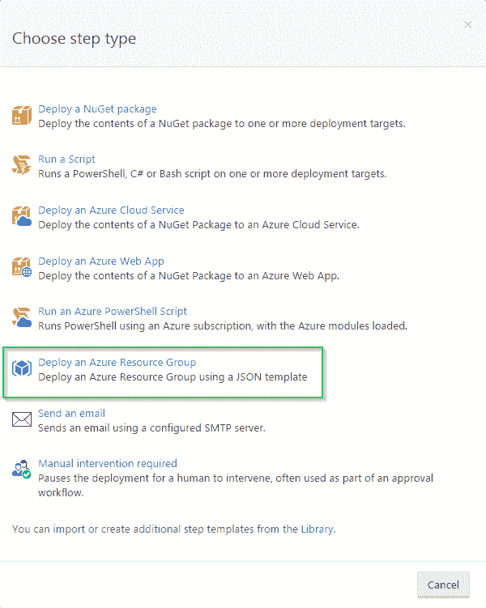
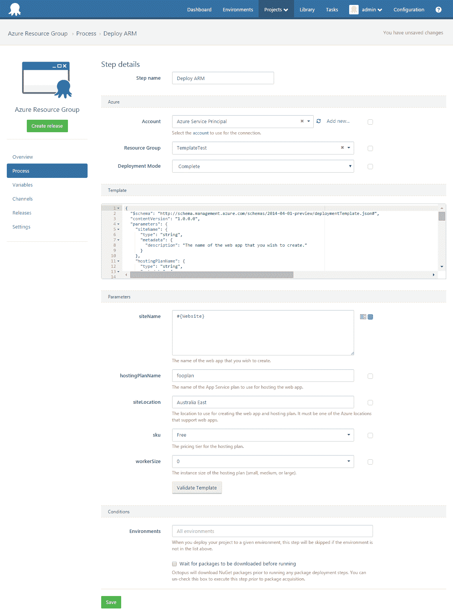
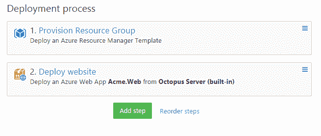

# RFC: Azure 资源管理器支持- Octopus 部署

> 原文：<https://octopus.com/blog/rfc-azure-resource-manager>

在过去的某个时候，Azure 团队对 Azure 中管理资源的方式进行了明确的方向改变。结果当然是 [Azure 资源管理器](https://azure.microsoft.com/en-us/documentation/articles/resource-group-overview/)。

因此，现在有两个不同的接口与 Azure 交互。最初的接口被称为 Azure 服务管理(ASM)，Azure 资源管理器(ARM)是新的。分裂是深刻的；有两个 HTTP API，两套 PowerShell 模块，甚至两个 web 门户。

目前，Octopus Deploy 只与服务管理接口交互。

当您在 Octopus 中创建新的 Azure 帐户时，您会附加一个证书，该证书用于通过 Azure 进行身份验证。这种认证模式只能与服务管理 API 交互。若要使用资源管理器，需要通过 Azure Active Directory 进行身份验证。

为了提供对 Azure 资源管理器的支持，提出了许多更改:

### Azure 服务主帐户

我们建议为 Octopus 添加一个新的帐户类型:一个 *Azure 服务主体*帐户(现有的 Azure 帐户将被称为 *Azure 管理证书*帐户)。Azure 服务主体帐户的创建过程将包括在你的 Azure Active Directory 中创建一个服务主体(参见这篇[帖子](https://azure.microsoft.com/en-us/documentation/articles/resource-group-authenticate-service-principal/)了解上下文)，并捕获必需的字段(应用程序 ID、租户 ID、密码)。我们会尽可能让这次经历顺利。

### 一个新的“部署 Azure 资源组”步骤

通过资源管理器，可以使用 [JSON 模板](https://azure.microsoft.com/en-us/documentation/articles/resource-group-authoring-templates/)作为一个组来提供和部署资源。

我们提出了一个新的部署步骤，可以使用 JSON 模板提供/部署资源组。

编辑步骤可能类似于:

需要注意的事项:

*   “参数”部分是动态的。该表单会进行调整，以匹配模板中定义的参数。
*   Octopus 变量可以绑定到任何字段，包括参数。在上面的示例中，siteName 参数被绑定到一个变量。这是强大的，因为它允许您的参数根据环境、通道等进行调整，而无需修改步骤。
*   “验证”按钮将允许根据 Azure 资源管理器来验证您的部署。这比创建一个版本并进行部署却发现 JSON 无效要好。

在我们目前的想法中，这些步骤不包括 NuGet 包。我们为这些资源组步骤设想的用例更多的是关于供应资源，而不是部署它们。例如，您可能有一个创建 Azure 网站(可能还有 SQL 数据库等)的“部署资源组”步骤，然后是一个“部署 Azure Web App”步骤，该步骤将获取包含您的应用程序的 NuGet 包并部署它。

例如

### Azure PowerShell 脚本

目前，对于“运行 Azure PowerShell 脚本”步骤，我们自动导入 Azure PowerShell 模块并根据订阅进行身份验证。但是这不允许使用资源管理器 cmdlets。我们将为资源管理器做类似的事情:如果帐户是服务主体帐户，我们将自动进行身份验证。是否自动加载资源管理器模块是一个悬而未决的问题，因为它们已经变得更细粒度了。

此时，服务主体帐户无法访问服务管理 API(包括 PowerShell 模块)。这意味着您无法在同一个步骤中组合服务管理和资源管理器 cmdlets。要使用服务管理器 cmdlet，您需要一个选择 Azure 管理证书帐户的步骤，而要使用 ARM cmdlets，您需要一个选择 Azure 服务主体帐户的步骤。鉴于微软似乎已经有效地停止了服务管理方面的开发，我们认为这将是一个越来越小的问题。

### 饭桶

我们还在考虑允许从 Git 存储库中检索模板。这种情况可能会发生，也可能不会发生，即使发生，也可能不会包含在此功能的初始版本中。我们很想知道这是否有趣。

## 反馈

告诉我们你的想法？