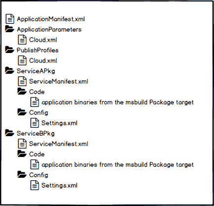
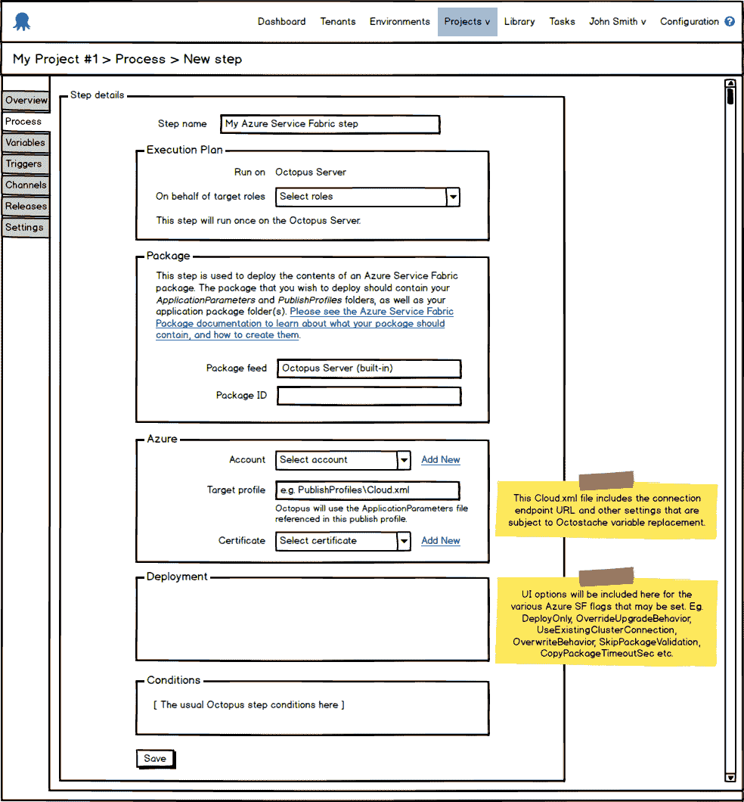

# RFC: Azure 服务结构支持- Octopus 部署

> 原文：<https://octopus.com/blog/rfc-azure-service-fabric>

为了迎接 2017 年，Octopus 的云团队陷入了一个流行的用户声音建议: [Azure 服务架构！](https://octopusdeploy.uservoice.com/forums/170787-general/suggestions/7790970-support-for-azure-service-fabric)

本 RFC 的目的是讨论从 Octopus Deploy 到 Azure Service Fabric 部署的集成支持。如果您希望看到服务结构的某个特定子功能，现在是参与进来的最佳时机，让我们知道我们是否在正确的轨道上。

## 什么是 Azure 服务结构？

微软在他们的[概述](https://docs.microsoft.com/en-us/azure/service-fabric/service-fabric-overview)中对此做了最好的解释:

> Azure Service Fabric 是一个分布式系统平台，可以轻松打包、部署和管理可伸缩且可靠的微服务。Service Fabric 还解决了开发和管理云应用程序的重大挑战。开发人员和管理员可以避免复杂的基础架构问题，并专注于实施可扩展、可靠和可管理的任务关键型高要求工作负载。Service Fabric 代表了用于构建和管理这些企业级、第 1 层、云规模应用程序的下一代中间件平台。

## 术语

### 包裹

在这个讨论中，有两个不同的概念与名词`Package`相关。

第一个是 Octopus Deploy 在其包提要中考虑的包，它将被称为 NuGet/zip 包。

第二个是 Azure Service Fabric 应用程序包上下文中的包，将简称为包(对于熟悉 Service Fabric 的人来说，这实质上是您提供给 Service Fabric PowerShell Cmdlets 的`ApplicationPackagePath`参数的内容)。

## 新的步骤模板

提议的解决方案将依赖于 NuGet/zip 打包服务结构应用程序的部署。NuGet/zip 包的必需内容将在这里讨论。然而，NuGet/zip 包的创建是一个构建责任，因此不在本讨论的范围之内。

假设您的 SF 应用程序包含两个服务，ServiceA 和 ServiceB，NuGet/zip 包将包含具有以下文件/文件夹结构的内容:

该步骤将包括以下输入:

*   账户
*   轮廓
*   证书
*   默认`Deploy-FabricApplication.ps1`文件中各种可用标志的用户界面选项(该文件包含在所有服务结构项目中)

建议的步骤模板用户界面如下:

## 处理

部署过程将:

*   打开包装内容
*   在`ApplicationParameters`和`PublishProfiles` xml 文件中执行变量替换(我们最有可能考虑所有的变量替换。xml/。解压缩后的包中的配置文件)
*   使用 Azure Service Fabric SDK 和 PowerShell 脚本的捆绑版本*(注意:我们仍在调查这里涉及的内容)*
    *   为了与现有的 [Azure PowerShell 模块](http://docs.octopusdeploy.com/display/OD/Configuring+the+version+of+the+Azure+PowerShell+modules)保持一致，如果你愿意，可以通过设置系统变量 **Octopus 来使用 Azure Fabric SDK 的定制版本。action . azure . usebundledazurepowershellmodules**到 **False** ，然后将使用安装在您的 Octopus 服务器上的 SDK 版本
*   调用`DeployAzureFabricApplication.ps1`，它将被打包成卡拉马里的一部分
    *   喜欢 Calamari 的 Azure 云服务脚本】(https://github . com/octopus deploy/Calamari/blob/master/source/Calamari)。azure/Scripts/deployazurecloudservice . PS1)，您将能够在您的 NuGet/zip 包中覆盖该脚本，并根据需要对其进行自定义

## 版本控制

用 Octopus 和 Service Fabric 应用程序对 NuGet/zip 包进行版本控制产生了一个有趣的讨论点，因为 Service Fabric 中的版本控制是每个服务、每个应用程序的代码和配置。换句话说，如果你从 Octopus 发布一个新的 NuGet/zip 包版本，你需要确保你理解版本控制和升级如何与 Azure Service Fabric 应用程序一起工作，以确保最小的(或没有)停机时间。

我们仍在积极研究八达通如何最好地处理这一问题。我们还不知道答案:)

## 反馈

这是您指导此功能开发的机会。

这对你有用吗？

你的愿望清单上有什么我们没提到的吗？