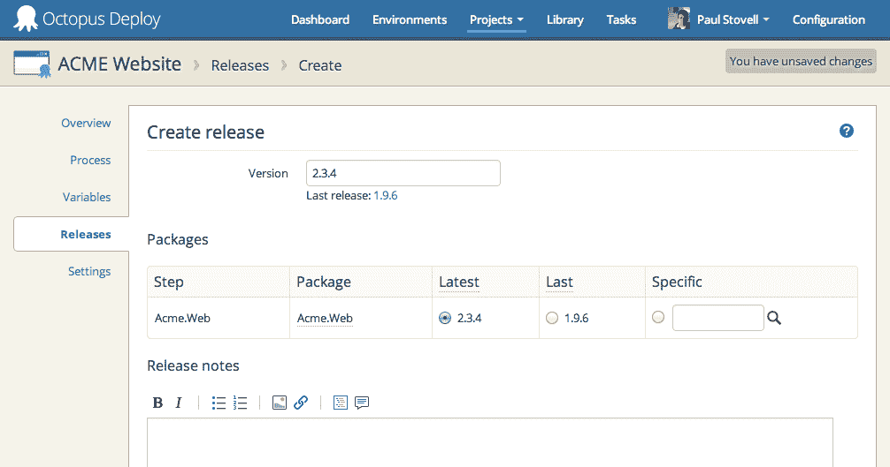
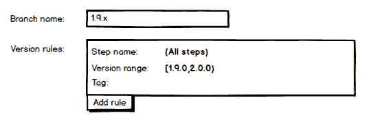
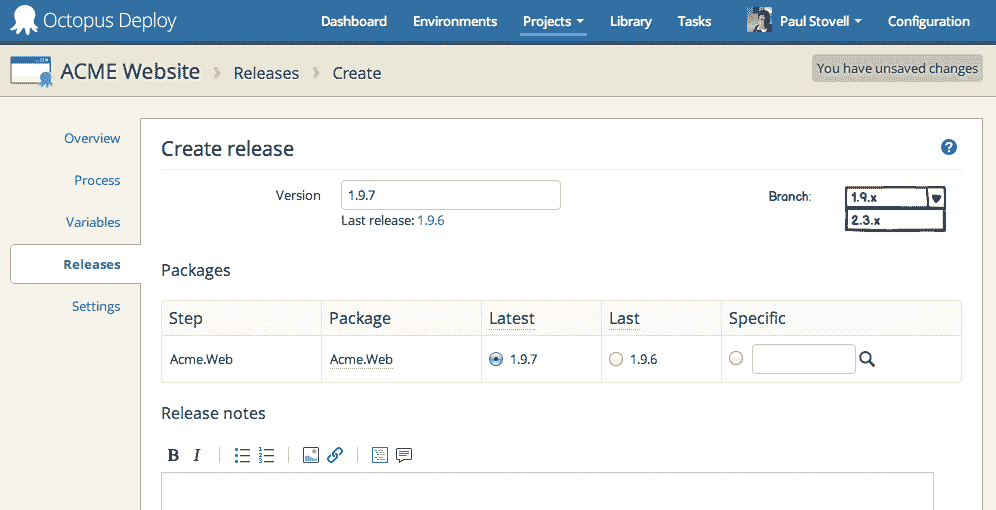
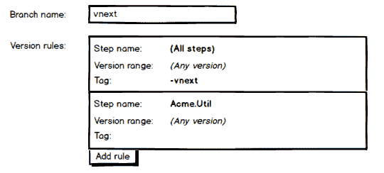

# RFC:分支- Octopus 部署

> 原文：<https://octopus.com/blog/rfc-branching>

***频道已经在[章鱼 3.2](/blog/octopus-deploy-3.2) 发货了！***

在 Octopus 的下一个版本中，我们计划改进对从事不同代码分支工作的人们的支持。我们仍处于这个项目的规划阶段，所以这是一个分享我们正在做的事情并获得您的评论的好时机。

每次在 Octopus 中创建一个版本时，您可以选择要包含的每个包的版本，默认为最新版本:



当不同的团队同时在不同的分支上工作时，这会使得创建发布页面难以使用。例如，假设团队按以下顺序发布包:

```
Acme.Web.1.9.3.nupkg
Acme.Web.1.9.4.nupkg
Acme.Web.1.9.5.nupkg
Acme.Web.2.3.1.nupkg
Acme.Web.2.3.2.nupkg
Acme.Web.1.9.6.nupkg
Acme.Web.1.9.7.nupkg
Acme.Web.2.3.3.nupkg
Acme.Web.2.3.4.nupkg 
```

当查看创建发布页面时，由于 Octopus 默认为最新版本，这意味着人们必须寻找选择正确的包版本-这不是一个很好的体验。

为了帮助解决这个问题，我们引入了分支机构。您将像这样定义一个分支:



一个分支有一个简单的名称，然后是一组规则，这些规则决定了在创建一个发布时应该出现哪些版本。在**步骤名称**字段中，您可以选择将规则应用于哪些步骤——项目中的一个、多个或所有步骤。**版本范围**字段使用 [NuGet 版本语法](http://docs.nuget.org/docs/reference/versioning)来指定要包含的版本范围。**标签**可以包含一个正则表达式，并在 [SemVer 预发布标签](http://semver.org/)上使用。

在 create release 页面上，您可以选择使用哪个分支，它将控制显示哪些包:



更复杂的分支定义可能是:



这里，项目有多个步骤。对于**的极致。Util** 步骤，我们有一个规则，其他步骤有不同的规则。我们使用标签只显示带有`-vnext` SemVer 标签的包。

我们这个特性的目标是保持简单——分支实际上只从发布创建页面(和`Octo.exe create-release`)的角度来看是重要的。如果您根据分支需要不同的环境或部署步骤，那么最好克隆一个项目。

你觉得怎么样？这样的功能对你有用吗？请在下面的方框中告诉我们。