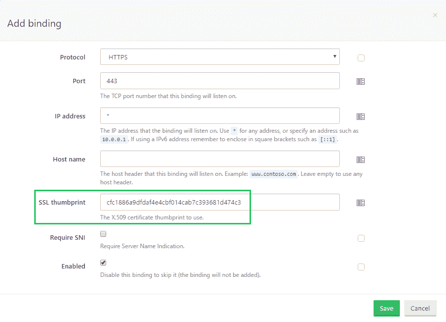
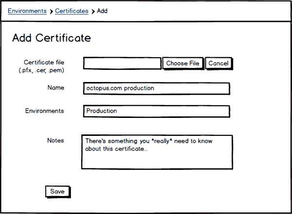
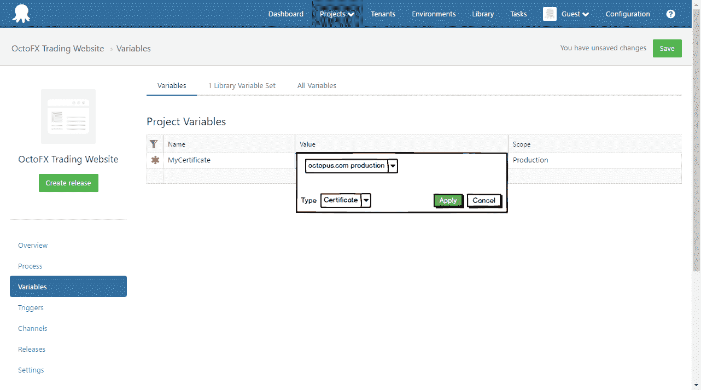
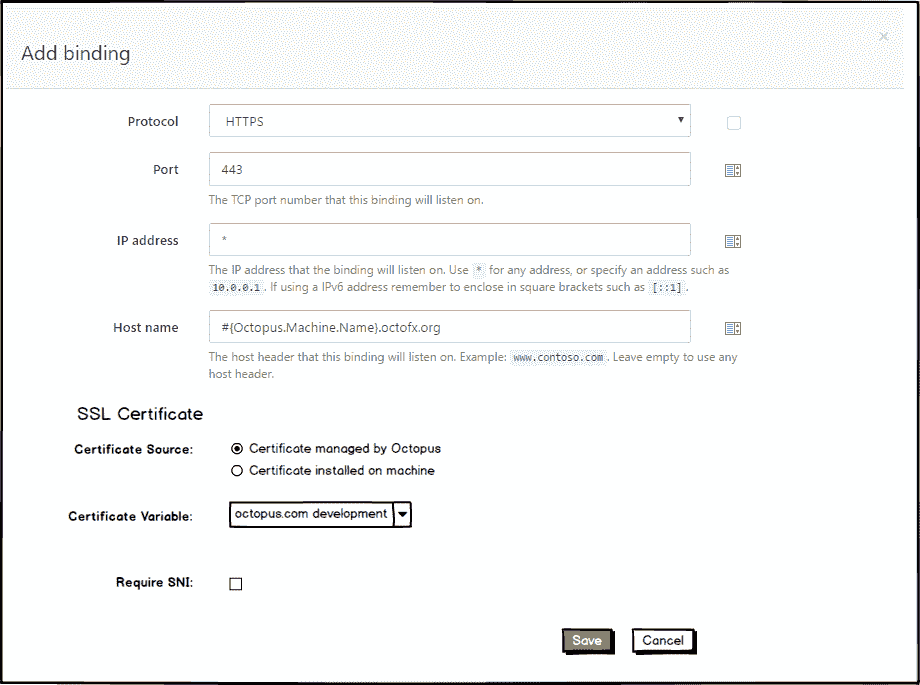
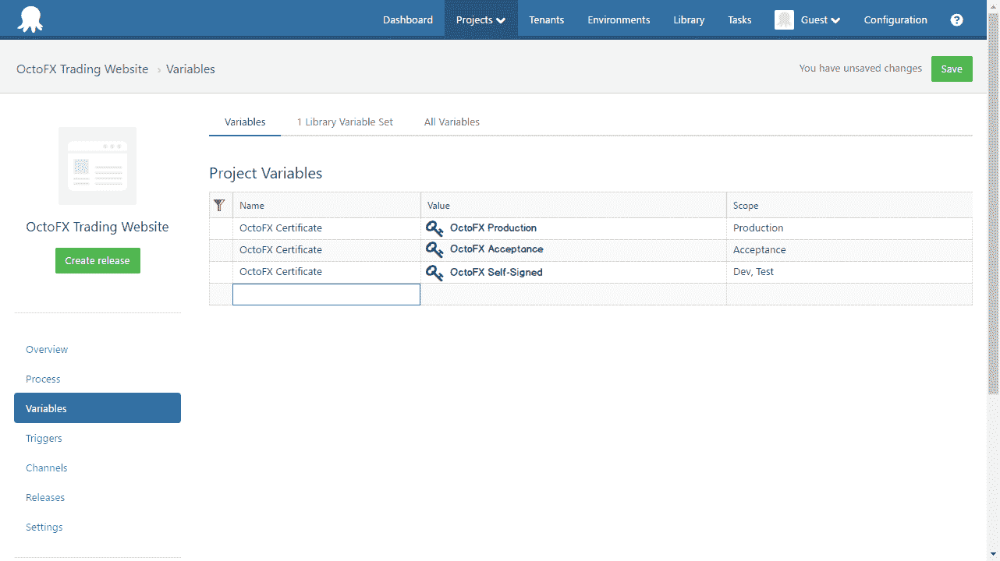

# RFC: X.509 证书管理- Octopus 部署

> 原文：<https://octopus.com/blog/rfc-certificate-management>

X.509 证书的管理是一个常见的部署难题。

推动这一特性的具体例子是在 IIS 中创建 HTTPS 绑定。

目前在 Octopus 中，当配置 HTTPS 绑定时，通过指纹引用证书。

假设证书已经安装到 IIS 服务器上。当指纹所引用的证书不可避免地过期时，你必须记住更新八达通中的指纹以匹配新证书。

我们相信，我们可以改进这一点，并(希望)改进许多其他与证书相关的场景。

## Octopus ==证书库

Octopus 服务器非常适合作为 X.509 证书的中央管理点。

我们打算允许你上传你的证书到八达通。

我们将支持上传各种文件格式(。pfx，。pem，。cer)，您将能够查看和搜索您已上传的证书。

证书的范围可以是环境(和租户)。例如，这将防止意外地将您的生产证书部署到开发环境中。

### 私钥

从技术上讲，X.509 证书只包含*公共*密钥。然而，在许多情况下(包括配置 HTTPS IIS 绑定)，证书及其对应的*私有*密钥都是必需的。

PFX (PKCS #12)和 PEM 格式都支持存储私钥和证书，Octopus 将支持上传这些内容。
所以对于学究们(我们不都是这样)，当我们在这个上下文中谈到*证书*时，我们实际上是指*证书及其相关的私钥(如果提供的话)*。

因为证书可能包含私钥，它们将被保存在用您的主密钥加密的 Octopus 数据库[中。](http://docs.octopusdeploy.com/display/OD/Security+and+encryption)

## 第一阶段

我们希望在初始阶段提供的功能是:

### 证书变量

为了支持证书，我们计划引入*类型变量*的概念。当创建一个变量时，您将能够指定它将代表一个证书。

使用证书时，有许多潜在的有用属性:

*   个性特征
*   公开密钥
*   私人密钥
*   完整的原始证书(可能包括私钥)
*   等等

在部署时，证书变量将被扩展成许多变量。

即:`MyCertificate`=>
`MyCertificate.Type`:`Certificate`
`MyCertificate.Name`:将证书导入八达通
`MyCertificate.Thumbprint`时提供的友好名称:证书指纹。例如`A163E39F59560E6FE33A0299D19124B242D9B37E`
`MyCertificate.Subject`:主体的 X.500 可分辨名称
`MyCertificate.Issuer`:发行者的 X.500 可分辨名称
`MyCertificate.NotBefore`:例如`2016-06-15T13:45:30.0000000-07:00`
`MyCertificate.NotAfter`:例如`2019-06-15T13:45:30.0000000-07:00`
`MyCertificate.Pfx`:base64 编码的证书，如[【PKCS # 12】](https://en.wikipedia.org/wiki/PKCS_12)格式，包括私钥(如果存在)。
`MyCertificate.PublicKey`:base64 编码的 DER ASN.1 主键。
`MyCertificate.PrivateKey`:base64 编码的 DER ASN.1 私钥(如果有)。
`MyCertificate.PublicKeyPem`:公钥的 PEM 表示(即带表头\表尾的公钥)。
`MyCertificate.PrivateKeyPem`:私钥的 PEM 表示(即带表头\表尾的 private key)。

这是一个可能的变量列表。创建的确切变量尚未最终确定。

私钥变量将以与[敏感变量](http://docs.octopusdeploy.com/display/OD/Sensitive+variables)相同的方式存储和传输；从不明文。

将来，我们将把类型变量的概念扩展到其他实体。一个明显的候选人是[账户](http://docs.octopusdeploy.com/display/OD/Accounts)。

### IIS 绑定

在为 IIS 部署配置 HTTPS 绑定时，目前必须从外部管理证书安装(或者至少通过自定义脚本)。然后将证书的指纹输入到绑定配置中。

此功能将允许您选择证书变量，而不是指纹。

有趣的是注意到绑定是到证书*变量*，而不是直接到证书。我们的推理是，常见的(也是推荐的)场景是拥有一个证书变量，每个环境有不同的实际证书值。

例如

因此，将使用`OctoFX Certificate`变量创建 IIS 绑定，并根据部署到的环境安装正确的证书。

部署时，证书将安装在`Cert:\LocalMachine`存储中(如果还没有安装的话)，HTTPS 绑定将在 IIS 中配置。

### 在自定义脚本中引用证书变量

无论您选择哪种脚本语言(PowerShell、ScriptCS、F#、Bash)，证书变量都应该使使用定制脚本中的证书变得既好又容易。

变量替换将起作用:

`Write-Host #{MyCertificate.Thumbprint}`

威尔也一样:

`Write-Host $OctopusParameters["MyCertificate.Thumbprint"]`

为了。基于. NET 的脚本语言，我们可能会提供一个 helper 函数来获取 [X509Certificate2](https://msdn.microsoft.com/en-us/library/system.security.cryptography.x509certificates.x509certificate2(v=vs.110).aspx) 对象，因为即使使用 pfx 表示，在创建这些对象时也有一些常见的陷阱。

## 未来

我们考虑在后续阶段交付的功能包括:

*   配置到期通知
*   报告证书安装在哪些机器上
*   允许在上传新证书时自动替换已安装的证书(即，仅为证书创建“部署”)
*   [让我们加密](https://letsencrypt.org/)集成。即实现 [ACME 协议](https://letsencrypt.github.io/acme-spec/)并充当[加密代理](https://letsencrypt.org/how-it-works/)

### 圣杯

我们梦想中的工作流程如下:

1.  创建新证书(从“让我们加密”中自动请求)
2.  在 IIS 部署步骤的 HTTPS 绑定配置中引用它
3.  当证书接近到期时，会自动从 Let's Encrypt 请求一个新的证书，并作为替换安装在所有使用过过期证书的机器上

## 反馈

这是您指导此功能开发的机会。

这对你有用吗？

你的愿望清单上有什么我们没提到的吗？