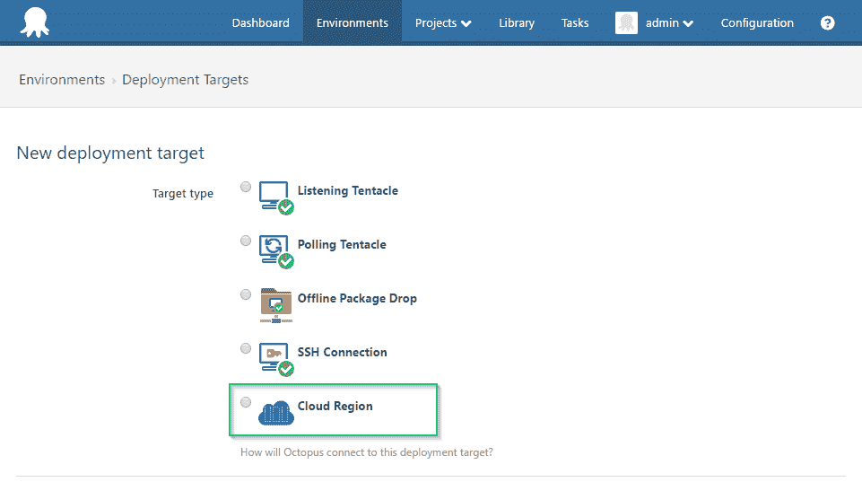
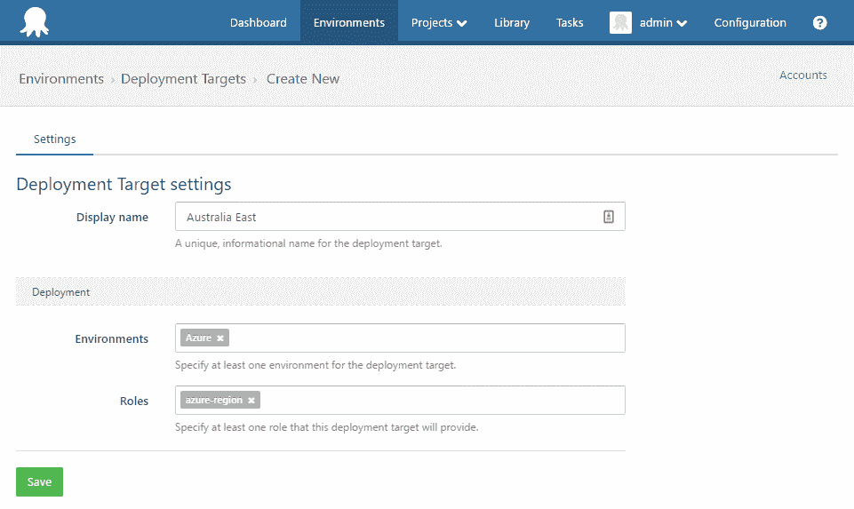
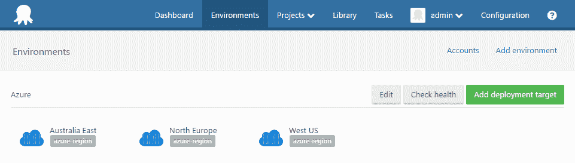
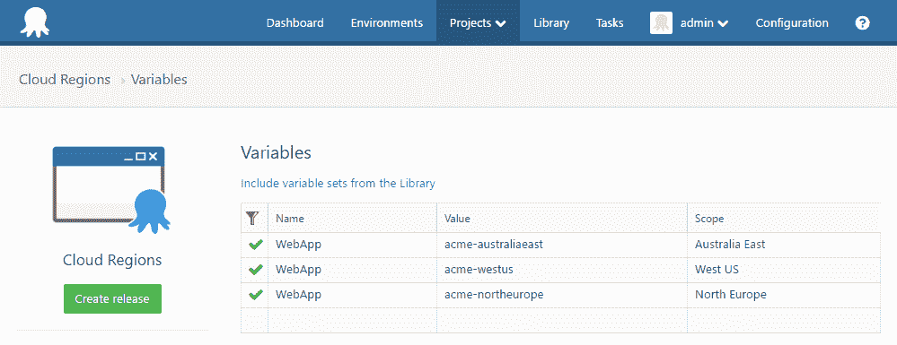
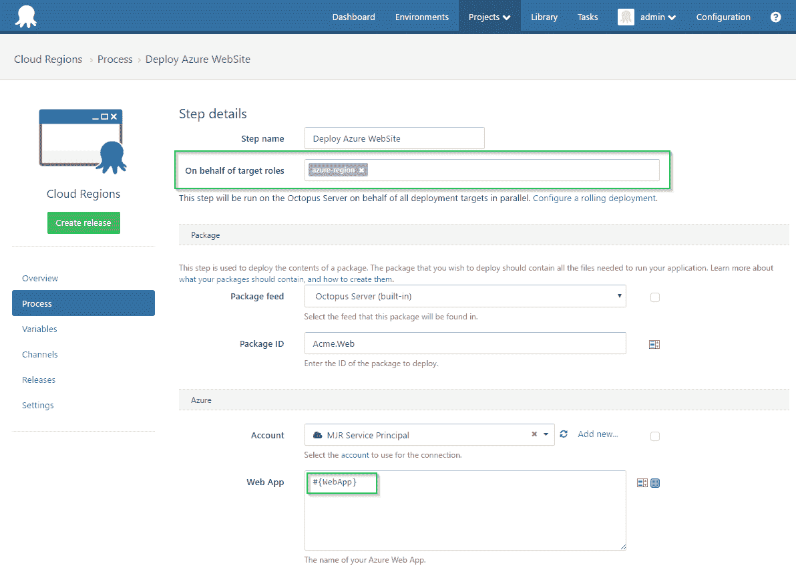
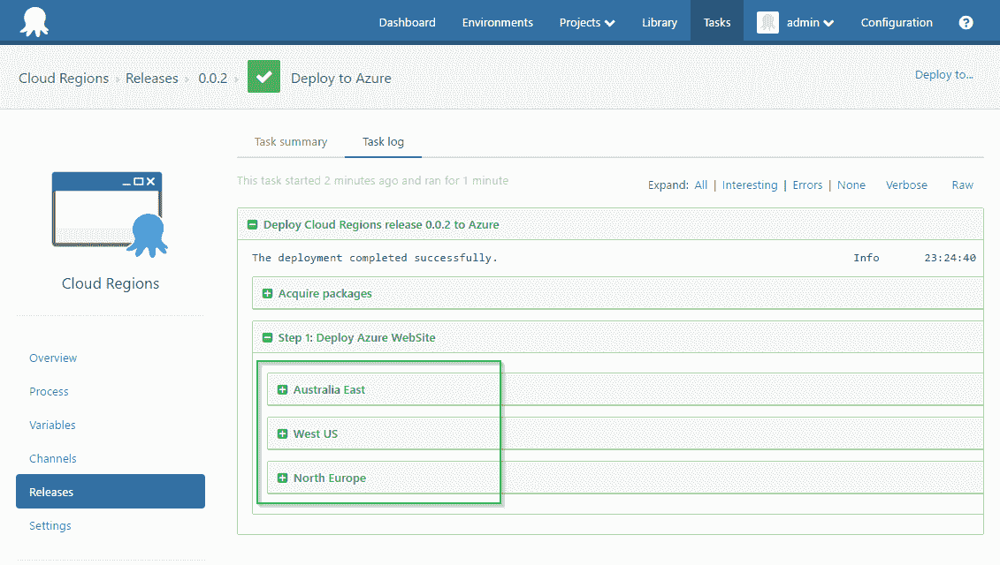

# RFC:云区域- Octopus 部署

> 原文：<https://octopus.com/blog/rfc-cloud-regions>

## TL；dr；

我们正在考虑引入一个新的目标类型，被称为云区。云区域目标将使在 Octopus 服务器上执行的步骤能够多次执行，变量的作用范围是每次迭代。这种设计支持的特定场景是将 Azure 步骤(Web 应用、云服务、PowerShell)部署到多个地区。

## 一点历史

在 Octopus Deploy 3.0 版本中，我们为 Azure 引入了两个特定的部署目标，即 Web 应用和云服务。然后我们[改变了我们的想法](https://octopus.com/blog/azure-changes)，在[3.1 版本](https://octopus.com/blog/octopus-deploy-3.1-pre-release#azure-step-types)中，回复到使用步骤而不是 Azure 部署的目标，放弃那些目标(尽管它们目前仍然可用)。

虽然我们对任何不便或困惑深表歉意，但我们总体上对这一变化非常满意。然而...

有一个场景，许多客户反映使用目标比步骤建模更好:将相同的组件(web app、云服务等)部署到多个 Azure 区域。在 3.0 模型中，他们简单地为每个区域创建了一个目标。目前，可以选择每个区域使用一个 Octopus 环境，或者每个区域使用一个 step。客户反馈说这两个选项都不可取。我们同意。这导致我们在删除已被否决的 Azure 目标时犹豫不决。

## 介绍云区域

创建新目标时，云区域将作为一个选项出现。

与任何目标一样，可以为云区域目标分配名称和角色。

云区域将出现在您的环境中，就像任何目标一样。

您可以像对待任何目标一样，将变量作用于它们。

但是现在你的 Azure 步骤要么只运行一次，*要么*为每个匹配指定角色的目标运行一次。

请注意在下面的部署 Azure Web 应用程序步骤中配置的角色和 Web 应用程序名称变量的使用。

部署步骤时，它将针对每个匹配的云区域目标运行一次。

**注意:**使用带有 Azure 步骤的云区域目标将是完全可选的。如果你目前正在使用 Azure 步骤，你不需要做任何改变。他们将完全按照目前的方式工作。

## 不仅仅是蔚蓝

尽管这种目标类型的动机来自 Azure regions，但是这些目标也可以被常规的*运行脚本*步骤使用。这意味着任何人都可以使用不同的变量值多次运行一个脚本步骤，而无需安装触须，从而利用云区域。例如，在生产和灾难恢复数据库服务器上运行相同的 SQL 脚本。

## 反馈

一如既往，我们非常重视您的反馈。

如果你目前使用的是被否决的 3.0 Azure 目标，我们特别想听听你的意见。我们不喜欢用两种方法来部署 Azure 组件(步骤和目标)。这让用户感到困惑，我们需要做更多的工作来维护。我们的希望是，这将解决区域问题，并允许我们(问心无愧地)逐步删除不赞成的 3.0 Azure 目标。