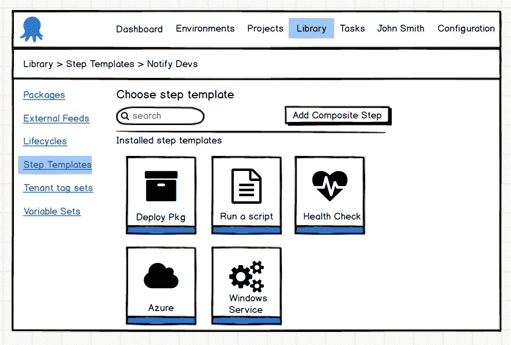
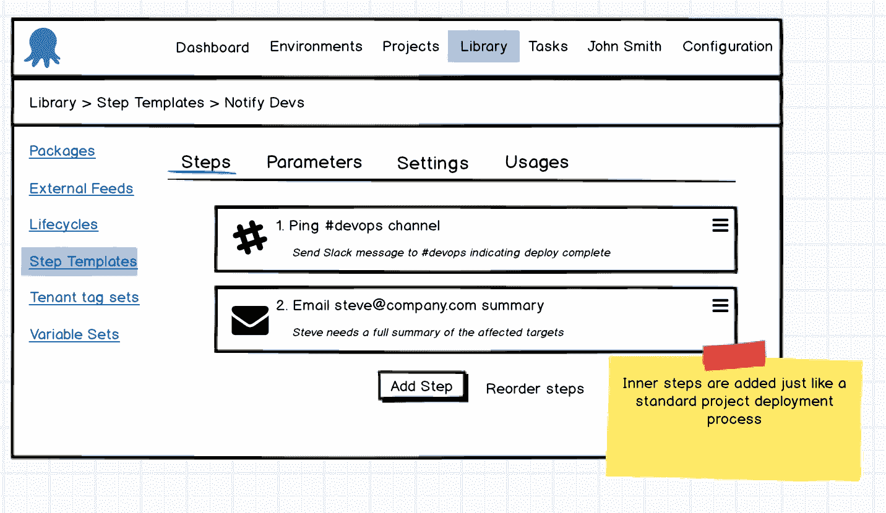
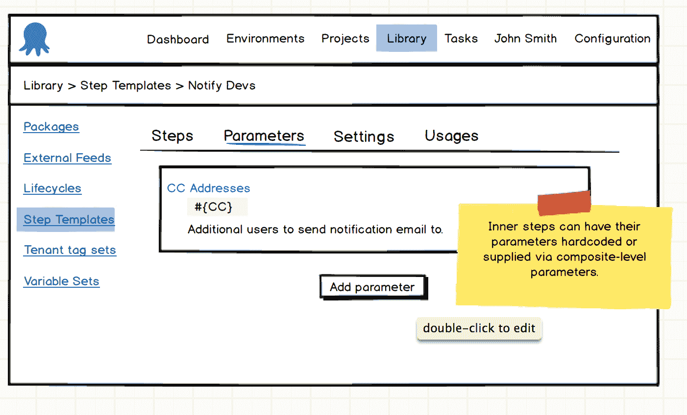
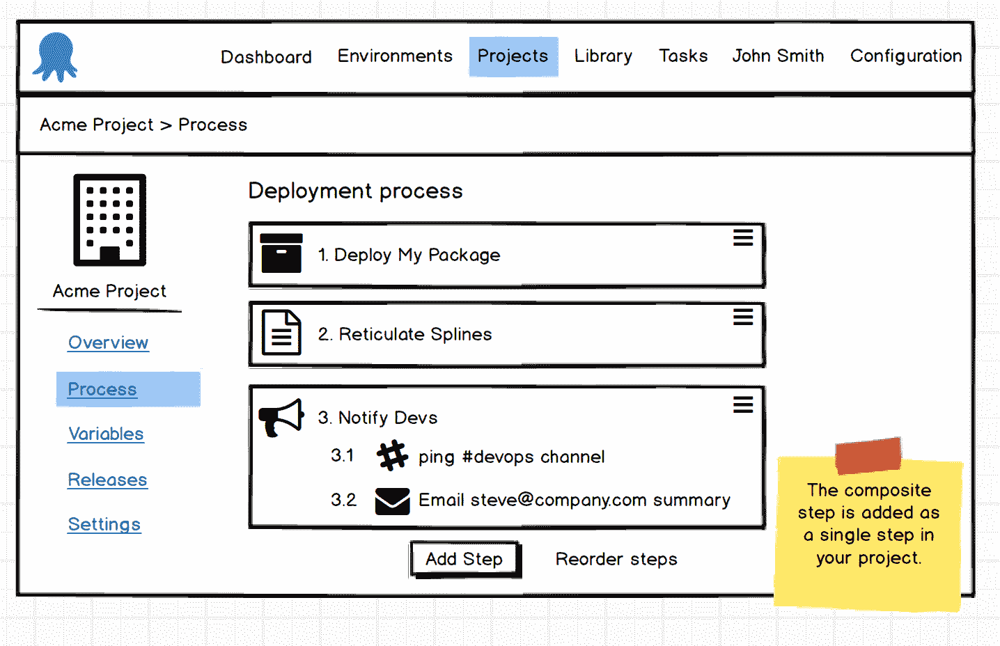

# RFC:复合步骤模板- Octopus 部署

> 原文：<https://octopus.com/blog/rfc-composite-step-templates>

## 复合步骤模板 RFC

[复合步骤模板](https://octopusdeploy.uservoice.com/forums/170787-general/suggestions/12948603-composite-step-templates)和相关提案[可继承模板](https://octopusdeploy.uservoice.com/forums/170787-general/suggestions/6559846-inheritable-templates)，是我们计划在未来几个月解决的两个用户声音建议。我们希望听取用户的意见，以确保我们以正确的方式解决您的问题。在整个 RFC 中，我们用粗体字突出显示了一些我们仍在考虑的问题(这些问题在内部引起了很多争论),我们希望听到您的想法，尤其是在您的部署和您所面临的问题的背景下。

### 这是什么？

通常情况下，您会有几个步骤需要一起包含在多个项目中。虽然将单个步骤转换成可共享的[步骤模板](https://octopus.com/docs/deploying-applications/step-templates)很容易，但是以单一统一的方式处理多个步骤通常需要较高的维护成本。也许您希望在整个项目中重用一组部署步骤，当需要添加新的包部署步骤时，这些步骤都应该得到更新。这就是复合步骤模板发挥作用的地方。通过有效地将多个步骤捆绑成一个单一的、可重用的步骤，该步骤可以包含在您的项目中(或者其他复合步骤模板！)，您可以减少整个系统中的重复配置，并确保跨项目的更改保持同步。

我们目前的计划包括创建和处理复合步骤模板，就像一个典型的步骤模板一样，只是有一些关键的不同。模板的内部细节由其他步骤组成，这些步骤可以是自定义步骤、其他步骤模板甚至是其他复合步骤模板！

 

当添加到项目中时，复合步骤模板被视为单个步骤块。有什么原因使单步阻塞概念对你不起作用吗？您是否希望能够在复合模板步骤之间运行项目级步骤？ 内部步骤的目标角色继承自项目步骤编辑屏幕上的项目级角色配置。**在项目层次上设置角色有意义吗，或者会导致比单独设置角色更复杂的问题吗？**您希望在项目级别上公开的任何参数都需要在复合级别上显式配置，否则将使用复合级别配置中显式提供的值。 ***您认为您会想要在项目级别上公开内部步骤参数吗？***

 

### 这不是什么

这些并不是完全成熟的项目模板，尽管您可以通过模板化部署所需的所有共享步骤来很好地实现这一点。共享变量最好通过创建一个共享库变量集来处理，这个库变量集已经存在。渠道目前仍需要在逐个项目的基础上进行管理。UserVoice 中的一些评论者认为这个解决方案与 TeamCity 构建模板类似。鉴于部署带来的不同背景，我们认为这不一定是同一个概念。

复合步骤模板功能并不旨在为您的部署提供安全性或业务遵从性。它们按照配置的顺序包含在您的部署过程中，不能重新安排步骤或在它们之间散布项目步骤。如果您希望确保在每次部署的开始或结束时都执行类似电子邮件步骤的操作，那么我们建议您编写自定义脚本来定期检查您的部署，以了解您业务中可能需要的所有变化。复合步骤模板是关于代码重用和共享部署配置的简化管理的。

尽管 UserVoice 的评论建议在模板更新时自动更新所有使用模板的项目，但我们认为，随着更好的解决方案[即将出现](https://github.com/OctopusDeploy/Issues/issues/2985)将解决[更新](https://octopusdeploy.uservoice.com/forums/170787-general/suggestions/6072178-when-updating-a-step-template-update-across-all)的问题，更新将很快通过更简单的手动升级过程得到更好的解决。

我们目前不认为导出复合步骤模板包含在该特性的第一个版本中。导出复合步骤模板会引发几个棘手的问题。**如果您导出由其他步骤模板组成的复合步骤模板，如果再次导入，该链接将如何保留？似乎您需要将内部步骤作为新的独立模板导入。除了现有的步骤模板导出之外，导出会提供更多的价值吗？**

## 问题

希望您可以看到这个特性在简化您的部署配置方面带来的一些好处。如您所知，我们仍有一些未解决的问题需要考虑，可能需要您的意见。将复合模板视为一个单独的步骤是否有意义，或者您是否认为有必要将它作为单独的步骤在项目级别上进行管理？如果有的话，内部步骤的参数应该如何在项目级别公开？让我们知道您认为我们遗漏了什么，并确保描述一些具体的问题，这些问题可能会解决，也可能不会解决，以便我们可以更好地制定未来的计划。