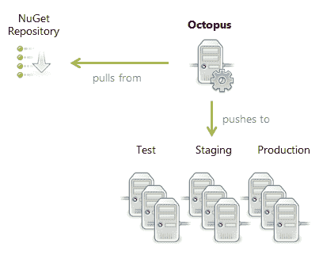
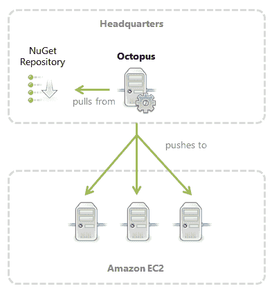
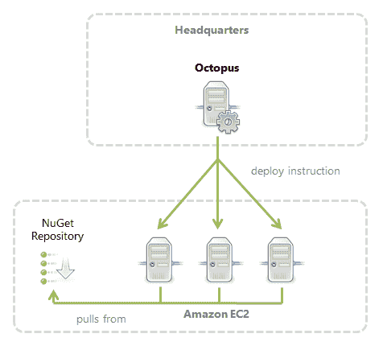

# RFC:改进部署流程- Octopus Deploy

> 原文：<https://octopus.com/blog/rfc-deployment-process-changes>

在这篇文章中，我想分享一些我正在考虑的对 Octopus Deploy 使用的部署工作流程的改变。

目前在 Octopus 中，任何部署都包括三个阶段:

1.  Octopus 服务器从 NuGet feed 下载所有必需的包
2.  Octopus 服务器安全地将包上传到所需的触角上
3.  部署步骤运行(包被提取和配置)

这可以总结为下图:

我们这样做的原因很简单:**包可能很大，上传它们可能需要很长时间**。我们不想部署一个包(例如，一个数据库模式更改)，然后等待 20 分钟，直到下一个包的上传完成，然后再继续。相反，我们上传一切，然后配置一切。

但是这种架构也有一些缺点，我将讨论这些缺点以及我正在考虑的一些解决方案。

## 上传前的步骤

这种架构的第一个问题是，在上传包之前，目前不可能运行任何步骤(包括专门的 PowerShell 脚本)。这阻止了使用脚本来完成有用的任务，如建立 VPN 连接。最好插入在下载/上传活动发生之前运行的步骤。

## 带宽

由于 Octopus 将每个包的副本推送到相关的触角，因此可能会浪费很多带宽。例如，想象一个场景，Octopus 服务器在本地网络中，它被部署到云中的许多机器上。同一个包将在互联网上推送多次:

另一种节省带宽的方法是将包复制到云中的 NuGet 服务器上，让每个触手从服务器上提取包:

当使用 DNS 或分布式文件系统部署到不同数据中心的机器上时，这种架构也可以很好地工作，以确保机器选择离它们最近的 NuGet 服务器。

## 改进部署流程

为了支持这些场景，我考虑对部署流程进行两项更改。

第一个是**预包上传步骤**的概念，它将在下载 NuGet 包之前运行。您可以在这里添加 PowerShell 步骤，以便在包下载过程开始之前建立 VPN 连接或执行其他任务。

第二个变化是软件包步骤设置中的一个选项，让 Tentacles 直接下载软件包。八达通不是下载软件包，而是指示触手下载软件包。下载会在部署步骤运行之前发生(同样，这样我们就不用在部署步骤之间等待复制包)，但是它们会直接到达 NuGet 服务器。

希望这些变化能使分布式环境中的部署变得更加容易。我很乐意在下面的评论框中得到您对提议的更改的反馈。