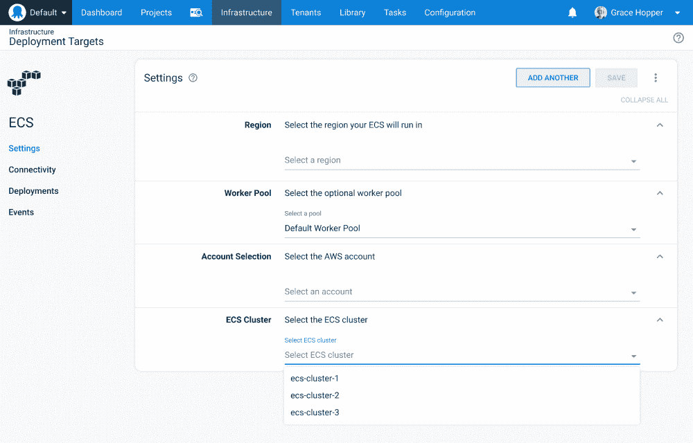
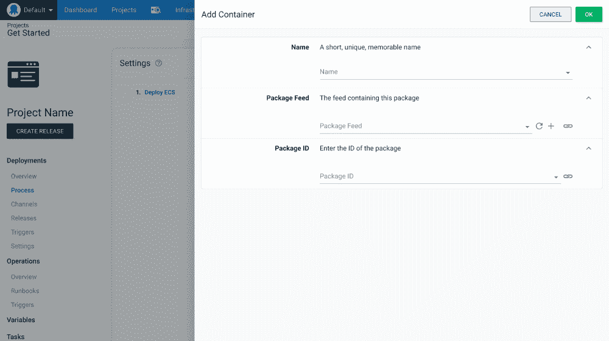
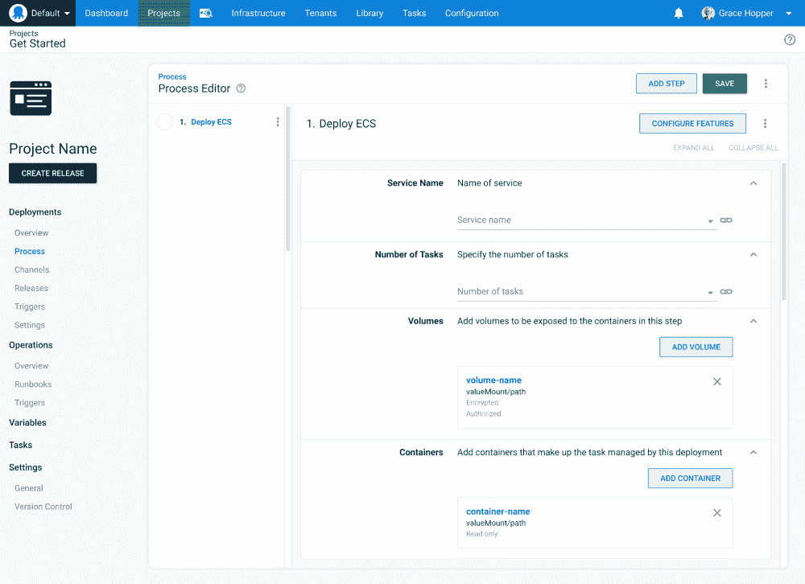
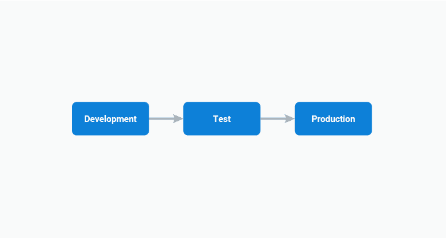
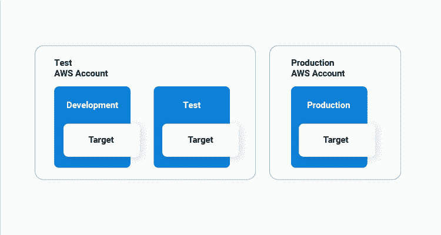
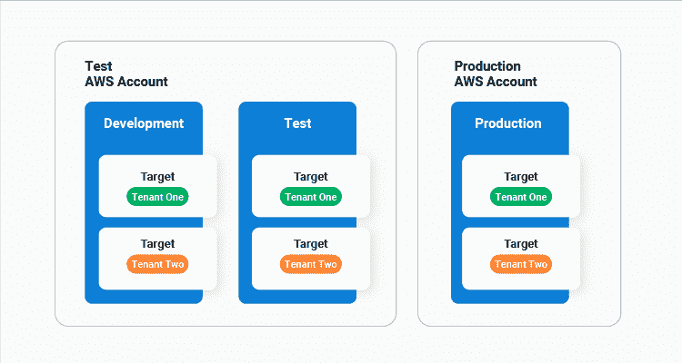
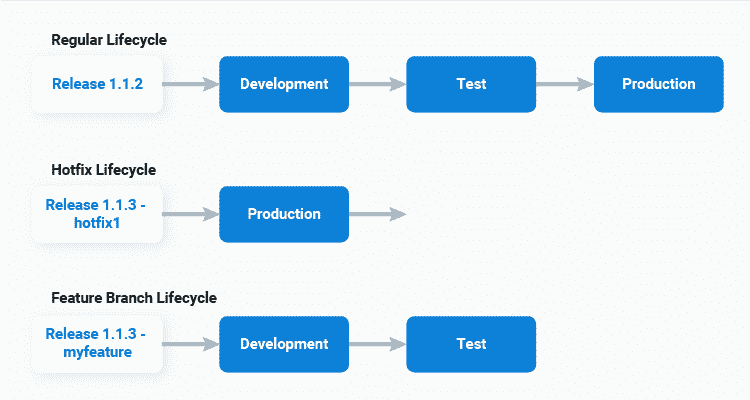
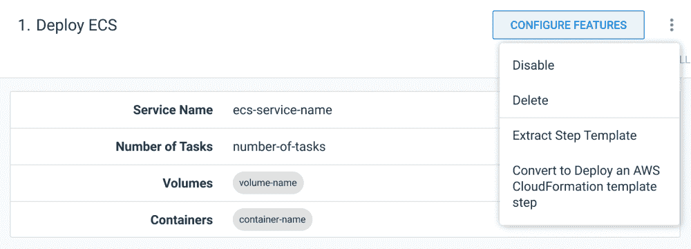

# 征求意见- ECS 与 Octopus 集成- Octopus 部署

> 原文：<https://octopus.com/blog/rfc-ecs-integration-with-octopus>

Octopus 是实现世界级部署的工具。我们一直拥有业界领先的功能来部署到您的内部基础架构，并且我们多年来一直支持 Azure 应用程序部署。

最近，我们扩展到其他主要的云服务提供商，允许您使用 Kubernetes 和 Terraform 等工具部署到 Azure 和 AWS。但是我们可以做得更多——仍然有 Octopus 没有提供一流集成的云原生服务。

我们希望 Octopus 成为您的首选，无论您是部署在本地、云还是两者的混合。这意味着为更多云原生服务产品提供一流的支持，从而简化复杂的部署。

为了实现这一目标，Octopus 建立了一个团队，致力于将 Octopus 与最受欢迎的云原生服务相集成。经过几个月的开发框架，使这些集成能够快速交付，我们现在可以与我们的客户，合作伙伴和其他内部八达通部门分享我们的目标和计划。

我们希望这个博客是许多征求意见(RFC)帖子中的第一个，在那里我们讨论提议的功能并提供反馈的机会。

我们被反复要求支持的一项云服务是 AWS ECS，这篇文章概述了我们目前正在讨论的一些新步骤和目标。

## 我们建议如何提供一流的 ECS 支持

[亚马逊将弹性容器服务(ECS)描述为](https://docs.aws.amazon.com/AmazonECS/latest/developerguide/Welcome.html):

> 一种高度可伸缩的快速容器管理服务，可以轻松运行、停止和管理集群上的容器。您的容器在任务定义中定义，用于运行单个任务或服务中的任务。

Octopus 已经提供了许多功能来协调容器部署，包括通过 feeds(包括 ECR feeds)使用 Docker 图像的能力，以及通过帐户安全存储 AWS 凭证的能力。通过针对 AWS CLI 编写脚本，即使不方便，现在也有可能*部署到 ECS。但是我们可以做得更好。*

### 一个新的 ECS 目标

提议的 ECS 支持从一个代表 ECS 集群的新目标开始。该目标引用用于访问 ECS 集群的 AWS 凭据、AWS 区域和集群名称:

*ECS 目标实体模型。*

### 新的服务部署步骤

概括地说，将应用程序部署到 ECS 集群需要三个组件。

首先你需要一个 Docker 图片。我们设想您的持续集成(CI)服务器将继续构建、标记和部署这些映像到 Docker 注册表。

然后一个[任务定义](https://docs.aws.amazon.com/AmazonECS/latest/developerguide/task_definitions.html)引用一个特定的图像标签，并为生成的容器定义许多设置，比如内存和 CPU 需求、环境变量、公开的端口等等。任务定义是不可变的，每个新的图像标签必须由任务定义的新版本捕获。

然后一个[服务](https://docs.aws.amazon.com/AmazonECS/latest/developerguide/service_definition_parameters.html)引用一个任务定义，以及额外的运行时细节，比如运行多少个实例，实例如何在集群中分布，在哪个 VPC 中运行，负载平衡器和伸缩需求。

我们提议的步骤提供了一个自以为是的部署工作流，它将一个 [Fargate](https://aws.amazon.com/fargate/) 任务定义和服务合并到一个步骤中。

您将从定义贡献给任务定义的值开始。值得注意的是，与 AWS 控制台不同，在此步骤中定义的 Docker 映像不包括标记，因为映像标记的选择将推迟到创建发布之后:

*显示 Docker 图像选择的步骤实体模型。*

同一步骤定义了服务属性的值:

*显示服务属性和任务定义容器的步骤模型。*

然后，ECS 部署将执行以下流程:

1.  创建发布时，选择要在任务定义中定义的 Docker 图像标签。
2.  使用特定于部署到给定环境的详细信息创建新的任务定义。
3.  使用步骤 2 中的任务定义配置服务。

## 拟议方法的好处

上述目标和步骤旨在帮助那些协调 ECS 部署的人落入成功的陷阱，我们将其总结为[务实部署的十大支柱](https://octopus.com/blog/ten-pillars-of-pragmatic-deployments)。

在这第一个里程碑中，我们特别关注基础，包括实现:

所有这些特性的核心思想是，部署将通过一系列[环境](https://octopus.com/docs/infrastructure/environments)进行，规范环境集包括开发、测试和生产环境。

尽管 ECS 没有环境的概念，因此为了实现[可重复部署](https://octopus.com/blog/ten-pillars-of-pragmatic-deployments#repeatable-deployments)，我们必须对新的步骤和目标进行建模，以促进环境进展，同时考虑到诸如[环境范围变量](https://octopus.com/docs/projects/variables#scoping-variables)和[更新发布快照的能力](https://octopus.com/docs/octopus-rest-api/examples/releases/update-release-variable-snapshot)等因素。

### 为什么使用目标？

通过将 ECS 集群的详细信息捕获为一个[目标](https://octopus.com/docs/infrastructure/deployment-targets)，它被限定在一个环境的范围内，并由一个[角色](https://octopus.com/docs/infrastructure/deployment-targets#target-roles)公开，将在哪里进行部署的具体细节被从步骤中提取出来。一个步骤简单地定义它部署到的目标角色，Octopus 将确保部署发生在当前环境的正确范围的目标上。

我们认为，如果您希望采用 AWS 推荐的关于使用多个帐户的一些[最佳实践](https://aws.amazon.com/blogs/mt/best-practices-for-organizational-units-with-aws-organizations/)，这将是非常有益的:

> AWS 帐户为您的 AWS 资源提供了自然的安全性、访问和计费边界，并使您能够实现资源独立性和隔离。

对于 ECS 目标，无论是将多个逻辑环境部署到一个共享的 ECS 集群，为每个环境部署一个专用集群，还是将多个环境划分到多个 AWS 帐户，都没有什么区别。只需将每个 ECS 目标指向适当的群集，您的部署就可以跨您使用的任何环境分区进行扩展:

【T2 

### 抽象出任务定义版本

如果您曾经部署过一个新的 Docker 映像，首先创建一个新的任务定义版本，然后更新服务以引用它，那么您就会理解手动 ECS 部署是多么乏味。

我们的目标是让新的 ECS 部署只涉及创建一个 Octopus 版本和选择要包含的新 Docker 图像标签。通过为每个部署创建一个新的任务定义，我们消除了部署到 ECS 的人员考虑任务定义的需要。

无论您的任务定义是否包含特定于环境的值，或者每个环境是否由新 AWS 帐户中的一个集群表示，都没有关系，因为 Octopus 将代表您创建必要的任务定义。这简化了您的工作流程，以便:

*   创建新的 Docker 图像
*   用这些 Docker 图像创建一个 Octopus 版本
*   在您的环境中推广您的版本

它还确保您可以[通过重新部署旧版本从失败的部署](https://octopus.com/blog/ten-pillars-of-pragmatic-deployments#recoverable-deployments)中恢复。

### 租户和渠道的高级部署

提议的步骤和目标还集成了高级 Octopus 特性，如[租户](https://octopus.com/docs/deployments/patterns/multi-tenant-deployments)、[通道](https://octopus.com/docs/releases/channels)和[生命周期](https://octopus.com/docs/releases/lifecycles)。

新的 ECS 目标可以针对租户，再次从步骤中抽象出部署位置的细节，并将其封装在目标中:

同时，渠道规则可应用于 Docker 图像标签，通过生命周期促进部署模式，如热修复，允许直接部署到生产环境:

### 退回到云层结构

在幕后，新的步骤将生成 CloudFormation 模板，然后为您执行。这确保了所有资源都可以用现有的云生成工具进行审计和跟踪。

然而，任何固执己见的步骤最终都会遇到它不支持的用例。对于那些有特殊需求的人，或者对于那些不适应建议步骤的人，我们将提供将固执己见的步骤转换成原始 CloudFormation 模板的能力。

只需在溢出菜单中选择 **Convert** 选项，该步骤将被转换为 CloudFormation 部署步骤，让您完全控制您的 ECS 部署，而无需从头开始重新创建它们:

*步骤模型，显示从固执己见的步骤到原始 CloudFormation 模板的转换。*

为了允许部署具有 Docker 图像引用的 CloudFormation 模板(这是一个常见的场景，其中有 [EKS](https://aws.amazon.com/eks/) 、 [ECS](https://aws.amazon.com/ecs/) 、 [Lightsail](https://aws.amazon.com/lightsail/) 、 [Lambdas](https://aws.amazon.com/lambda/) 和 [AppRunner](https://aws.amazon.com/apprunner/) ))，**部署 AWS CloudFormation 模板**步骤将被更新以支持[附加包引用](https://octopus.com/blog/script-step-packages)。这允许在 CloudFormation 模板中定义和引用 Docker 图像，同时将图像标签选择推迟到发布创建时间。

## 第一个 ECS 里程碑的范围是什么？

我们的目标是增量发布 ECS 集成，让客户更快地获得该特性，并收集早期采用者的反馈。

上面建议的步骤是我们对这一新功能发展方向的高层次审视，但第一个里程碑可能会有以下限制:

*   将步骤限制为仅部署到 Fargate。
*   仅支持滚动部署，不支持集成 CodeDeploy 蓝/绿部署。
*   不提供构建新负载平衡器的能力。
*   排除自动缩放设置。
*   排除应用网格和 FireLens 设置。
*   排除服务自动发现设置。
*   仅创建服务，不支持任务或计划任务。

这些特性可能会包含在后续的里程碑中，所以请关注新的 RFC 帖子。

## 这个什么时候发布？

我们仍处于早期规划阶段，ECS 支持目前还不是一个确定的功能，所以我们不能提供发布日期。请关注[博客](https://octopus.com/blog/)以获取进一步的公告。

## 我们需要您的反馈

ECS 支持仍处于规划阶段，因此现在正是利用您的反馈来帮助塑造这一新功能的大好时机。我们创建了一个 [GitHub 问题来捕捉讨论](https://github.com/OctopusDeploy/StepsFeedback/issues/1)。

具体来说，我们想知道:

*   建议的步骤和目标是否适用于您的 ECS 部署？
*   你的 ECS 架构是什么样子的？
*   你有多个集群吗？
*   你有多个 AWS 账户吗？
*   您正在部署哪些类型的应用程序？
*   您希望 Octopus 能为您解决哪些 ECS 部署挑战？

这些反馈将有助于我们提供最佳解决方案。

## 结论

总之，我们提议的 ECS 支持的第一个里程碑包括:

*   模拟环境和租赁部署的新目标。
*   将任务定义的创建/更新与服务的创建/更新相结合的新步骤。
*   将固执己见的步骤转换成原始云形成模板的能力。
*   跨环境的简化部署工作流，支持特定于环境的变量、渠道和生命周期。

感谢你阅读这篇文章。我们希望您和我们一样对建议的新 ECS 功能感到兴奋。

非常感谢您的任何反馈。

愉快的部署！