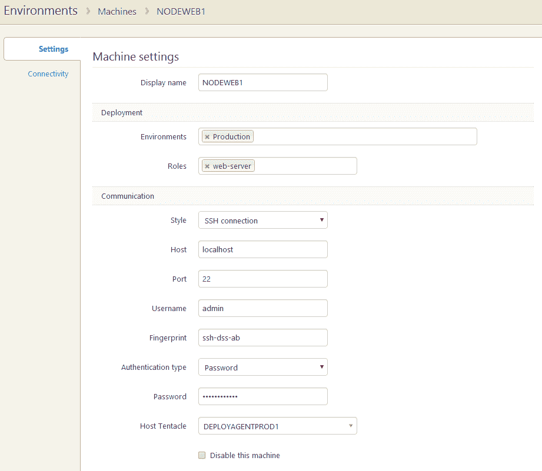
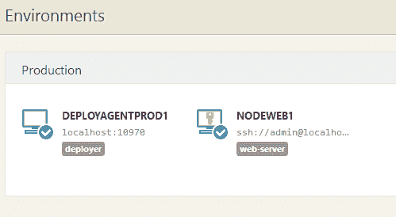
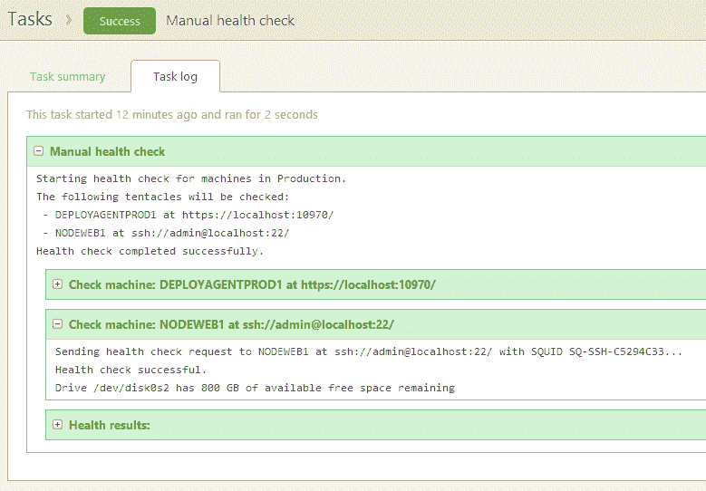
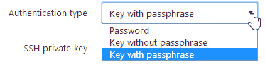
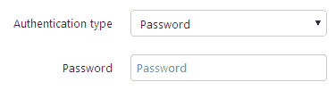
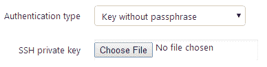
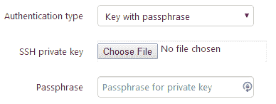

# RFC: Linux 部署——Octopus 部署

> 原文：<https://octopus.com/blog/rfc-linux-deployments>

目前我们投票最高的 [Uservoice 想法](https://octopusdeploy.uservoice.com/forums/170787-general/suggestions/5730566-linux-support)是在 Octopus 中增加对 Linux 部署的支持。我们将通过添加对运行 SSH 的服务器的一流支持来实现这一点，这将非常接近今天使用 Octopus 的 Windows 部署的工作方式。


为此，我们将在 Octopus 中引入一个新术语，*。无代理的机器将不会运行触手，而是使用不同的通信方法，例如 SSH。*

 *我们的 RFC 目标是确保我们实现这一特性的方式适合最广泛的客户。

### 无代理机器简介

在 Octopus 中设置一台新的无代理机器，例如运行 SSH 的 Linux 服务器，其工作方式与添加一台运行触手的新机器相同。

**添加无代理机器**

通过选择 *SSH* 而不是*监听*或*轮询*作为通信方式来配置无代理机器。



**无代理机器环境**

无代理计算机就像普通触须一样出现在“环境”页面上，显示它们的位置和状态(在线/离线)



**检查无代理机器的运行状况**

典型的 Octopus 任务，如健康检查、特别脚本等，可以在所有适当的机器上运行，包括触手和无代理机器(如果两种类型都使用的话)。



#### 证明

我们的目标是为 SSH 目标机器支持以下认证类型



**密码**



**无密码的密钥**



**带有密码短语的密钥**



*私钥将作为加密属性存储在 Octopus 数据库中。*

### 网络拓扑结构

不会直接从 Octopus 服务器连接到无代理机器；取而代之的是，一个或多个触角将用于与机器进行出站连接。我们计划在 Octopus 服务器上添加一个隐藏的、运行在低特权进程中的“影子”触手，作为一个方便的默认设置，但是使用特定的触手来处理不同的网络拓扑也是我们正在考虑的一个功能。

### 无代理机器上的 Octopus 足迹

Octopus 会在进行任何部署之前将压缩包上传到目标机器上，所以我们需要目标机器上的一些本地存储空间，这些存储空间将转到`~/.tentacle/`。我们还将把包解压到一个默认的位置，就像我们在一个触手机器上所做的一样，例如`~/.tentacle/apps/{environment}/{project}/{package}/{version}`，并且我们还将支持自定义的安装位置来将文件移动到其他地方。

### 包装采购

因为执行 SSH 部署需要一个触手机器，所以这些部署的包获取将与今天使用 Octopus 的 Windows 部署略有不同。

触手机器将提取 NuGet 包并创建一个`.tar.gz` tarball，然后上传到目标机器。

触手机器可以与目标机器位于同一位置，以优化带宽使用，即 Octopus 将包上传到触手，触手再将包发送到目标机器。

### 部署

包部署步骤将完全通过目标机器上的单个 shell 会话来运行。

1.  我们将检查并确保八达通脚本是最新的
2.  包和支持部署文件将通过 SCP 上传
3.  将执行部署业务流程脚本
4.  如果默认安装目录不存在，将创建该目录
5.  tar 文件将被解压缩
6.  `predeploy`会跑
7.  如果已经指定了自定义安装目录
    *   如果在部署前清除目录的选项为真，我们将清除自定义安装目录
    *   将提取的文件复制到自定义目录
8.  `deploy`会跑
9.  `postdeploy`将运行
10.  运行保留策略来清理旧部署
11.  删除 Octopus 变量文件(确保敏感变量不会留在服务器上)

**部署脚本**

主要的部署编排脚本将用 bash 编写，因为这是*nix 发行版中最少的共同点。这个脚本将寻找用户可以创建的`predeploy` / `deploy` / `postdeploy`脚本，如果它们存在，就执行它们。

`predeploy` / `deploy` / `postdeploy`脚本可以用用户偏好的脚本语言编写(但是用户必须确保它安装在运行部署的服务器上)。

*   `predeploy`
    *   部署前需要运行的任务，例如应用程序所需的配置转换。
*   `deploy`
    *   实际部署应用程序所需的任务。
*   `postdeploy`
    *   部署后需要运行的任务。例如，清理应用程序部署期间创建的任何临时文件。

工作目录将是预先部署脚本的默认安装目录，也是部署和后期部署脚本的默认或自定义安装目录。

**部署的环境变量**

Octopus 拥有比 Linux 环境变量所能支持的更复杂的变量系统和语法。不得不在像`Octopus.Action[Install website].Status.Code`这样的名字和有效的 POSIX 等价物之间进行映射，这看起来很不舒服，而且容易出错。大型 Octopus 部署也倾向于携带大量的*变量，所以我们不愿意将这些任意地放入部署脚本运行的环境中。*

与直接设置环境变量不同，部署脚本将可以访问一个`tentacle`命令，该命令可用于检索它们需要的值。例如，要检索部署使用的自定义安装目录，用户可以像这样调用`tentacle`命令:

```
DEST=$(tentacle get Octopus.Action.Package.CustomInstallationDirectory) 
```

这声明了一个环境变量`DEST`来保存定制安装目录(随后作为`$DEST`可用于脚本)。

使用`"`引号可以支持带有嵌入式空格等的值。

尽管我们不太可能在该命令的第一个版本中实现它，但我们正在考虑一些更复杂的特性，如迭代:

```
for ACTION in $(tentacle get "Octopus.Action[*]")
do
    echo "The status of $ACTION was $(tentacle get "Octopus.Action[$ACTION].Status.Code")"
done 
```

这突出了我们看到的使编写部署脚本变得更加愉快的机会。

### `tentacle`命令的其他功能

使用`tentacle`助手还将提供对在 *Windows* 机器上使用*PowerShell*cmdlet 支持的命令的一致访问。

**设置输出变量**

可以使用`tentacle set`将输出变量发送到 Octopus 服务器:

```
tentacle set ActiveUsers 3 
```

或者:

```
ps -af | tentacle set RunningProcesses 
```

**收集工件**

可以使用`tentacle collect`将目标机器上的文件收集为 Octopus 工件:

```
tentacle collect InstallLog.txt 
```

**送入工具**

当我们(或其他人)提供助手脚本时，这些脚本本身需要访问变量、路径等等，可以使用`tentacle exec`调用这些脚本:

```
tentacle exec xmlconfig Web.config 
```

### 部署功能

XML 配置转换/appsettings 支持等功能将在目标机器上运行。

支持 Octopus 脚本和可执行文件将是目标机器上默认文件夹结构的一部分，即`~/.tentacle/tools/`，在这个文件夹中，我们还可以包含使用 Mono 进行支持的助手应用程序。特定于. NET 的约定，如 XML 配置转换/appsettings。

我们还可以包括不同的脚本/可执行选项来支持其他部署功能。

### 保留策略

部署完成后，我们将应用为项目指定的保留策略，就像我们处理 Windows 部署一样。

用户可以指定保留若干天的部署，或者特定数量的部署。如果指定了其中任何一项，我们将删除不在指定保留策略范围内的任何文件。

### 系统需求

Linux 发行版的默认配置和可用的软件包可能会有很大的不同。我们的目标是选择一个得到广泛支持的基线，使 Octopus 能够部署到几乎任何当前的 Linux 发行版上。

我们对目标机器的基本假设是:

*   可以使用 SSH 和 SCP 访问它
*   用户的登录 shell 是 Bash 4+
*   `tar`可用

我们自己计划构建和测试的平台有:

*   *亚马逊 Linux AMI 2014.03*
*   *LTS Ubuntu 服务器 12.04*

我们将尽最大努力保持发行版无关性，但是如果您能够为您自己的服务器选择这些选项中的一个，您将帮助我们提供有效的测试和支持。

### 未解决的问题

1.  管理特定于平台的路径
    *   当应用程序同时部署到 Windows 和 Linux 服务器时，需要为 Linux 和 Windows 分别指定“自定义安装目录”等路径。我们能让这种体验变得更好吗？
2.  部署脚本的命名
    *   预先部署/部署/后期部署，或
    *   预先部署/部署/后期部署，或
    *   pre_deploy/deploy/post_deploy？
3.  默认情况下，我们将上传包和提取包的路径的定制
    *   有必要通过 Octopus 进行配置吗，或者像`~/.tentacle/apps`这样的位置可以根据需要由管理员链接到其他位置吗？
4.  像我们在 PowerShell 中一样写出变量
    *   在 PowerShell 中，我们首先使用 DPAPI 对它们进行加密，在 Linux 上有类似的标准加密功能吗？

### 我们需要你的帮助！

我们真正希望的是，已经在 Octopus 中使用 SSH 的客户，或者希望开始使用 SSH 的客户，能够就我们如何在 Octopus 中实现 SSH 部署的计划给我们提供反馈。

无论是对上面建议的实现的改进，还是如果我们已经做出了*假设*认为**无法工作**，那么请在下面的评论中告诉我们。*