# RFC -多租户- Take 2 - Octopus 部署

> 原文：<https://octopus.com/blog/rfc-multitenancy-take-two>

更新:多租户部署将作为 Octopus Deploy 3.4 的一部分推出，Beta 2 已经发布！参见 [3.4 Beta 2 博客文章](https://octopus.com/blog/octopus-deploy-3.4-eap-beta2)了解最新信息。

**这是对[原始 RFC 的后续 RFC，旨在更好地支持 Octopus Deploy](https://octopus.com/blog/rfc-multitenancy) 中的多租户部署。**

Octopus Deploy 旨在部署软件版本，并通过一系列具有可重复结果的环境来推广它们。Octopus 很好地模拟了这种典型的场景，但是它不适合多租户应用程序。

我们之前的提议探索了标记环境的概念，以使处理许多环境更容易。这个 RFC 将探索如果我们实现了**租户一级概念**而不是*环境假装是租户*，Octopus Deploy 会如何表现。

## 概述

这是一个很大的 RFC，但也是一个很大的特性集！我们鼓励您花时间了解我们的提议，以及它将如何影响您的情况，并帮助我们把握方向！

## 为什么是另一个 RFC？

参与 RFC 过程最棒的一点是，你真的可以对 Octopus Deploy 的发展方向产生重大影响。有几个引人注目的特点促使我们起草了另一份 RFC:

*   **租户感知生命周期**，您希望确保在将某个版本部署到`Tenant 1`的`Production`环境之前，已经将该版本部署到`Tenant 1`的`Staging`环境，对所有租户也是如此。
*   **更容易防泄漏的**，你要确保你不会意外地将`Tenant 1`的发布部署到属于`Tenant 2`的环境中。
*   **以租户为中心的工作流**您希望从租户的角度管理租户及其项目、环境、变量和部署。

我们可以使用环境标签来构建这些特性，但是我们很快发现实现的复杂性在增加，更不用说试图描述如何配置 Octopus 来实现这些引人注目的特性了。将租户视为一级概念使得这些特性更容易实现，*也更容易解释*。

别忘了，Octopus Deploy 是为少数环境设计的。引入**租户**意味着我们可以引入一些功能，使处理**大量租户**变得更容易，而**可以重新管理少量环境**！

## 与原始 RFC 的差异？

你可能会注意到这两种设计有很多相似之处。如果你还没有阅读原始 RFC，我们强烈建议你阅读。在大多数情况下，你可以简单地将任何*环境——假装是租户*替换为*租户——一级概念*:

*   核心问题是[多租户是痛苦的](https://octopus.com/blog/rfc-multitenancy#multi-tenancy-is-painful)没有改变
*   通过使用租户标签而不是环境标签将租户视为租户组，您仍然可以更容易地管理大量租户
    *   为了使使用标签更容易，你可以用颜色来标记你的标签
*   生命周期将恢复到今天的工作方式，明确地将环境添加到阶段中，但是生命周期可以成为租户感知的，以确保您在投入生产之前安全地将版本提升到每个租户的暂存环境中(例如)
*   仪表板仍然可以以类似的方式[进行聚合](https://octopus.com/blog/rfc-multitenancy#improved-dashboards)，但是我们可以让它更像一个数据透视表，您可以从租户、版本或环境中选择两个选项来定制您的视图
*   您仍然可以定义[变量模板](https://octopus.com/blog/rfc-multitenancy#managing-variables)，但是不是在*环境上定义值——假装是租户*,而是在租户本身上定义它们
*   [变量检查器](https://octopus.com/blog/rfc-multitenancy#variable-inspector)仍然可以像我们最初提议的那样工作
*   您可以显式地将租户映射到项目，而不是通过生命周期隐式地将租户映射到项目

您可能还会注意到一些额外的引人注目的功能，用于通过 Octopus Deploy 管理多租户部署，以及一些令人愉快的增强功能，这些增强功能与*租户即一流概念*很有意义。

更困难的一件事是迁移过程。有了每租户环境，就不需要迁移了——您只需开始额外使用新功能。对于租户即第一类概念，您需要将某些环境转换为租户，并带来某些变量集/变量。

## 我们建议如何处理 Octopus 部署中的多租户问题

### 作为一流概念的模型租户

我们建议将**租户**建模为一级概念，而不是将环境或项目纠结成一个形状来实现多租户部署。您可以:

*   创建和管理租户
*   为每个租户指定应该将哪些项目部署到哪些环境中
*   管理特定于每个租户的变量
*   定义租户感知的生命周期

像往常一样，我们希望多租户是一个附加的功能集:如果你不需要多租户，你的八达通体验将与今天一样*除了一些将使每个人受益的功能*。

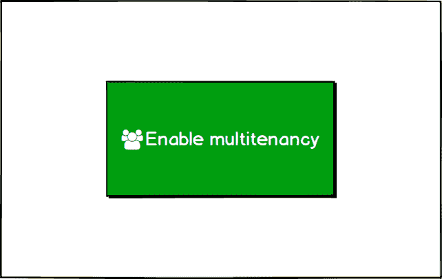

一旦您启用了多租户部署，该界面可以向主菜单栏添加一个**租户**选项卡，您可以在这里管理您的租户。

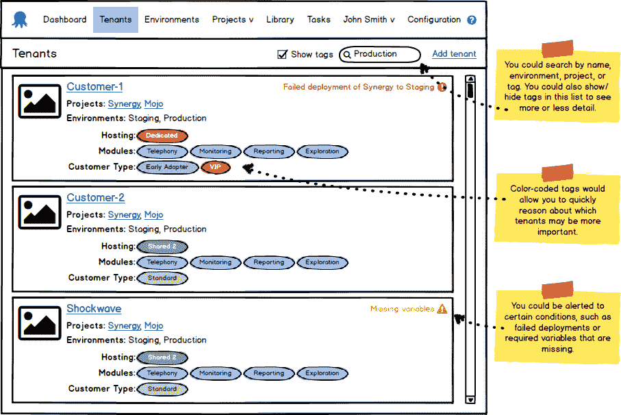

您可以给每个租户一个名称和徽标，以便在列出租户时更容易区分。您还可以为每个租户明确定义将哪些项目部署到哪些环境中。在这种情况下，*将把`Synergy`和`Mojo`项目部署到`Staging`和`Production`环境中。*

***这是我们希望得到[反馈](#leave-a-comment)的特定区域:这种链接应该有多精细？如果租户有一个试运行和生产环境，这是否适用于所有项目？或者您希望为每个项目选择特定的环境？***

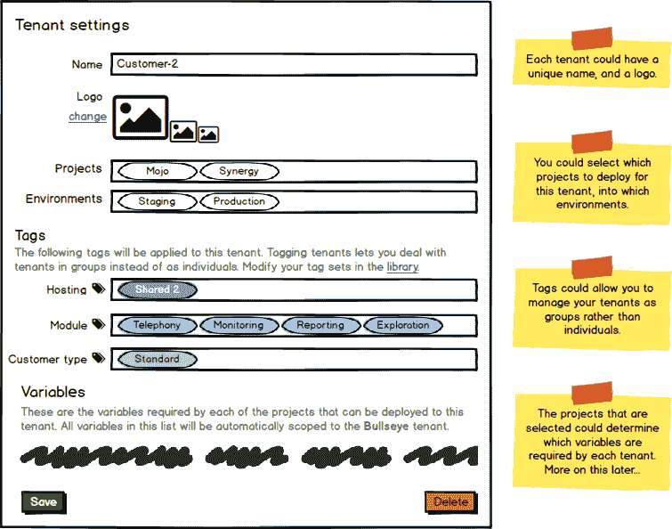

当你有很多租户时(这是一个很大的问题),和他们单独工作是很痛苦的。我们(仍然)建议引入**标签**来支持这些类型的场景。您可能已经注意到，我们已经为上面的`Customer-2`定义了几个标签，在本例中，作为一个具有已定义模块的`VIP`租户，托管在`Shared 2`托管组/集群/服务器场中。

首先，您可以通过在库中创建标签集来确定您想要使哪些标签可用，并为每个标签集创建有效的标签列表。创建哪个标签集和标签完全由您决定。在本例中，我们创建了几个标记集，每个标记集代表我们希望在整个 Octopus 部署中利用的不同属性。

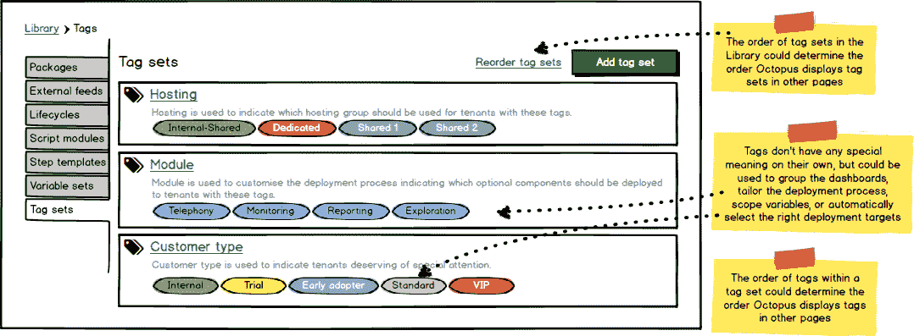

*请注意，这些标签目前意义不大——请继续阅读，看看如何利用这些不同的属性来实现一些引人注目的场景，尤其是当您的标签集代表正交关注点时。*

*还要注意标签是一个附加特性:如果你没有定义任何标签集，Octopus 不会提示你与标签有关的任何事情。*

如果您有很多租户，那么如果您能够管理哪些标签被批量应用到租户，事情会简单得多。这将使您能够添加一个新的标记集，并非常快速地为您的所有租户添加适当的标记。

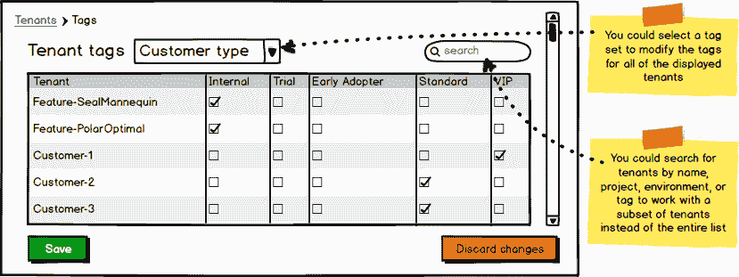

一旦您配置了一些标签集并标记了一些租户，Octopus 就可以按标签集聚集租户页面。您可以按名称或标签搜索租户，或者直接钻取其中一个标签并显示匹配的租户。

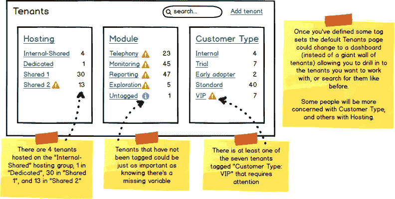

### 改进的仪表板

将租户作为一级概念，Octopus 可以使仪表板更像一个数据透视表，您可以从项目、环境、租户/标签集中进行选择。考虑一个**项目/环境**(目前的默认设置)的例子，Octopus 可以聚集关于每个组的最重要的信息，包括租户的数量、组的整体状态(如果需要的话，可以用指示器来引起您的注意)、已经部署到所包含的租户的版本范围，以及向所包含的租户推出最新版本的进度。

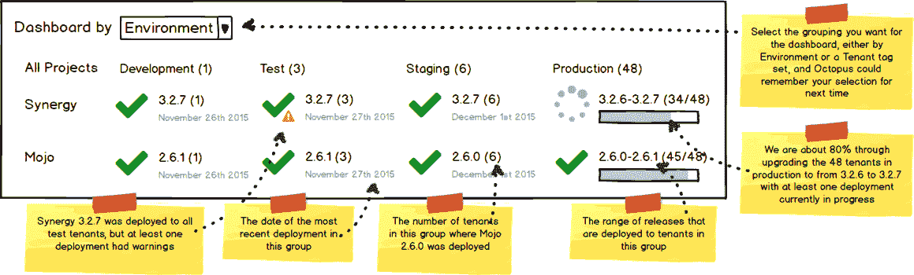

有些人可能对**项目/客户类型**或其他集合更感兴趣。

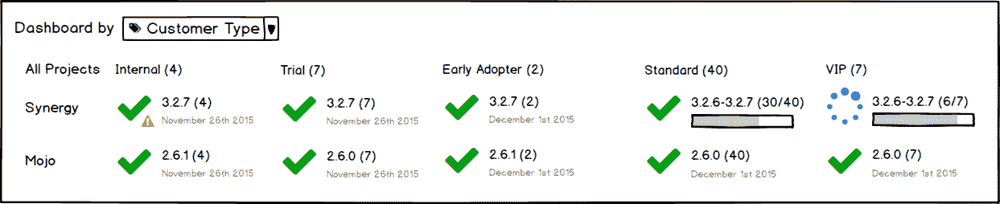

类似地，项目概述可以按环境或租户/标签集分组，以显示今天的发布历史。

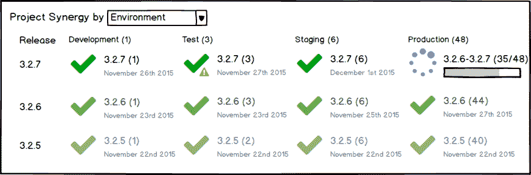

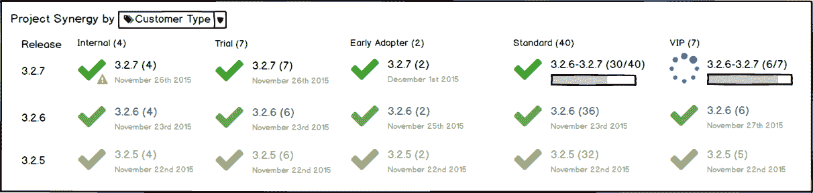

### 部署到租户

Octopus 还可以使生命周期**租户感知**阻止您在`Customer-1`将项目部署到`Production`环境，直到您在`Customer-1`将项目部署到`Staging`环境。

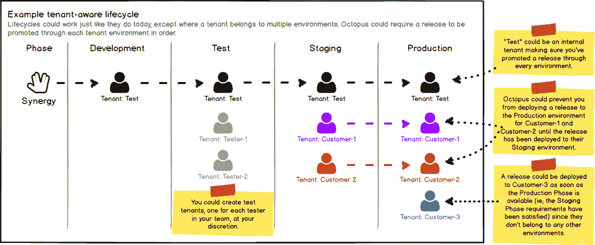

*生命周期可以像现在一样工作，除了它在多个环境中看到一个租户:在这种情况下，生命周期可以确保通过每个租户的环境链提升一个版本。*

一旦您创建了一些租户，您就可以选择一个租户和一个环境来部署一个版本。您还可以选择多个租户和环境(受生命周期限制)来并行运行部署(就像您现在可以并行部署到多个环境一样)。

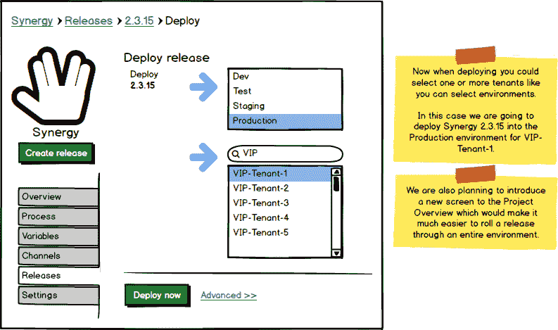

Octopus 还可以提供一个专门设计的屏幕，用于在所有租户之间滚动部署。请注意，我们现在可以垂直排列租户(不再需要水平滚动),并可能按名称或标签过滤租户。Octopus 可以显示每个租户最近的发布历史，以及 Deploy 按钮，这样你就可以在同一个屏幕上升级所有的租户。

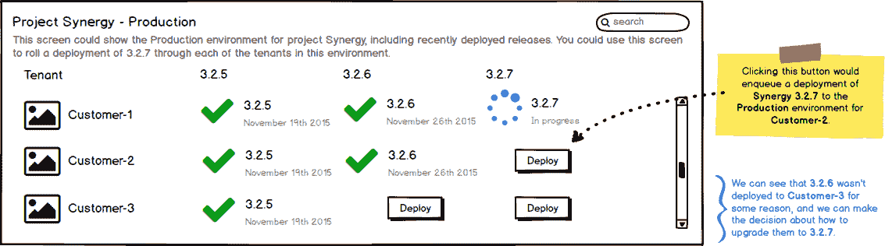

### 按标签选择租户

在章鱼世界的某些地方，识别租户是有意义的。考虑将部署授权给特定的部署目标或帐户，或者将变量和步骤限定到特定的租户。Octopus 不局限于识别特定的租户(可能有数百个)，而是允许您使用标签组合来选择一组租户。Octopus 可以在运行时解析这个*租户查询*，以提供匹配租户的时间点列表。

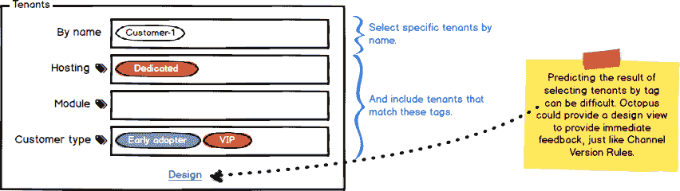

虽然在许多情况下使用这些*查询*来引用租户可能更方便，但是根据每种情况的复杂性，这可能会变得更加混乱。为了帮助驯服额外的复杂性，我们可以提供一个设计视图，类似于我们为设计通道的版本规则所做的。

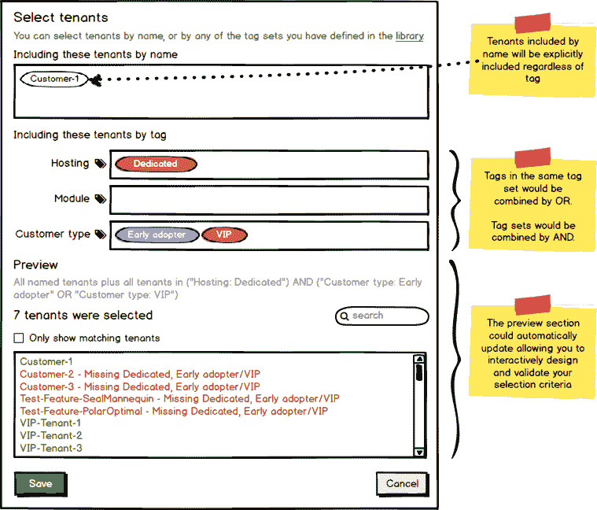

### 部署目标和客户

考虑这些与多租户部署相关的场景:

*   您可以为每个租户提供专用的机器，并且您不希望将部署或敏感变量/数据泄露给错误的租户的机器
*   您有一个客户正在提供他们自己的 Azure 订阅，您希望确保其他租户的部署不会泄漏到该订阅中
*   您希望实现专用/共享托管模型，其中一些租户将在共享池/群集/场中托管，而其他租户将在专用池/群集/场中托管

Octopus 可以帮助您实现这些目标，它允许您通过名称和/或标签来确定哪些租户应该被允许部署到特定的目标和帐户。

这是在共享主机集群中设置一个节点的示例。Octopus 可以自动将这个部署目标包括在`Synergy-Web-Server`环境中，为标记为`Hosting: Shared 1`的租户部署`Synergy-Web-Server`。此外，可能会阻止不符合此规范的部署包含此部署目标。

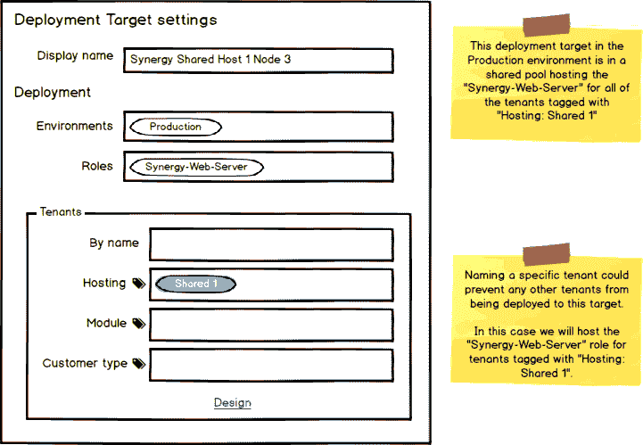

这是一个限制哪些部署有权使用帐户的示例。Octopus 可以授权`Customer-3`到`Production`环境的部署使用`Customer-3 Synergy Production Subscription`帐户，拒绝不符合该规范的部署。

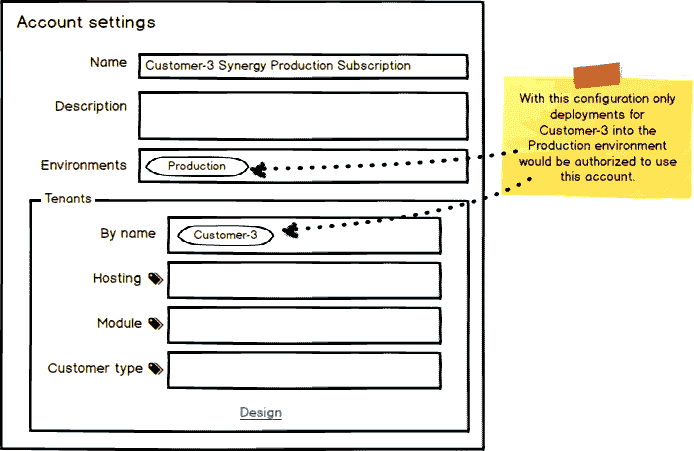

#### 部署目标和向后兼容性

我们希望保持向后兼容性，并允许您选择加入多租户部署。我们认为区分**普通项目**和**多租户项目**(映射到至少一个租户的项目)会有所帮助。考虑我们如何计算部署中应该涉及哪些部署目标:

1.  当部署一个**普通项目**时:查找所有具有匹配角色**的部署目标，忽略由部署目标**指定的任何租户范围。*这相当于我们今天所做的。*
2.  为特定租户部署**多租户项目时:查找所有角色匹配**的部署目标；其中租户与部署目标**指定的租户范围相匹配。**

这意味着没有指定**租户范围**的部署目标将不可用于多租户项目的部署。这样做的另一个好处是，您可以提前构建基础架构，并在需要时安全地向基础架构添加租户。

### 范围变量和步骤

如果可以基于标记来确定范围，那么确定变量值的范围会更方便。在本例中，当我们使用`Telephony`模块为任何`VIP`或`Early adopter`租户部署到`Production`环境时，将使用变量值。

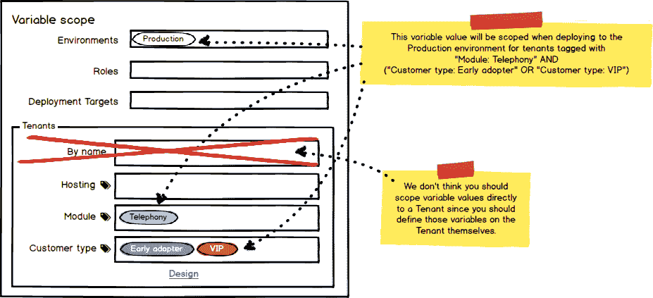

类似地，确定部署步骤的范围会变得更加简单。在这个例子中，我们已经基于几个不同的标签定制了我们的部署过程。首先，我们将把*探索模块*部署到标有`Module: Exploration`的租户。当标记为`Customer type: VIP`的 *VIP 客户*升级后，我们也会通知优先支持团队。一旦我们的租户成功完成生产部署，我们还会向他们发送定制的电子邮件通知。

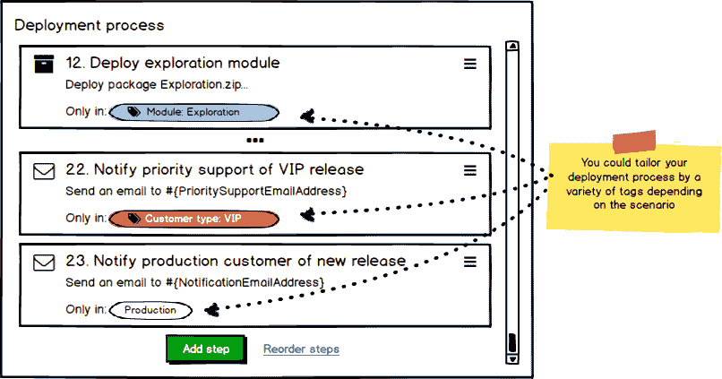

### 管理特定于租户的变量

下一个难题是管理特定于每个租户的变量。为了解决这个问题，我们计划让您直接向租户添加变量，但是在我们开始之前，您如何知道哪些变量需要添加到这些租户呢？想象一下，如果项目可以为每个不同的租户定义所需的变量，然后每个租户可以提示您它需要的变量。我们提议引入**变量模板**的概念。

### 项目变量模板

变量模板可以允许项目定义成功部署所需的变量。我们认为变量模板作为复合部分将更易于管理，就像今天的项目变量和库变量集一样。每个项目可以定义在租户之间变化的变量集，可选地包括库中的公共变量模板。在本例中，项目定义了两个特定的变量模板，并包含了库中的两个变量集模板。

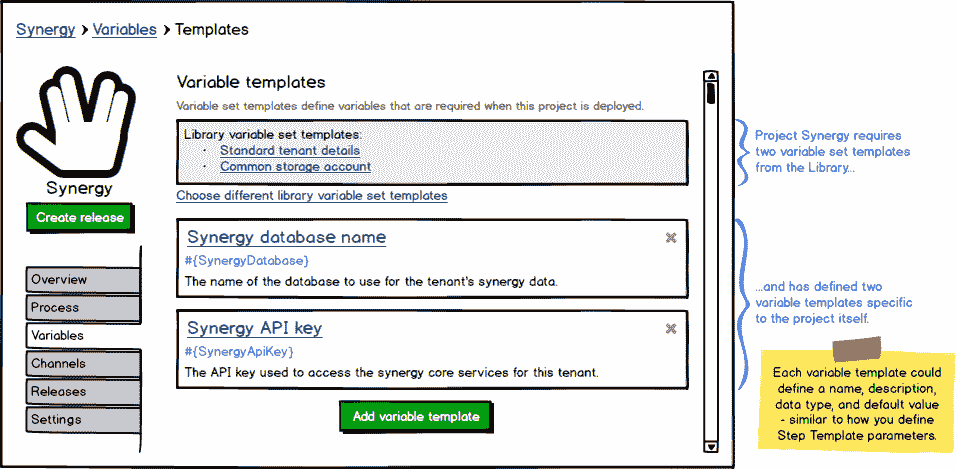

这些变量模板中的每一个都可以以类似于为步骤模板定义参数[的方式进行定义，其中您可以提供变量名、标签、帮助文本、默认值和输入控制类型，如单行/多行文本框、敏感/密码框、复选框或下拉菜单。](http://docs.octopusdeploy.com/display/OD/Step+Templates)

### 租户变量集

如今，许多使用 Octopus 进行多租户部署的客户将为每个租户创建一个库变量集。我们建议将变量作为租户设置的一部分。通过这种方式，您可以将所有特定于租户的变量指定为租户本身的一部分，而 Octopus 会自动地、隐式地将这些变量限定到该租户。当你为一个特定的租户部署一个版本时，Octopus 会自动合并来自该租户的变量集。

在本例中，`Customer-2`需要为`Synergy`和`Mojo`项目提供变量，根据两个项目的变量模板，我们需要:

*   `TenantAlias`来自标准租户详细信息库变量集模板
*   `StorageAccountUri`从普通存储账户库变量设置模板
*   来自协同项目的`SynergyDatabase`和`SynergyApiKey`
*   `MojoDatabase`来自 Mojo 项目

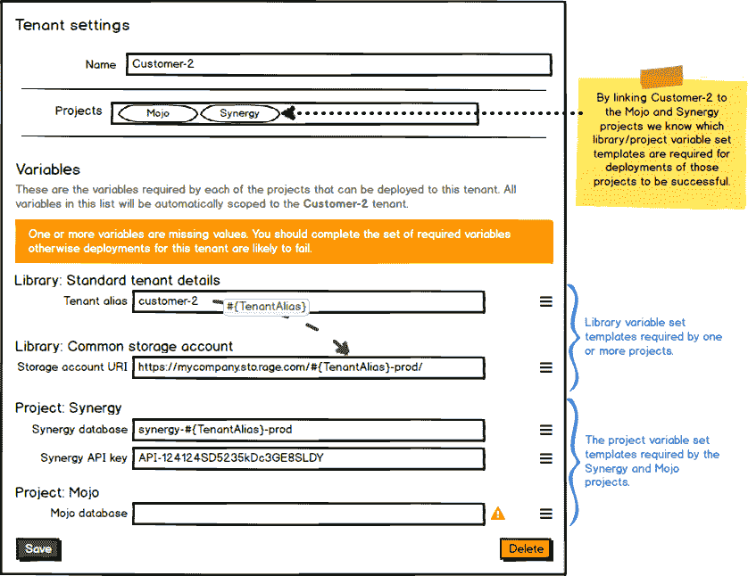

在这种情况下，我们没有为`MojoDatabase`变量定义一个值，而是被提示设置该值。

### 变量检查器

如今，Octopus Deploy 中的变量一般来自项目、库变量集或 step 模板。添加租户作为变量的来源将简化管理变量的某些方面，但是诊断变量的问题可能会变得更加困难。我们建议添加一个变量检查器，这将使它更容易获得一个项目中所有变量的概览，它们的来源，以及是否有任何问题。

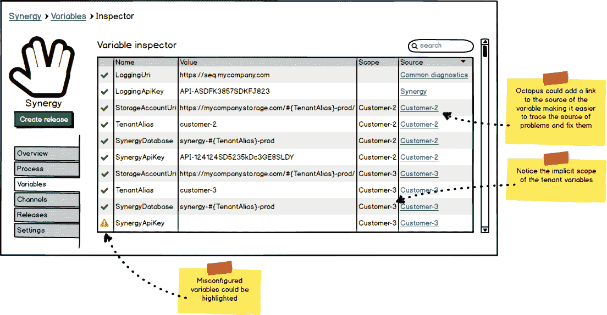

## 正在打包

有了这些功能，我们希望与管理大规模多租户部署相关的痛苦将得到显著缓解。考虑创建新租户会涉及哪些内容:

*   创建名为`CustomerA`的新租户
    *   输入提示变量
*   将最新版本部署到`CustomerA`的环境中
*   利润！

## 留下评论

你怎么想呢?这是您(再次)大胆发言的机会，可以帮助我们针对您的情况构建合适的功能。

**这一次，我们想提出一些具体的问题:**

1.  与[之前的提案(环境标签)](https://octopus.com/blog/rfc-multitenancy)相比，您觉得这个提案怎么样？
2.  您能描述一下您希望如何将租户与项目/环境联系起来以适应您的情况吗？是否要选择一个项目并指定该项目中的租户应该可以使用的环境？或者，不管项目如何，每个租户都有相同的环境吗？也许是别的什么？
3.  您认为有什么令人信服的理由可以让您通过名称将项目或库变量集中的变量限定到特定的租户，或者我们应该强制您指定特定租户的值？
4.  我们遗漏了什么特别的特征吗？