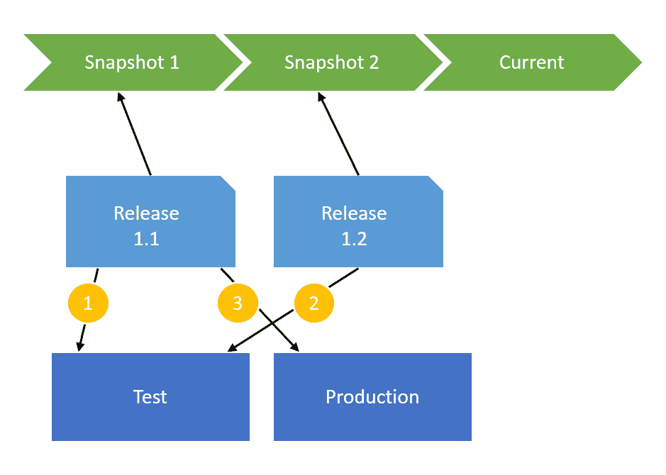

# RFC:删除快照- Octopus 部署

> 原文：<https://octopus.com/blog/rfc-removing-snapshots>

在任何部署流程中，以下两者之间都存在紧张关系:

*   对部署流程/配置进行更改的需求；而且，
*   希望候选版本的部署在不同的环境中保持一致

例如，假设作为部署过程的一部分，您需要为 IIS 网站配置一个特殊设置。您已经编写了一些 PowerShell 来做到这一点。您将发布(让我们称之为“发布 1.1”)部署到一个测试环境中，一旦合适的人签字同意，这个发布就可以投入生产了。

在等待的时候，您决定对 PowerShell 脚本进行一些调整；也许你找到了一种新的方法，用更少的代码来改变 IIS。您发布了一个新的版本(“版本 1.2”)，并将其部署到测试中。它看起来工作正常，但是你不能 100%确定——输出并不完全是你所期望的。

突然，您获得了将“版本 1.1”部署到生产环境的许可。您希望它运行您刚刚开发的实验性 PowerShell，还是运行在部署 1.1 版进行测试时运行的经过反复测试的旧 PowerShell？

# 快照

2012 年，Octopus 推出了[快照](https://octopus.com/blog/releases-and-snapshots)作为这个问题的解决方案。创建“1.1 版”时，我们会拍摄以下内容的快照:

*   组成部署过程的部署步骤，以及
*   构成项目配置的变量

这样，您可以随心所欲地进行更改，并且确信旧版本不会引入任何意外的更改；测试中发生的事情就是生产中发生的事情。

然而，当我们第一次介绍快照时，它并不是我所希望的银弹。他们在不同的场景下崩溃了:

*   假设您以前从未部署到生产环境中(一个处于起步阶段的项目)；现在，在投入生产之前，你意识到需要一些额外的步骤或变量。如果我们只依赖快照，就没有办法添加这些内容。
*   您的 PayPal 密钥发生变化，或者数据库服务器被重新定位。旧版本仍然使用旧的 API 密钥和旧的数据库服务器；那毫无意义。

为了解决这些问题，我们添加了一个按钮，将项目的最新变量导入到一个版本中——有效地覆盖了旧的快照。然而，它受到变量的限制。如果您添加了一个新的部署步骤，您仍然需要删除旧的发布并创建一个新的。

然而，快照的最大限制是它们是线性的。没有办法“分支”快照——比方说，保留一个“1.x”版本的部署流程，和一个“2.x”版本。

# 频道

2015 年末，我们增加了渠道。通道最初是为了帮助我们支持分支，但是我们很快发现了它们的许多其他用途:

*   修补程序版本，其中跳过了一些步骤和环境
*   发展部署设计:您可以在每个通道的基础上完全添加或更改步骤
*   处理功能分支和新的发布流
*   暂时禁用步骤或变量(只需将它们分配给不使用的通道)

# 需要快照吗？

在讨论有关快照的计划以及如何在我们即将发布的版本中应用于多租户时，我们意识到 channels 实际上解决了许多快照最初旨在解决的问题，只是更好。

在上面的例子中,“经过尝试和测试的”PowerShell 步骤可能属于一个“主”通道，而“新的和改进的”PowerShell 步骤可能属于一个“实验”通道。1.1 版是在“主”频道上发布，而 1.2 版是在“实验”频道上发布。您可以不断迭代两者的新版本，并确定哪一个将在每个版本中运行。

在这方面，通道比快照更好，因为您可以细化它们的应用方式。在所有的变量中，您可能只关心其中一些变量的“快照”行为。当然，API 键和数据库服务器总是使用“最新”的变量。但是您可能希望保留一小部分(例如，1.x 代码和 2.x 代码的不同文件路径)。您可以在没有快照的情况下，将这些变量值限定到一个通道来实现此行为。

快照行为也很烦人。如果您通过部署到一个测试环境来试验一个新的脚本，您必须不断地创建新的版本来测试每一个变化。使用“实验”频道而不使用快照会容易得多。您甚至可以配置一个生命周期，这样您的“实验性”渠道版本就永远不会进入生产阶段——它实在是太强大了。

这指向一个结论:快照似乎过时了。我就是想不出快照能处理频道不能处理的任何场景。

# 移除快照

在 3.4 中，我们考虑完全删除快照。这样做的原因是:

*   快照可以做的任何事情，渠道都可以做得更好
*   对于一个产品来说，用两种方法来实现相同的目标是浪费
*   快照使得对部署过程的改变的实验变得困难
*   它们让新用户感到困惑；频道是一个用户只有在寻找的时候才会看到的特性，否则就不会出现
*   如果我们今天从头开始，我们只会做频道，而不会做快照
*   快照使多租户等功能变得难以推理(快照中是否包含租户变量)？

如果我们真的移除它们，我们需要考虑:

*   升级过程/兼容性看起来像什么(因为人们目前依赖于行为)
*   如果人们忘记测试通道上的更改，我们如何帮助他们进行“回滚”——改进的[源代码控制集成](https://octopusdeploy.uservoice.com/forums/170787-general/suggestions/6186352-version-control-of-deployment-scripts)似乎是一个更好的方法。
*   教育。快照至少很容易解释；我们需要找到一种简单的方法来解释如何使用通道来实现相同的场景。

你怎么想呢?你愿意看到快照的背面吗？您能想到快照支持而渠道不支持的场景吗？