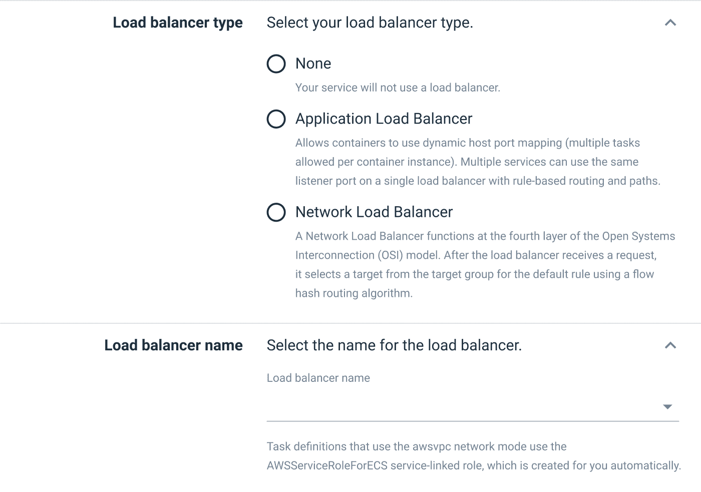

# 征求意见- ECS 与 Octopus 集成里程碑二- Octopus 部署

> 原文：<https://octopus.com/blog/rfc-second-ecs-integration-with-octopus>

Octopus 中的第一个亚马逊弹性容器服务(ECS)集成里程碑正在开发中，它将提供一个新的步骤和目标，使您可以轻松地通过 Octopus 部署第一个 ECS 服务。

第一个里程碑将通过 CloudFormation 为您创建和管理 ECS 服务和任务定义。这使得开发人员和管理员不必为自己编写冗长的模板。

然而，我们早期从部署到 ECS 的团队那里收到的一个一致的反馈是，他们已经成功地管理了现有的 ECS 资源，通过手动创建的服务或通过 Terraform 等工具。挑战不是创建服务，而是用新的映像作为 CI/CD 管道的一部分来更新它们。

对于 ECS 集成的第二个里程碑，我们提议采取一个新的步骤来更新现有的 ECS 服务，而不获取它们的所有权。这为已经建立了 ECS 集群的团队提供了一个机会，在保留对资源创建方式的控制的同时，协调新映像版本到其服务的部署。

## 我们建议如何支持已建立的 ECS 集群

这个征求意见稿(RFC)提出了一个新的步骤，与第一个里程碑引入的 ECS 目标相集成。该步骤使用新的图像标签创建新的任务定义修订版，并使用任务定义修订版更新服务。

这个里程碑还通过展示链接现有负载平衡器的能力，增强了里程碑 1 中交付的步骤。

### 新的步骤

新的步骤支持人们向现有的任务定义和服务部署新的映像。

步骤:

*   定义任务定义及其关联服务的名称。
*   定义要在相关任务定义中更新的容器数量:

现有任务定义和服务的 ECS 部署将执行以下流程:

1.  基于最新修订创建新的任务定义修订。
2.  任务定义修订中的图像版本与步骤中的匹配容器定义一起更新。
3.  然后使用新的任务定义修订版更新服务。

### 链接到负载平衡器

部署到 ECS 的大多数服务都暴露于网络流量，这意味着它们接收来自负载平衡器的流量。

里程碑二更新了里程碑一中引入的将服务链接到现有负载平衡器的步骤:

## 拟议方法的好处

这一新步骤将允许已建立 ECS 群集的客户通过 Octopus 协调映像部署，同时仍然保留对任何现有基础架构脚本的控制。

Octopus 在发布创建时选择图像版本，以及所有与频道和版本规则相关的功能。Octopus 随后会更新将新映像部署到 ECS 所需的最低设置，而不会尝试拥有任务定义或服务。

这将您的软件发布管理从您的基础设施发布管理中分离出来。

## 第二个 ECS 里程碑的范围是什么？

第二个里程碑主要是用已建立的 ECS 集群支持团队。它还包括对现有步骤的一些小的更新。

来自[里程碑一](https://octopus.com/blog/rfc-ecs-integration-with-octopus#what-is-the-scope-of-the-first-ecs-milestone)的限制仍然适用于里程碑二:

*   将最初的步骤限制为只部署到 Fargate(但是，在这个里程碑中提出的新步骤将更新任何现有的服务和任务定义，无论是 EC2 还是 Fargate)。
*   仅支持滚动部署，不支持集成 CodeDeploy 蓝/绿部署。
*   不提供构建新负载平衡器的能力(仅选择现有的一个)。
*   排除自动缩放设置。
*   排除应用网格和 FireLens 设置。
*   排除服务自动发现设置。
*   仅创建或更新服务，不支持任务或计划任务。

## 这个什么时候发布？

里程碑二的工作计划在里程碑一完成后开始。我们还没有发布日期，所以请关注[博客](https://octopus.com/blog/)以获得进一步的公告。

## 我们需要您的反馈

我们仍在计划第二个里程碑，所以现在是利用您的反馈来帮助塑造这一新功能的大好时机。我们制作了一期 [GitHub 来捕捉讨论](https://github.com/OctopusDeploy/StepsFeedback/issues/5)。

具体来说，我们想知道:

*   更新现有任务定义和服务的能力是否支持您现有的 ECS 群集？
*   您希望 Octopus 能为您解决哪些进一步的 ECS 部署挑战？
*   您能否预见到可能会阻止您对现有 ECS 群集使用建议步骤的任何挑战？

这些反馈将有助于我们提供最佳解决方案。

[提供反馈](https://github.com/OctopusDeploy/StepsFeedback/issues/5)

## 结论

总之，我们提议的 ECS 支持的第二个里程碑包括:

*   将映像部署到现有任务定义和服务的新步骤。
*   在里程碑一中介绍的步骤中链接现有负载平衡器的能力。

感谢你阅读这篇文章。我们希望您和我们一样对建议的新 ECS 功能感到兴奋。

非常感谢您的任何[反馈](https://github.com/OctopusDeploy/StepsFeedback/issues/5)。

愉快的部署！