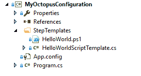

# RFC:带有 Octopus 声明的 Octopus 配置的版本控制- Octopus Deploy

> 原文：<https://octopus.com/blog/rfc-version-control>

> 在我们的 UserVoice 中，第六高的投票项目是以某种方式在源代码控制中存储 Octopus 数据。这是我们经常思考的问题，我已经记不清这些年来我们在白板上画了多少次解决方案。

我们在 2017 年的路线图中说过我们会做一些事情，但这可能是一项重大的任务。每次我们想出如何做到这一点时，我们的方法都分为几类:

*   仅在 Git 中存储 Octopus 建模数据
*   将 Octopus 建模数据存储在数据库中，但将其同步到 Git repo——团队城市方法
*   存储单独的脚本等。让 Octopus 引用它们

我认为我们已经提出了解决这个问题的另一种方法，这种方法更简单，可以满足大多数用例，并且比默认的“将 Octopus 设置同步到版本控制”更加灵活和强大。我现在称之为“ **Octopus Declarative** ”，在这篇文章中，我想说明为什么这是一种更好的方法，并获得您对这是否是正确方向的反馈。

## 我们要解决什么？

Octopus 存储了许多不同的数据，并不是所有的数据都存储在 Git 中有意义。人们要求的主要东西是:

*   步骤模板和 PowerShell 脚本
*   部署流程
*   可变集合

您还可以证明其中一些也值得存储在 Git 中:

*   生命周期和渠道
*   环境
*   房客

在更高的层面上，人们似乎最感兴趣的用例是:

*   能够浏览历史、轻松比较和回滚更改
*   能够在 Octopus 服务器之间移动配置
*   能够创建一些东西的多个副本(例如，基于模板的项目)

## 为什么 Git“同步”方法如此困难

假设我们采用了将 Octopus 中的设置与 Git 存储库同步的方法。要让它真正有用，它需要双向工作(这样人们可以在 Git 中进行更改，并让它们出现在 Octopus 中)。

### 冲突解决

第一个问题是同步过程和冲突的处理。每次你在 Octopus 中改变一些东西，我们都需要把改变提交给 Git，并把它推送到你已经配置好的任何远程设备(比如 GitHub，VSTS)。很有可能在其中一个遥控器上有冲突性的改变，所以 Octopus 需要某种形式的冲突解决方案。

如果您改变一个部署过程，然后创建一个发布，然后部署它，并且在这个过程的某个地方我们检测到一个冲突，会发生什么？我们可以回滚，但我们已经基于该更改进行了部署。

### 范围

第二个问题是范围。我们有一个 Git repo 用于整个 Octopus 服务器吗？还是每个项目都有一个？

鉴于 Octopus 用于生产部署，Git 对谁可以编辑给定路径中的文件没有太多控制，我认为 Octopus 服务器范围的 Git 回购是不可能的。但是如果我们要对每个项目都有一个回购(对库也有一个)，当我们需要对多个项目进行变更时会发生什么呢？如果其中一个回购协议有冲突，而其他回购协议没有冲突，会发生什么？

当我思考这些问题时，我意识到所有这些问题都有解决方案。但我的蜘蛛感官告诉我，要让它做好生产准备还需要相当大的努力。我可以很容易地想象我们花 4-6 个月的时间让这样的东西工作。

## 备选方案:基础设施作为代码方法

当我考虑版本控制和 DevOps 工具时，我突然意识到还有其他方法可以解决这个问题。

以亚马逊网络服务为例。AWS 是代码为的[基础设施的最佳范例。见鬼，AWS 团队没有在 AWS 控制台用户界面上投入任何精力的原因是因为他们假设每个人都在使用命令行或 REST API 来管理他们的 AWS 基础设施(好吧，这是我瞎编的)。](https://en.wikipedia.org/wiki/Infrastructure_as_Code)

没有人会声称“我们不应该使用 AWS，因为它不受版本控制”。然而，**我在 AWS 中找不到任何页面告诉它将你的 AWS 账户同步到 Git** 。相反，AWS 公开了 API，您可以针对它们编写代码——当然，您可以对代码进行版本控制。

当你仔细想想，它要优越得多:

*   范围问题消失了。由您决定哪个存储库应该包含设置 AWS 帐户各个部分的代码。
*   因为您是针对 API 执行代码，而不仅仅是将 JSON 文件推入 Git，所以您可以使用 for 循环、查询外部服务等。

诚然，某些 AWS 服务(如 CloudFormation)确实使用声明性 JSON 方法来配置它们，但同样，您不会将它们提交给存储库并期望 AWS 双向同步它们——您自己对其进行版本控制，然后调用它们的 API 来上传新的配置。

### 您已经可以在 Octopus 中做到这一点

Octopus 已经有了一个[全面的 REST API](https://octopus.com/docs/octopus-rest-api) ，你可以用它来做任何你可以在 Octopus UI 中做的事情。而且我们有一个. NET 客户端库， [Octopus。客户端](https://octopus.com/docs/octopus-rest-api/octopus.client)，你可以从 C#轻松使用 API。

例如，如果您想要对步骤模板进行版本控制，现在您可以:

*   创建使用 Octopus 的控制台应用程序。客户
*   通过在客户端调用适当的方法来定义每个步骤模板
*   从. PS1 文件加载每个步骤模板的脚本体
*   将所有这些存储在版本控制中

每次您更改. PS1 文件或 step 模板参数时，您只需重新运行您构建的这个应用程序，将新配置推送到 Octopus 中。你甚至可以建立一个 TFS 或 TeamCity build 来编译、测试并在每次修改脚本时运行它。

对于部署过程或变量集也可以这样做(敏感变量除外——我们会找到解决方案)。

问题解决了！有点儿...

### 今天的不足之处

虽然你可以这样做，但现在我不会向所有人推荐。首先，检查每个资源是否存在的代码，如果不存在就创建它，如果存在就更新它，等等..会变得非常乏味。

## 解决方法:章鱼。客户端.声明性

我提议的解决方案是在现有的“命令式”章鱼之上创建一个层。客户端名为 Octopus.Client.Declarative。您可以创建一个 C#控制台应用程序，如下所示:

【T2 

每个类都声明性地定义了您在 Octopus 服务器中的期望:

```
public class HelloWorldScriptTemplate : ScriptStepTemplate
{
    public HelloWorldScriptTemplate()
    {
        Name = "Hello world";
        Body = FromFile("HelloWorld.ps1");
    }
} 
```

`Program.cs`文件将调用 Octopus 中的一些方法。客户端通过调用我们的 REST API 来应用配置，检查资源是否存在，如果不存在就创建它们，并确保它们符合预期。

我们还会构建一些定义其他资源类型的好方法。将会有一个很好的 C#对象模型来构建部署过程或变量集。或者从 CSV 或 XLSX 文件导入变量。

作为代码，你可以循环遍历所有的东西。例如，也许您希望可以为您的每个客户克隆一个“模板”项目的副本:

```
public class MyProjectTemplate
{
    public MyProjectTemplate(string customerName, string databaseName) 
    {
        Name = "MyProject - " + customerName;
        Steps = ...
        Variables = FromSpreadsheet("Variables.xlsx");
        Variables["DatabaseName"] = databaseName;
    }
} 
```

在您的`Program.cs`中，您可以遍历您的客户数据库，为每个客户创建新的模板，然后将配置推送到 Octopus。

这类似于 [Kotlin DSL 为 TeamCity](https://confluence.jetbrains.com/display/TCD10/Kotlin+DSL) 所采用的方法，除了您在如何和何时运行它方面有更多的选择。

为了让这个功能真正发光，让人们使用它，我认为我们需要一些额外的功能。

### 漂移检测

除了应用声明性配置之外，您还可以检测 Octopus 服务器中是否有任何变化，这意味着它已经“偏离”了配置。例如，您可以按计划运行它，以检测是否有人修改了他们不应该修改的内容。

### 锁

如果你在一个外部数据集上循环，并使用它来动态地创建 Octopus 项目，如果用户对这些项目做了修改，他们会很生气，而你在下次项目运行时就把它们删除了。我想我们会提供一个简单的机制，让您“锁定”某些资源类型，使其不能在 UI 中被编辑，并提供一个很好的消息。

### 出口

将我们的 UI 映射到底层的资源并不总是容易的，所以我们需要某种方法来获取一个对象并将其导出到等价的声明性 C#代码。这也可能是章鱼的一部分。客户端，或者我们构建到 Octopus UI 中使其可被发现的东西。

## 副作用

如果我们采用这种方法，除了最初的 UserVoice 建议能够对您的 Octopus 配置进行版本控制之外，我们还有一个解决方案可以帮助解决其他一些问题:

*   [复合步骤模板](https://octopusdeploy.uservoice.com/forums/170787-general/suggestions/12948603-composite-step-templates) - 609 票很多时候人们只是希望多个项目重用部署步骤。跨项目重用 C#代码中的同一个对象是可能的。唯一的问题是，对于这些项目来说，它们是否可以在 UI 中不可编辑。
*   [改进变量 UI](https://octopusdeploy.uservoice.com/forums/170787-general/suggestions/7192251-improve-variables-ui) - 834 票这里大部分的评论都集中在处理很多变量上，这些变量很可能在别处有定义。虽然我们仍然应该努力改进 UI(我们会的！)，能够用程序创建它们或从电子表格中导入将会对许多人有所帮助。
*   [可继承模板](https://octopusdeploy.uservoice.com/forums/170787-general/suggestions/6559846-inheritable-templates) - 171 票我上面的例子已经展示了这是如何工作的。事实上,“模板”项目可以在 Octopus 中保持可编辑状态，代码会将它拉下来，并为它的每个实例克隆它。

## 你怎么想呢?

作为一名产品负责人，我不害怕耗时 6-9 个月或更长时间的“停止世界重写”。我们在 Octopus 1.6 到 2.0 中做到了这一点，当时我们重写了编排层并采用了 API 优先。在 3.0 中，当我们从 [RavenDB 切换到 SQL Server](https://octopus.com/blog/3.0-switching-to-sql) 时，我们又做了一次。当我确信最终结果会是一个更好的产品时，我很乐意沿着这条路走下去。

如果我们采用将 Octopus 配置作为 XML 或 JSON 文件存储在 Git 存储库中的方法，我认为要解决我之前提到的挑战需要付出巨大的努力。最后，如果您想采用“for 循环”方法来基于外部数据源动态生成您的配置，您会想要禁用 UI 编辑，并使用一种好的、强类型的语言来完成它。我认为我们可以用更少的努力来建造它。

我们正处于一年中的某个时刻，我们需要以某种方式做出决定。如果我们采用 Git sync 方法，用户体验可能会影响我们正在构建的大部分新功能，所以我们可能会首先着手于此。另一方面，如果我们采用我在这里概述的声明性 Octopus 客户端方法，我们可以在接下来的几个月中轻松发布和改进它，而不会减慢其他任何东西的速度。

我的问题是:**这种声明式 C#方法对你有用吗？或者你还需要版本控制 Octopus 配置中的其他东西吗？**