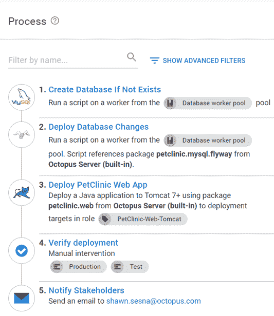
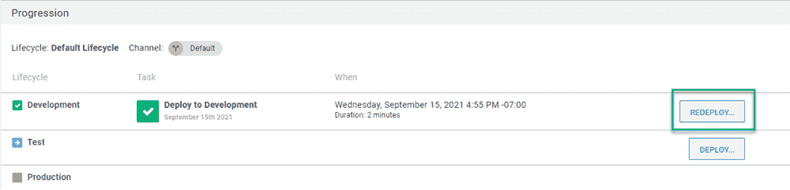
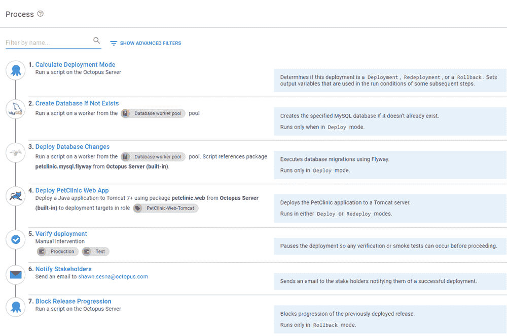
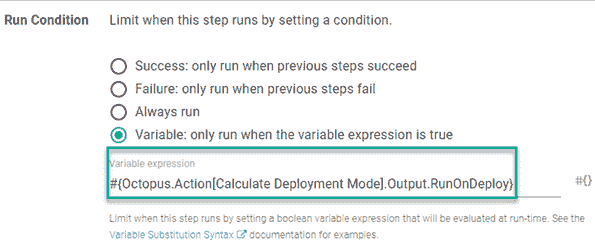
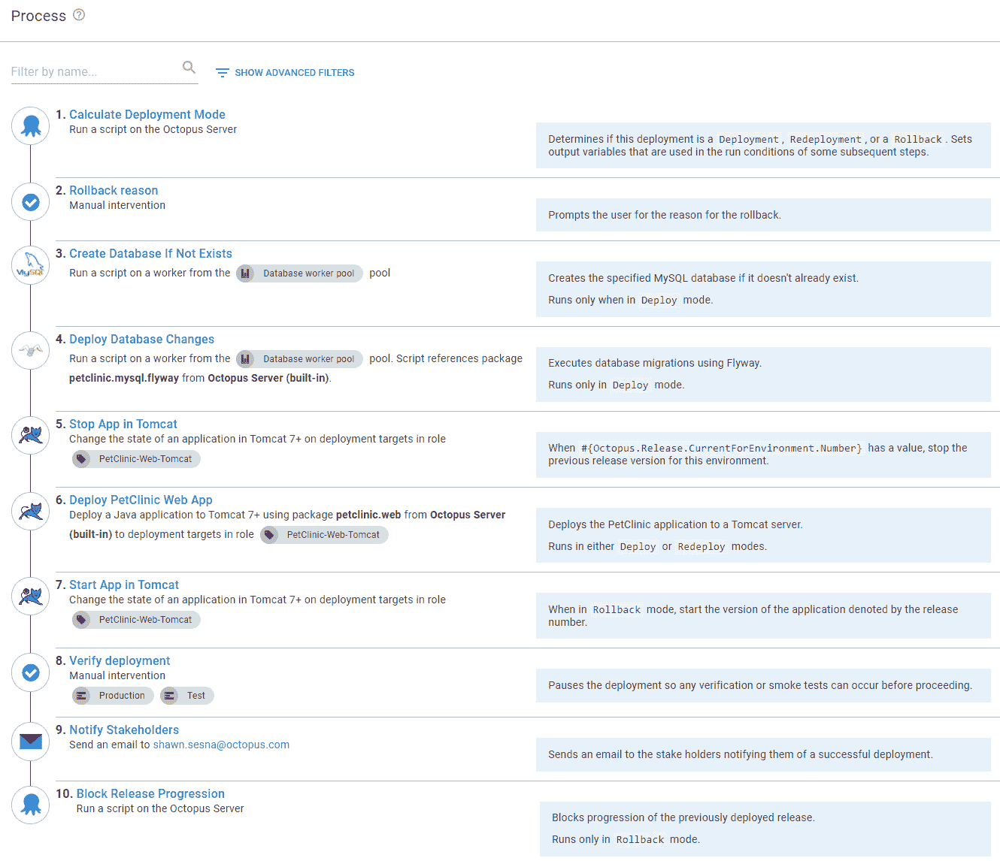
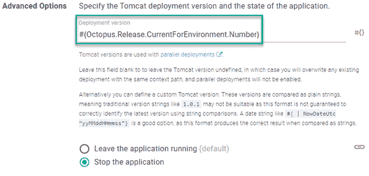

# 回滚 Tomcat 部署- Octopus 部署

> 原文：<https://octopus.com/blog/rolling-back-tomcat-deployment>

DevOps 反馈循环通常有自动化的流程来尽可能早地在管道中捕获问题。虽然这些自动化过程允许早期检测，但错误仍然可以找到进入生产代码的途径。一些 bug 非常严重，足以保证退出最近部署的版本。恢复更改的过程称为回滚。

在本文中，我将讨论使用 Apache Tomcat web 服务器时的不同回滚策略。

## 初始部署流程

这篇文章使用 [PetClinic 应用程序](https://bitbucket.org/octopussamples/petclinic/src/master/)部署到 Apache Tomcat web 服务器。PetClinic 应用程序需要一个数据库后端，并使用 Flyway 来执行数据库迁移。

示例流程如下所示:

1.  如果不存在，则创建数据库
2.  部署数据库更改
3.  部署 PetClinic Web 应用程序
4.  验证部署
5.  通知利益相关方

[](#)

这篇文章假设您熟悉这个部署过程中包含的步骤，并且不会详细介绍每个步骤。

## 部署以前的版本

使用 Octopus Deploy，您可以通过重新部署应用程序的以前版本来回滚。您只需从 **Releases** 屏幕中选择以前的版本，然后单击所需环境旁边的 **REDEPLOY** 按钮。

[](#)

部署过程中的所有步骤都按照创建发布时的配置执行。对于 Apache Tomcat，将在 Tomcat 服务器上重新提取包，执行变量替换，并在发送到 Tomcat 管理器进行部署之前重新打包。包裹的大小将决定需要多长时间。

## 简单回滚

如上所述，部署过程中的所有步骤都将像第一次一样重新执行。虽然内置的重新部署方法是有效的，但在执行回滚时，可能会有一些您不想执行的步骤。

如果发布有问题，您通常会回滚。在这种情况下，最好将正在回滚的版本标记为坏的，并阻止它升级到其他环境。要有条件地跳过步骤并将发布标记为坏，需要修改流程:

1.  计算部署模式
2.  如果数据库不存在，则创建数据库(回滚时跳过)
3.  部署数据库更改(回滚期间跳过)
4.  部署 PetClinic Web 应用程序
5.  验证部署
6.  通知利益相关方
7.  阻止发布进度(仅在回滚期间)

在部署步骤中使用 **Notes** 字段，您可以为这些步骤以及它们将以何种模式运行提供文档。

[](#)

您会注意到两个新步骤，**计算部署模式**和**阻止发布进度**，以及一些应用于现有步骤的条件。让我们更详细地看看这些。

### 计算部署模式

回滚过程的第一部分是确定它是部署、回滚还是重新部署操作。

我们的团队开发了社区步骤模板 **[计算部署模式](https://library.octopus.com/step-templates/d166457a-1421-4731-b143-dd6766fb95d5/actiontemplate-calculate-deployment-mode)** ，它决定了部署处于哪种模式，并生成了许多包含变量[运行条件](https://octopus.com/docs/projects/steps/conditions#run-condition)语法的[输出变量](https://octopus.com/docs/projects/variables/output-variables)(更多详细信息，请参见步骤描述中的文档)。

### 数据库步骤

**如果不存在则创建数据库**和**部署数据库更改**步骤不需要在回滚中运行。需要将它们配置为跳过。来自**计算部署模式**的`RunOnDeploy`输出变量可应用于这些步骤的变量运行条件以跳过它们:

```
#{Octopus.Action[Calculate Deployment Mode].Output.RunOnDeploy} 
```

[](#)

### 阻止释放进程

阻塞发布进程在 Octopus Deploy 中并不新鲜，但是，它需要通过 UI 或 API 调用来完成。

我们的团队认识到，在处理回滚时，自动化这一活动是至关重要的，并开发了**[Block Release Progression](https://library.octopus.com/step-templates/78a182b3-5369-4e13-9292-b7f991295ad1/actiontemplate-block-release-progression)**模板，该模板可以自动阻止发布。

此步骤应仅在回滚操作期间运行。使用**计算部署模式**的以下输出变量作为变量运行条件以确保这一点:

```
#{Octopus.Action[Calculate Deployment Mode].Output.RunOnRollback} 
```

## 复杂的回滚

内置的和简单的回滚方法都将提取并重新打包`.war`文件，然后将其交付给 Tomcat 服务器进行部署。如果您的应用程序很大，这可能需要一些时间。使用 Tomcat [并行部署](https://tomcat.apache.org/tomcat-7.0-doc/config/context.html#Parallel_deployment)特性，可以在几秒钟内执行回滚。

### Tomcat 并行部署

并行部署特性是在 Tomcat version 7 中引入的，它允许您将同一应用程序的多个版本部署到 Tomcat 服务器上。

在应用程序的较新版本处于运行状态后，新会话将在新版本上运行，而现有会话将继续在旧版本上运行，直到它们过期。您需要提供带有上下文路径的版本号。Tomcat 服务器结合了版本号和上下文路径，并将部署的`.war`重命名为`<contextpath>##<version>.war`

### 复杂的回滚过程

要使用并行部署特性实现回滚过程，您需要修改您的过程，如下所示:

1.  计算部署模式
2.  回滚原因(仅在回滚期间)
3.  如果数据库不存在，则创建数据库(回滚时跳过)
4.  部署数据库更改(回滚期间跳过)
5.  在 Tomcat 中停止应用程序(回滚时运行或部署和回滚时运行)
6.  部署 PetClinic Web 应用程序(仅在部署或重新部署期间)
7.  在 Tomcat 中启动应用程序(仅在回滚期间)
8.  验证部署
9.  通知利益相关方
10.  阻止发布进度(仅在回滚期间)

[](#)

让我们回顾一下为实现这一点而对流程所做的更改。

#### 回滚原因

**回滚原因**步骤是手动干预，提示您回滚的原因。您指定的原因用于流程中更下一步的**块释放进程**中的**原因**字段。此步骤仅在回滚期间运行，因此需要将变量运行条件设置为以下内容:

```
#{Octopus.Action[Calculate Deployment Mode].Output.RunOnRollback} 
```

#### 停止 Tomcat 中的应用程序

**停止**和**启动**步骤都使用 Tomcat 步骤中的**启动\停止应用。**停止**步骤在**部署模式**下是可选的，但在**回滚模式**下是必需的，因为 Tomcat 会将新会话传送到正在运行的最新版本的部署应用程序。**

回滚时，我们需要停止坏的版本，这样以前部署的版本将开始获取会话。

将变量运行条件设置为仅在回滚期间运行:

```
#{Octopus.Action[Calculate Deployment Mode].Output.RunOnRollback} 
```

或者，您可以使用[系统变量](https://octopus.com/docs/projects/variables/system-variables) `Octopus.Release.CurrentForEnvironment.Number`来检查是否有先前部署的版本:

```
#{if Octopus.Release.CurrentForEnvironment.Number}True#{/if} 
```

Tomcat 步骤的**高级选项**的版本号如下，所选动作为**停止应用**:

```
#{Octopus.Release.CurrentForEnvironment.Number} 
```

[](#)

#### 在 Tomcat 中启动应用程序

在回滚过程中，此过程会停止正在回滚的版本。

您需要一个步骤来启动您要回滚到的版本。在**高级选项**中为 Tomcat 步骤指定的版本号如下，选择**保持应用程序运行**:

```
#{Octopus.Release.Number} 
```

[](#)

该步骤需要配置为仅使用以下变量运行条件在`Rollback Mode`中运行:

```
#{Octopus.Action[Calculate Deployment Mode].Output.RunOnRollback} 
```

#### 部署 PetClinic Web 应用程序

该步骤需要与 Tomcat 步骤中的 **Start App 设置相同的**高级选项**，为正在部署的版本提供`#{Octopus.Release.Number}`。(参考 Tomcat 中[启动 App 中的图片。)](#start-app-in-tomcat)**

#### 阻止释放进程

在简单回滚场景中，**块进程**的**原因**字段被静态设置。**回滚原因**步骤提示您回滚的原因，而**注释**输出变量可以作为**原因**的输入，对阻塞释放有更有意义的信息。

修改**原因**字段以使用来自**回滚原因**步骤的**注释**输出变量，如下所示:

```
#{Octopus.Action[Rollback reason].Output.Manual.Notes} 
```

在 Tomcat 中启用[取消部署版本](https://tomcat.apache.org/tomcat-9.0-doc/config/host.html)功能会干扰复杂的回滚策略。

在 Tomcat 管理器中，并行部署将与此类似:

[T35【](#)

### 清理旧版本

Octopus Deploy 的保留策略通过删除已部署的旧版本来帮助您的目标保持干净。然而，Tomcat 管理器将`.war`文件放在它自己的文件夹中，Octopus Deploy 不知道这个文件夹。

如果您没有使用并行部署特性，那么新版本会简单地覆盖`.war`并部署应用程序。

Tomcat 的并行部署特性将`.war`重命名为`<contextpath>##<version>.war`，因此它们是独一无二的。除非对版本化的应用程序条目执行`undeploy`操作，否则这些文件将继续累积。

为了帮助 Tomcat 维护，我们的团队开发了 **[通过管理器](https://library.octopus.com/step-templates/34f13b4c-64e1-42b4-ad1a-4599f25a850e/actiontemplate-undeploy-tomcat-application-via-manager)** 取消部署 Tomcat 应用程序，这是一个社区步骤模板，在 Tomcat 服务器上执行取消部署操作，目前在 Bash 语法中可用。

## 结论

在这篇文章中，我介绍了几种将应用程序部署回滚到 Apache Tomcat web 服务器的方法。我希望这些方法中的一个能在你的 DevOps 之旅中帮助你。

## 观看网络研讨会:Octopus Deploy 的回滚策略

[https://www.youtube.com/embed/F_V7r80aDbo](https://www.youtube.com/embed/F_V7r80aDbo)

VIDEO

我们定期举办网络研讨会。请参见[网络研讨会第](https://octopus.com/events)页，了解即将举办的活动和现场直播的详细信息。

愉快的部署！