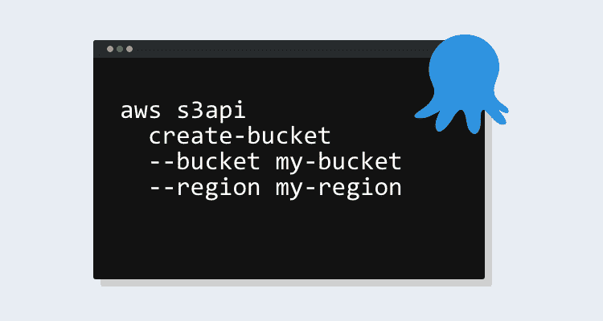
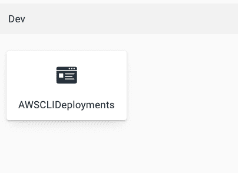
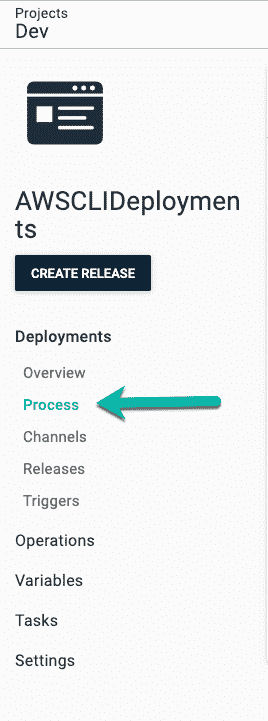
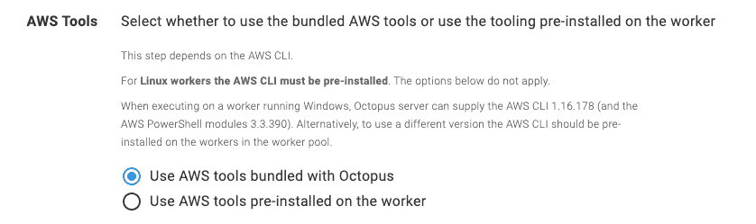
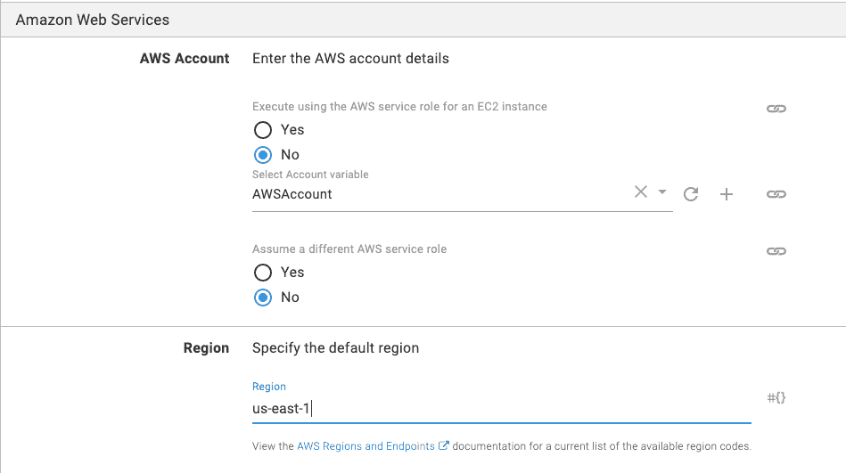

# 在 Octopus 部署- Octopus 部署中运行 AWS CLI

> 原文：<https://octopus.com/blog/run-aws-cli-in-octopus-deploy>

[](#)

您是否曾经发现自己处于这样一种情况，您知道您想要自动创建一个对象，或者甚至列出对象并生成一个报告，但是您不想在编程语言之间切换？CLI 为您提供了一种获得 SDK 全部可用性的方法，它们通常在每个系统上运行相同的功能，这意味着您不必为 API 创建包装。

在这篇博文中，我们来看看如何在 Octopus Deploy 中使用 AWS CLI。演示重点是使用 Octopus Deploy 中的**运行 AWS CLI 脚本**步骤模板创建一个 S3 存储桶。

## 先决条件

要跟进这篇博文，您应该具备以下条件:

你可以从八达通服务器或八达通云免费开始使用。

## 创建新项目

在运行任何 AWS CLI 命令或创建步骤之前，您需要配置一个项目，以便有地方创建 AWS CLI 过程和步骤。为此，我们将使用 Octopus CLI 的强大功能。

打开终端并运行以下命令，创建一个添加了适当开关值的新项目:

```
octo create-project --name AWSCLIDeployments --server=octopus_server_url --apiKey=octopus_server_api_key --projectGroup project_group --lifecycle=lifecycle_name 
```

打开网络浏览器并登录 Octopus 门户网站。您现在应该看到新项目可用:

[](#)

## 配置变量

现在项目已经创建，您可以配置项目本身了。首先，我们将配置变量。要使 AWS CLI 步骤模板正常工作，它需要 AWS 帐户是一个变量:

1.  在 Octopus 门户网站中，导航到您刚刚创建的项目，**projects➜AWS clideployments**。
2.  在项目窗格下，点击**变量**。
3.  在项目变量内的**值**下，选择下拉菜单并选择**改变类型**。
4.  在类型选项下，选择 **AWS 账户**。
5.  选择一个现有的 AWS 帐户，并为其命名。完成后，点击绿色的 **DONE** 按钮。
6.  点击绿色的**保存**按钮，保存项目中的变量。

## 添加 AWS CLI 步骤

现在已经配置了 AWS account 变量，您可以开始配置 AWS CLI 步骤本身来运行 AWS CLI 命令了。为此，您将创建一个新流程:

1.  在项目概述页面，选择**流程**:

[](#)

2.  在 process 页面上，您可以开始添加新步骤，特别是 AWS CLI 步骤。点击**添加步骤**按钮。
3.  在**下选择步骤模板**，选择 AWS，在已安装的步骤模板下，选择名为**的步骤模板运行 AWS CLI 脚本**。找到后，单击该步骤。
4.  在 **AWS 工具**部分，选择**使用与 Octopus** 捆绑的 AWS 工具，因为该选项包含我们需要的所有内容:

[](#)

5.  在 **Amazon Web Services** 部分，选择您之前创建的`AWSAccount`变量，并选择 **us-east-1** 地区:

[](#)

6.  在该步骤的**脚本部分**中，选择 inline source code 选项并键入以下代码，这些代码将用于创建 S3 存储桶。您也可以将 bucket 的名称改为您所在的环境。请记住，S3 存储桶名称必须是唯一的:

```
aws s3api create-bucket --bucket octopusdeploys392 --region us-east-1 
```

7.  输入代码后，点击绿色的**保存**按钮。

您现在已经准备好运行管道了。

## 运行管道

现在已经创建了使用 AWS CLI 的步骤，添加了内联代码，您已经准备好开始管道的部署过程了。

1.  在项目下，点击蓝色的**创建发布**按钮。
2.  要保存发布，点击绿色的**保存**按钮。
3.  选择要部署到的环境。比如 Dev。
4.  点击绿色的**展开**按钮，展开将开始。
5.  完成后，您将看到任务摘要，其中完成了 S3 存储桶的创建。

恭喜你。您已经成功地使用 AWS CLI 在 AWS 中创建了 S3 存储桶。

## 结论

许多 CLI 为您提供了围绕任务执行简单操作的能力，而这些任务在 UI 中可能是复杂或繁琐的。使用 CLI，您仍然可以从编程的角度直接与平台进行交互，以确保您能够自动执行任务。

在这篇博文中，您不仅学习了如何在 Octopus Deploy 中启动并运行项目，还学习了如何配置 AWS CLI 任务以在 AWS 中创建 S3 存储桶。

愉快的部署！