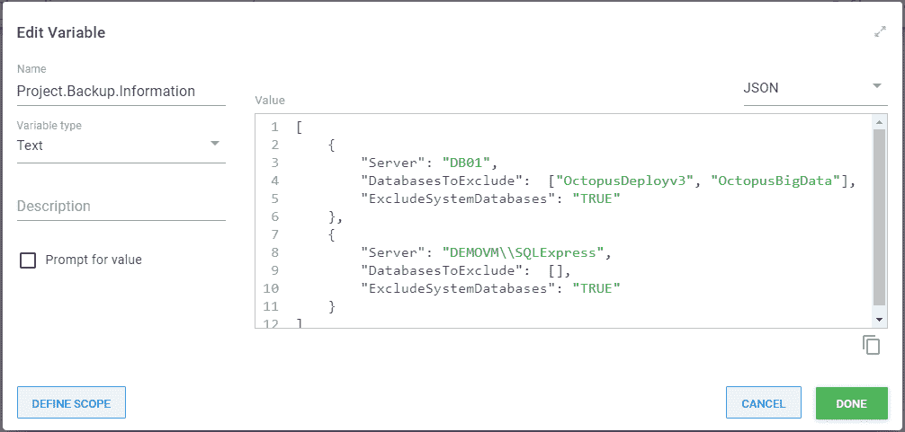
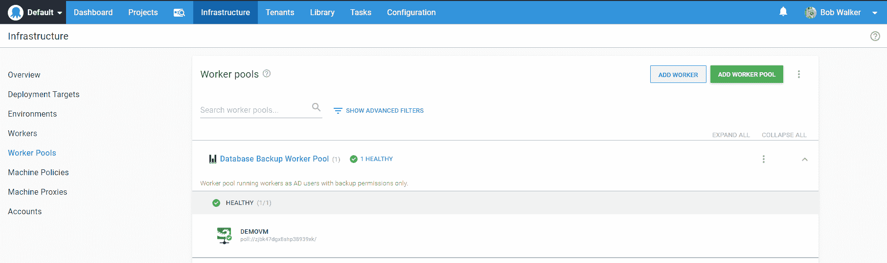
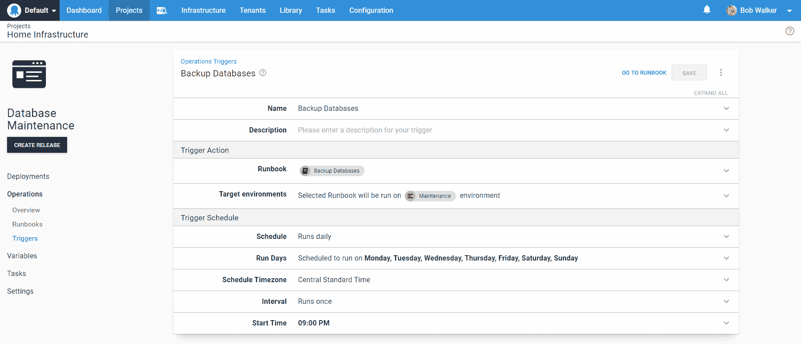
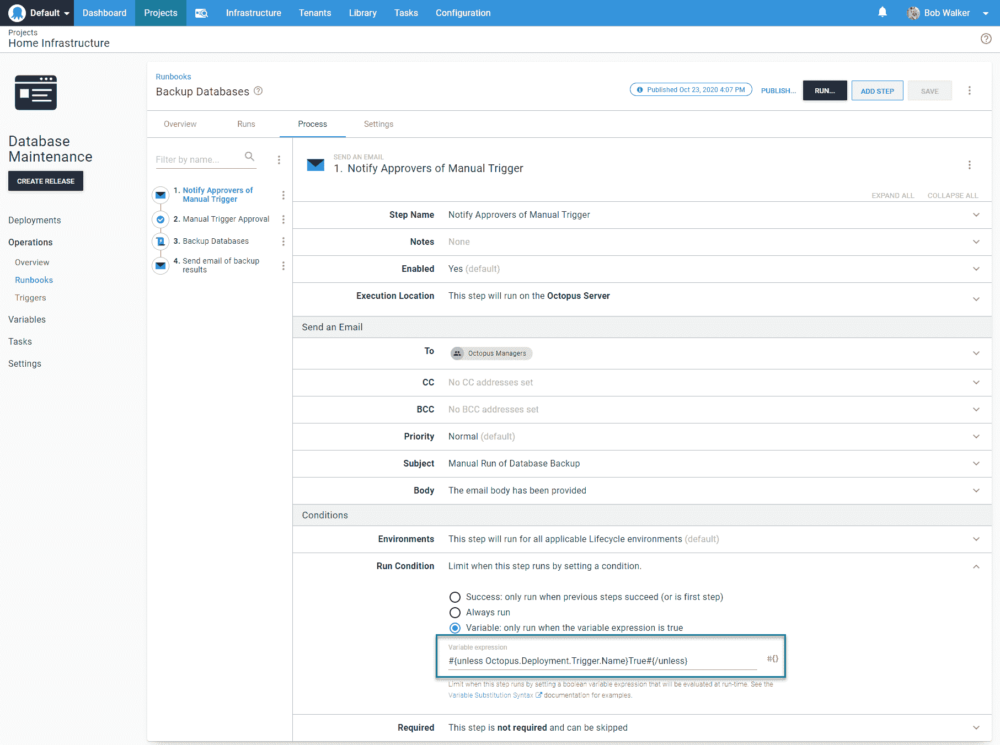
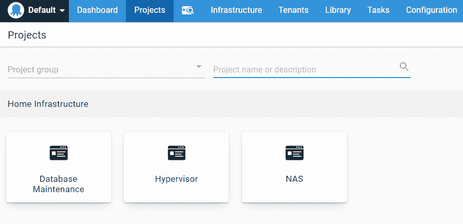
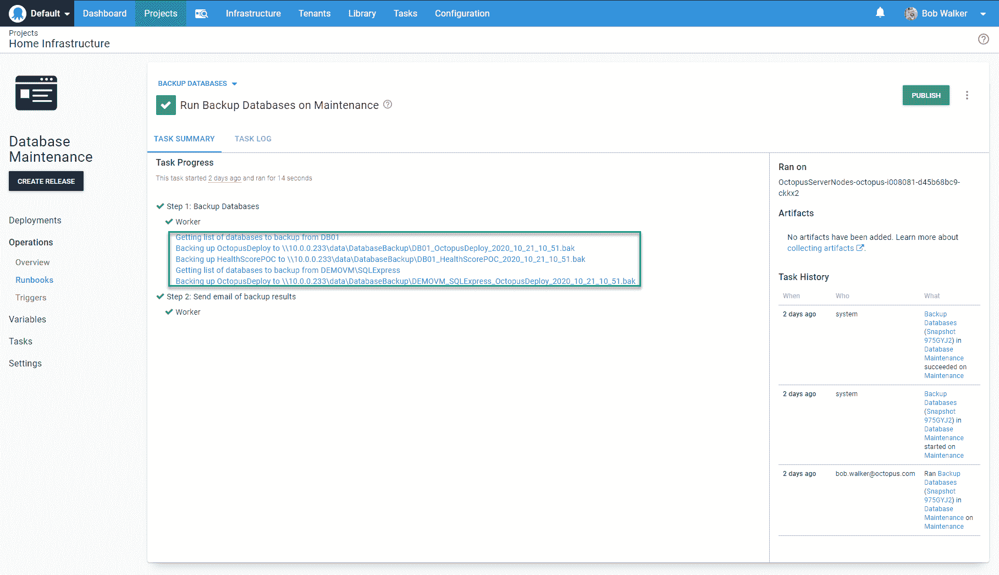
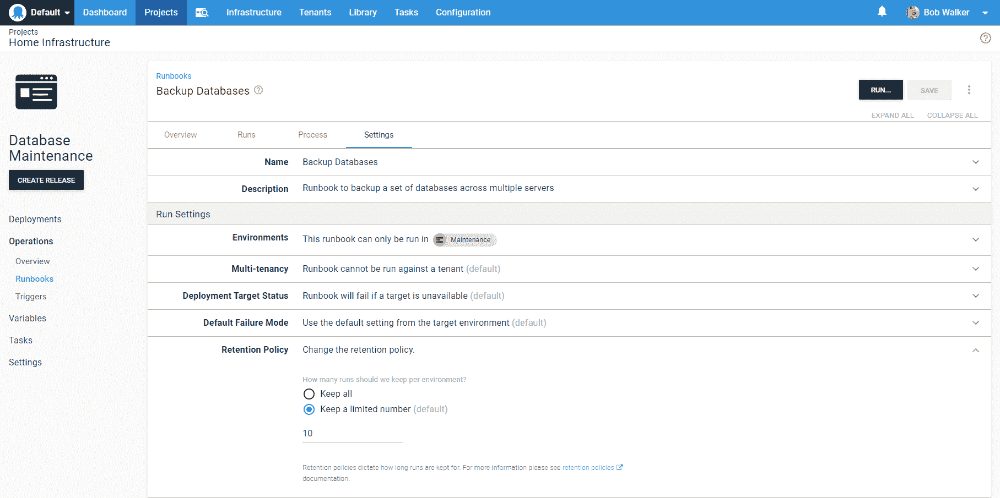
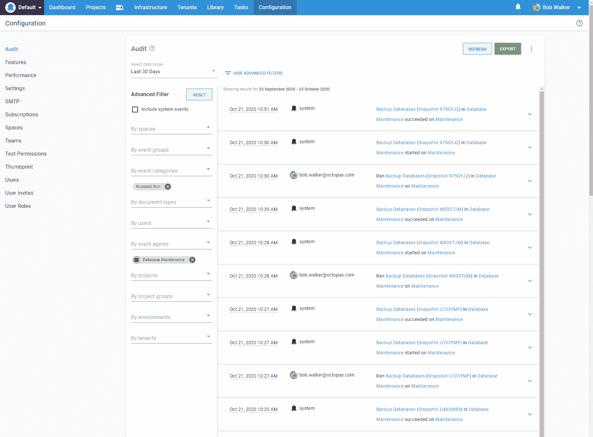

# 操作手册经验教训和建议- Octopus 部署

> 原文：<https://octopus.com/blog/runbook-recommendations-and-best-practices>

当我们第一次发布 Runbooks 时，我有机会创建了一些 Runbooks，我学到了一些可能对你有帮助的经验。

在这篇文章中，我将从头开始创建一本操作手册，并分享我的建议。

## 定义要解决的问题

在 Octopus，我们使用 AWS 和 Azure 作为我们的基础架构。事实上，在撰写本文时(本文最初发表于 2020 年 11 月)，布里斯班家庭办公室中唯一的基础设施是一个 WiFi 路由器和一个网络交换机。尽管是大量的云用户，我们中的许多人在家里的办公室里运行一个虚拟机管理程序。它让我们可以配置和运行永久虚拟机，如域控制器和 SQL 服务器，以配合 Octopus Deploy 使用。有人帮你设置是一回事，但从头开始设置是完全不同的。

要解决的问题:我有几台 SQL 服务器在运行，我想将每台服务器上的几个数据库备份到我的 NAS 上。

## 设计操作手册流程

定义问题是第一步。然后，我默认的下一步是向 Octopus Deploy 添加脚本步骤。这已经多次适得其反了，所以首先，我回答这些问题:

*   用例及需求是什么？有发现吗？
*   以前试过这个吗？如果是的话，什么有效，什么无效？
*   runbook 应该在哪里运行？
*   谁将调用该操作手册，如何调用？
*   运行操作手册需要批准吗？
*   应该有通知吗？如果是，他们应该什么时候出门，应该包括哪些信息？如何保持较高的信噪比？
*   runbook 是特定于项目的吗？还是通用的？
*   是否有任何需要捕获和保留的信息？保留策略应该是什么？我应该把任何东西推给另一个服务吗？

**推荐:**抓紧时间过一遍类似的题。一点点准备工作会大有帮助。

## 用例、陷阱和需求

我以前使用库步骤模板 [SQL - Backup Database](https://library.octopus.com/step-templates/34b4fa10-329f-4c50-ab7c-d6b047264b83/actiontemplate-sql-backup-database) 使用 Octopus Deploy 将数据库备份到我的 NAS。效果还不错。主要问题是库步骤只支持一个数据库。备份多个数据库需要多个步骤，而且该过程需要不断调整。它还使用 SQL 管理对象( [SMO](https://docs.microsoft.com/en-us/sql/relational-databases/server-management-objects-smo/sql-server-management-objects-smo-programming-guide?view=sql-server-ver15) ，这意味着我必须安装额外的软件。

基于这一经历，我的要求是:

*   向现有服务器添加数据库不需要更新 Octopus Deploy。
*   从过程中排除数据库应该很容易。
*   备份系统数据库应该是可选的。
*   在触手之外，运行这个进程的虚拟机不需要任何额外的软件。
*   向流程中添加新的服务器应该是微不足道的。
*   执行备份的 SQL Server 用户应该只拥有执行备份的权限。不允许模式更改或写入。
*   该过程将备份到 NAS，而不是本地硬盘。
*   该过程应清理一周前的所有备份。

在继续之前，让我们快速检查一下这个 runbook 将运行的脚本。为了解决许多需求，我需要存储配置选项。Octopus Deploy 的一个鲜为人知的特性是能够存储多个行变量值，比如 JSON。像 JSON 这样存储数据允许我定义一个对象供我的脚本使用。您可以在您的实例中通过点击**打开编辑器**链接来做类似的事情。

[](#)

编辑器模式窗口允许您选择右上角的文本类型。选择文本类型会在值窗口中突出显示语法，从而更容易查看 JSON 的语法是否正确。

[](#)

脚本本身并不复杂。对于数组中的每个对象，它将:

*   连接到服务器
*   调出数据库列表
*   排除 DatabasesToExclude 数组中的任何数据库
*   如果 ExcludeSystemDatabases 为 TRUE，则排除任何系统数据库
*   清理旧的数据库备份

```
$backupFolderLocation = $OctopusParameters["Project.Backup.FilePath"]
$backupFileDate = $(Get-Date).ToString("yyyy_MM_dd_HH_mm")
$backupItemList = $($OctopusParameters["Project.Backup.Information"]) | ConvertFrom-Json
$notificationContent = [System.Text.StringBuilder]::new()

foreach ($backupitem in $backupItemList)
{   
    $notificationContent.AppendLine("Server: $($backupItem.Server)")
    $connectionString = "Server=$($backupItem.Server);Database=master;integrated security=true;"    

    try
    {
      $sqlConnection = New-Object System.Data.SqlClient.SqlConnection
      $sqlConnection.ConnectionString = $connectionString

      $command = $sqlConnection.CreateCommand()
      $command.CommandType = [System.Data.CommandType]'Text'
      $command.CommandTimeout = 60000

      $command.CommandText = "select Name from sys.databases"
      $tablesToBackupDataAdapter = New-Object System.Data.SqlClient.SqlDataAdapter $command
      $tablesToBackupDataSet = New-Object System.Data.DataSet

      Write-Host "Opening the connection to $($backupItem.Server)"
      $sqlConnection.Open()

      Write-Highlight "Getting list of databases to backup from $($backupItem.Server)"
      $tablesToBackupDataAdapter.Fill($tablesToBackupDataSet)
      $databaseToBackupList = @()
      foreach ($row in $tablesToBackupDataSet.Tables[0])
      {
          $databaseNameToCheck = $row["Name"]        

          if ($backupitem.DatabasesToExclude -contains $databaseNameToCheck)
          {
              Write-Host "The database $databaseNameToCheck was found in the exclusion list, excluding this database."
              continue
          }

          if ($backupitem.ExcludeSystemDatabases -eq $true -and ($databaseNameToCheck -eq "master" -or $databaseNameToCheck -eq "model" -or $databaseNameToCheck -eq "tempdb" -or $databaseNameToCheck -eq "msdb"))
          {
              Write-Host "The database $databaseNameToCheck is a system database and exclude system databases is set to true, excluding this database."
              continue
          }

          $databaseToBackupList += $databaseNameToCheck
      }    

      Write-Host "The list of databases that will be backed up on $($backupItem.Server) is $databaseToBackupList"
      foreach ($databaseToBackup in $databaseToBackupList)    
      {
          $backupFileName = "$($backupFolderLocation)\$($backupItem.Server.Replace("\", "_"))_$($databaseToBackup)_$($backupFileDate).bak"

          $message = "Backing up $databaseToBackup to $backupFileName"
          Write-Highlight $message
          $notificationContent.AppendLine("    $message")
          $command.CommandText = "BACKUP DATABASE [$($databaseToBackup)]
          TO DISK = '$backupFileName'
             WITH FORMAT;"
          $command.ExecuteNonQuery()

          Write-Host "Backup complete, removing any backups a week old"
          $fileToRemoveList = Get-ChildItem -Path "$($backupFolderLocation)" -Filter "$($backupItem.Server.Replace("\", "_"))_$($databaseToBackup)_*"
          foreach ($fileToRemove in $fileToRemoveList)
          {
              $dateDiff = $(Get-Date) - $fileToRemove.CreationTime
              if ($dateDiff.TotalDays -gt 7)
              {
                  $message = "Removing $($FileToRemove.FullName) because it is $($dateDiff.TotalDays) days old"
                  Write-Host $message
                  $notificationContent.AppendLine("    $message")

                  Remove-Item $fileToRemove.FullName
              }
          }
      }

      $sqlConnection.Close()
    }
    catch
    {
        $notificationContent.AppendLine($_.Exception.Message)
    }

    $notificationContent.AppendLine("")
    $notificationContent.AppendLine("")
}

Set-OctopusVariable -name "NotificationContent" -value $($notificationContent.ToString()) 
```

## runbook 应该在哪里运行？

runbook 将通过端口`1433`调用`t-sql`命令来备份数据库。好消息是 Tentacle 不必直接安装在 SQL Server 上(我们的[文档关于为数据库部署安装 Tentacle 和 Workers](https://octopus.com/docs/deployment-examples/database-deployments/configuration/tentacle-and-worker-installation)建议您*不要*在与 SQL Server 相同的服务器上安装 Tentacle)。

一个要求是执行备份的用户应该只拥有执行备份的权限。此外，几个需求表明这个过程应该易于使用并且维护简单。这些需求通过将触手作为域帐户运行来解决。该域帐户将被分配`db_backupoperator`和`db_datareader` [角色](https://docs.microsoft.com/en-us/sql/relational-databases/security/authentication-access/database-level-roles?view=sql-server-ver15#fixed-database-roles)。

就像我们的[文档推荐的](https://octopus.com/docs/deployment-examples/database-deployments/configuration/tentacle-and-worker-installation)一样，触手在 Octopus Deploy 中注册为[工人](https://octopus.com/docs/infrastructure/workers)。我创建了一个新的工人池`Database Backup Worker Pool`，将这些工人与其他数据库部署工人隔离开来。

[](#)

**建议:**让工人尽可能靠近目的地。如果你在 Azure 中，在 Azure 虚拟机上运行 Worker。如果您在 AWS 中，有一个 EC2 实例托管一个 Worker。如果您在内部运行，请让一名员工在内部运行。Runbooks 可用于执行非常低级的任务。不必穿越防火墙或配置额外的权限，增加了额外的安全层。此外，它保持低延迟。

## 调用操作手册

我不想考虑备份；它们应该通过触发器自动发生。需要思考的是 runbook 应该在什么环境下运行。我希望这个操作手册能够同时在所有环境中运行。为了简单起见，我为这个 runbook 创建了一个名为`Maintenance`的新环境。我可以使用`Production,`,但这可能会令人困惑，因为它连接到`Test`环境中的 SQL 服务器。

[](#)

**推荐:**维护环境可以方便地用于其他跨领域的运行手册。然而，这意味着有一个接触`Test`和`Production`环境的过程。对流程进行安全审查，以确保您不会意外地将自己暴露在额外的风险中。

## 批准和通知

虽然这是一个不干涉的过程，但我想知道错误何时发生。该过程总是在完成时发出一封电子邮件，即使它失败了。将运行条件设置为`Always Run`可以达到这个要求。

[](#)

虽然这是不干涉的，但是如果一个人在现实世界的用例中触发了 runbook，那么要求批准是有意义的。幸运的是，在 Octopus 中，批准可以是有条件的，使用可变的运行条件。当一个人调用 runbook 时触发手动干预的语法是`#{unless Octopus.Deployment.Trigger.Name}True#{/unless}`。变量说，除非一个触发器触发这一点，然后运行这一步。

[](#)

**建议:**利用可变运行条件和[输出变量](https://octopus.com/docs/projects/variables/output-variables)来帮助实施业务规则。当不符合业务规则时，需要批准；否则，自动批准运行。有条件的自动批准有助于批准者保持较高的信噪比。请参见我在[上发布的关于运行特定 SQL 脚本的帖子](https://octopus.com/blog/database-deployment-automation-adhoc-scripts-with-runbooks)中的真实示例。

## 通用操作手册

这是一个通用的操作手册，而不是项目专用的操作手册。特定于项目的操作手册旨在仅用于一个项目。它在具有特定角色的目标上运行。特定于项目的操作手册的一个例子是刷新 web 应用程序的缓存。一些应用程序公开端点来刷新缓存；其他需要应用程序池或 web 服务器重置。或者应用程序可以使用 Redis 作为缓存存储。

**建议:**将相似的通用运行手册归入仅运行手册项目。将这些仅运行手册的项目放入一个独特的项目组。在下面的截图中，每个项目有 1 到 N 个 runbooks。管理程序项目有管理管理程序的操作手册；NAS 项目有用于将文件备份到 NAS 上以及从 NAS 备份到 Azure 文件存储的操作手册。

【T2 

## 日志和保留策略

您可能会注意到该脚本正在捕获日志并设置一个输出变量。该输出变量的内容在结果电子邮件中发送。它还使用 [write-highlight](https://octopus.com/docs/deployment-examples/custom-scripts/logging-messages-in-scripts) 向任务摘要添加文本。

[](#)

对于我的用例，这就是我需要的所有日志记录和保留策略。由于这种备份每天都在进行，我不需要长时间保留这些日志。我将保留策略从默认值 100 减少到 10。

[](#)

保留策略会删除审核日志中的运行，但不会删除任务。为了查看运行历史，我使用高级过滤器和日期过滤器找到了审计日志。

[](#)

**建议:**保留策略按 runbook 配置。仔细检查你公司的审计政策，以确保 Octopus Deploy 不会在应该清理运行之前清理它。

## 结论

Runbooks 是实现自助开发的绝佳工具。然而，像任何工具一样，它也有可能被误用。我希望这些建议能够帮助您设计可以在 Octopus Deploy 实例中使用的 runbooks。

最后一个建议:不要在筒仓中设计操作手册。如果您是开发人员，请与适当的操作人员合作(反之亦然)。在设计阶段开始合作。协作有助于充实需求，最终您会得到一个每个人都乐于支持的流程。

阅读我们的 [Runbooks 系列](https://octopus.com/blog/tag/Runbooks%20Series)的其余部分。

愉快的部署！